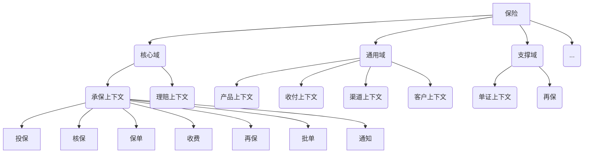

2020年12月12日 众安*ThoughWorks "领域驱动设计，科技赋能保险"
## 1. 核心概念
### 1.1. 从字面理解
2004年 Eric Evans 《Domain Driven Design》提到

- 战略设计
	○ **通用语言**:产品有自己的语言,那么开发人员与之有对接鸿沟,故定义
	○ **限界上下文**:既是语义的限界,也是一个团队的范围--知识在团队内部流转,同时符合康威定律,也是组织架构的边界
- 战术设计
	○ 实体、值对象、聚合、**聚合根**
### 1.2. 从比较中理解
**领域模型** vs **数据驱动模型**
先定义表字段再去做开发，即面向数据表开发的方式效率可能更高。但是其不适合微服务背景下的全链路调整，比如线上的存储过程的遗留代码相当多,调用顺序难以统一改造,从而必须整体性去把握模型的变化。某种程度上，国内普遍使用Mybatis而不是JPA则是基于效率习惯于操作sql本身。事实上某些时候宁愿代码中做筛选更好表示业务逻辑,也不要只是黑盒sql去实现.DDD之后应当使得代码和模型相匹配,做到
>模型即设计,设计即代码


**领域模型** vs **UseCase**
Usecase之间不突出相互交互。另一方面，领域事件可以通过IOC的方式,让IOC容器管理事件，摆脱每次只能更新一个聚合根的问题

- 发布事件的代码
```java
@DomainEvent(CLAM_CASE_TERMINATION)
public void terminate()
...
```
- 接受事件的代码
```java
public class PolicyProduct implements DomainSubscriber{
    public void onDomainEvent(DomainEvent event){...}
}
....
```
## 2. 如何落地
### 2.1. 事件风暴找出微服务
#### 2.1.1. 方法
通过事件风暴的方式将概念与想法从每个人头脑中拿出来

1. 便利贴每个人对于业务流程小到**事件**的认知贴在上面
    - 每个人包括需求，产品，技术等，重点是**多视角**
2. 怎么触发事件(黄色,橙色事件,蓝色命令/定时/回调/异常),谁**触发**事件?
3. 归纳UseCase,找**聚合**.不一致的重定义通用语言.突出操纵事件的角色(绿色人工,浅绿色系统角色)
4. 拆分职责过多的"上帝对象",找出**限界上下文**(ContextDTO?),归纳到不同部门(虚线域)
即虚线圈出的域负责域内事件，对于每个事件则是<font color= "green">绿色</font>操纵<font color= "blue">蓝色</font>触发<font color= "yellow">黄色</font>/<font color= "orange">橙色</font>。

5. 梳理事件流，争取围绕聚合根实现原子性，从战略视角区分不同域的支撑方式
- 核心域(价值链)
- 通用域(现有的开源的或商业的产品)
- 支撑域(具有业务特色的监控,运营等)
#### 2.1.2. 案例
- 以电商领域为例，划分后可初步得到下图结果：

- 以保险领域为例：

### 2.2. 分布式的质量确保
1. 前后对比：
从代码的层面找出调用链，并"录制"http调用过程,那么当代码修改后,重放一遍同时重检查每个库的变化,保证每一次修改至少不会引入破坏原有功能的bug
    - 复杂的业务模型种，`TDD`造数据的成本比较高,同时对于函数调用的测试覆盖不了业务流程
    - 因此DDD中侧重以数据库或者某些共享媒介做中心检查

2. ArchUnit检验分层开发是否符合规范,比如Service只能被Service或者Controller访问
3. 阻塞流程充分利用回调接口
4. `Spring Event` vs `Guava Event Bus`(API多,友好)
## 3. 一些疑问
### 3.1. DDD为什么一直没被广泛运用？

1. "杀鸡焉用牛刀"，业务不够复杂的CRUD用不到
2. DDD致力于向网络中所有人暴露复杂性，不被接受
3. 专业术语过多
2. DDD是思想,不是技术,准备工作多,不好落地执行
4. 因为不好落地而缺乏实战案例，反过来因为案例少也难以落地

最后附上现场照片一张:-)
