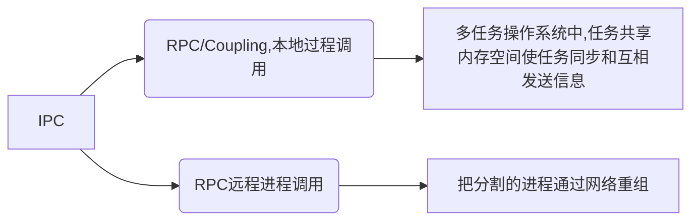

## 1. 基于LSP的专业英语写作辅助客户端与服务器端设计与开发k
## 2. 写作背景

### 2.1. 需求
#### 2.1.1. 词伙补全（词伙，释义，图片）

- 默认情况下使用Completion

- 固定句式
**By the time** Doug Raysby's wife was allowed to enter his hospital room, **it was too late to** be sure whether he even knew she was there.

zero-sum game
#### 2.1.2. 字数提示
#### 2.1.3. 时间提示（图表题/议论文等）
#### 2.1.4. （拼写纠错/非常规表达提示）静态检查
#### 2.1.5. 学术写作规则约束
#### 2.1.6. 英语语言格式化
#### 2.1.7. 提供雅思真题仿写（填鸭式）
#### 2.1.8. 优化交互体验
##### 2.1.8.1. 补全允许取消

### 2.2. 可能的需求
- 添加.english语言的定义
- 添加欢迎页面
- 划词翻译：主要用于写了不确定单词后的场景。主要是通过剪贴板调用翻译API实现。https://mp.weixin.qq.com/s/hB5u-jF5tvwtIeSXa2l4hg

## 3. 未知的
### 3.1. 材料处理
用户使用excel按格式排版好,上传到服务器后,服务器处理成json,结合原本已经有的单词材料并更新写入到自己本地.

- 词伙按雅思常用的12个场景划分
    - 使用`@`读取场景名称返回对应列表
    - 后期可以根据任意关键词返回搜索引擎的内容,如某个词语搭配网站

- 词伙按单词开头划分
    - 单词的各种形式使用转换器转换成可识别的形式
### 3.2. 通信形式
server supports **sockets**, **named pipes**, and **standard streams of the server process** to communicate with the client.
```bash
java -agentlib:jdwp=transport=dt_socket,server=y,suspend=n,address=1044 -Declipse.application=org.eclipse.jdt.ls.core.id1 -Dosgi.bundles.defaultStartLevel=4 -Declipse.product=org.eclipse.jdt.ls.core.product -Dlog.level=ALL -noverify -Xmx1G -jar ./plugins/orgorg.eclipse.equinox.launcher.win32.win32.x86_64_1.2.0.v20200915-1442.jar -configuration ./config_win -data G:\java-lsp3\data --add-modules=ALL-SYSTEM --add-opens java.base/java.util=ALL-UNNAMED --add-opens java.base/java.lang=ALL-UNNAMED -DCLIENT_PORT=3333
```
### 3.3. 算法
https://jojozhuang.github.io/algorithm/data-structure-trie
https://github.com/wolfgarbe/PruningRadixTrie
https://zhuanlan.zhihu.com/p/68447845
### 3.4. 本身
1. 为什么微软不能用http协议,而自己搞一套协议?
2. 服务器端和客户端一起打包发布的是什么?
3. 服务器端是自动挂载到微软的后台服务器上运行的吗?
### 3.5. Step
把ts服务器与客户端改造成java写的
凑文献ii
## 4. 部署
### 4.1. 发布
#### 4.1.1. token
wh1:zowvk65mfgpftwsmdvq5zrjmycc5yutu34n7s4xy3mpctxlift4q
### 4.2. Client与Server分离-IPC进程间通信
>进程间通信（`IPC`，`Inter-Process Communication`），指至少两个进程或线程间传送数据或信号的一些技术或方法。进程是计算机系统分配资源的最小单位。每个进程都有自己的一部分独立的系统资源，彼此是隔离的。为了能使不同的进程互相访问资源并进行协调工作，才有了进程间通信。这些进程可以运行在同一计算机上或网络连接的不同计算机上。 进程间通信技术包括消息传递、同步、共享内存和远程过程调用。 IPC是一种标准的Unix通信机制。[^进程间通信IPC、LPC、RPC]


[^进程间通信IPC、LPC、RPC]:[进程间通信IPC、LPC、RPC](https://www.cnblogs.com/gsk99/archive/2010/12/13/1904541.html)



客户机/服务器模式计算把远程过程调用与其它技术如消息传递一道，作为系统间通信的一种机制。客户机执行自己的任务，但靠服务器提供后端文件服务。RPC为客户机提供向后端服务器申请服 务的通信机制，如图R-4所示。如果你把客户机/服务器应用程序想作是一个分离的程序，服务器能运行数据访问部分，因为它离数据最近，客户机能运行数据表 示和与用户交互的前端部分。这样，远程过程调用可看作是把分割的程序通过网络重组的部件。

目前看了LSP的启动流程
"main": "../client/out/extension"
extension.ts
client.start()->server start
启动Server可能会报错:


一个守护进程,另外5个进程

### 4.3. RPC跨机器进程通信
https://code.visualstudio.com/api/language-extensions/language-server-extension-guide
https://github.com/redhat-developer/vscode-java
https://github.com/eclipse/eclipse.jdt.ls


https://www.thoughtco.com/what-is-collocation-1211244#:~:text=Collocation%20refers%20to%20a%20group%20of%20two%20or,place.%20Collocation%E2%80%8Bs%20are%20words%20that%20are%20located%20together.

java -agentlib:jdwp=transport=dt_socket,server=y,suspend=n,address=1044 -Declipse.application=org.eclipse.jdt.ls.core.id1 -Dosgi.bundles.defaultStartLevel=4 -Declipse.product=org.eclipse.jdt.ls.core.product -Dlog.level=ALL -noverify -Xmx1G -jar ./plugins/orgorg.eclipse.equinox.launcher.win32.win32.x86_64_1.2.0.v20200915-1442.jar -configuration ./config_win -data G:\java-lsp3\data --add-modules=ALL-SYSTEM --add-opens java.base/java.util=ALL-UNNAMED --add-opens java.base/java.lang=ALL-UNNAMED -DCLIENT_PORT=3333
### 4.4. docker安装

>`apt-get update`
同步 /etc/apt/sources.list 和 /etc/apt/sources.list.d 中列出的源的索引，获取到最新的软件包。

>`sudo add-apt-repository "deb [arch=amd64] http://mirrors.aliyun.com/docker-ce/linux/ubuntu $(lsb_release -cs) stable"`
添加阿里镜像源

如果添加后与原有链接冲突,则`/etc/apt/sources.list`注释掉这句：`deb [arch=amd64] https://download.docker.com/linux/ubuntu bionic stable`.注意sources.list文件是只读的，需要`chmod`为可写权限才能编辑

### 4.5. 开启docker远程服务端
Docker为C/S架构，服务端为`docker daemon`，客户端为`docker.service`.

默认不会监听任何端口，只能在本地直接或间接使用Docker API进行操作。这样做可能是为了安全,因为docker服务器端不会鉴别请求者.默认[这样](https://www.cnblogs.com/weiyiming007/p/10168733.html)开启`2375`端口,允许tcp连接.
### 4.6. 原料->做菜

1. `scp`:`scp -r H:/Code/code-generate/target/ root@121.36.48.66:/mnt/code-generate/target/`.
因为本地2375端口总是提示被占用,但是又根本找不到谁占用了.

2. 打包image: `docker build -t code-generate-exec .`

3. 构建容器并启动:` docker run -di --name cg3 -p 8081:8081 code-generate-exec`

## 5. 竞品调研
### 5.1. Hallelujah输入法
hallelujah是我永远不会记住如何拼写的单词之一，但我知道它以“ halle”开头。--[hallelujah_autocompletion](https://daringfireball.net/2006/10/hallelujah_autocompletion)
### 5.2. 秘塔写作猫
### 5.3. 英语作文修改润色
以雅思官方8分范文为例，
Life skills are very important and by doing voluntary work, students learn not only how to communicate with others but also how to manage their time and improve their organisational skills. Unfortunately, teenagers today do not have many after-school activities. After-school clubs are no longer popular and students mostly go home and sit in front of the TV, browse the Internet or play video games.
#### 5.3.1. Grammar
也有office插件，并且会在office里嵌入检查。

#### 5.3.2. 改写匠

改写匠的批改结果并不好，所给的三个意见有两个是错的。

#### 5.3.3. AI辅助写作
#### 5.3.4. 搜狗翻译
搜狗翻译App的“作文批改”功能，AI写作助手便可针对用户输入的作文内容，指出写作中基础的语法或拼写等错误，提供8种经AI算法优化后的语句润色升级方式。用户还能利用批改前后对照功能，通过“输入-反馈-修正-对比”的良性循环方式，科学、高效的提升写作能力。
### 5.4. 其他
#### 5.4.1. 益加医
https://zhuanlan.zhihu.com/p/139657826


### 5.5. 其他
#### 5.5.1. 读取pdf
elctron+pdf.js+云函数
React Native 做订阅
#### 5.5.2. 异步调用

```ts
function lazyHookCreation() {
  const inspector = internalBinding('inspector');
  const { createHook } = require('async_hooks');
  config = internalBinding('config');

  hook = createHook({
    init(asyncId, type, triggerAsyncId, resource) {
    // It's difficult to tell which tasks will be recurring and which won't,
    // therefore we mark all tasks as recurring. Based on the discussion
    // in https://github.com/nodejs/node/pull/13870#discussion_r124515293,
    // this should be fine as long as we call asyncTaskCanceled() too.
      const recurring = true;
      if (type === 'PROMISE')
        this.promiseIds.add(asyncId);
      else
        inspector.asyncTaskScheduled(type, asyncId, recurring);
    },

    before(asyncId) {
      if (this.promiseIds.has(asyncId))
        return;
      inspector.asyncTaskStarted(asyncId);
    },

    after(asyncId) {
      if (this.promiseIds.has(asyncId))
        return;
      inspector.asyncTaskFinished(asyncId);
    },

    destroy(asyncId) {
      if (this.promiseIds.has(asyncId))
        return this.promiseIds.delete(asyncId);
      inspector.asyncTaskCanceled(asyncId);
    },
  });

  hook.promiseIds = new Set();
}
```
为什么
```ts
 destroy(asyncId) {
      if (this.promiseIds.has(asyncId))
        return this.promiseIds.delete(asyncId);
      inspector.asyncTaskCanceled(asyncId);
    },
```
总是会调用下面的函数呢？
```typescript
// Called from native. The asyncId stack handling is taken care of there
// before this is called.
function emitHook(symbol, asyncId) {
  active_hooks.call_depth += 1;
  // Use a single try/catch for all hook to avoid setting up one per
  // iteration.
  try {
    for (var i = 0; i < active_hooks.array.length; i++) {
      if (typeof active_hooks.array[i][symbol] === 'function') {
        active_hooks.array[i][symbol](asyncId);
      }
    }
  } catch (e) {
    fatalError(e);
  } finally {
    active_hooks.call_depth -= 1;
  }

  // Hooks can only be restored if there have been no recursive hook calls.
  // Also the active hooks do not need to be restored if enable()/disable()
  // weren't called during hook execution, in which case
  // active_hooks.tmp_array will be null.
  if (active_hooks.call_depth === 0 && active_hooks.tmp_array !== null) {
    restoreActiveHooks();
  }
}
```
#### 5.5.3. 机器翻译
机器翻译与检索最开始是源于情报翻译的需求,它最开始被实现为一种机械的解读密码的方式,渐渐地人们认识到需要综合分析词法、句法和语义分析来实现,目前业界认为应该围绕英语文本写作打造词汇、语法、语义、内容与结构的全信息智能双语辅助学习工作系统.
#### 5.5.4. 备份
1.在线申请：登录学院综合信息服务平台实习与开题板块在线提交论文开题申请；
2.开题：联系导师，请导师组织开题报告会，要求至少两位专家（两位专家其中一位须是导师或协助导师，另一位为导师或协助导师指定的专家）参加开题；
3.在北大校内门户中录入开题报告内容
1)录入地址：北大主页—校内门户—登陆—业务办理—研究生院—培养环节录入及打印；
2)注意事项：培养环节录入及打印主要就是完成开题情况的录入工作 ，请录入开题时间（如有题目变化二次开题的也请录入第一次开题时间），本人陈述请输入开题报告，考评小组意见请录入开题评审表中记录部分内容，并要在最后明确录入“同意通过开题”。导师意见写“同意通过开题”， 考评小组成员姓名可不填写。（北大系统生成的开题表格无需打印提交。）
3)请使用火狐（FireFox）浏览器进行操作，其他浏览器可能无法正常提交。
4.纸质材料提交：登录学院综合信息服务平台实习与开题板块下载论文开题材料模板，打印并请参与开题的两位专家签字后（两位专家其中一位须是导师或协助导师，另一位为导师或协助导师指定的专家），提交至教务办公室1111门口的信箱。（特别提示：纸质材料须双面打印，如需装订请使用曲别针，不要使用订书钉。未按要求打印装订的材料将被视为无效，需重新提交。）


#### 5.5.5. 可能的问题
问题1: 为什么会想要做这个?
答：因为笔者在备考雅思过程中切实感到了当前英语辅导写作中存在的一些痛点。并在阅读论文深入剖析英语写作过程的过程中了解到确实针对词伙策略开发的软件或工具存在空白，加上实现一个语言服务器本身是很有想象力的事，于是我选择了这个题目而没有选择传统的网页开发。
问题2：那你觉得你能完成吗？
答：有一定把握。因为语言服务器的实现是很广泛的，我可以学习已有的优秀实践。正是因为有了语言服务器,一门特定的语言才可能实现在文本编辑器或IDE中的自动补全、定义跳转等功能。不过自然语言如英语与精通编译原理的大师们设计出来的程序语言有着天然的不同,前者是非结构化的非人为设计的语言,而后者可以按照编译原理对其生成抽象语法树或控制流图进行编译。我需要深入学习Java语言服务器Eclipse JDT Language Server等打造一个专门为英语文本写作开发的英语语言服务器。 
问题3: 那你为什么不采用批改网那种的网页形式？
答： 因为我本身没有社区运营或者盈利的需求，并且对写作者来说，无论是否备考，离线都是更好的，因此采用单一的文本编辑器作为客户端载体是更符合开发初衷的。并且考虑到跨平台和跨文本编辑器的需要，采用了微软提出的LSP这个json RPC协议，在VS Code上也可以使用它已有的包括Hover,Completion等服务API更好的打造这个英语辅助工具。
