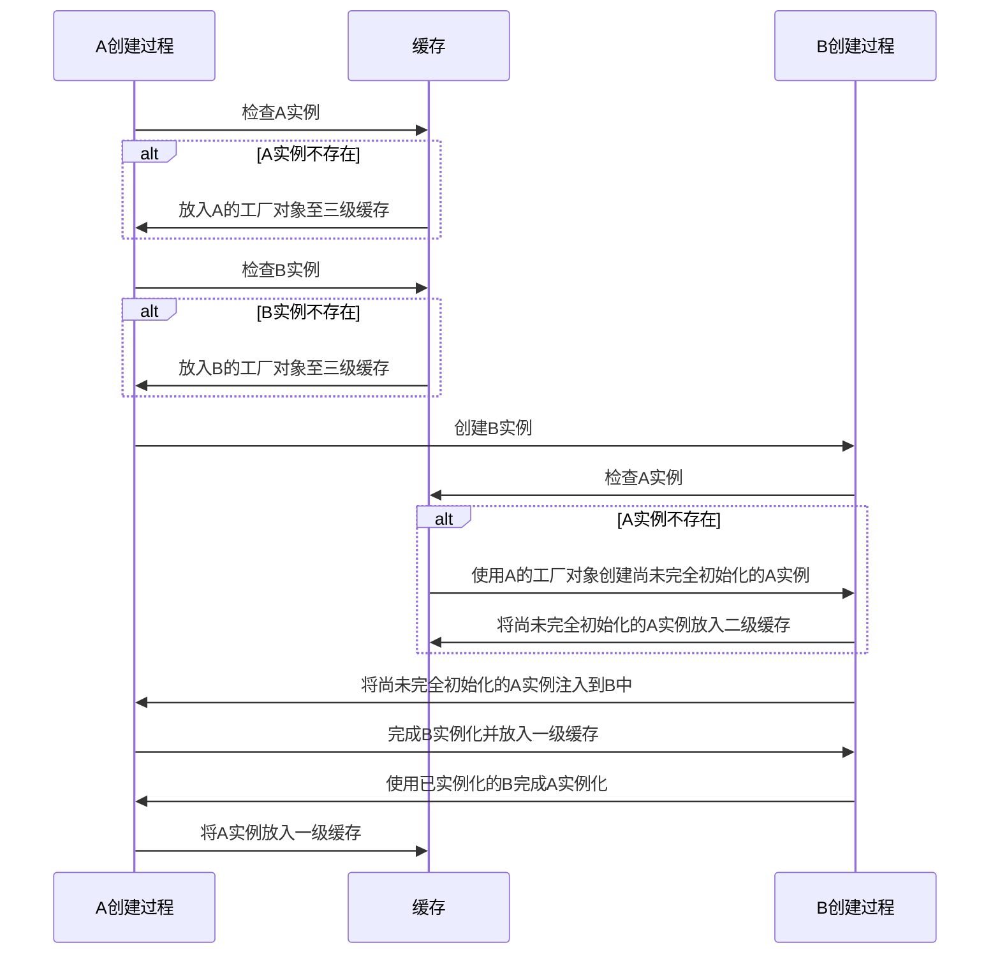

假设我有如下 Bean：
```java
@Service
public class A {
    @Autowired
    B b;
}
@Service
public class B {
    @Autowired
    A a;
}
```

1. 就这样一个简单的循环依赖，默认情况下，A 会被先加载，然后在 A 中做属性填充的时候，去创建了 B，创建 B 的时候又需要 A，之后呢?


2. What can we learn from the fact spring use three-level cache system to solve circular dependency problems?
	
	1. **Design Patterns**: Spring's approach to handling circular dependencies demonstrates the effective use of design patterns, such as the **Factory pattern** and **Proxy pattern.** By using these patterns, Spring can create and manage objects in a more flexible and efficient manner, making it easier to handle complex scenarios like circular dependencies.
	    
	2. **Separation of Concerns**: The three-level cache system in Spring separates the concerns of **object creation**, **dependency management**, and **object storage**. This separation allows Spring to handle each aspect independently and in a more organized manner, making the overall system more maintainable and scalable.
	    
	3. **Fault Tolerance**: By using a three-level cache system, **Spring can detect and handle circular dependencies at runtime**, preventing potential issues and crashes that could arise from such dependencies. 
	    
	4. **Optimization**: The caching mechanism in Spring helps to optimize the process of object creation and dependency resolution. By storing partially and fully resolved objects in different caches, Spring can avoid unnecessary object creation and redundant operations, improving the overall performance of the system.
	    
	5. **Best Practices**: While Spring provides a solution for circular dependencies, it's important to remember that the best practice is to avoid circular dependencies altogether. This can be achieved by using techniques like constructor injection, lazy loading, and code restructuring. The fact that Spring can handle circular dependencies serves as a reminder to developers to be mindful of their code design and to strive for clean, modular, and well-structured code.

3. Why can we use constructor injection and lazy loading to solve the circular dependencies? 
	Let's take an example of two classes `ClassA` and `ClassB` with circular dependencies:
	
	
	```java
	public class ClassA {
	    private ClassB classB;
	
	    public ClassA(ClassB classB) {
	        this.classB = classB;
	    }
	}
	
	public class ClassB {
	    private ClassA classA;
	
	    public ClassB(ClassA classA) {
	        this.classA = classA;
	    }
	}
	```
	
	In this example, if we try to create an instance of `ClassA` using constructor injection, we'll need an instance of `ClassB`. But to create an instance of `ClassB`, we'll need an instance of `ClassA`. This circular dependency will cause issues during object creation. By the way, we recommend using constructor injection for beans because it can help us discover issues with circular dependencies.
	
	To resolve this circular dependency using constructor injection, we can introduce lazy loading using Java `Supplier`:

	
	```java
	import java.util.function.Supplier;
	
	public class ClassA {
	    private Supplier<ClassB> classBSupplier;
	
	    public ClassA(Supplier<ClassB> classBSupplier) {
	        this.classBSupplier = classBSupplier;
	    }
	
	    public ClassB getClassB() {
	        return classBSupplier.get();
	    }
	}
	
	public class ClassB {
	    private Supplier<ClassA> classASupplier;
	
	    public ClassB(Supplier<ClassA> classASupplier) {
	        this.classASupplier = classASupplier;
	    }
	
	    public ClassA getClassA() {
	        return classASupplier.get();
	    }
	}
	```
	
	Now, instead of directly injecting the instances of `ClassA` and `ClassB`, we inject `Supplier` instances that can provide the required objects on demand. This breaks the circularity during object creation and allows us to create instances of both classes:

	```java
	Supplier<ClassA> classASupplier = () -> new ClassA(classBSupplier);
	Supplier<ClassB> classBSupplier = () -> new ClassB(classASupplier);
	
	ClassA classA = classASupplier.get();
	ClassB classB = classBSupplier.get();
	```
	
	By combining constructor injection with lazy loading using `Supplier`, we can resolve the circular dependency between `ClassA` and `ClassB`. However, it's important to note that this approach may not be suitable for all scenarios, and it's best to avoid circular dependencies whenever possible.

记一个隐秘的循环依赖：自定义AOP（非Spring AOP）如果没实现 Spring 解决循环依赖接口 getFactoryBeanReference ，当该类与其他普通类循环依赖时Spring 会启动失败。