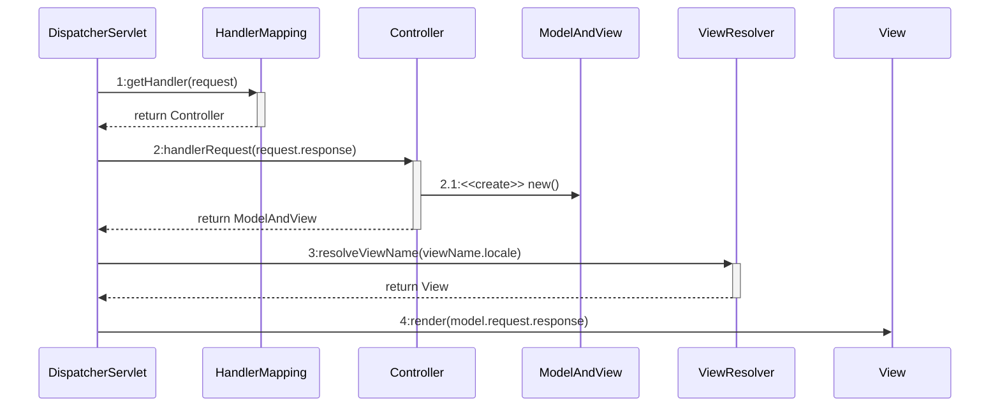
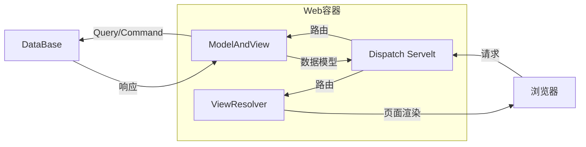

## 1. J2EE/Jakarta EE与Spring
### 1.1. J2EE概述
现名为`Java EE`，Java 平台企业版（Java Platform Enterprise Edition）,是一种利用Java平台来简化企业解决方案的开发、部署和管理相关的复杂问题的体系结构.之前称为Java 2 Platform Enterprise Edition (`J2EE`)，2018年因为Java被收购的原因更名为 `Jakarta EE`,这里仍采用经典称呼`J2EE`.
J2EE当年号称有十三种核心技术[^javaEE]用以解决**企业开发**多方面的问题，如：
[^javaEE]:[javaEE的13种核心技术](https://blog.csdn.net/zyb_icanplay7/article/details/8492996)

- EJB(Enterprise Java Beans)负责核心业务逻辑，且支持分布式
- JMS管理消息队列
- JAXP处理XML
- JTA管理事务
- Java Mail发邮件...

现在它们都成为了经典(凉了...)，下面再介绍几个经典:

- JSP
JSP（全称JavaServer Pages）是由 Sun 公司主导创建的一种动态网页技术标准。JSP 部署于网络服务器上，可以响应客户端发送的请求，并根据请求内容动态地生成 HTML、XML 或其他格式文档的 Web 网页，然后返回给请求者。
- Servlet
Servlet（Server Applet），是用 Java 编写的**服务器端程序**。其主要功能在于交互式地浏览和修改数据，生成动态 Web 内容。
狭义的 Servlet 是指 Java 语言实现的一个接口，广义的 Servlet 是指任何实现了这个 Servlet 接口的类，一般情况下，人们将 Servlet 理解为后者。
- JDBC(还在用)
Java 数据库连接，（Java Database Connectivity，JDBC）是 Java 语言中用来规范客户端程序如何来访问数据库的应用程序接口，提供了诸如查询和更新数据库中数据的方法。

### 1.2. Spring 框架
广义的 Java EE 包含各种框架，其中最重要的就是 Spring 全家桶。

Spring 诞生之初是为了改进 Java EE 开发的体验，后来逐渐成为了 Java Web [^JavaWeb]开发的实际标准.目前Spring 是用于构建 Java 应用的一套工具的集合，包括

[^JavaWeb]:由Java语言主要实现的浏览器可以访问的程序内容
- Spring Framework:我们通常所说的 Spring，最初是为了简化J2EE,包含 Spring AOP、Spring MVC 等一系列内容，指的是一个完整的技术栈。
- Spring Boot: 一个用于快速开发的**搭建**工具（脚手架），"约定优于配置",开箱即用.使用它搭建出来的项目可以称为是使用了 Spring Boot 框架。
- Spring Data:提供对**非关系型与关系型数据库**的支持，为数据访问提供熟悉且一致的基于Spring的编程模型，同时仍保留底层数据存储的特殊特性[^SpringDataJPA]。
- Spring Cloud:协调,一个基于 Spring Boot 实现的云应用/分布式开发工具,允许服务发现和注册、负载均衡、配置中心、熔断机制等开箱即用[^SpringDataJPA]. 
[^SpringDataJPA]: [Spring Data JPA是什么（Spring家族）](https://www.cobing.com/archives/669)

- Spring Cloud Data Flow:连接,基于 Spring Boot 的工具，用于简化专注于数据处理用例的应用程序的开发和部署。

目前比较常见的Spring框架组合:

- SSH
Structs + Spring + Hibernate
- SSM
Spring +SpringMVC + MyBatis

所以再解释几个名词:

- Spring MVC: 基于 Spring 的 MVC 框架(Model-View-Controller),是spring 处理web层请求的现有实践模块
- Hibernate 与Mybatis: ORM（Object Relational Mapping[^ORM]）持久层开发框架,一个实现了POJO 和数据库表之间的映射,一个实现了POJO(Plain Ordinary Java Object,实体类) 与SQL之间的映射关系,都可以自动生成简单基本的DAO层方法
- JPA:Java Persistence API规范,整合ORM标准,Hibernate JPA是其具体实现之一
- Spring Data JPA,对JPA规范的再次抽象,包含了JPA规范和Spring项目的增加功能:分页、排序、复杂查询等

[^ORM]:ORM采用**元数据**（可以是xml格式）来描述对象与关系映射的细节。元数据描述数据，是对数据及信息资源的描述性信息。

### 1.3. Spring思想
#### 1.3.1. 从面向过程到面向对象
在软件业发展的初期，程序编写以算法为核心[^OO]。程序员会有意将数据当做问题空间的客体，程序代码则像锤子剪刀的工具加之使用来处理这些数据。这是一种站在计算机角度来抽象问题和解决问题的思维方式，也即面向过程的编程思想。之后为了适应越来越繁杂的现实世界所提出的需求，诞生了面向对象的编程思想。面向对象鼓励程序站在现实世界与业务的角度去抽象和解决问题，如此数据和处理数据的逻辑与控制也被统一到了类与对象中。

[^OO]:深入理解Java虚拟机，周志明，2020年版

#### 1.3.2. 管理对象--IoC(Inversion of Control)
##### 1.3.2.1. IoC的诞生
但是人们依然发现构建大型应用时用到的类如此多以至于对类与类之间的各种依赖关系管理阻碍程序员关注实际产生价值的业务问题，于是IoC容器出现了。

IoC容器的作用就是管理类之间复杂的依赖关系,即降低类之间的耦合度，方便后期开发和维护。可以通过依赖注入 (`Dependency Injection`)实现解耦,因而IoC又称为`Bean Factory`.`DI`主要有三种方式[^field-injection-is-not-recommend],第三种才是容器给的:

[^field-injection-is-not-recommend]:[不推荐使用@Autowired进行Field注入的原因](https://www.rainng.com/field-injection-is-not-recommend/)

- 构造器注入：利用构造方法的参数注入依赖
- Setter注入：调用Setter的方法注入依赖
- 字段注入：在字段上使用`@Autowired/Resource`注解
    - @Autowired是Spring提供的，因此用了@Autowired的项目与Spring强耦合
    - @Resource是Java标准提供的，一般IoC容器都会兼容它

不用`DI`时我们使用面向对象编程,对象的创建与对象间的依赖关系完全硬编码在程序中，对象的创建由程序自己控制。现在控制反转后将对象的创建转移给第三方，对象由IoC容器创建（`我从哪里来`），对象的生命周期（`我到哪里去`）和其与其他对象的依赖关系（`我与社会的关系`）都由IoC容器管理。或许控制反转就是：**程序员与对象交互的方式反转了**。
##### 1.3.2.2. 泛谈IoC
区别于软件开发中“**以用户为出发点，以需求分析为核心**”的传统模式,[IoC](https://coolshell.cn/articles/6950.html)的设计是一种“**以愿景（自身利益是愿景的重要方面）为出发点，以架构为核心**”的模式。从“做产品”和“做项目”的视角到“**做设计**”.

>如何应对需求变化？ @假装刺猬的猪 的答案是领域建模，并持续优化模型，适应需求的变化。@高煥堂 则认为领域建模不是美好的手段。我进一步补充，应该“反过来”让自己在需求变化中处于主导地位(在你的体系下实现需求)，而不是被动地适应。--coolshell

只是这恐怕也需要这个领域内努力甩开其他的对手，然后才能成为制定标准的那一两个，掌握主动权。

#### 1.3.3. 全局对象封装--AOP（Aspect Oriented Programming）
##### 1.3.3.1. 传递代码块
>函数式编程语言操纵代码片段就像操作数据一样容易。[^JAVA编程思想]

设计模式一个重心就是将重复的或者不变的代码与反复变化的代码分开，因此希望将代码块或方法更简洁地**内联**到其他代码中，或者像**参数**一样进行传递。Java借鉴了函数式编程的成功实践在Java8中引入了`Lambda`表达式用以实现这种功能：Lambda实现**只有一个方法的接口**(函数式接口)并允许将这个接口的函数当做方法参数传入,如下图中函数参数中的函数:

```typescript
Phrases.filter(
    (phrase)=>{
        return issueKey === phrase[CollocationDetail.issueStr()][0]
    }
).forEach( matchedphrase => {
    matchedKeys.push(matchedphrase[CollocationDetail.collocationStr()]);
});
```

而面向切面编程则是在Spring的帮助下实现了在代码自己定义的切面处内联代码块。

[^JAVA编程思想]:JAVA编程思想

##### 1.3.3.2. 切面处插入模块
Spring AOP采用JDK的动态代理（反射找到有注解的方法，然后动态代理这个方法）实现AOP代理，在运行时完成AOP的aspect代码内联如原代码中。从业务的角度，AOP便是实现了在已有类和方法的前后加上事务管理,日志管理等功能，

>[比如](https://cloud.tencent.com/developer/article/1579202)现在有5个类，每个类有5个方法，如果我想要在每个方法执行完成之后打印方法名，按照没有AOP的思想就是在每个方法后面加上logger.info或者system.out.println。
>一共需要25行代码.这个时候AOP登场,t建立一个切面类，然后定位到这5个类的每个方法，加一个后置通知（就是方法执行完之后会执行这个通知，本质上是一个方法）。
>这样25行的代码简化成了一个方法加方法体的一行代码.

这样的设计遵循了面向对象的封装复用理念，即把**核心业务功能**（登录、CRUD 等）与周边功能（性能统计、日志、**事务管理**等）区分开。如下图所示：


简单说AOP将重复的功能形成组件，**在需要处切入**,是一种粒度更大的面向对象编程。

接下来重点介绍Spring全家桶中的SpringBoot.
## 2. 从WWW到SpringBoot
>只有知晓了历史,才可能把握未来

话说1989年世界上第一个Web服务器和第一个浏览器在欧洲核子研究中心诞生,也标志着`World Wide Web`诞生...

### 2.1. CGI的诞生
不久后有个天才大学生Nobert写出了后世更加闻名的Ｗeb Server--`NCSA httpd`.但在最开始,`httpd`只能处理静态的html和页面,Robert于是让Server可以调用本地的程序,然后把程序的输出(本来是写到`console`的)直接发给浏览器.他使用的媒介称之为`CGI`(Common Gateway Interface)**脚本编程语言**.他的能力很简单,

1. 对于每一个请求都启动一个新的**进程**
2. 帮助服务器将`http`请求信息传递给外部程序处理

示意如下:


远古时代,虽然这些设计现在看来很多缺点,但没有CGI也就没有提供邮箱,购物,交友等服务的网站的出现.
不过CGI依赖各个平台不同的语言(`C`,`Perl`etc).为了跨平台同时增强功能诞生了`Servlet`.
### 2.2. Servlet的诞生
Servlet是Java平台上第一个用于Web开发的技术。它**本身就是Java类**，运行于Web容器（Web Container）中,能力比较强大：

- 一个请求一个**线程**而不是进程
- 允许使用Session以及对对象生命周期管理
- 可以直接调用JDK的API(比如直接构建业务对象，使用`JDBC`)以及生态提供的服务（比如JVM的GC）

示意如下：

因为它一个类就可以实现众多功能，因而也被称作“*Magic Servlet*”,但是另一面便是违背了“**高内聚，低耦合**”的开发原则（血泪的教训...），各种逻辑混杂于一处：

- 流程控制逻辑
- 视图显示逻辑
- 业务逻辑
- 数据访问逻辑

尤其是视图显示是使用`out.println("<html>")`这种语句拼接而成,继承自CGI的在代码中输出html的方式广受诟病,是当时急需解耦的问题。

### 2.3. JSP的诞生
人们想到了使用模板化（`templating`）的方法将View从Servlet中以独立的单元抽离出来，于是提出来JSP页面技术。虽然还是将Java代码和HTML写在一起，但是原本需要`out.println（）`的语句被集合在一起做成了模板,`Java`语句则放在了html下方的`Scriptlet`中.然而这依然允许任何应用程序逻辑都融入`Scriptlet`中,眼看着又要诞生另一个"*Magic JSP*".
### 2.4. Servlet与JSP的联盟
#### 2.4.1. JSP Model2的诞生
JSP功能的强大却演化成了一种不良诱惑,程序员终于意识到技术不应该滥用.
>当你只拿起锤子,你总要发现周围的钉子.

不管Servlet与JSP本身能做到什么,

- Servelt只负责请求处理逻辑的控制以及与业务层的交互
- JSP只负责视图的渲染逻辑
- 再引入封装业务层逻辑的`JavaBean`

这样的架构被称之为`JSP Model2`,其示意图如下:


这便是MVC的雏形.但是仍有一个很大的区别,可以看到早期视图与模型之间的数据同步工作是模型push数据到视图,而MVC模式中,Contrller是主导地位,它从Model中pull数据然后返回给View.

#### 2.4.2. 分离具体的Web请求逻辑
在JSP Model2实践中,人们对Servelt有两种选择:

- 一个Servlet对应一个Web请求
- 单一Servlet作为集中控制器

为了集中管理Web请求的处理流程与维护`web.xml`的简单,第二种逐渐成为主流.但是因为控制逻辑是硬编码在Servlet中的,一旦要调整url映射的处理,就得修改Servlet控制器的代码并重新编译,于是继续解耦,对原先耦合度高的控制器逻辑逐步分离.

Web开发框架主要分为两种:

- 请求驱动
- 事件(GUI)驱动

对于请求驱动的JSP Model2,继续限制Servlet的功能,将其瘦身为`Front Controller`,并参照外部可配置的流程规则,将Web请求转发给`Sub/Page Controller`进行处理.在曾经使用的Structs中,ActionServlet便是`Front Controller`t,Action便是`Page Controller`,同时结合`structs-donfig.xml`对url与Action之间进行映射.
#### 2.4.3. 解耦视图类型的选择和渲染(Render)与具体控制器
传统的JSP视图文件渲染逻辑如下:
```java
request.setAttribute("infoList",infoList);
forward(request,response,"view.jsp");
```
可以看到JSP需要依赖request对象来传递模型数据,依赖`RequestDispatcher`来输出最终的视图.但是模板技术远不止JSP一家,还有`*.vm`,`*xls`等等.所以仍然需要将处理后的模型数据与具体的View实现技术(如`*.jsp`或者之后的`.html`)解耦.
Spring MVC引入`servlet.view`接口来统一抽象视图的生成策略,使得DispatcherServlet只需要根据Controller处理完毕后通过`ModelAndView`返回的逻辑视图名称查找到具体的view实现即可.同时与url与`Page Controller`之间的映射类似,再引入了`servlet.ViewResolver`来处理逻辑视图名与具体View实例之间的映射关系.
注意这里的View实例可以包括Excel与PDF形式的文档视图甚至自定义的.
### 2.5. Spring MVC的诞生
Spring MVC是Spring的一个**web框架**。通过`Dispatcher Servlet`, `ModelAndView` 和 `ViewResolver`，解决网站应用程序或者服务开发——URL路由、Session、模板引擎、静态Web资源集成等方面的问题。
#### 2.5.1. Spring MVC的低耦合性
- `Front Controller`-->`servlet.DispatcherServlet`
    - `HandlerMapping`处理Web请求与Handler之间的映射关系
- `Page Controller`-->`Handler`-->`mvc.Controller`实例
- `JavaBean`-->`Model`
- `JSP`* -->`View`
    - `ViewResolver`来处理逻辑视图名与具体View实例之间的映射关系


Spring MVC中各角色交互图:


各角色流程图:


#### 2.5.2. 基于注解的Spring MVC
以Controller为例,基于Annotation的Controller和传统的Controller没有什么区别,都是普通的POJO.Java 通过元注解[^Metadata]定义在被注解的类结构上得到注解，然后这个注解再被使用，借助Java反射实现被注解的类功能。即Java注解的形式和功能是分离的，本质是语法糖,这不同于 Python 的装饰器[^DisSpringBoot]会直接传递功能类，两者好比[引用传递和值拷贝](https://juejin.im/post/6867121018897432590)的关系。
对于基于注解的Controller,它至少需要解决两个问题:
- Spring MVC框架类(DispatcherServlet)怎么知道当前Web请求应该由哪个基于注解的Controller处理?
- Spring MVC框架类怎么知道基于注解的Controller的哪个方法来处理具体的Web请求?

[^Metadata]:即定义注解的注解，与元数据类似，如@Target({ElementType.TYPE})注解适用类型与@Retention(RetentionPolicy.RUNTIME)注解生命周期等

[^DisSpringBoot]:[DisSpringBoot](https://zhuanlan.zhihu.com/p/54146400)

解决方法简单说:

1. 注解中附加了有用的元数据信息与基础类
2. 基于约定或配置扫描有关注解类并纳入IoC容器进行管理
    - 比如将`@Controller` 注解的类作为 URL 路由注册到 `DispatcherServlet`中，并在创建 Tomcat Server 时传入请求处理器
3. AOP动态代理


**核心注解介绍**

- `@Bean`[^Bean]
[^Bean]:[Spring中Bean及@Bean的理解](https://www.cnblogs.com/bossen/p/5824067.html)

-  `@ComponentScan`开启组件扫描功能,默认将**包**下正确注解的类纳入IoC容器.
- `@SpringBootConfiguration`/`@Configuration`表示被注解的类是一个需要被IoC管理的配置类/`@interface`类
- `@EnableAutoConfiguration`开启*自动*配置功能
    - Import `AutoConfigurationImportSelector` 激活SpringFactoriesLoader
    - 通过SpringFactoriesLoader(类加载器<svg t="1613551927172" class="icon" viewBox="0 0 1024 1024" version="1.1" xmlns="http://www.w3.org/2000/svg" p-id="1221" width="15" height="15"><path d="M665.6 374.4c-12.8-57.6-57.6-105.6-118.4-118.4-67.2-16-131.2 9.6-169.6 64-28.8 41.6 0 60.8 16 73.6 6.4 3.2 12.8 9.6 22.4 19.2 12.8 12.8 32 9.6 44.8-3.2 12.8-12.8 9.6-32-3.2-44.8-9.6-6.4-16-12.8-22.4-19.2 22.4-25.6 60.8-38.4 96-28.8 35.2 9.6 60.8 35.2 70.4 70.4 9.6 48-12.8 92.8-54.4 112-41.6 19.2-70.4 57.6-70.4 102.4l0 22.4c0 19.2 12.8 32 32 32 0 0 0 0 0 0 16 0 32-12.8 32-32l0-22.4c0-19.2 12.8-38.4 32-44.8C643.2 528 681.6 451.2 665.6 374.4zM480 729.6c-9.6 9.6-12.8 22.4-12.8 35.2 0 12.8 6.4 25.6 12.8 35.2 9.6 9.6 22.4 12.8 35.2 12.8 12.8 0 25.6-6.4 35.2-12.8 9.6-9.6 12.8-22.4 12.8-35.2 0-12.8-6.4-25.6-12.8-35.2C531.2 710.4 499.2 710.4 480 729.6zM512 67.2c-80 0-160 22.4-227.2 64C246.4 86.4 188.8 64 124.8 64 115.2 64 102.4 70.4 96 80c-6.4 9.6-6.4 22.4 0 32 0 0 32 54.4 41.6 137.6 3.2 16 16 28.8 32 28.8 0 0 3.2 0 3.2 0C192 275.2 204.8 262.4 204.8 243.2 198.4 201.6 188.8 163.2 179.2 137.6 204.8 144 230.4 160 249.6 188.8c0 0 0 0 0 0 0 0 0 0 0 0C252.8 192 252.8 192 252.8 195.2c0 0 3.2 3.2 3.2 3.2 3.2 0 3.2 3.2 6.4 3.2 3.2 0 3.2 3.2 6.4 3.2 3.2 0 3.2 0 6.4 0 3.2 0 3.2 0 6.4 0 3.2 0 3.2 0 6.4-3.2 3.2 0 3.2 0 6.4-3.2 0 0 0 0 0 0 0 0 0 0 0 0 64-44.8 140.8-67.2 217.6-67.2 211.2 0 384 172.8 384 384s-172.8 384-384 384-384-172.8-384-384c0-54.4 9.6-105.6 32-156.8 6.4-16 0-35.2-16-41.6-16-6.4-35.2 0-41.6 16C76.8 390.4 64 451.2 64 515.2c0 246.4 201.6 448 448 448 246.4 0 448-201.6 448-448C960 268.8 758.4 67.2 512 67.2z" p-id="1222" fill="#1296db"></path></svg>)加载`EnableAutoConfiguration.class`,从而启动Jar包中`Springfactories`中的自动配置类,并利用`@Conditional`系列注解(允许`exclude`等自定义配置规则)完成基于项目的自动配置

-  `@AutoConfigurationPackage`将主配置类(`@SpringBootApplication`)的所在包以及下面所有子包里面的所有组件扫描到Spring容器
- `@Controller`用于定义控制器**类**，在spring项目中由控制器负责将用户发来的URL请求转发到*对应的服务接口*（service层），
    - 配合注解`@RequestMapping`,返回一个视图(前后端不分离)
    - 配合`@ResponseBody`当返回值是String，返回的字符串将不再通过ViewResolver查找视图(即`.jsp`或`.html`文件)，会被直接以 `JSON `或` XML `形式数据展示在浏览器里

- `@AutoWired`自动导入依赖的组装好属性、方法的`Bean`,可以对类成员变量、方法及构造函数进行标注，把配置好的Bean拿来用.比如:Service 类注入到 Controller 类中。
-  HTTP 方法映射
    - `@RequestMapping`提供路由信息，负责URL到Controller中的具体函数的映射。 如果没有指定请求方式，将接收`Get、Post、Head、Options`等所有的请求方式。
        -  `@GetMapping`==`@RequestMapping(method = RequestMethod.GET)`的缩写。该注解将HTTP Get 映射到特定的处理方法上。 
        - - Get示例:
        >`https://yihui.wang/ares/goods/detail/?goods_id=55`
       
       - 同理`PostMapping`==`@RequestMapping(method = RequestMethod.POST)`
       -  - Post示例:
        >`http://localhost:8080/wx/auth/profile?username=user123&password= user123`
        
```java
@Service
public class UserService {
  ......
}

@RestController
@RequestMapping("/users")
public class UserController {
   @Autowired
   private UserService userService;
   ......
}
```

**非空校验注解**
- `@NotEmpty`用在集合类上面,不能为null，并且长度必须大于0
- `@NotBlank`用在String上面,只能作用在String上，不能为null，而且调用trim()后，长度必须大于0
- `@NotNull` 用在基本类型上,不能为null，但可以为空字符串

后来人们越来越喜欢用注解,并且发现还有大量重复的代码可以打包变成依赖.正好当时还流行`RoR`(`Ruby on Rail`),于是也学习它将以基于`Convention Over Configuration`(约定优于配置)的方式省略这些代码,于是诞生了Spring Boot.
#### 2.5.3. 新一代的模板引擎thymeleaf
类似于Angular的值引用,将大量的data可以通过`{user}`这种方式填充在对应的模板里,最后生成html时由自己再转化
### 2.6. Spring Boot 的诞生
#### 2.6.1. 让开发更简单!
##### 2.6.1.1. 简化依赖导入

**导入SpringBoot相关依赖**
```xml
<dependency>
<groupId>org.springframework.boot</groupId>
<artifactId>spring-boot-starter-web</artifactId>
</dependency>
```
实际上点进去`starter-web`:
```xml
<dependencies>
    <dependency>
    ....
      <artifactId>spring-boot-starter</artifactId>
      
      <artifactId>spring-boot-starter-json</artifactId>

      <artifactId>spring-boot-starter-tomcat</artifactId>

      <artifactId>spring-web</artifactId>

      <artifactId>spring-webmvc</artifactId>
    ....
    </dependency>
</dependencies>
```
可以看到`starter-web`这个依赖中已经包含了Spring Web需要导入的多个依赖.此外这每个依赖又封装了许多不同功能的依赖.这是Spring将**功能场景**抽取成各个`Starter`的设计,需要开发什么功能,导入这个功能场景对应的依赖包就好.
##### 2.6.1.2. 简化配置
如`@Service`=`@Configuration`+`@Bean`:
```java
@Configuration
public class JavaConfig {
    @Bean
    public TestService getTestService() {
        return new TestService();
    }
}
```
`@Configuration` 表示该类是个配置类， `@Bean` 表示该方法返回一个 Bean。这样就把TestService 作
为 Bean 让 Spring 去管理了，在其他地方，我们如果需要使用该 Bean，和原来一样，直接使用`@Resource `注解**注入进来**即可使用:

```java
@Resource
private TestService testService;
```
不过对于底层的大量封装也难免带来开发人员对于底层原理的忽视.
##### 2.6.1.3. 简化部署
**传统**
打包成传统的WAR文件，并部署到一个外部的应用服务器(如`Tomcat`的`/webapp`下)
**现在**

1. maven插件打成`jar`包,或者`Webjar`类似于前端里的`Webpack`
创建一个独立的（standalone）应用程序,由古老的main()方法驱动
2. ` java -jar `运行
采用Spring提供的**嵌入（embeded）的Tomcat Servlet容器**作为HTTP运行时环境，不需要部署一个外部的运行时环境实例。
##### 2.6.1.4. 简化监控
#### 2.6.2. 还能再解耦吗?
其实SpringBoot采用的是面向过程的分层管理(注意分层只是管理手段)：
##### 2.6.2.1. DAO层: 持久层，与数据库交互
在配置文件中进行配置数据源和数据库连接的参数 `-->`DAO层`-->`创建Dao接口(可以在这里引入sql或xml中配置映射)`-->`在模块中调用Dao的接口进行数据业务的处理
##### Client层:客户端层,与其他服务接口交互
##### 2.6.2.2. Entity层: 实体层，数据库在项目中的类
定义与数据库中字段对应的实体类，并提供`get`/`set`/`tostring`方法等。
##### 2.6.2.3. DTO层、Model层: 全项目最惨工具人
与Entity层功能类似，但是其中模型类**不与数据库中字段对应**，处于数据转化的中间地位(某种程度上就是`工具人`)。
##### 2.6.2.4. Service层:业务层 设计分类的业务逻辑
在Service层封装一些业务逻辑帮助业务逻辑独立与复用，所以事实上小型项目中Service可能是多余的，完全可以并入Controller中
##### 2.6.2.5. Controllor层:控制层 控制调用哪个业务逻辑
Controller负责**具体的**业务模块**流程**的控制；Service层负责业务模块的**逻辑应用设计**
##### 2.6.2.6. View层
随着前后端分离的大趋势,View层此前主要响应Controller层对`jsp`页面的请求,现在则归属前端的范围.得到后端的数据(如`json`)之后处理,渲染,呈现数据.
##### 2.6.2.7. 简单总结
在C/S架构下，`Controller层`调用`Service层`的方法，Service层调用`Dao层`的方法，其中调用的参数是使用`Entity层`进行传递的，中间可能用到工具类可以再做个util层以及中间件做个middle层，还有工具人用上`DTO层`。最后`Controller层`响应Client的请求返回结果给`View层`.


### 2.7. 前后端分离--将数据与视图显示继续解耦
生活中类似于基于模板的生成方式很是平常,比如

- 利用模子来制作各种形状的蛋糕/瓶子
- 使用方印染不同的印泥后盖章

但是我们也注意到模具与实例之间是可以完全分离的,实例的一部分不需要放在模具中。所以之前的模板技术还可以继续解耦.于是诞生了前后端分离,开始流行返回`json`而不是逻辑视图名。
另一方面，从管理学的角度，这也符合团队成员各司其职的原则。
### 2.8. SpringBoot优化
#### 2.8.1. SpringBoot刀刃的另一面
Spring本质上就一个`IoC`容器，SpringBoot相对Spring像一个全家桶，为其加入了`DI`/`AOP`/注解封装等各种功能支持，也因此显得臃肿。相对Spring来说[^NileMichael]，

- 一堆配置无非就是从`xml`变成`annotation`或是`*config.java`
     - Spring Boot框架尽管通过组合注解方式实现了诸多Spring注解的组合，但是注解依旧会被大量重复地用到各个类或者方法中
- tomcat、jetty等只是被内置了简化了部署，但是要想容器调优除了依旧要深入tomcat等具体的容器知识，还必须知道在SpringBoot的体系下tomcat怎么配置

[^NileMichael]:[ SpringBoot vs Spring](https://www.zhihu.com/question/39483566/answer/603515756)

此外(这个说到底是自己的问题)：

- 开箱即用也带来了相当的黑盒恐惧感，比如AutoConfiguration配置了哪些东西?我自己要覆盖配置怎么办？


#### 2.8.2. 与SpringBoot相关的痛点
- IO耗时过长  **->**  增加Cache(如`Reids`),以避免频繁调用一些不变的数据
- 业务模式比较复杂 **->** 对代码做非空校验，引入注解/配置等[^Mybatis+isnull]
- 并发量比较高  **->** 后端异步返回的数据量很大+时间很长,故调大异步返回的最大时间以及对返回信息做压缩,以增加网络传输效率
- Controller层无法完全满足跳转的需求等


[^Mybatis+isnull]:在MyBaitis的xml里,`select`语句`where`条件有`innull`即这个值有就增加一个where条件,借此对任何一个where增加一个不带isnull的查询条件,以免改语句当传入参数都是null时,做全表扫描

### 2.9. 泛谈架构分层
#### 2.9.1. SpringBoot 中的分层
SpringBoot通常分为

- Dao
- Entity/Model
- Controller
- Service

分层设计基于单一职责原则（SRP-Single responsibility principle）让每个对象**各司其职、各尽其能**，同时易于复用,达到软件架构“**高内聚、低耦合**”的要求。

#### 2.9.2. 其他领域的分层
##### 2.9.2.1. 通信领域
TCP/IP的

- 应用层
- 传输层
- 网络层
- 链路层
- 物理层

OSI：

- 应用层
- 表示层
- 会话层
- 传输层
- 网络层
- 链路层
- 物理层

网络层屏蔽底层细节而承接上层接口，达到“**everything over IP**”以及“**IP over everthing**”的功能设计，是体现“**高内聚，低耦合**”的非常好的案例。

- everything what is over IP : 不管哪种数据形式，图像，声音，文件...通过确定的传输层协议TCP/UDP/FTP...就可以通过IP包送到目的地
- everthing what Ip is  over:
    - 屏蔽不同的通信子网：以太网,ATM,卫星网，4g网...
    - 硬件接口为此向IP靠拢：硬件接口在操作系统里抽象成一个接口，IP可以从这个接口里收发IP报文
##### 2.9.2.2. 互联网架构领域

把底层的支持与实际产生价值的业务分离开，但是底层是技术的真正所在。很多程序员入门时就从业务开发开始了。
##### 2.9.2.3. 软件开发分层
参考《阿里巴巴开发手册》：

#### 2.9.3. 与程序的关系
这背后是基于对
<center><strong>Program = Logic+Control+Data Structure</strong></center>

中项目各组成元素的分离. `Data Strcuture`是对现实数据及对象的抽象或者说建模,是接下来要使用的实体; `Logic`实现对已定义的实体的处理,关注"**What**"; 最后`Control`部分关注业务逻辑,操控怎样地组合各种封装好的`Logic`,关注"**How**"
三者的分离是写好程序的关键,`Logic`与`Control`是解耦的关键:

- `Dao`层实现与数据库的接口并与`Entity`层中的实体一一映射
- `Service`层实现`Dao`层中的接口并设计业务逻辑,代表的是`Logic`的部分
- `Controller`层则响应客户端的请求,控制业务逻辑的调用,代表`Control`的部分

>面向对象的本质是面向数据库开发

## 3. 从一个SpringBoot到微服务
### 3.1. 单体架构的无奈
在同一个服务器上部署同一个系统，往往是比较容易部署与测试的。但是随着需求的不断膨胀，单体应用欲通过使用统一的技术平台解决所有的问题是不现实的（Node.js想统一前后端也受限于此）。
### 3.2. SOA的诞生
#### 3.2.1. SOA(Service Oriented Ambiguity)
**围绕着业务就是围绕着价值**，于是面向服务架构的SOA概念随之诞生。SOA通过将彼此链接的、可重复的服务整合降低成本；又为了提高系统负载能力，实现高内聚低耦合，

- 将一个大的系统划分为多个业务模块，并分别部署在不同的服务器上；
- 数据库也采用分布式数据库，如Redis/ES;
- 服务器通过LVS/Ngnis实现负载均衡；
- 引入资源调度与治理中心

同时不同服务之间的交互通过RPC实现。

#### 3.2.2. RPC的沿革
早期实现跨物理机的远程访问另一个`进程`唯一的方式就是RPC（`Remote Procedure Call`）（Socket 属于私有协议数据通信）.在SOA提出后，RPC通过消息队列(如`RocketMQ`)解决**被动调用问题**，通过发布与订阅实现**消息异步处理**。如今RPC既作为一种比`tcp`或`http`等更高层的服务请求协议存在，也作为**内部服务管理框架**在发展。
注意RPC的客户端调用还会被代理，后来这个代理的部分发展为Dubbo中的注册中心。

本地调用的过程至少需要涉及

- 确定的类或参数或方法名
- 类或函数的参数
- 类或函数的返回值

与任何一种协议的报文设计类似，同样需要将这些参数进行合适的编码设计。作为RPC协议中服务A调用服务B的过程双方，


对于服务A：

- 序列化
- 协议编码
- 网络传输

对于服务B：

- 反序列化
- 协议解码
- 网络传输

而在更大意义上，作为内部服务框架的RPC，涉及

- 服务注册
- 服务治理
- 服务发现
- 熔断机制
- 负载均衡等

#### 3.2.3. RPC的实现
微服务之间通过RPC跨进程调用

##### 3.2.3.2. 传输层基于TCP实现
RPC大部分都是基于TCP实现的,毕竟TCP是传输层的协议.
裸TCP连通的是**无边界**的数据流,所以需要定义消息格式,但是据说无法穿透防火墙[^Jager]。
而定义的消息格式最著名的应该就是http了.其他的还有`Apache Thrift`,`gRPC`

[^Jager]:[RPC vs RESTful](https://www.cnblogs.com/jager/p/6519321.html)

##### 3.2.3.1. 应用层基于HTTP 1.1实现
如feign,

- **Http交互方式已成共识**,比如各种响应码
- 可以使用JSON或XML格式的请求或响应数据
    - 带来可读性的同时也不能使用压缩程度更高的`protobuf`等序列化协议了
- HTTP无状态便于联系同时降低复用


但是http协议原本只是为了`Browser/Service`架构实现的，比如下面的http报文头中

```http
Remote Address:61.135.169.125:80
Request URL:http://www.baidu.com/
Request Method:GET
Status Code:200 OK
Request Headersview source
Accept:text/html,application/xhtml+xml,application/xml;q=0.9,image/webp,*/*;q=0.8
Accept-Encoding:gzip,deflate,sdch
Accept-Language:zh-CN,zh;q=0.8,en;q=0.6
Cache-Control:max-age=0
Connection:keep-alive
Cookie:~
Host:www.baidu.com
Referer:http://tieba.baidu.com/
User-Agent:Mozilla/5.0 (Windows NT 6.1; WOW64) AppleWebKit/537.36 (KHTML, like Gecko) Chrome/35.0.1916.114 Safari/537.36
```
User-Agent、Accept-Language这些字段对于RPC支持的调用过程所需要的

- 确定的类或参数或方法名
- 类或函数的参数
- 类或函数的返回值

来说则是冗余的。
##### 3.2.3.1. 应用层基于HTTP 2.0实现
HTTP 2.0 性能可能比很多公司内部的RPC协议还要好,所以gRPC底层是直接用的HTTP 2.0.
### 3.3. Spring Cloud的诞生
#### 3.3.1. SpringCloud的组成
当系统复杂度再跳，系统进一步被拆分成许多相对独立的小应用，小服务。每一个都有更强的独立部署能力，单元和单元之间的交互或者具体的RPC调用可以选择多种方式实现，比如`http`的`Rest`方式。微服务将业务逻辑分散到不同的物理机，不同的进程下[^从rpc到微服务]，使得单应用的故障与负载不会影响到其他应用。其最吸引人的地方还在于**每个微服务可以使用自己适宜的技术栈** 。
SpringCloud是一套开源工具的集合，由它实现的微服务通常包含：

<center>Spring Cloud=服务注册发现+（负载均衡+限流熔断降级）RPC框架+网关+Spring Boot+分库分表+读写分离</center>

[^从rpc到微服务]:[微服务发展沿革](https://cloud.tencent.com/developer/article/1051490)

#### 3.3.2. 服务注册发现
##### 3.3.2.1. Dubbo
##### 3.3.2.2. Zookeeper/Eureka

#### 3.3.3. RPC框架

##### 3.3.3.1. Dubbo
##### 3.3.3.2. Feign
Feign使用 `Rest-like`风格的HTTP交互方式实现`json-rpc`,封装了

- Ribbon
     - RestTemplate：封装Http请求-->客户端负载均衡
- Hystrix
    - 服务容错保护


**当使用RPC要不要遵循RestFul**？
>RPC的思想是把本地函数映射到API，本地有一个getAllUsers，远程也能通过某种约定的协议来调用这个getAllUsers。至于这个协议是Socket、是HTTP还是别的什么并不重要； RPC中的主体都是动作，是个动词，表示我要做什么。 而REST则不然，它的URL主体是资源，是个名词，也仅支持HTTP协议，规定了使用HTTP Method表达本次要做的动作，这些动作表达了对资源仅有的几种转化方式。--[Vincross](https://www.zhihu.com/question/28570307/answer/163638731)

### 3.4. 复杂化后的Service Mesh
>一言以蔽之：Service Mesh是微服务时代的TCP协议。[^ServiceMesh]

[^ServiceMesh]:[什么是Service Mesh](https://zhuanlan.zhihu.com/p/61901608)

### 3.5. PaaS的诞生
各自服务的单打独斗却会带来重复劳动，比如各自部署自己的ES或某一个相同的日志服务。前者是资源需要整合以便弹性调用；后者或许可以通过共享库解决但是在多语言版本时也不可行。于是华为提出“让听到炮火的人可以呼唤支援“，阿里提出“大中台，小前台”的概念。严谨思考业务场景各自的边界从而严格限制每个微服务的边界，各个微服务整合成的大中台系统，即我们常说的PaaS层（平台即服务）应运而生了。


PaaS层的建立往往意味着微服务的数量已经很庞大，对于一个中型公司就有上万个之多。其必然要面临两种问题：

1. 新的功能应该被部署成新的微服务吗？还是融入到已有的微服务中？
2. 已有的微服务是否承载的功能太多？已有的微服务是否边界不够清晰？

上诉两个问题近来的DDD(`Domian Driven Design`)提供了一定的解决思路。
### 3.6. Serverless的窥视
#### 3.6.1. 只管付钱的野心
基于云计算，开发者能做到真正只关注业务。云端可以自动分配存储和计算资源，并提供标准REST API的接口。
曾经 Go 高并发、node.js 高并发和Java 高并发是炙手可热的技术追求,技术人才不断钻研如何在这些语言里选个好库, 有一个好的设计加上某些语言特性达成优异的性能,但是未来某一天这一些技术及技术人才或许都将被大公司垄断,就好像新的面向应用层的巨大的操作系统一样.
#### 3.6.2. IaaS -> PaaS -> SaaS -> FaaS
从基础设施到平台到可插拔软件最后到粒度更小的函数,它们最后可以被提供为服务.https://www.jianshu.com/p/6e86c42f85bd
#### 3.6.3. 资源背后的故事
在最开始单机上的多用户就有了分割计算机资源的想法，并诞生了虚拟化技术，将底层的计算机资源抽象成多组相互隔离的计算平台。下面图片来自码农翻身公众号：


[^码农翻身]: 我终于实现了前辈的梦想！

纯软件实现的虚拟化有两类，一类是在硬件上运行操作系统，在操作系统上安装虚拟化软件，创建各种虚拟机，这是2型虚拟化，由于中间隔着一个宿主操作系统，2型虚拟化的效率并不高。 还有一类是1型虚拟化，在硬件上安装Hypervisor、在其上运行各种虚拟机，这种方式更加彻底，更加可靠。和虚拟化相对的是更轻量级的容器，这种技术将操作系统内核虚拟化，允许用户空间的进程隔离起来，形成一个相对独立的运行环境[^码农翻身]。
现在云端的资源分配只是历史的进程之一。
#### 3.6.4. 列举一些资源细节
- Tomcat 默认配置的最大请求数是 150，也就是说同时支持 150 个并发(传统BIO模式下)
- Windows 每个进程中的线程数不允许超过 2000
- Linux 每个进程中的线程数不允许超过 1000
- Java 中每开启一个线程需要耗用 1MB 的 JVM 内存空间用于作为线程栈之用

## 4. Other Concept
### 4.1. **.json**
#### 4.1.1. 概念
JavaScript 对象表示法（`JavaScript Object Notation`).JSON 是存储和交换文本信息的语法，类似 XML。如:
```json
{
    "employees": [
        { "firstName":"Bill" , "lastName":"Gates" },
        { "firstName":"George" , "lastName":"Bush" },
        { "firstName":"Thomas" , "lastName":"Carter" }
    ]
}
```

### 4.2. maven项目管理
maven项目管理分为以下常用组成部分，共同组成了一个项目对象模型(Project Object Model)：


#### 4.2.1. 一个项目生命周期(project `Lifecycle`)
- clean
- validate
- compile
- test
- package
- verify
- install
- site
- deploy

#### 4.2.2. 一个依赖管理系统(`Dependency` Managemnet System)
- groupId:依赖所有组织的代码,可以是依赖的网址或公司网址,如Apache Software以org.apche开头, 实际对应JAVA的包的结构即`src--main--java`下的目录结构
    - 当发布一个包的时候应该考虑到groupId的标志性与指示性,如istarwyh在github上的私人库`Initial`的目录就可以为:`com.github.istarwyh.Initial`
    - 当发布包时,发布的包网址也会遵循这样的约定:**`groupId/artifactId/version/(artifactId-version.jar + artifactId-version.pom +)...`**(虽然`mvn clean package deploy`这样的命令会帮我们完成这一步)
- artifactId:对于该项目的唯一标识符,实际对应项目的名称，就是项目根目录的名称
- SNAPSHOT：不稳定版本
- RELEASE：在SNAPSHOT中选择一个最稳定的作为发布版

以惯用父依赖导入为例:
```xml
    <parent>
<!--        快速导入开发一个Web容器所需要的依赖-->
        <groupId>org.springframework.boot</groupId>
        <artifactId>spring-boot-starter-parent</artifactId>
        <version>2.3.0.RELEASE</version>
        <relativePath/> 
    </parent>
```
maven解析到这样的配置时,所做的工作其实是:
```cmd
Downloading from central-repository: http://central.maven.org/maven2/org/springframework/boot/spring-boot-starter-parent/2.3.0.RELEASE/spring-boot-starter-parent-2.3.0.RELEASE.pom
```
- maven的依赖查找与DNS解析过程类似,即 `local > mirror > central(default) > reporitory`
    - 必须注意的是,在`setting.xml`中只能配置一个`mirror`,而一旦配置了mirror,便不会再往低优先级的地方查找,即自己如果配了`repository`将会失效
#### 4.2.3. 一个在生命周期阶段中插件(`plugin`)运行的目标
1. clean
2. resources
3. compile
4. testResource
5. testCompile
6. test
7. jar(打包)
8. install
9. deploy

    - `mvn clean package`执行到第七步打好`jar`包,但是没有把打好的可执行jar包（war包或其它形式的包）布署到本地maven仓库和远程maven私服仓库
    - `mvn clean install`到`8`，部署到本地maven仓库
    - `mvn clean deploy`完成全部步骤,部署[^远程发布jar]到local和remote

	[^远程发布jar]:[发布Artifact](https://www.liaoxuefeng.com/wiki/1252599548343744/1347981037010977)

**当默认没有在pom.xml 指定任何 `plugin`，但是也能正常构建工程是为什么？**
这是Maven 自己默认指定了 plugin。如cmd执行 `mvn install` 的输出日志中可以看到一系列的 插件:版本号:目标(phase)[^Maven生命周期]：
```sh
[INFO] --- maven-compiler-plugin:3.1:compile (default-compile) @ my-app ---
[INFO] Changes detected - recompiling the module!
[INFO] Compiling 1 source file to /Users/zhangguanghui/git/my-app/target/classes
```

[^Maven生命周期]:[Maven生命周期](https://www.jianshu.com/p/fd43b3d0fdb0)

## 5. About Me & References


[
    
](https://github.com/istarwyh)