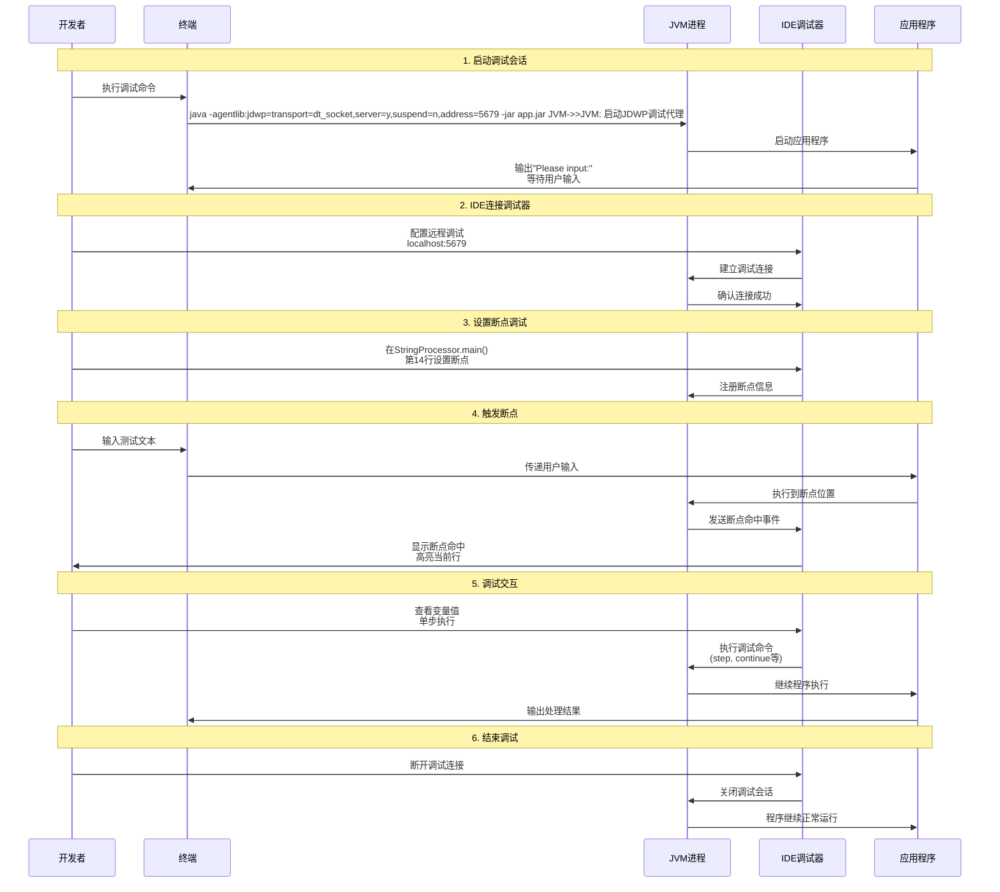
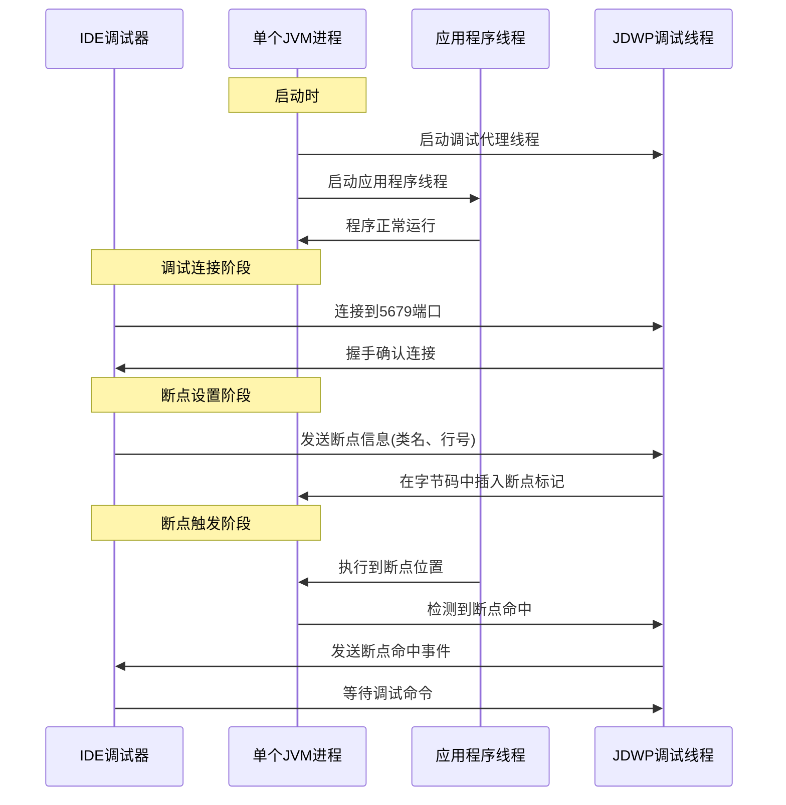

## JAR 文件生成步骤

### 使用自动构建工具构建（推荐）

自动构建工具比如Maven 或 Gradle,这里以 gradle 为例。Gradle 这些工具本质上是将手动构建的步骤自动化与代码化了。

**前提条件：**

- 确保 Java 版本兼容
- 项目根目录有 `build.gradle` 或 `build.gradle.kts`

**构建命令：**

```bash
# 构建整个项目
./gradlew build

# 仅构建特定模块
./gradlew :StringProcessorTest:build

# 仅生成 jar 包
./gradlew :StringProcessorTest:jar

# 使用指定 Java 版本构建
JAVA_HOME="/path/to/java21" ./gradlew :StringProcessorTest:jar
```

**生成位置：**

- `StringProcessorTest/build/libs/StringProcessorTest-1.0-SNAPSHOT.jar`

### 手动构建步骤

#### 1. 环境准备

```bash
# 检查 Java 环境
java -version
javac -version

# 设置 JAVA_HOME（如果需要）
export JAVA_HOME="/Users/mac/Library/Java/JavaVirtualMachines/openjdk-21.0.1/Contents/Home"
export PATH="$JAVA_HOME/bin:$PATH"
```

#### 2. 创建目录结构

```bash
# 创建编译输出目录
mkdir -p build/classes
mkdir -p build/libs
```

#### 3. 编译 Java 源代码

```bash
# 编译单个文件
javac -d build/classes src/main/java/istarwyh/StringProcessor.java

# 编译整个包
javac -d build/classes src/main/java/istarwyh/*.java

# 如果有依赖，需要添加 classpath# javac -cp "libs/*" -d build/classes src/main/java/istarwyh/*.java
```

#### 4. 创建可执行 JAR 包

```bash
# 方式1：创建基础 jar 包
jar cf build/libs/StringProcessorTest.jar -C build/classes .

# 方式2：创建带清单的 jar 包
echo "Main-Class: istarwyh.StringProcessor" > MANIFEST.MF
jar cfm build/libs/StringProcessorTest.jar MANIFEST.MF -C build/classes .

# 方式3：一步创建可执行 jar 包（推荐）
jar cfe build/libs/StringProcessorTest.jar istarwyh.StringProcessor -C build/classes .
```

#### 5. 验证 JAR 包

```bash
# 查看 jar 包内容
jar tf build/libs/StringProcessorTest.jar

# 查看清单文件
jar xf build/libs/StringProcessorTest.jar META-INF/MANIFEST.MF && cat META-INF/MANIFEST.MF

# 测试运行
java -jar build/libs/StringProcessorTest.jar
```

### 完整手动构建脚本

```bash
#!/bin/bash

# 清理之前的构建
rm -rf build

# 创建目录
mkdir -p build/classes build/libs

# 编译
echo "编译 Java 源码..."
javac -d build/classes src/main/java/istarwyh/StringProcessor.java

# 打包
echo "创建可执行 jar 包..."
jar cfe build/libs/StringProcessorTest.jar istarwyh.StringProcessor -C build/classes .

echo "构建完成！运行：java -jar build/libs/StringProcessorTest.jar"
```

## 调试命令

```bash
java -agentlib:jdwp=transport=dt_socket,server=y,suspend=n,address=5679 -jar StringProcessorTest/build/libs/StringProcessorTest-1.0-SNAPSHOT.jar
```

## 命令参数详解

- `-agentlib:jdwp`：启用 Java Debug Wire Protocol (JDWP) 调试代理
- `transport=dt_socket`：使用 socket 传输协议进行调试通信
- `server=y`：JVM 作为调试服务器，等待 IDE 连接
- `suspend=n`：程序立即启动，不等待调试器连接
- `address=5679`：监听 5679 端口（默认监听所有网络接口）

## 调试时序流程



## 执行表现

1. **程序启动**：

   - 控制台显示 "Please input:" 提示
   - 程序等待用户输入
   - JDWP 调试代理在后台监听 5679 端口

2. **调试连接**：

   - IDE 可以随时连接到 localhost:5679
   - 连接成功后可以设置断点
   - 程序继续运行，不受调试器连接影响

3. **断点触发**：

   - 当用户输入文本时，程序执行到断点位置
   - IDE 收到断点命中通知
   - 可以查看变量、单步执行等

4. **调试优势**：
   - 非侵入式调试，程序保持运行状态
   - 可以动态分析程序执行流程
   - 适合分析用户交互场景

## 技术原理详解

### 单进程双线程模型

远程调试命令 `java -agentlib:jdwp=transport=dt_socket,server=y,suspend=n,address=5679 -jar app.jar` 实际上启动的是**单个 JVM 进程**，但该进程内部运行两个主要功能：

1. **应用程序线程**：运行你的程序逻辑（如 StringProcessor.main）
2. **JDWP 调试代理线程**：在后台监听调试连接



### IDE 本地调试 vs 远程调试

#### IDE 本地调试

当你在 IDE 中直接点击 Debug 按钮时，IDE 会：

1. **编译代码**：自动编译项目（如果需要）
2. **启动 JVM**：使用类似这样的参数：

   ```bash
   java -agentlib:jdwp=transport=dt_socket,server=n,suspend=y,address=localhost:随机端口
   ```

3. **立即连接**：IDE 作为客户端立即连接到 JVM
4. **控制执行**：IDE 完全控制 JVM 的生命周期

#### 远程调试

- **JVM 独立运行**：程序可以独立于 IDE 运行
- **异步连接**：调试器可以随时连接/断开
- **生产环境调试**：适合调试运行中的生产服务

### JDWP 协议详解

#### 协议特点

- **专为调试设计**：专门用于 Java 虚拟机调试的协议
- **二进制协议**：高效、低延迟的二进制数据传输
- **基于 Socket**：使用 TCP 连接传输调试数据
- **标准协议**：所有 Java IDE 和 JVM 都原生支持

#### JDWP 核心功能

1. **断点管理**：设置、清除断点
2. **执行控制**：单步执行、继续执行、挂起
3. **变量访问**：读取、修改变量值
4. **堆栈跟踪**：获取调用栈信息
5. **类信息**：动态加载类信息
6. **事件通知**：断点命中、异常抛出等事件

#### 与常见协议对比

| 协议 | 用途 | 传输方式 | 数据格式 | 特点 |
| --- | --- | --- | --- | --- |
| **JDWP** | Java 调试 | TCP Socket | 二进制 | 专为 JVM 调试设计，支持断点、单步、变量查看等调试操作 |
| **WebSocket** | Web 实时通信 | TCP Socket | 文本/二进制 | 全双工通信，适合 Web 应用实时数据传输 |
| **HTTP/HTTPS** | Web 请求/响应 | TCP Socket | 文本 | 请求-响应模式，无状态协议 |
| **RMI** | Java 远程调用 | TCP Socket | 二进制 | Java 对象序列化传输，适合分布式系统 |
| **gRPC** | 微服务通信 | HTTP/2 | Protocol Buffers | 跨语言 RPC 框架，支持流式传输 |

#### 通信实例对比

**JDWP 调试通信示例：**

```
IDE -> JVM: SetBreakpoint(class="StringProcessor", line=14)
JVM -> IDE: BreakpointSet(id=1)
... 程序运行到断点 ...JVM -> IDE: BreakpointHit(id=1, thread=main)
IDE -> JVM: GetLocalVariables(thread=main, frame=0)
JVM -> IDE: Variables(input="Hello World")
IDE -> JVM: StepOver(thread=main)
JVM -> IDE: StepCompleted(thread=main)
```

**WebSocket 通信示例：**

```javascript
// 客户端 -> 服务器
{"type": "chat", "message": "Hello", "user": "Alice"}

// 服务器 -> 客户端  {"type": "chat", "message": "Hi Alice!", "user": "Bob", "timestamp": "2024-01-01T10:00:00Z"}
```

**HTTP 请求示例：**

```http
GET /api/users/123 HTTP/1.1
Host: example.com
Accept: application/json

HTTP/1.1 200 OK
Content-Type: application/json

{"id": 123, "name": "Alice", "email": "alice@example.com"}
```

### 其他调试参数

- `suspend=y`：程序启动时暂停，等待调试器连接
- `address=localhost:5679`：仅监听本地连接
- `address=0.0.0.0:5679`：监听所有网络接口
