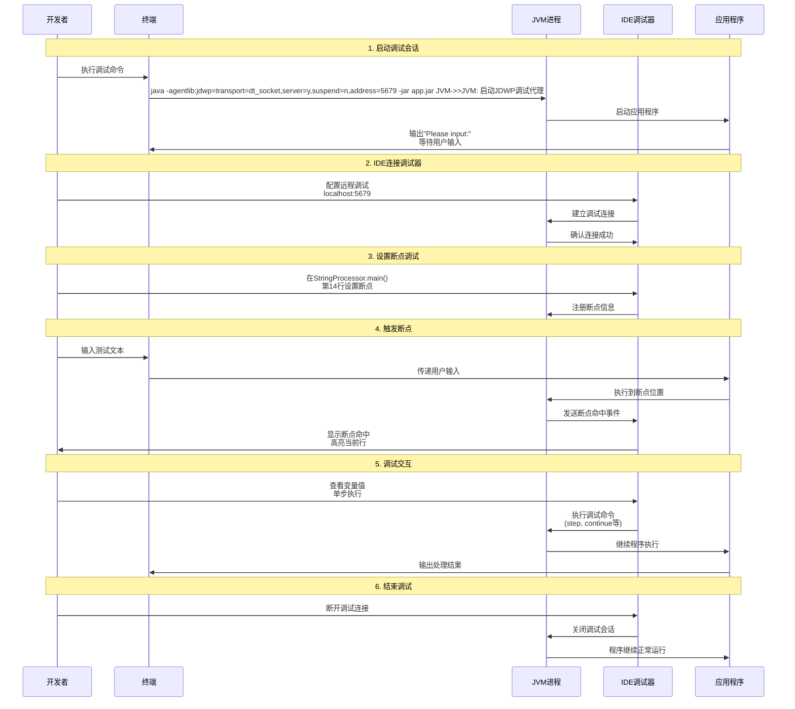

最贫穷的父母也能教给一样东西，那就是面对贫穷带来的无知与无能该如何面对。

生物演化嘛，如果外在都能适应环境，何必提升内在？[--](https://mp.weixin.qq.com/s/g_FgfmZAaa9b2n8E0JAuSQ)

在“多考一分干掉XX人”、“千军万马过独木桥”这样的的叙事里成长起来的人会成为一个单向度的利己主义者。他会把整个社会看作是一个巨大的零和博弈场，只有竞争没有合作；只有损人才能利己；只有人上人和人下人，没有人人平等；只有倾轧没有尊重。而事实上，人与人之间的合作分工才是社会进步的基础。（虽然靠着KPI也可以聚集起原本零和博弈的敌手）

大学几乎是一个“洗钱机器”(money laundry machine)，将金融资本转化为文化和政治资本。这种转化是如何完成的呢？富人们将他们的孩子送到顶尖大学，这些孩子们在毕业后名正言顺地继续享受特权，富人们愿意投资这类大学，因为它们是社会不平等再生产的重要机器。然后这些学校变得非常富有，能够做出好的研究等等，还会有一个大型的公关团队去往世界各地与政客名流打交道。--项飙

学习是个人如何教育自己的事，教育是社会如何看待学习的事。

其实教育就是一个手段，最后的目的就是一个，怎样能更好地激发兴趣。--何帆，《变量》作者

各行各业，凡是能成功的都有一个共性的特质，这些人一定是输得起的人，输了再来，最后就赢了。而我们现在的教育，你只让他成功，不让他输。--佚名

为什么要让年轻人试错？我五六岁时学滑冰，想比别人划得更快，后来我发现其实这和你多聪明无关，而是看谁跌倒的次数最多。后来每次去滑冰，我都比别人跌得更多、更狠。不怕错、不怕跌倒，才有可能学得更快。--新浪创始人

只教一个人思想而不教道德，就是对社会的威胁。-罗斯福

聪明的人的诅咒就是：其实自己什么都能干好，摆在自己面前的选择太多了，机会成本太高了，于是总是在面对“艰难的”选择。--刘宇波

理科的目的在于解释自然，追求真理，工科的目的在于改造自然，推进发展。工科的尽头是理科，理科通过工科改变世界。---顾险峰

教育的本质是一棵树摇动另一棵树，一朵云推动另一朵云，一个灵魂唤醒另一个灵魂。--佚名

像我这样的人要通过不断努力保持不愚蠢，而不是变得更聪明。--芒格

写作之难，在于将网状的思想，通过树状的语法，用线性的文字展开。--斯蒂芬·阿瑟·平克

孩子像父母回应他们一样回应自己，这发展成为成年之后的“自我指南”。当强调“理想自我”时，我们遭受的是沮丧/抑郁的痛苦，而当强调“应该自我”时，我们遭受的是焦虑/不安的痛苦。--《Handbook of Theories of Social Psychology》

如果你倒过来教孩子们，只关注成绩，他们会选容易的课程，只关注在课堂和考试中表现好，但不会真正学习。他们可能学到错误的东西，可能会挑战自己更少。--Jesen 黄仁勋

没有什么真正的独唱，一定是穿越时空的重唱、合唱。我们都是围绕古老基音产生的泛音，在历史重复的韵脚里形成越来越丰富和谐的音调。

#wisdom #education

