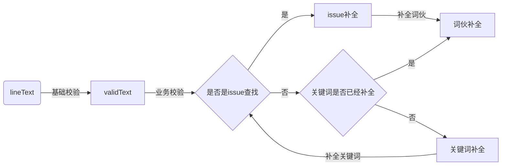
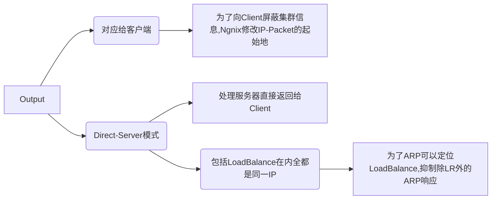
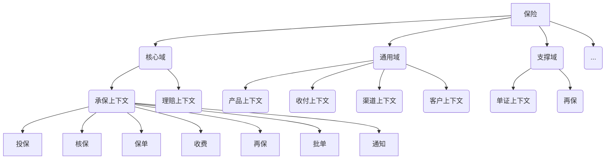
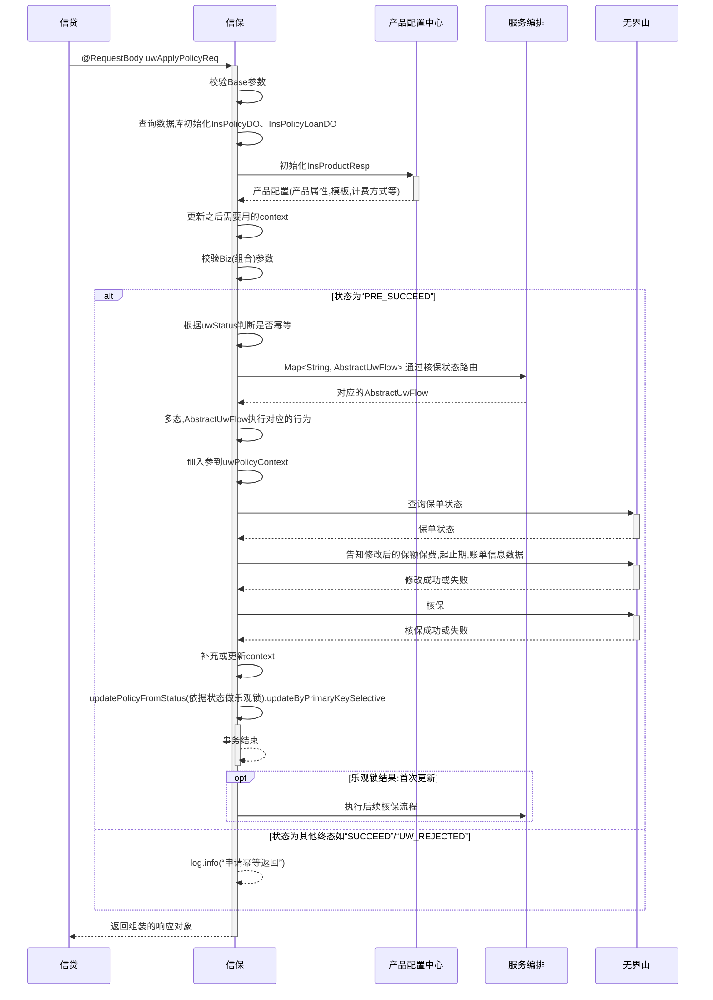

#tool
## Markdown
|        操作         |   Hash   | 有序数组 |  二叉树  |     b树(B-tree,Balanced Tree)     |                 b+树                 |                 b*树                  |
| ------------------ | -------- | ------- | ------- | --------------------------------- | ------------------------------------ | ------------------------------------- |
| Insert             | O(1)     | O(n)    | O(logn) | n叉树，每个节点可以有1200个叉         | n叉树，优化b树存储，提供范围查找          | n叉树，优化b+树页分裂空间利用率低的问题     |
| Remove             |          |         | O(logn) | 树高不超过3                        | **所有Key只在叶子节点上出现一次**        | 非叶子节点的兄弟节点之间也通过指针相连      |
| Update             |          |         |         | 最多只需要访问3次磁盘就可定位数据块    | 所有非叶子节点都是**叶子节点**的索引      | 如果节点上的子节点满了                    |
| Find               | O(1)     | O(logn) | O(logn) | 极少io--根节点总在内存中             | 叶子结点如果是聚簇索引直接定位到记录       | 就将它的子节点挪一部分到旁边没满的兄弟节点上 |
| Iterator(范围查找n) | $\times$ | O(n)    | O(n)?   | **所有数据只在节点上出现一次**        | 叶子结点如果是非聚簇索引存储指向记录的指针 | 避免了重新创建新的节点的过程               |
| Sort/Group by      | $\times$ |         |         | 搜索可以在非叶子节点结束              | 各个叶子节点通过指针跟兄弟节点关联(双指针) |                                       |
| supplement         |          |         |         | 子节点数目超过后再二分，称作**页分裂** |                                      |                                       |

### Extradraw
本身是JSON格式存储，渲染为手绘风格的图画。可以导入Mermaid 格式的Flowchart

### Mermaid
#### 画流程图

1. 这里的射线是不能转弯的
2. 结构换行必须加subgraph & end,也就是独立出来才行
3. 文本换行得用` `标签...
4. 文字中不能包含`~`

#### 画思维导图
https://blog.csdn.net/skytruine/article/details/105828748

#### 画时序图
https://www.imooc.com/article/292709?block_id=tuijian_wz

## Draw.io/Diagrams.net
GUI画图，xml 格式存储，渲染为drawio风格的图画。支持图形较多。
## CSS3
### 3.1. Papaerclip

### 3.2. Danger Icon

## 4. SVG
[手摸手，带你优雅的使用 icon](https://www.jianshu.com/p/f14982b2b737)

<svg t="1613551927172" class="icon" viewBox="0 0 1024 1024" version="1.1" xmlns="http://www.w3.org/2000/svg" p-id="1221" width="20" height="20"><path d="M665.6 374.4c-12.8-57.6-57.6-105.6-118.4-118.4-67.2-16-131.2 9.6-169.6 64-28.8 41.6 0 60.8 16 73.6 6.4 3.2 12.8 9.6 22.4 19.2 12.8 12.8 32 9.6 44.8-3.2 12.8-12.8 9.6-32-3.2-44.8-9.6-6.4-16-12.8-22.4-19.2 22.4-25.6 60.8-38.4 96-28.8 35.2 9.6 60.8 35.2 70.4 70.4 9.6 48-12.8 92.8-54.4 112-41.6 19.2-70.4 57.6-70.4 102.4l0 22.4c0 19.2 12.8 32 32 32 0 0 0 0 0 0 16 0 32-12.8 32-32l0-22.4c0-19.2 12.8-38.4 32-44.8C643.2 528 681.6 451.2 665.6 374.4zM480 729.6c-9.6 9.6-12.8 22.4-12.8 35.2 0 12.8 6.4 25.6 12.8 35.2 9.6 9.6 22.4 12.8 35.2 12.8 12.8 0 25.6-6.4 35.2-12.8 9.6-9.6 12.8-22.4 12.8-35.2 0-12.8-6.4-25.6-12.8-35.2C531.2 710.4 499.2 710.4 480 729.6zM512 67.2c-80 0-160 22.4-227.2 64C246.4 86.4 188.8 64 124.8 64 115.2 64 102.4 70.4 96 80c-6.4 9.6-6.4 22.4 0 32 0 0 32 54.4 41.6 137.6 3.2 16 16 28.8 32 28.8 0 0 3.2 0 3.2 0C192 275.2 204.8 262.4 204.8 243.2 198.4 201.6 188.8 163.2 179.2 137.6 204.8 144 230.4 160 249.6 188.8c0 0 0 0 0 0 0 0 0 0 0 0C252.8 192 252.8 192 252.8 195.2c0 0 3.2 3.2 3.2 3.2 3.2 0 3.2 3.2 6.4 3.2 3.2 0 3.2 3.2 6.4 3.2 3.2 0 3.2 0 6.4 0 3.2 0 3.2 0 6.4 0 3.2 0 3.2 0 6.4-3.2 3.2 0 3.2 0 6.4-3.2 0 0 0 0 0 0 0 0 0 0 0 0 64-44.8 140.8-67.2 217.6-67.2 211.2 0 384 172.8 384 384s-172.8 384-384 384-384-172.8-384-384c0-54.4 9.6-105.6 32-156.8 6.4-16 0-35.2-16-41.6-16-6.4-35.2 0-41.6 16C76.8 390.4 64 451.2 64 515.2c0 246.4 201.6 448 448 448 246.4 0 448-201.6 448-448C960 268.8 758.4 67.2 512 67.2z" p-id="1222" fill="#1296db"></path></svg>
## 5. HTML
### 5.1. 表格
#### 5.1.1. 压缩前
<html>
  <head>
    <meta http-equiv="Content-Type" content="text/html; charset=UTF-8" />
    <meta http-equiv="Content-Style-Type" content="text/css" />
    <meta name="generator" content="Aspose.Words for .NET 17.1.0.0" />
    <title>Bug-1</title>
  </head>
  
<body>
    

      <table cellspacing="0" cellpadding="0" style="border-collapse: collapse;">
        <tbody>
          <tr>
            <td
              style="
                width: 92.9pt;
                border-style: solid;
                border-width: 0.75pt;
                padding-right: 5.03pt;
                padding-left: 5.03pt;
                vertical-align: middle;
              "
            >
              

                BugID
              

            </td>
            <td
              colspan="3"
              style="
                width: 300.3pt;
                border-style: solid;
                border-width: 0.75pt;
                padding-right: 5.03pt;
                padding-left: 5.03pt;
                vertical-align: middle;
              "
            >
              

                &nbsp;B-1
              

            </td>
          </tr>
          <tr>
            <td
              style="
                width: 92.9pt;
                border-style: solid;
                border-width: 0.75pt;
                padding-right: 5.03pt;
                padding-left: 5.03pt;
                vertical-align: middle;
              "
            >
              

                Bug
                标题
              

            </td>
            <td
              colspan="3"
              style="
                width: 300.3pt;
                border-top-style: solid;
                border-top-width: 0.75pt;
                border-right-style: solid;
                border-right-width: 0.75pt;
                border-left-style: solid;
                border-left-width: 0.75pt;
                padding-right: 5.03pt;
                padding-left: 5.03pt;
                vertical-align: middle;
              "
            >
              

                &nbsp;布尔表达式输入框为空时无提示
              

            </td>
          </tr>
          <tr>
            <td
              style="
                width: 92.9pt;
                border-style: solid;
                border-width: 0.75pt;
                padding-right: 5.03pt;
                padding-left: 5.03pt;
                vertical-align: middle;
              "
            >
              

                软件版本
              

            </td>
            <td
              style="
                width: 92.9pt;
                border-style: solid;
                border-width: 0.75pt;
                padding-right: 5.03pt;
                padding-left: 5.03pt;
                vertical-align: middle;
              "
            >
              

                &nbsp;CellCover1.0
              

            </td>
            <td
              style="
                width: 92.9pt;
                border-style: solid;
                border-width: 0.75pt;
                padding-right: 5.03pt;
                padding-left: 5.03pt;
                vertical-align: middle;
              "
            >
              

                测试环境
              

            </td>
            <td
              style="
                width: 92.9pt;
                border-style: solid;
                border-width: 0.75pt;
                padding-right: 5.03pt;
                padding-left: 5.03pt;
                vertical-align: middle;
              "
            >
              

                &nbsp;1
              

            </td>
          </tr>
          <tr>
            <td
              style="
                width: 92.9pt;
                border-style: solid;
                border-width: 0.75pt;
                padding-right: 5.03pt;
                padding-left: 5.03pt;
                vertical-align: middle;
              "
            >
              

                测试人员
              

            </td>
            <td
              style="
                width: 92.9pt;
                border-style: solid;
                border-width: 0.75pt;
                padding-right: 5.03pt;
                padding-left: 5.03pt;
                vertical-align: middle;
              "
            >
              

                &nbsp;王艺辉
              

            </td>
            <td
              style="
                width: 92.9pt;
                border-style: solid;
                border-width: 0.75pt;
                padding-right: 5.03pt;
                padding-left: 5.03pt;
                vertical-align: middle;
              "
            >
              

                开发人员
              

            </td>
            <td
              style="
                width: 92.9pt;
                border-style: solid;
                border-width: 0.75pt;
                padding-right: 5.03pt;
                padding-left: 5.03pt;
                vertical-align: middle;
              "
            >
              

                &nbsp;
              

            </td>
          </tr>
          <tr>
            <td
              style="
                width: 92.9pt;
                border-style: solid;
                border-width: 0.75pt;
                padding-right: 5.03pt;
                padding-left: 5.03pt;
                vertical-align: middle;
              "
            >
              

                创建时间
              

            </td>
            <td
              style="
                width: 92.9pt;
                border-style: solid;
                border-width: 0.75pt;
                padding-right: 5.03pt;
                padding-left: 5.03pt;
                vertical-align: middle;
              "
            >
              

                &nbsp;2020年5月31日
              

            </td>
            <td
              style="
                width: 92.9pt;
                border-style: solid;
                border-width: 0.75pt;
                padding-right: 5.03pt;
                padding-left: 5.03pt;
                vertical-align: middle;
              "
            >
              

                Bug状态
              

            </td>
            <td
              style="
                width: 92.9pt;
                border-style: solid;
                border-width: 0.75pt;
                padding-right: 5.03pt;
                padding-left: 5.03pt;
                vertical-align: middle;
              "
            >
              

                &nbsp;待解决
              

            </td>
          </tr>
          <tr>
            <td
              style="
                width: 92.9pt;
                border-style: solid;
                border-width: 0.75pt;
                padding-right: 5.03pt;
                padding-left: 5.03pt;
                vertical-align: middle;
              "
            >
              

                测试阶段
              

            </td>
            <td
              colspan="3"
              style="
                width: 300.3pt;
                border-right-style: solid;
                border-right-width: 0.75pt;
                border-left-style: solid;
                border-left-width: 0.75pt;
                border-bottom-style: solid;
                border-bottom-width: 0.75pt;
                padding-right: 5.03pt;
                padding-left: 5.03pt;
                vertical-align: middle;
              "
            >
              

                <input type="button" style="height: 11px; width: 10px;" />
                接口测试、
                <input
                  type="button"
                  id="default"
                  style="height: 11px; width: 10px;"
                />
                功能测试、
                <input type="button" style="height: 11px; width: 10px;" />
                配置测试、
                <input type="button" style="height: 11px; width: 10px;" />
                回归测试
              

            </td>
          </tr>
          <tr>
            <td
              style="
                width: 92.9pt;
                border-style: solid;
                border-width: 0.75pt;
                padding-right: 5.03pt;
                padding-left: 5.03pt;
                vertical-align: middle;
              "
            >
              

                Bug严重程度
              

            </td>
            <td
              colspan="3"
              style="
                width: 300.3pt;
                border-style: solid;
                border-width: 0.75pt;
                padding-right: 5.03pt;
                padding-left: 5.03pt;
                vertical-align: middle;
              "
            >
              

                <input type="button" style="height: 11px; width: 10px;" />
                紧急、
                <input type="button" style="height: 11px; width: 10px;" />
                严重、
                <input
                  type="button"
                  id="default"
                  style="height: 11px; width: 10px;"
                />
                一般、
                <input type="button" style="height: 11px; width: 10px;" />
                轻微
              

            </td>
            

          </tr>
          <tr>
            <td
              style="
                width: 92.9pt;
                border-style: solid;
                border-width: 0.75pt;
                padding-right: 5.03pt;
                padding-left: 5.03pt;
                vertical-align: middle;
              "
            >
              

                问题优先级
              

            </td>
            <td
              colspan="3"
              style="
                width: 300.3pt;
                border-style: solid;
                border-width: 0.75pt;
                padding-right: 5.03pt;
                padding-left: 5.03pt;
                vertical-align: middle;
              "
            >
              

                <input type="button" style="height: 11px; width: 10px;" />高
                、
                <input type="button" style="height: 11px; width: 10px;" />较高
                、
                <input
                  type="button"
                  id="default"
                  style="height: 11px; width: 10px;"
                />一般
                、
                <input type="button" style="height: 11px; width: 10px;" />低
              

            </td>
          </tr>
          <tr>
            <td
              style="
                width: 92.9pt;
                border-style: solid;
                border-width: 0.75pt;
                padding-right: 5.03pt;
                padding-left: 5.03pt;
                vertical-align: middle;
              "
            >
              

                问题来源
              

            </td>
            <td
              colspan="3"
              style="
                width: 300.3pt;
                border-style: solid;
                border-width: 0.75pt;
                padding-right: 5.03pt;
                padding-left: 5.03pt;
                vertical-align: middle;
              "
            >
              

                <input
                  type="button"
                  id="default"
                  style="height: 11px; width: 10px;"
                />测试、<input type="button" style="height: 11px; width: 10px;" />升级、<input type="button" style="height: 11px; width: 10px;" />其他
              

            </td>
          </tr>
          <tr>
            <td
              style="
                width: 92.9pt;
                border-style: solid;
                border-width: 0.75pt;
                padding-right: 5.03pt;
                padding-left: 5.03pt;
                vertical-align: middle;
              "
            >
              

                问题类型
              

            </td>
            <td
              colspan="3"
              style="
                width: 300.3pt;
                border-style: solid;
                border-width: 0.75pt;
                padding-right: 5.03pt;
                padding-left: 5.03pt;
                vertical-align: middle;
              "
            >
              

                <input type="button" style="height: 11px; width: 10px;" />功能问题、<input type="button" style="height: 11px; width: 10px;" />版本问题、<input type="button" style="height: 11px; width: 10px;" />遗留问题、<input type="button" style="height: 11px; width: 10px;" />新需求、<input type="button" style="height: 11px; width: 10px;" />配置错误、<input type="button" style="height: 11px; width: 10px;" />性能问题、<input type="button" id="default" style="height: 11px; width: 10px;" />设计问题、<input type="button" style="height: 11px; width: 10px;" />偶发性错误、<input type="button" style="height: 11px; width: 10px;" />其他
              

            </td>
          </tr>
          <tr>
            <td
              style="
                width: 92.9pt;
                border-style: solid;
                border-width: 0.75pt;
                padding-right: 5.03pt;
                padding-left: 5.03pt;
                vertical-align: middle;
              "
            >
              

                缺陷的触发条件
              

            </td>
            <td
              colspan="3"
              style="
                width: 300.3pt;
                border-style: solid;
                border-width: 0.75pt;
                padding-right: 5.03pt;
                padding-left: 5.03pt;
                vertical-align: middle;
              "
            >
              

                &nbsp;
              

            </td>
          </tr>
          <tr>
            <td
              style="
                width: 92.9pt;
                border-style: solid;
                border-width: 0.75pt;
                padding-right: 5.03pt;
                padding-left: 5.03pt;
                vertical-align: middle;
              "
            >
              

                操作步骤（简）
              

            </td>
            <td
              colspan="3"
              style="
                width: 300.3pt;
                border-style: solid;
                border-width: 0.75pt;
                padding-right: 5.03pt;
                padding-left: 5.03pt;
                vertical-align: middle;
              "
            >
              

                &nbsp;1.打开测试用例生成页面 2.设置表达式输入框为空 3.点击生成按钮
              

            </td>
          </tr>
          <tr>
            <td
              style="
                width: 92.9pt;
                border-style: solid;
                border-width: 0.75pt;
                padding-right: 5.03pt;
                padding-left: 5.03pt;
                vertical-align: middle;
              "
            >
              

                实际结果
              

            </td>
            <td
              colspan="3"
              style="
                width: 300.3pt;
                border-style: solid;
                border-width: 0.75pt;
                padding-right: 5.03pt;
                padding-left: 5.03pt;
                vertical-align: middle;
              "
            >
              

                &nbsp;无任何结果
              

            </td>
          </tr>
          <tr>
            <td
              style="
                width: 92.9pt;
                border-style: solid;
                border-width: 0.75pt;
                padding-right: 5.03pt;
                padding-left: 5.03pt;
                vertical-align: middle;
              "
            >
              

                预期结果
              

            </td>
            <td
              colspan="3"
              style="
                width: 300.3pt;
                border-style: solid;
                border-width: 0.75pt;
                padding-right: 5.03pt;
                padding-left: 5.03pt;
                vertical-align: middle;
              "
            >
              

                &nbsp;弹出"请重新输入表达式不为空"的提示框
              

            </td>
          </tr>
          <tr style="height: 96.1pt;">
            <td
              style="
                width: 92.9pt;
                border-style: solid;
                border-width: 0.75pt;
                padding-right: 5.03pt;
                padding-left: 5.03pt;
                vertical-align: middle;
              "
            >
              

                附图
              

            </td>
            <td
              colspan="3"
              style="
                width: 300.3pt;
                border-style: solid;
                border-width: 0.75pt;
                padding-right: 5.03pt;
                padding-left: 5.03pt;
                vertical-align: middle;
              "
            >
              

                (如果语言不清楚可附图，图过多可附件)
              

            </td>
          </tr>
        </tbody>
      </table>
      

        &nbsp;
      

    

  </body>
  
</html>

#### 5.1.2. 压缩后

[html压缩工具](https://www.haorooms.com/tools/html_minifier/)
<html> <head> <meta http-equiv=Content-Type content="text/html; charset=UTF-8"> <meta http-equiv=Content-Style-Type content="text/css"> <meta name=generator content="Aspose.Words for .NET 17.1.0.0"> <title>Bug-1</title> <body> 
 <table cellspacing=0 cellpadding=0 style=border-collapse:collapse> <tbody> <tr> <td style=width:92.9pt;border-style:solid;border-width:.75pt;padding-right:5.03pt;padding-left:5.03pt;vertical-align:middle> 
 BugID 
 <td colspan=3 style=width:300.3pt;border-style:solid;border-width:.75pt;padding-right:5.03pt;padding-left:5.03pt;vertical-align:middle> 
 &nbsp;B-1 
 <tr> <td style=width:92.9pt;border-style:solid;border-width:.75pt;padding-right:5.03pt;padding-left:5.03pt;vertical-align:middle> 
 Bug 标题 
 <td colspan=3 style=width:300.3pt;border-top-style:solid;border-top-width:.75pt;border-right-style:solid;border-right-width:.75pt;border-left-style:solid;border-left-width:.75pt;padding-right:5.03pt;padding-left:5.03pt;vertical-align:middle> 
 &nbsp;布尔表达式输入框为空时无提示 
 <tr> <td style=width:92.9pt;border-style:solid;border-width:.75pt;padding-right:5.03pt;padding-left:5.03pt;vertical-align:middle> 
 软件版本 
 <td style=width:92.9pt;border-style:solid;border-width:.75pt;padding-right:5.03pt;padding-left:5.03pt;vertical-align:middle> 
 &nbsp;CellCover1.0 
 <td style=width:92.9pt;border-style:solid;border-width:.75pt;padding-right:5.03pt;padding-left:5.03pt;vertical-align:middle> 
 测试环境 
 <td style=width:92.9pt;border-style:solid;border-width:.75pt;padding-right:5.03pt;padding-left:5.03pt;vertical-align:middle> 
 &nbsp;1 
 <tr> <td style=width:92.9pt;border-style:solid;border-width:.75pt;padding-right:5.03pt;padding-left:5.03pt;vertical-align:middle> 
 测试人员 
 <td style=width:92.9pt;border-style:solid;border-width:.75pt;padding-right:5.03pt;padding-left:5.03pt;vertical-align:middle> 
 &nbsp;王艺辉 
 <td style=width:92.9pt;border-style:solid;border-width:.75pt;padding-right:5.03pt;padding-left:5.03pt;vertical-align:middle> 
 开发人员 
 <td style=width:92.9pt;border-style:solid;border-width:.75pt;padding-right:5.03pt;padding-left:5.03pt;vertical-align:middle> 
 &nbsp; 
 <tr> <td style=width:92.9pt;border-style:solid;border-width:.75pt;padding-right:5.03pt;padding-left:5.03pt;vertical-align:middle> 
 创建时间 
 <td style=width:92.9pt;border-style:solid;border-width:.75pt;padding-right:5.03pt;padding-left:5.03pt;vertical-align:middle> 
 &nbsp;2020年5月31日 
 <td style=width:92.9pt;border-style:solid;border-width:.75pt;padding-right:5.03pt;padding-left:5.03pt;vertical-align:middle> 
 Bug状态 
 <td style=width:92.9pt;border-style:solid;border-width:.75pt;padding-right:5.03pt;padding-left:5.03pt;vertical-align:middle> 
 &nbsp;待解决 
 <tr> <td style=width:92.9pt;border-style:solid;border-width:.75pt;padding-right:5.03pt;padding-left:5.03pt;vertical-align:middle> 
 测试阶段 
 <td colspan=3 style=width:300.3pt;border-right-style:solid;border-right-width:.75pt;border-left-style:solid;border-left-width:.75pt;border-bottom-style:solid;border-bottom-width:.75pt;padding-right:5.03pt;padding-left:5.03pt;vertical-align:middle> 
 <input type=button style="height:11px;width:10px"> 接口测试、 <input type=button id=default style="height:11px;width:10px"> 功能测试、 <input type=button style="height:11px;width:10px"> 配置测试、 <input type=button style="height:11px;width:10px"> 回归测试 
 <tr> <td style=width:92.9pt;border-style:solid;border-width:.75pt;padding-right:5.03pt;padding-left:5.03pt;vertical-align:middle> 
 Bug严重程度 
 <td colspan=3 style=width:300.3pt;border-style:solid;border-width:.75pt;padding-right:5.03pt;padding-left:5.03pt;vertical-align:middle> 
 <input type=button style="height:11px;width:10px"> 紧急、 <input type=button style="height:11px;width:10px"> 严重、 <input type=button id=default style="height:11px;width:10px"> 一般、 <input type=button style="height:11px;width:10px"> 轻微 
 <tr> <td style=width:92.9pt;border-style:solid;border-width:.75pt;padding-right:5.03pt;padding-left:5.03pt;vertical-align:middle> 
 问题优先级 
 <td colspan=3 style=width:300.3pt;border-style:solid;border-width:.75pt;padding-right:5.03pt;padding-left:5.03pt;vertical-align:middle> 
 <input type=button style="height:11px;width:10px">高 、 <input type=button style="height:11px;width:10px">较高 、 <input type=button id=default style="height:11px;width:10px">一般 、 <input type=button style="height:11px;width:10px">低 
 <tr> <td style=width:92.9pt;border-style:solid;border-width:.75pt;padding-right:5.03pt;padding-left:5.03pt;vertical-align:middle> 
 问题来源 
 <td colspan=3 style=width:300.3pt;border-style:solid;border-width:.75pt;padding-right:5.03pt;padding-left:5.03pt;vertical-align:middle> 
 <input type=button id=default style="height:11px;width:10px">测试、<input type=button style="height:11px;width:10px">升级、<input type=button style="height:11px;width:10px">其他 
 <tr> <td style=width:92.9pt;border-style:solid;border-width:.75pt;padding-right:5.03pt;padding-left:5.03pt;vertical-align:middle> 
 问题类型 
 <td colspan=3 style=width:300.3pt;border-style:solid;border-width:.75pt;padding-right:5.03pt;padding-left:5.03pt;vertical-align:middle> 
 <input type=button style="height:11px;width:10px">功能问题、<input type=button style="height:11px;width:10px">版本问题、<input type=button style="height:11px;width:10px">遗留问题、<input type=button style="height:11px;width:10px">新需求、<input type=button style="height:11px;width:10px">配置错误、<input type=button style="height:11px;width:10px">性能问题、<input type=button id=default style="height:11px;width:10px">设计问题、<input type=button style="height:11px;width:10px">偶发性错误、<input type=button style="height:11px;width:10px">其他 
 <tr> <td style=width:92.9pt;border-style:solid;border-width:.75pt;padding-right:5.03pt;padding-left:5.03pt;vertical-align:middle> 
 缺陷的触发条件 
 <td colspan=3 style=width:300.3pt;border-style:solid;border-width:.75pt;padding-right:5.03pt;padding-left:5.03pt;vertical-align:middle> 
 &nbsp; 
 <tr> <td style=width:92.9pt;border-style:solid;border-width:.75pt;padding-right:5.03pt;padding-left:5.03pt;vertical-align:middle> 
 操作步骤（简） 
 <td colspan=3 style=width:300.3pt;border-style:solid;border-width:.75pt;padding-right:5.03pt;padding-left:5.03pt;vertical-align:middle> 
 &nbsp;1.打开测试用例生成页面 2.设置表达式输入框为空 3.点击生成按钮 
 <tr> <td style=width:92.9pt;border-style:solid;border-width:.75pt;padding-right:5.03pt;padding-left:5.03pt;vertical-align:middle> 
 实际结果 
 <td colspan=3 style=width:300.3pt;border-style:solid;border-width:.75pt;padding-right:5.03pt;padding-left:5.03pt;vertical-align:middle> 
 &nbsp;无任何结果 
 <tr> <td style=width:92.9pt;border-style:solid;border-width:.75pt;padding-right:5.03pt;padding-left:5.03pt;vertical-align:middle> 
 预期结果 
 <td colspan=3 style=width:300.3pt;border-style:solid;border-width:.75pt;padding-right:5.03pt;padding-left:5.03pt;vertical-align:middle> 
 &nbsp;弹出"请重新输入表达式不为空"的提示框 
 <tr style=height:96.1pt> <td style=width:92.9pt;border-style:solid;border-width:.75pt;padding-right:5.03pt;padding-left:5.03pt;vertical-align:middle> 
 附图 
 <td colspan=3 style=width:300.3pt;border-style:solid;border-width:.75pt;padding-right:5.03pt;padding-left:5.03pt;vertical-align:middle> 
 (如果语言不清楚可附图，图过多可附件) 
 </table> 
 &nbsp; 
 
 