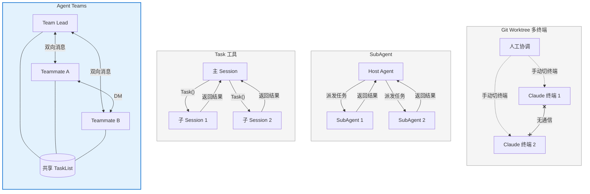
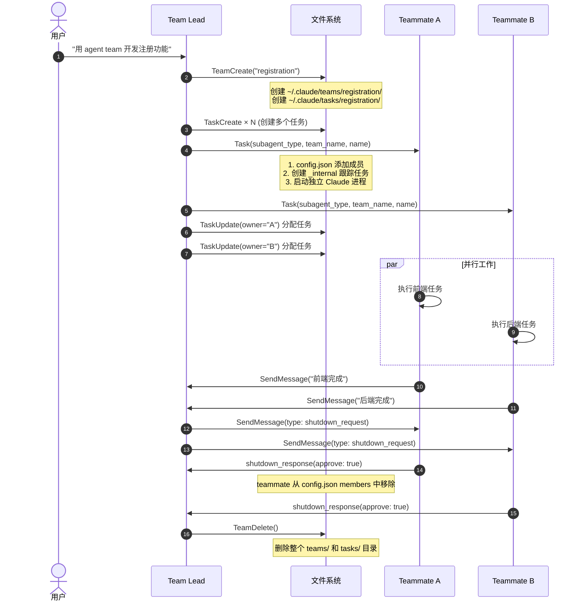
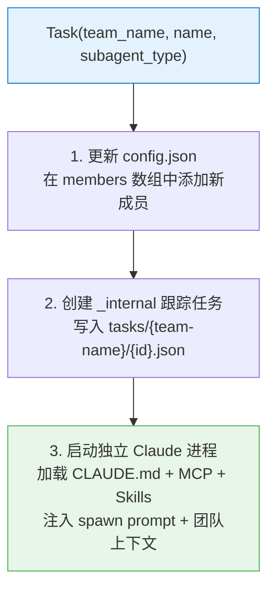
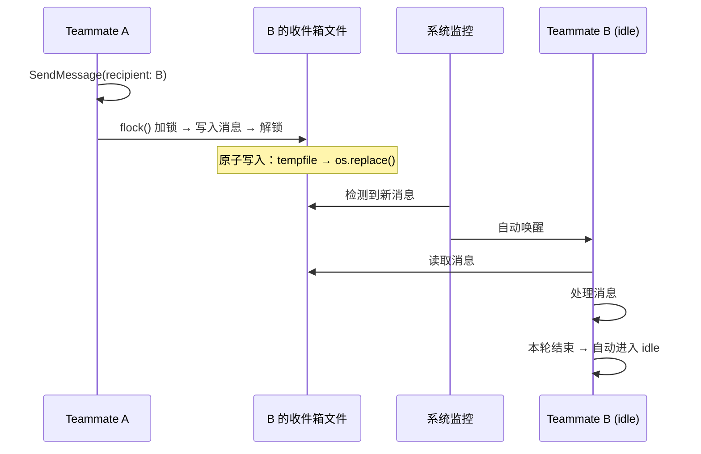
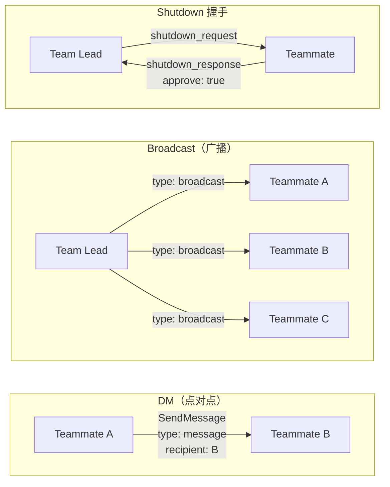
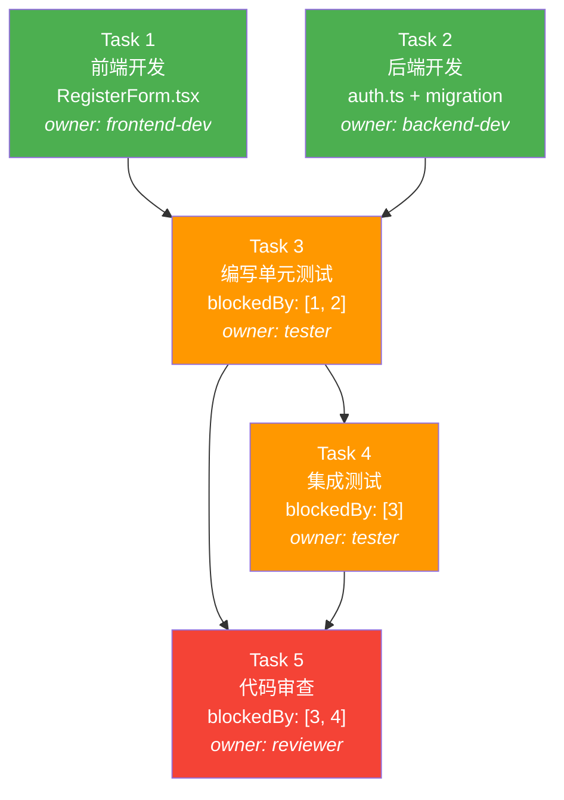
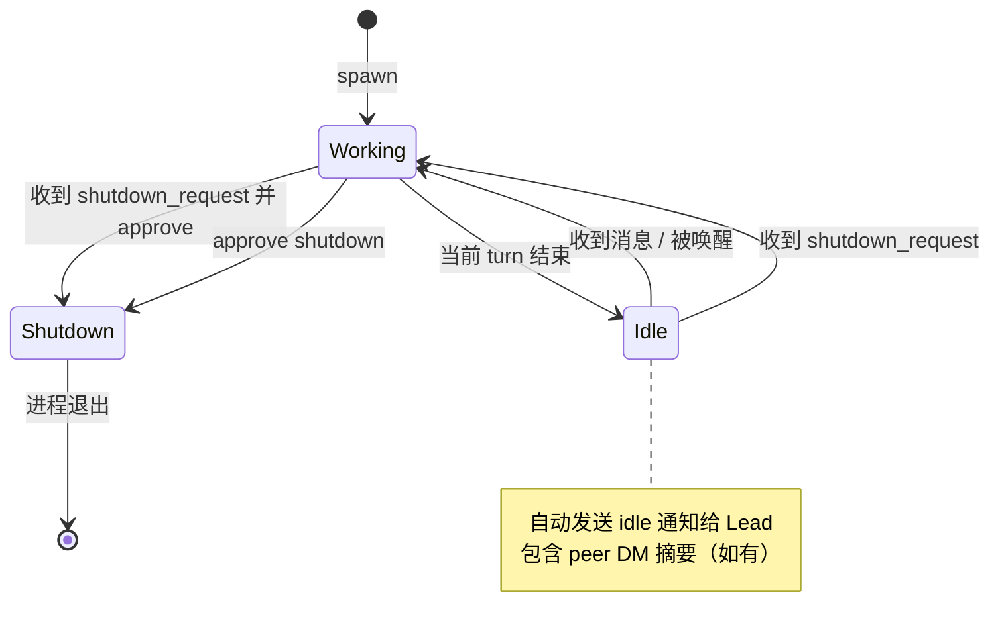
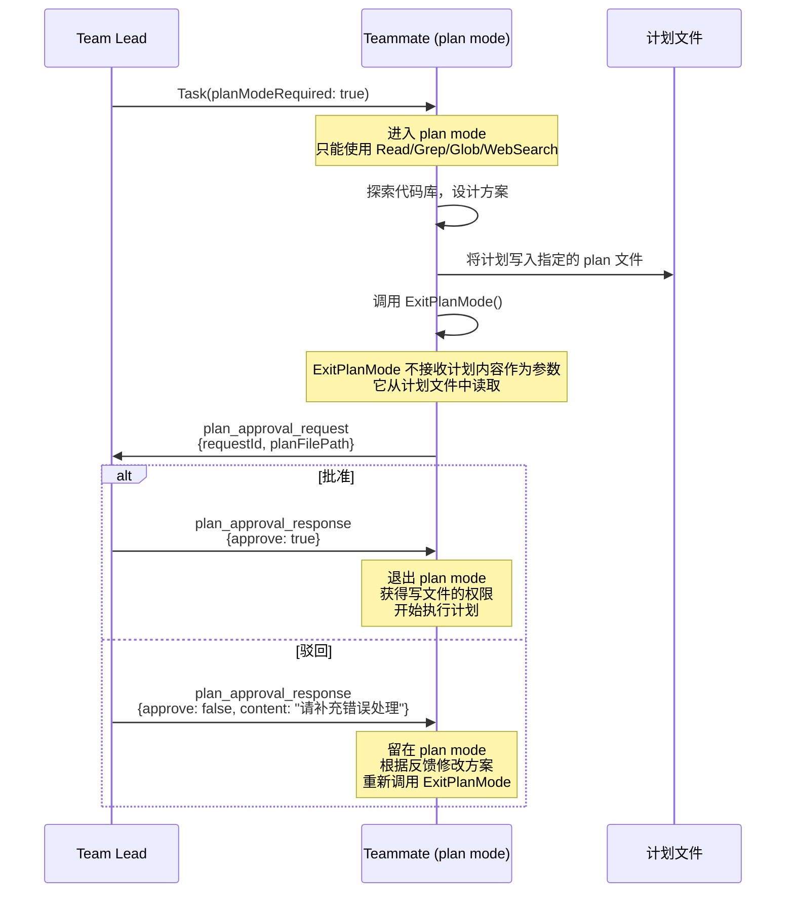
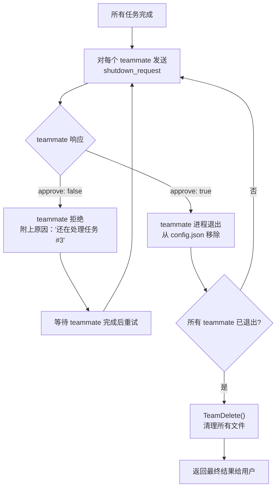
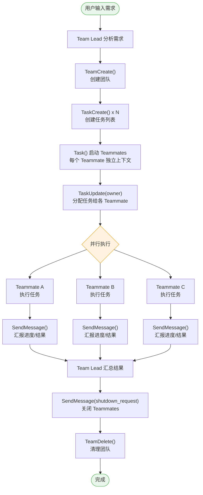

在之前的[【万字长文】最强 AI Coding：Claude Code 最佳实践](https://mp.weixin.qq.com/s/xxx)中，我们提到了通过 Git Worktree 和 subAgent 实现多 Claude 并发干活。但这些方案本质上还是"各干各的"——要么靠人来协调，要么 subAgent 只能单向汇报给 hostAgent。

现在，Claude Code 推出了实验性的 **Agent Teams** 功能，终于把"多 Agent 协作"这件事做成了一个完整的框架：有 Team Lead、有 Teammates、有共享任务列表、有消息通信机制。简单来说就是——Claude 终于能**组队开黑**了。

# 1. Agent Teams 是什么

Agent Teams 允许你**协调多个 Claude Code 实例协同工作**。一个 session 充当 Team Lead（领队），负责拆解任务、分配工作、汇总结果；其他 session 作为 Teammates（队员），各自拥有独立的上下文窗口，独立执行任务。 

关键特性：

- **独立上下文**：每个 teammate 有自己的上下文窗口，互不污染
- **消息通信**：teammate 之间可以直接发消息，不必经过 lead 中转
- **共享任务**：通过统一的 TaskList 协调工作进度
- **异步并行**：多个 teammate 同时工作，真正的并行而非串行

# 2. 和之前的多 Claude 方案有啥区别

在最佳实践那篇文章里，我们介绍过三种多 Claude 方案。现在加上 Agent Teams，一共四种，来对比一下：

| 维度 | Git Worktree 多终端 | SubAgent | Task 工具 | Agent Teams |
| --- | --- | --- | --- | --- |
| 协调方式 | 人工协调 | hostAgent 单向调度 | 主 session 调度 | Team Lead + 消息通信 |
| 上下文隔离 | 完全隔离（不同目录） | 隔离（通过 prompt 传递上下文） | 隔离（独立 session） | 隔离（独立上下文窗口） |
| 通信能力 | 无 | 只能回报结果 | 只能回报结果 | 双向消息、广播、DM |
| 任务管理 | 无 | 无 | 无 | 共享 TaskList |
| 是否可以与 teammate 直接交互 | 是（人工切终端） | 否 | 否 | 是 |
| 文件冲突风险 | 低（不同分支） | 中 | 中 | 中（需要人为规划） |
| Token 消耗 | N 倍（独立计费） | 较低 | 较高（独立上下文） | 高（N 个独立上下文） |

**一句话总结**：SubAgent 适合"派单式"的简单任务分发；Agent Teams 适合需要**持续协作和沟通**的复杂项目。

> 注：SubAgent 本质上也是通过 Task 工具实现的（带 `subagent_type` 参数），二者是同一机制的不同用法。表格中分开列出是为了突出使用模式的差异。



# 3. 实现原理拆解

Agent Teams 的底层实现主要由以下几个核心模块支撑。这个章节会深入到数据结构和机制层面，帮助你理解"为什么这样设计"以及"边界在哪里"。

## 3.1 七个核心工具

整个 Agent Teams 的能力建立在七个工具之上：

| 工具          | 职责                         | 调用方           |
| ------------- | ---------------------------- | ---------------- |
| `TeamCreate`  | 创建团队配置和任务目录       | Lead             |
| `TeamDelete`  | 清理团队和任务文件           | Lead             |
| `SendMessage` | DM、广播、shutdown、计划审批 | Lead + Teammates |
| `TaskCreate`  | 在共享任务列表中创建任务     | Lead + Teammates |
| `TaskUpdate`  | 修改任务状态、owner、依赖    | Lead + Teammates |
| `TaskList`    | 列出所有任务，动态计算可用性 | Lead + Teammates |
| `TaskGet`     | 获取单个任务的完整详情       | Lead + Teammates |

注意，**Task 工具**（用于启动 teammate）是已有工具，通过 `team_name` 和 `name` 参数获得团队感知能力——它不是 Agent Teams 新增的工具，而是被"增强"了。

## 3.2 团队生命周期



## 3.3 文件系统即数据库

Agent Teams 并没有引入额外的通信中间件，而是巧妙地利用**文件系统**作为共享状态存储：

```
~/.claude/
├── teams/
│   └── my-team/
│       ├── config.json          # 团队配置：成员列表、角色、模型
│       └── inboxes/             # 消息收件箱
│           ├── .lock            # 收件箱并发锁
│           ├── frontend-dev.json  # 首次收到消息时才创建
│           └── backend-dev.json
└── tasks/
    └── my-team/
        ├── .lock                # 任务并发锁
        ├── 1.json               # 用户创建的任务
        ├── 2.json               # _internal 跟踪任务（自动创建）
        └── ...
```

### config.json 完整结构

之前我们只展示了简化版本。实际的 `config.json` 包含更丰富的字段：

```json
{
  "name": "registration",
  "description": "开发用户注册功能",
  "createdAt": "2026-02-15T10:30:00.000Z",
  "leadAgentId": "team-lead@registration",
  "leadSessionId": "session-uuid-here",
  "members": [
    {
      "agentId": "team-lead@registration",
      "name": "team-lead",
      "agentType": "team-lead",
      "model": "claude-opus-4-6",
      "joinedAt": 1771441084084,
      "tmuxPaneId": "in-process",
      "cwd": "/home/user/Projects/myapp",
      "subscriptions": []
    },
    {
      "agentId": "frontend-eng@registration",
      "name": "frontend-engineer",
      "agentType": "general-purpose",
      "model": "claude-sonnet-4-6",
      "prompt": "你是一个高级前端工程师，负责...",
      "color": "blue",
      "planModeRequired": false,
      "joinedAt": 1771441090000,
      "tmuxPaneId": "",
      "cwd": "/home/user/Projects/myapp",
      "subscriptions": [],
      "backendType": "in-process"
    }
  ]
}
```

几个值得注意的字段：

- **`model`**：每个 teammate 可以用不同模型。Lead 用 Opus，执行类 teammate 用 Sonnet，从这里控制
- **`prompt`**：teammate 的角色设定 prompt，在 spawn 时注入
- **`planModeRequired`**：是否要求 teammate 先写计划再执行
- **`backendType`**：`"in-process"` 或 tmux pane ID，决定显示模式
- **`color`**：终端中的显示颜色，用于区分不同 teammate 的输出

当 teammate 关闭时，它会从 `members` 数组中**被移除**——config.json 是动态收缩的。`TeamDelete` 要求所有成员都已离开才能执行。

### 收件箱文件格式

每个 teammate 的收件箱是一个 JSON 数组：

```json
[
  {
    "from": "team-lead",
    "text": "请开始开发认证模块",
    "summary": "认证模块任务分配",
    "timestamp": "2026-02-15T10:35:00.000Z",
    "color": "green",
    "read": false
  }
]
```

对于协议消息（shutdown_request、plan_approval 等），`text` 字段包含序列化的 JSON 结构体，带有 `type`、`requestId` 等字段。

收件箱文件**不是在 spawn 时创建的**——只有当某人第一次给该 teammate 发消息时才会创建。这是一个惰性初始化的设计。

### 并发控制：原子写入

所有文件写入遵循原子写入模式：

```
1. 将内容写入临时文件（tempfile）
2. 通过 os.replace() 原子替换目标文件
3. 确保没有 agent 会读到写了一半的文件
```

跨进程的互斥通过 `.lock` 文件上的 `flock()` 系统调用实现。两个目录各有一把锁：`inboxes/.lock` 保护消息写入，`tasks/.lock` 保护任务状态变更。

> 局限性：这个锁机制仅适用于本地文件系统。在网络文件系统（NFS、SMB）上，`flock()` 的行为取决于 OS 实现，可能不可靠。

这意味着：

- **任务协调**通过读写 task JSON 文件实现
- **成员发现**通过读取 config.json 实现
- **消息投递**通过 inboxes 目录下的文件实现
- **并发控制**通过 .lock 文件上的 flock() 实现
- **没有中心化服务**，所有状态都在本地文件系统上——这也意味着 Agent Teams 天然不支持跨机器协作

## 3.4 Teammate 的启动过程

Teammate 通过 **Task 工具** 启动，和普通 SubAgent 用的是同一个工具，但通过额外参数区分身份：

| 参数            | SubAgent   | Teammate                         |
| --------------- | ---------- | -------------------------------- |
| `team_name`     | 无         | 必填——加入指定团队               |
| `name`          | 无         | 必填——teammate 的显示名称        |
| `subagent_type` | agent 类型 | agent 类型（相同参数）           |
| `mode`          | 可选       | 可选（如 `"bypassPermissions"`） |
| `model`         | 可选       | 可选（可指定 sonnet/opus）       |

启动过程分三步：



第 2 步创建的**内部跟踪任务**长这样：

```json
{
  "id": "2",
  "subject": "frontend-engineer",
  "description": "Tracking task for frontend-engineer agent",
  "status": "in_progress",
  "metadata": { "_internal": true }
}
```

这个跟踪任务在 teammate 关闭后**不会被删除**——teammate 从 `config.json` 的 members 中移除，但跟踪任务保留。这意味着你在 TaskList 中看到的任务数量可能比你手动创建的多。

### Agent 类型选择

不同类型的 teammate 拥有不同的工具权限：

| Agent 类型                        | 可用工具                     | 适用场景             |
| --------------------------------- | ---------------------------- | -------------------- |
| `general-purpose`                 | 全部（Edit, Write, Bash 等） | 需要写代码的开发任务 |
| `Explore`                         | 只读（Read, Grep, Glob）     | 代码调研、信息搜索   |
| `Plan`                            | 只读 + 计划输出              | 架构设计、方案规划   |
| 自定义 agent（`.claude/agents/`） | 自定义                       | 取决于 agent 定义    |

关键约束：**只读类型的 agent 永远不能写文件**。如果你把一个开发任务分给 Explore 类型的 teammate，它会做完调研但无法产出代码。

## 3.5 消息通信机制

Agent Teams 的 `SendMessage` 工具支持五种消息类型：

| 类型                     | 用途                 | 必填字段                             | 开销           |
| ------------------------ | -------------------- | ------------------------------------ | -------------- |
| `message` (DM)           | 点对点通信           | `recipient`, `content`, `summary`    | 低             |
| `broadcast`              | 广播给所有 teammates | `content`, `summary`                 | 高（N 条消息） |
| `shutdown_request`       | 请求 teammate 关闭   | `recipient`, `content`               | 低             |
| `shutdown_response`      | 响应关闭请求         | `request_id`, `approve`              | 低             |
| `plan_approval_response` | 审批 teammate 的计划 | `request_id`, `recipient`, `approve` | 低             |

### 消息投递与自动唤醒



关键的设计细节：

- **Teammate 的纯文本输出对其他人不可见**。系统提示词明确要求："Your plain text output is NOT visible to the team lead or other teammates. To communicate with anyone on your team, you MUST use the SendMessage tool." 这就像开发团队里，你在自己电脑上嘟囔的话同事听不到，得发 Slack 消息才行。
- **消息对忙碌的 agent 会排队**。如果 teammate 正在执行工具调用（mid-turn），新消息会排队，等当前 turn 结束后投递。UI 会显示一个带发送者名字的简短通知。
- **Peer DM 可见性**。当 Teammate A 给 Teammate B 发 DM 时，Lead 在 A 的 idle 通知中会收到这条 DM 的简短摘要——这让 Lead 无需完整消息就能掌握团队内部沟通动态。

### 通信模式图解



## 3.6 任务系统详解

### 任务文件完整结构

每个任务存储为独立的 JSON 文件（`~/.claude/tasks/{team-name}/{id}.json`）：

```json
{
  "id": "3",
  "subject": "编写集成测试",
  "description": "为用户注册功能编写集成测试，覆盖正常注册、重复邮箱、密码校验等场景",
  "activeForm": "编写集成测试中",
  "status": "pending",
  "owner": "tester",
  "blockedBy": ["1", "2"],
  "blocks": ["5"],
  "metadata": {}
}
```

字段说明：

- **`id`**：字符串类型（不是数字），如 `"3"`
- **`subject`**：祈使句形式的简短标题（如 "Run tests"）
- **`activeForm`**：进行时形式，显示在 UI spinner 中（如 "Running tests"）
- **`status`**：三种状态 `pending` → `in_progress` → `completed`，另有 `deleted` 用于永久移除
- **`owner`**：未认领时该字段**不存在**（不是 null），通过 TaskUpdate 设置
- **`metadata`**：任意对象，内部跟踪任务使用 `{"_internal": true}`

### 依赖解析是声明式的

这是一个容易被忽略的重要设计：**依赖解析是动态计算的，不是状态同步的**。

当任务 1 完成时，系统**不会去更新**任务 3 的文件。相反，每次调用 `TaskList` 时，系统会：

1. 读取所有任务文件
2. 检查哪些任务的 `status` 是 `completed`
3. 对每个 pending 任务，检查其 `blockedBy` 数组中的任务是否都已完成
4. 动态计算出哪些任务当前可执行

`blockedBy` 数组在创建后**永远不会被修改**——可用性完全靠运行时计算。这个设计避免了分布式状态同步的复杂性，代价是每次查询都要扫描所有任务文件。



图例：绿色 = 可立即执行，橙色 = 等待前置任务，红色 = 最终汇总节点。

### 任务认领机制

任务认领通过 `TaskUpdate` 设置 `owner` 字段实现。系统提示词要求 teammate 遵循以下行为：

1. 完成当前任务后调用 `TaskList` 查看可用任务
2. 找到 `status: "pending"`、无 `owner`、`blockedBy` 为空的任务
3. **优先认领 ID 最小的任务**（低 ID 先做，因为早期任务往往为后续任务提供上下文）
4. 通过 `TaskUpdate(owner: "my-name")` 认领

这里有一个微妙的竞争条件：两个 teammate 可能同时读到同一个未认领的任务并同时尝试认领。`.lock` 文件防止了并发写入，但无法防止"读-判断-写"的 TOCTOU 问题——最终结果是 last-writer-wins。在实践中，由于 teammate 的执行节奏不太可能完全同步，这个问题很少出现。

## 3.7 Idle 状态管理

Teammate 的 idle 状态是整个协作机制中最容易被误解的部分。

### 工作原理



- Teammate **每轮对话结束后自动进入 idle**——这是正常行为，不代表挂了或完成了
- 进入 idle 时系统自动向 Lead 发送通知
- 给 idle 的 teammate 发消息会**立即唤醒**它
- Teammate 发完消息然后 idle 是标准流程——它发了消息，现在等回复

### TeammateIdle Hook

系统在 teammate 即将进入 idle 状态时触发 `TeammateIdle` Hook：

| Exit Code | 行为                                                            |
| --------- | --------------------------------------------------------------- |
| `0`       | 允许正常进入 idle                                               |
| `2`       | 将 stderr 内容作为反馈发回，**阻止 idle，让 teammate 继续工作** |

示例：确保 teammate 停止前构建产物已生成：

```bash
#!/bin/bash
# .claude/hooks/check-before-idle.sh
if [ ! -f "./dist/output.js" ]; then
  echo "构建产物缺失，请先运行 build。" >&2
  exit 2
fi
exit 0
```

## 3.8 Plan Approval 流程

当 teammate 以 `planModeRequired: true` 启动时，完整的审批流程如下：



一个关键细节：`ExitPlanMode` 工具**不接收计划内容作为参数**——它从 teammate 事先写好的计划文件中读取。Teammate 在 plan mode 下被严格限制，除了编辑计划文件本身，不能使用任何写入工具。

## 3.9 Delegate Mode 的实现

Delegate Mode 通过限制 Lead 可用的工具集来实现：

| 被禁用的工具 | 保留的工具                                   |
| ------------ | -------------------------------------------- |
| Edit         | TeamCreate / TeamDelete                      |
| Write        | SendMessage                                  |
| Bash         | TaskCreate / TaskUpdate / TaskList / TaskGet |
| NotebookEdit | Task（用于 spawn teammate）                  |
| 其他写入工具 | AskUserQuestion                              |

Lead 在 Delegate Mode 下如果需要了解代码库，系统提示词指示它通过 `Task(subagent_type=Explore)` 启动一个只读的 Explore agent 来搜索，而不是自己直接调用 Grep/Glob。

### 一个已知的 Bug

Delegate Mode 存在一个[已知问题](https://github.com/anthropics/claude-code/issues/24073)：当 Lead 处于 Delegate Mode 时，通过 Task 工具 spawn 的 teammate 会丢失核心工具（Bash、Read、Write、Edit）的访问权限，即使传了 `mode: "bypassPermissions"` 也无效。

根本原因是权限计算逻辑：

```
effective_permissions = min(mode_param, lead_session_state)
```

Lead 的 Delegate Mode 成了 teammate 权限的**上限**，而不是 `mode` 参数独立生效。

**Workaround**：在进入 Delegate Mode **之前** spawn 所有 teammate。先 spawn 的 teammate 保留完整工具权限。

## 3.10 关闭流程

Lead 完成任务后，必须执行优雅关闭：



Teammate **可以拒绝关闭**。系统提示词允许 teammate 在还有未完成工作时拒绝 shutdown_request 并附上原因。Lead 需要等待它完成后再重试。

另外，teammate 在收到 shutdown_request 时不会立即中断——它会**先完成当前正在执行的工具调用**，然后再响应。如果它正在跑一个耗时的测试套件，你可能需要等一段时间。

# 4. 最佳实践场景

基于上面对实现原理的理解，我们可以推导出什么场景最适合 Agent Teams。核心判断标准很简单：**任务能否被拆解为多个模块边界清晰、文件不冲突的并行子任务**。

## 4.1 全栈功能开发（最典型场景）

前端、后端、测试天然分属不同的文件目录，非常适合并行。

```
你：请用 agent team 开发用户注册功能。
    前端：React 表单组件 + 表单校验
    后端：Express API + 数据库 migration
    测试：单元测试 + 集成测试

Lead 拆解为：
├── Task 1: [frontend-dev] src/components/RegisterForm.tsx
├── Task 2: [backend-dev]  src/api/auth.ts + db/migrations/
├── Task 3: [tester]       tests/  (blockedBy: [1, 2])
```

注意 Task 3 设置了 `blockedBy`，测试会等前端和后端都完成后再开始——利用了任务依赖机制。

## 4.2 竞争性假设调试

面对一个复杂 bug，不确定根因在哪一层？让多个 teammate 从不同方向同时排查：

```
你：线上用户偶尔登录失败，帮我排查。

Lead 拆解为：
├── Task 1: [network-investigator]  检查 API 网关日志和超时配置
├── Task 2: [auth-investigator]     检查 JWT 签发和验证逻辑
├── Task 3: [db-investigator]       检查数据库连接池和慢查询
```

三个方向并行排查，哪个先找到线索就集中力量。这比串行地一个个排查快得多。

## 4.3 多模块重构

对多个互相独立的模块同时进行重构，比如一个大型 monorepo：

```
├── Task 1: [refactor-auth]     重构认证模块，从 Session 迁移到 JWT
├── Task 2: [refactor-logging]  重构日志模块，统一使用 structured logging
├── Task 3: [refactor-config]   重构配置管理，从 .env 迁移到 config service
```

前提是这些模块之间没有强耦合。如果有依赖关系，用 `blockedBy` 声明清楚。

## 4.4 并行研究与技术选型

这是一个纯研究场景，不写代码。多个 teammate 同时调研不同方案，最后 Lead 汇总对比：

```
你：我们需要选一个实时通信方案，帮我调研。

Lead 拆解为：
├── Task 1: [researcher-ws]   调研 WebSocket 方案的优劣、库生态、性能
├── Task 2: [researcher-sse]  调研 SSE 方案的优劣、浏览器兼容性、限制
├── Task 3: [researcher-grpc] 调研 gRPC-Web 方案的可行性、工具链
```

每个 researcher 用 Explore 类型的 agent 即可（只读，不需要写文件）。

## 4.5 代码审查 + 自动修复

一个 teammate 审查，另一个 teammate 根据审查意见修复——流水线式协作：

```
├── Task 1: [reviewer]   审查 src/ 下所有最近修改的文件，输出问题清单
├── Task 2: [fixer]      根据 reviewer 的问题清单逐一修复 (blockedBy: [1])
├── Task 3: [verifier]   运行测试验证修复结果 (blockedBy: [2])
```

这里用到了任务依赖链：审查 → 修复 → 验证，是一个串行流水线，但每一步内部可以并行处理多个问题。

## 4.6 实战：用 Agent Teams 打磨一篇技术文章

这个例子来自真实场景——就是你正在读的这篇文章。文章初稿完成后，还有大量的打磨工作：检查内容质量、配图、调研竞品补充深度、思考更宏观的叙事角度。这些工作彼此独立，天然适合并行。

```
你：文章初稿写好了，在 docs/Vnote/program/bot/ 目录下。
    请用 agent team 帮我做以下事情：
    1. 校对文章，检查事实性错误、逻辑断裂、表述不清的地方
    2. 为文章中的关键概念配图（架构图、流程图）
    3. 搜索同类文章和行业动态，看是否有遗漏的关键信息
    4. 从"企业协作变革"和"超级个体"两个视角，补充一段深度思考

Lead 拆解为：
├── Task 1: [proofreader]
│   校对文章内容：
│   - 技术术语和 API 名称是否准确
│   - 示例代码是否可运行
│   - 段落之间逻辑是否连贯
│   - 输出修改建议清单
│
├── Task 2: [designer]
│   为文章配图：
│   - 生成 Agent Teams 架构概览图
│   - 生成任务 DAG 调度示意图
│   - 生成"四种多 Agent 方案对比"的可视化图
│   - 生成微信公众号封面图
│
├── Task 3: [researcher]
│   搜索补充内容：
│   - 搜索 AutoGen、CrewAI、LangGraph 等框架的多 Agent 协作方案
│   - 搜索 2025-2026 年多 Agent 协作的行业趋势报告
│   - 对比 Claude Agent Teams 与其他方案的差异
│   - 输出调研摘要，标注可补充到文章的位置
│
├── Task 4: [thinker]
│   撰写深度思考章节：
│   - 视角一：企业协作变革
│     多 Agent 协作对软件团队意味着什么？
│     当 AI 团队可以自组织、自协调，人类工程师的角色如何演变？
│     从"人指挥 AI"到"人审查 AI 团队的产出"，管理范式如何变化？
│   - 视角二：超级个体的崛起
│     一个人 + Agent Team = 一个团队的产能？
│     独立开发者、自由职业者如何利用 Agent Teams 突破个体产能天花板？
│     这对传统软件外包和小型团队意味着什么？
│   - 输出一段 500-800 字的思考，风格贴近公众号读者
│
└── Task 5: [editor] (blockedBy: [1, 3, 4])
    汇总整合：
    - 根据 proofreader 的建议修订文章
    - 将 researcher 的调研发现融入正文
    - 将 thinker 的深度思考作为新章节插入"写在最后"之前
    - 最终通读全文，确保风格统一
```

Agent Teams 的能力不局限于编程。研究、写作、设计、审校，任何可以拆解为并行子任务的知识工作都适用。这也是为什么我们要在下一章讨论它对"超级个体"的意义。

如果你正在读这篇文章并且已经开启了 Agent Teams，可以直接把上面的 prompt 复制到 Claude Code 中运行。你会看到多个 teammate 同时启动，各自开始工作，最后由 editor 汇总成稿。


## 4.7 什么时候该用，什么时候不该用

| 适合使用 Agent Teams                | 不适合使用 Agent Teams |
| ----------------------------------- | ---------------------- |
| 多角度并行调研/审查                 | 简单的单文件编辑       |
| 独立模块的并行开发                  | 强依赖的串行任务       |
| 竞争性假设的并行验证                | 同一文件的多处修改     |
| 跨层协调（前端/后端/测试）          | 日常的 bug fix         |
| Code Review（安全/性能/测试多角度） | Token 预算紧张         |

一个更实用的判断标准：**如果任务可以自然地拆成 2-3 个互不依赖的子任务，且每个子任务涉及不同的文件集合，那就适合用 Agent Teams**。反过来，如果任务本身就是串行的，或者多个步骤都要改同一批文件，那单会话或 SubAgent 更合适。

> 如果你是第一次尝试，建议从**不需要写代码的研究/审查任务**开始。比如让三个 teammate 从不同角度审查一个 PR，或者让它们分别调研一个技术方案的不同方面。这些任务没有文件冲突的风险，先感受一下多个 Agent 同时干活是什么体验。

# 5. 如何启用和使用

## 5.1 开启 Agent Teams

在 `~/.claude/settings.json` 中添加：

```json
{
  "env": {
    "CLAUDE_CODE_EXPERIMENTAL_AGENT_TEAMS": "1"
  }
}
```

保存后**重启 Claude Code** 生效。

## 5.2 使用方式



最简单的方式是自然语言触发——直接告诉 Claude 你想用团队模式：

```
请用 agent team 帮我完成这个需求：
- 前端实现用户列表页面
- 后端实现 /api/users 接口
- 编写对应的测试用例
```

Claude Code 会自动完成以下步骤：

1. `TeamCreate` 创建团队
2. `TaskCreate` 创建任务列表
3. `Task` 启动多个 teammates
4. `TaskUpdate` 分配任务（Teammate 也可以自行认领）
5. Teammates 并行工作，通过 `SendMessage` 汇报进度
6. Lead 汇总结果，最后 `TeamDelete` 清理

## 5.3 选择显示模式

Agent Teams 支持两种显示模式：

- **in-process 模式（默认）**：所有 teammate 运行在主终端内。用 `Shift+Up/Down` 切换 teammate，可以直接跟任何一个对话。这种模式兼容性好，在任何终端中都能使用。
- **split-pane 模式**：每个 teammate 独占一个终端面板，需要 tmux 或 iTerm2 支持。看起来很酷——多个面板同时输出——但不支持 VS Code 内置终端、Windows Terminal 和 Ghostty 等。

建议先用默认的 in-process 模式入门，等熟悉了再考虑 split-pane。

## 5.4 手动管理团队

你也可以在过程中直接与团队交互：

```bash
# 查看当前任务列表
# (Claude 会调用 TaskList)

# 给某个 teammate 发消息
"告诉 frontend-dev 把按钮颜色改成蓝色"

# 查看 teammate 状态
# teammate 空闲时会收到自动通知，这是正常的
```

## 5.5 直接与 Teammate 对话

每个 teammate 都是完整的 Claude Code session。你可以随时**绕过 Lead，直接跟任何 teammate 对话**：

- **in-process 模式**：`Shift+Up/Down` 选择目标 teammate，然后输入消息
- **split-pane 模式**：直接点击对应的面板对话

这在 teammate 跑偏时特别有用——直接纠正它，不需要通过 Lead 传话。

# 6. 进阶技巧

## 6.1 Delegate Mode：让 Lead 专注当项目经理

默认情况下，Lead 会忍不住自己动手写代码。这就像一个技术 Lead 说好了只做 code review，结果控制不住就自己上手改了。

解决方法是按 `Shift+Tab` 切换到 **Delegate Mode**。在这个模式下，Lead 只能使用协调类工具（创建团队、分配任务、发消息），不能读写文件、执行命令，**强制让它做一个纯粹的管理者**。

也可以在 prompt 中明确说"你不要自己写代码，全部分给 teammate"，但 Delegate Mode 是更可靠的硬约束。

## 6.2 Plan Approval：先审方案再执行

对于高风险任务，可以要求 teammate 先写方案，审批通过后才允许执行：

```
spawn 一个架构师 teammate 来重构数据库层。
要求它先写方案，我审批后再动手。
```

工作流程：

1. Teammate 进入 plan mode，使用只读工具探索代码库、设计方案
2. 方案完成后通过 `plan_approval_request` 发给 Lead 审批
3. Lead 可以批准（`approve: true`）或驳回并附上反馈
4. Teammate 收到反馈后修改方案，重新提交
5. 审批通过后，teammate 退出 plan mode 开始执行

这个机制特别适合**重构、架构变更**等不可逆操作——先看方案，避免 teammate 一上来就大刀阔斧改错方向。

## 6.3 用 Hooks 做质量门禁

Claude Code 的 Hooks 机制可以在 Agent Teams 中强制执行质量标准：

- **TeammateIdle Hook**：teammate 准备空闲时触发。如果 exit code 为 2，会发送反馈让 teammate 继续工作。可以用来检查测试是否通过、代码是否 lint 干净。
- **TaskCompleted Hook**：任务被标记完成时触发。Exit code 2 阻止完成并发送反馈。可以用来做自动化的完成标准检查。

两种 Hook 都支持三种 handler 类型：`command`（执行 bash 脚本）、`prompt`（单轮 LLM 评估）、`agent`（多轮 subagent，可调用 Read/Grep/Glob）。

### 案例 1：TaskCompleted — 测试必须通过才能标完成

最常见的场景：teammate 声称开发完成，但测试根本没跑过。

在 `.claude/settings.json` 中配置：

```json
{
  "hooks": {
    "TaskCompleted": [
      {
        "hooks": [
          {
            "type": "command",
            "command": "bash .claude/hooks/verify-tests.sh"
          }
        ]
      }
    ]
  }
}
```

`.claude/hooks/verify-tests.sh`：

```bash
#!/bin/bash
# 运行测试，如果失败则阻止任务标记为完成
npm test --silent 2>&1
if [ $? -ne 0 ]; then
  echo "测试未通过，请修复失败的测试用例后再标记完成。" >&2
  exit 2  # exit 2 = 阻止完成，反馈内容发回给 teammate
fi

exit 0  # exit 0 = 允许完成
```

效果：teammate 调用 `TaskUpdate(status: "completed")` 时，Hook 自动跑测试。测试失败 → teammate 收到反馈并继续修复；测试通过 → 任务正常标记为完成。

### 案例 2：TaskCompleted — 代码必须通过 lint

```bash
#!/bin/bash
# .claude/hooks/verify-lint.sh
LINT_OUTPUT=$(npx eslint src/ --quiet 2>&1)
if [ $? -ne 0 ]; then
  echo "代码存在 lint 错误，请修复后再标记完成：" >&2
  echo "$LINT_OUTPUT" >&2
  exit 2
fi
exit 0
```

可以和测试 Hook 组合使用——在同一个 `TaskCompleted` 事件下挂多个 hooks，它们会依次执行，任一返回 exit 2 就阻止完成：

```json
{
  "hooks": {
    "TaskCompleted": [
      {
        "hooks": [
          {
            "type": "command",
            "command": "bash .claude/hooks/verify-lint.sh"
          },
          {
            "type": "command",
            "command": "bash .claude/hooks/verify-tests.sh"
          }
        ]
      }
    ]
  }
}
```

### 案例 3：TaskCompleted — 用 prompt handler 做智能审查

除了 bash 脚本，还可以用 `prompt` 类型让 LLM 快速审查代码质量：

```json
{
  "hooks": {
    "TaskCompleted": [
      {
        "hooks": [
          {
            "type": "prompt",
            "prompt": "检查当前 git diff 中是否存在以下问题：1) 硬编码的密钥或密码 2) 被注释掉的代码块 3) console.log 调试语句。如果发现任何问题，输出问题列表并返回 exit code 2。"
          }
        ]
      }
    ]
  }
}
```

`prompt` handler 使用快速模型做单轮评估，适合做轻量级的模式匹配检查。如果需要多轮分析（比如跨文件检查一致性），可以用 `agent` 类型：

```json
{
  "type": "agent",
  "prompt": "审查本次任务修改的所有文件，确认：1) 新增的函数都有对应的测试 2) API 变更在文档中有体现 3) 没有引入循环依赖。如果发现问题则拒绝完成。"
}
```

注意：Hook 层级越多，teammate 完成任务的时间越长（每次标完成都要跑全部 Hook）。建议根据项目实际需要选择，不必全部启用。

## 6.4 给 Teammate 指定模型

不是所有 teammate 都需要用最强的模型。可以给不同角色指定不同模型来控制成本：

```
创建一个 4 人团队。Use Sonnet for each teammate.
```

只在真正需要强推理能力（如架构设计、复杂 debug）的 teammate 上用 Opus，其他执行类任务用 Sonnet 即可。

# 7. 注意事项与踩坑

Agent Teams 还在早期阶段，踩坑在所难免。以下是实战中总结的经验。

### 文件冲突是最大的坑

多个 teammate 同时编辑同一个文件，后写入的会覆盖先写入的——这是最常见的问题。Agent Teams 的任务列表有文件锁，但**文件写入本身没有锁机制**。

解决思路：

- **任务拆解时划清文件所有权**。比如 Teammate A 只改 `src/auth/`，Teammate B 只改 `tests/auth/`，绝不交叉
- **用任务依赖确保共享文件只有一个写入者**。如果两个 teammate 都要改 `config.ts`，让它们通过 `blockedBy` 串行化
- **在 prompt 中明确强调**"每个人只改自己负责的文件，不要动其他人的代码"——这句话不可缺少

### Lead 和 Teammate 都可能失控

**Lead 的问题**：忍不住自己动手写代码，不愿意把活分给 teammate。解决方法是用 Delegate Mode（`Shift+Tab`）强制限制。

**Teammate 的问题**：容易跑偏。比如让它只审查安全问题，结果它顺手重构了代码风格；让它改测试，结果它跑去改了实现代码。缓解方法：

- 使用 Plan Approval 先审方案再执行
- 任务颗粒度不要过大，大任务容易跑偏
- 发现跑偏及时直接与 teammate 对话纠正

### Token 消耗不容忽视

每个 teammate 是独立 Claude 实例，5 人团队约 5 倍 token 消耗，启用 Plan Approval 模式下可达 7 倍。建议：

- 给执行类 teammate 用 Sonnet 而不是 Opus
- 只在真正需要并行的场景才动用 Agent Teams
- 团队规模控制在 **2-4 个 teammate**

### Teammate 的 Idle 状态是正常的

Teammate 每轮对话结束后会自动进入 idle 状态，这不代表它挂了或完成了。给它发消息就会重新唤醒。不要看到 idle 通知就慌。

### Session 恢复的限制

`/resume` 和 `/rewind` **不能恢复正在运行的 teammate**。会话中断后，Lead 会尝试给已不存在的 teammate 发消息，只能重新创建。这意味着**长时间运行的任务有较高的中断风险**，建议拆成较短的分步执行。

### 协调本身的开销

- Teammate 有时忘记把任务标记为已完成，导致下游任务一直被阻塞——需要手动检查或让 Lead 去催
- 关停不是即时的，teammate 会先完成当前的工具调用才响应 shutdown_request。如果它正在跑测试套件，可能需要等很久
- Teammate 的权限请求会通过 Lead 频繁打断你的操作，建议**提前在权限设置中批准常用操作**

### 别指望 Agent Team 自觉保证质量

AI Agent 一个常见问题是**声称任务完成但实际上并没有**——输出一个差不多的结果就交差了。解决方法：

- 通过 TaskCompleted Hook 添加自动验证（如测试必须通过）
- 对关键任务一定要**人工审查**
- 不要完全信任 teammate 的"完成"状态

### 不能正确关闭

teammate 可能会不响应 shutdown_request 来关闭任务

遇到问题时，最稳妥的做法是 `/clear` 重新开始。

尽管有这些限制，Agent Teams 的核心价值已经清晰可见。

---

# 8. 深度思考：Agent Teams 的更大图景

Agent Teams 表面上是一个多 Claude 协作框架，但它背后折射出的趋势值得我们花点时间认真想一想。

## 企业协作的范式转移

传统软件团队的运作方式是：Tech Lead 拆需求 → 分给工程师 → 每日站会同步进度 → Code Review → 合并。这个流程之所以存在，本质上是因为**人类的认知带宽有限**——你没法同时做前端、后端和测试，所以需要多人分工。

Agent Teams 的出现意味着，这个分工逻辑开始被 AI 内化。一个 Team Lead Agent 可以拆任务、分配、跟踪进度、汇总产出——这不就是一个初级项目经理的工作吗？当 AI 团队可以自组织、自协调，人类工程师的角色必然从"执行者"向"审查者"和"决策者"迁移。

这对工程管理者意味着什么？你管理的不再只是人，而是"人 + AI 团队"的混合编队。Tech Lead 的核心能力从"带人写代码"变成"设计任务结构、定义验收标准、审查 AI 产出的质量"。坦白说，这更接近架构师和产品负责人的角色——关注 What 和 Why，而非 How。

2025 年以来，我们已经看到不少团队在实践中摸索这种模式：人类工程师负责架构设计和关键决策，日常的 CRUD 开发、测试编写、文档生成交给 AI 流水线。Agent Teams 只是把这条路往前推了一步——从"一个人配一个 AI 助手"到"一个人指挥一个 AI 团队"。

## 超级个体的崛起与边界

"一个人 + Agent Team = 一个团队的产能"——这个说法夸张吗？取决于场景。

对于模式化程度高的工作（CRUD 应用开发、标准化测试编写、文档生成），一个熟练的独立开发者配合 Agent Teams，确实可以达到 3-5 人小团队的产出速度。这对独立开发者和自由职业者来说是巨大的杠杆：你不需要雇人，不需要协调排期，甚至不需要等队友回复消息——AI teammate 7×24 在线，没有情绪，没有上下文切换成本。

这对传统软件外包行业是一个值得警惕的信号。当甲方自己就能用 Agent Teams 搞定原本需要外包的工作，"人头计费"的商业模式会受到直接冲击。小型外包团队要么转向 AI 无法胜任的高复杂度领域，要么自己先用 Agent Teams 提效，用更少的人交付更多的项目。

但"超级个体"模式也有明确的边界。Agent Teams 擅长的是**可拆解、模块边界清晰、验收标准明确**的任务。涉及到模糊需求的产品判断、跨部门的政治协调、需要长期信任积累的客户关系——这些仍然是人类不可替代的领域。AI 团队再强，也需要一个清晰的任务定义作为输入。而"把模糊的需求变成清晰的任务定义"，恰恰是最难自动化的那一步。

所以，更准确的说法可能是：Agent Teams 不会让每个人都变成超级个体，但它会让**本身就具备系统性思维和任务拆解能力的人**获得前所未有的杠杆。差距不会缩小，而是会被放大。

---

## 写在最后

Agent Teams 代表了 AI Coding 的一个重要方向——从"一个 AI 干活"到"一群 AI 协作"。它的实现原理并不复杂（文件系统 + 消息传递），但提供的协作模式解决了实际痛点。

放眼整个行业，多 Agent 协作已经成为确定性趋势。Cursor 2.0 支持最多 8 个并行 Agent 和 Background Agents；GitHub Copilot 走 Issue 驱动的云端 Agent 模式；VS Code 1.109 刚支持在同一编辑器中编排多厂商 Agent；CrewAI、MetaGPT 等框架也在各自的方向上快速迭代。Claude Agent Teams 的独特之处在于——它是 CLI 原生的零代码协作体验，不需要写编排代码，用自然语言就能指挥一个 AI 团队。

当然，现阶段它还是实验性功能，适合在**非关键路径**上尝鲜。我的建议是：

1. 确保任务拆解足够清晰，文件不重叠
2. 关注 Token 消耗，避免"开了一个排的 AI 结果账单爆炸"

从 Git Worktree 手动并发，到 SubAgent 单向调度，再到 Agent Teams 的完整协作框架——多 Agent 协作的基础设施正在逐步成熟。期待它正式发布的那天。

## 📚 参考

- [Piebald-AI/claude-code-system-prompts - Agent Teams 系统提示词](https://github.com/Piebald-AI/claude-code-system-prompts)
- [From Tasks to Swarms: Agent Teams in Claude Code (alexop.dev)](https://alexop.dev/posts/from-tasks-to-swarms-agent-teams-in-claude-code/)
- [Claude Code Agent Teams: How They Work Under the Hood (claudecodecamp.com)](https://www.claudecodecamp.com/p/claude-code-agent-teams-how-they-work-under-the-hood)
- [Claude Code Agent Teams 官方文档](https://code.claude.com/docs/en/agent-teams)
- [Feisky - Claude Code 多 Agent 组队开发：从原理到踩坑全指南](https://mp.weixin.qq.com/s/mT5qlT8t6_KAzwNP0QH8ag)
- [Claude Code 最佳实践](https://www.anthropic.com/engineering/claude-code-best-practices)
- [Claude Code 官方文档](https://docs.anthropic.com/en/docs/claude-code)
- [CrewAI vs LangGraph vs AutoGen 对比 (DataCamp)](https://www.datacamp.com/tutorial/crewai-vs-langgraph-vs-autogen)
- [Best AI Coding Agents for 2026 (Faros AI)](https://www.faros.ai/blog/best-ai-coding-agents-2026)
- [Cursor 2.0 Multi-Agent Workflows (DevOps.com)](https://devops.com/cursor-2-0-brings-faster-ai-coding-and-multi-agent-workflows/)
- [GitHub Copilot Coding Agent (GitHub Docs)](https://docs.github.com/en/copilot/concepts/agents/coding-agent/about-coding-agent)
- [kieranklaassen 的 Swarm 编排 SKILL](https://gist.github.com/kieranklaassen/4f2aba89594a4aea4ad64d753984b2ea)
- [2026 Agentic Coding Trends Report (Anthropic)](https://resources.anthropic.com/hubfs/2026%20Agentic%20Coding%20Trends%20Report.pdf)

#claudecode #agentteams #practice
