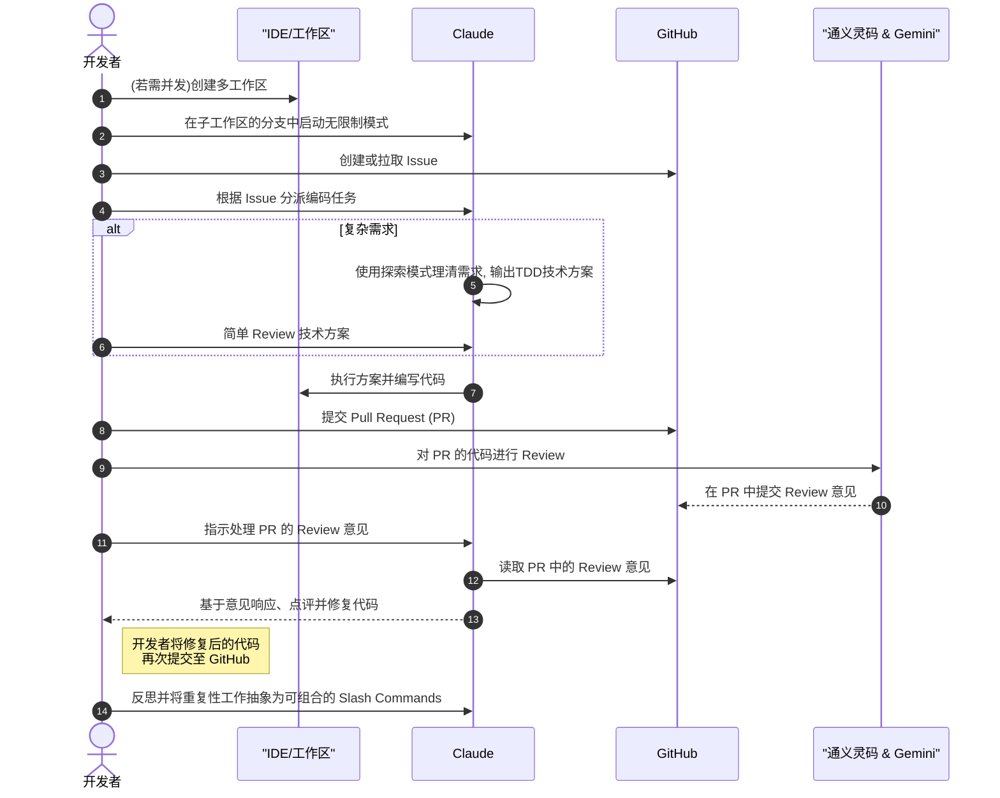

Claude Code 是目前最强的AI Coding Agent，没有加之一，应该也没有人反对吧：）如果还没用上 Claude Code（CC）,直接看 https://cc.xiaohui.cool

## 📋 目录

0. [我现在的工作流]()
1. [自定义环境配置](#1-自定义环境配置)
2. [MCP 与常用命令]()
3. [核心工作流程](#3-核心工作流程)
4. [上下文管理]()
5. [自动化与批处理](#5-自动化与批处理)
6. [多 Claude 并发干活]()

---

# 我现在的工作流

基于 CC，我综合了最佳实践形成了自己的工作流如下，整个过程其实我只需要提出需求以及Review。

## 时序图



## 流程细节

1. 有需要并发则创建多工作区
2. 在子工作区中每个分支启动 Claude 无限制模式，通过 `Shift Tab` 需要时切换模式 
3. 对于新需求创建 issue，或者拉取当前 issue. 多个 issue 可以使用 GitHub Projects 管理。
4. 按照 issue 给 Claude Code 派活。对于复杂需求，使用探索模式理清需求, 尽量产出基于 TDD 的技术方案，简单review 后让 Claude 执行
5. 提交 PR
6. 通义灵码和 Gemini Code Assistant Review PR 代码 
7. Claude 响应 Code Review 意见，点评后修复

 8. 对每一个重复的工作都可以抽象成 commands ,注意 commands 不要太大，方便组合。 比如我们可以让 Claude 为我们添加一个`pr-comments`命令

接下来我将详细介绍 Claude 6 个部分的最佳实践。

# Claude 最佳实践

## 1. 初始环境配置

### 1.1 创建 CLAUDE.md 文件

**作用**：作为项目记忆库，自动注入上下文，减少重复说明

**推荐位置**：

- 项目根目录（`CLAUDE.md`）
- 子目录（按需加载）
- 全局配置（`~/.claude/CLAUDE.md`）

**内容结构**：

```markdown
# 项目基础信息

- 技术栈：React + TypeScript + Node.js
- 运行环境：Node 18+, Python 3.9+

# 常用命令

- `npm run dev`: 启动开发服务器
- `npm run test`: 运行测试
- `npm run build`: 构建项目

# 代码规范

- 使用 ES modules
- 函数使用 camelCase 命名
- 组件使用 PascalCase 命名

# 测试策略

- 单元测试使用 Jest
- E2E 测试使用 Playwright
- 测试文件命名：\*.test.ts

# 注意事项

- 提交前必须运行 lint 和测试
- 新功能需要更新文档
```

这个和 cursurruels 类似，很多 AI Coding 类产品都有给 LLM 补充 context 的文件需要配置。产出

### 1.2 权限管理策略

**安全配置**：

```bash
# 查看当前权限
/permissions

# 允许特定操作
/permissions add Edit
/permissions add Bash(git commit:*)

# 跳过所有权限检查（谨慎使用）可以使用 Shift+ Tab 切换模式
claude --dangerously-skip-permissions
```

`claude --dangerously-skip-permissions` 也被称为YOLO （You Only Live Once) 模式：）

### 1.3 GitHub CLI 集成

**安装**：

```bash
brew install gh  # macOS
```

**常用操作**：

- 创建 PR：`gh pr create`
- 查看 Issue：`gh issue view`
- 添加标签：`gh issue edit --add-label`

---

## 2. MCP 与常用命令

### 2.1 MCP 服务器集成

**常用 MCP 服务器**：

```json
{
  "mcpadvisor": {
    "command": "npx",
    "args": ["-y", "@xiaohui-wang/mcpadvisor@1.0.4"]
  },
  "Up-to-date Docs For Any Prompt": {
    "command": "npx",
    "args": ["-y", "@upstash/context7-mcp@latest"]
  },
  "sequential-thinking": {
    "command": "npx",
    "args": ["-y", "@modelcontextprotocol/server-sequential-thinking"],
    "env": {},
    "disabled": true
  },
  "memory": {
    "command": "npx",
    "args": ["-y", "@modelcontextprotocol/server-memory"],
    "env": {}
  }
}
```

```
# 添加一个 MCP
claude mcp add <name> <command> [args...]

claude mcp add my-server -e API_KEY=123 -- /path/to/server arg1 arg2
# This creates: command="/path/to/server", args=["arg1", "arg2"]
```

更多命令直接输：

```bash
claude mcp
```

### 2.2 常用命令参数

如果在 Claude 中使用命令，为了和对话区分，需要前面加`!`。

```bash
#️ 继续最近的对话
claude --continue

# 可以选择最近的一些对话中的一个开始
claude --resume

#进入 Claude Debug 模式，会打印很多运行时日志
claude --debug

```


### 2.3 自定义 Slash 命令

**创建命令**：在 `.claude/commands/` 目录下创建 Markdown 文件。可以在 家目录下或者当前项目下。

```bash
mkdir -p .claude/commands
```

**示例：修复 GitHub Issue**,使用 `$ARGUMENTS` 作为占位符

```markdown
# .claude/commands/fix-issue.md

请分析和修复 GitHub issue: $ARGUMENTS

执行步骤：

1. 使用 `gh issue view $ARGUMENTS` 获取详细信息
2. 理解问题描述
3. 搜索相关代码文件
4. 实现修复方案
5. 运行测试验证
6. 提交代码并创建 PR
```

**使用方法**：

```bash
/fix-issue 1234
```

#### Meta-Slash-Commands

和 Meta-Prompt 类似，又到了套娃的环节了！当然不用命令，直接说和 CC 说创建一个 Slash Command 也可以。 

````
---
allowed-tools:Write(*),Read(*),Bash(mkdir:*),Bash(ls:*),Bash(echo:*),Bash(cp:*),Bash(date:*)
description:生成一个支持版本管理的新斜杠命令
version:1.0.0
author:xiaohui
---

# 生成带版本管理的斜杠命令

您正在创建一个内置版本管理的新Slash Comamnd。根据 `$ARGUMENTS` 中的用户需求，生成一个完整的带版本控制的 Slash Comamnd 文件。

## 版本管理功能

此命令支持：
- **语义化版本控制** (MAJOR.MINOR.PATCH)
- 更新现有命令时**自动创建备份**
- 在 YAML Frontmatter 中**跟踪版本历史**
- **生成更新日志**

## 指令：

1.  **解析参数**：格式应为 `<command-name>"<description>" [project|user] [version] [additional-requirements]`
    - `command-name`: 斜杠命令的名称（不带 `/`）
    - `description`: 命令的作用
    - `scope`: "project" (`.claude/commands/`) 或 "user" (`~/.claude/commands/`) - 默认为 "user"
    - `version`: 语义化版本（新命令默认为 "1.0.0"）
    - `additional-requirements`: 任何所需的特殊功能

2.  **版本管理流程**：
    - 检查命令文件是否已存在
    - 如果存在：使用当前版本号创建备份
    - 更新版本号（适当递增）
    - 向 Frontmatter 添加更新日志条目

3.  **创建适当的目录结构**：
    - 对于项目命令：`.claude/commands/`
    - 对于用户命令：`~/.claude/commands/`
    - 如果需要，为备份创建 `versions/` 子目录

4.  **生成带增强 YAML Frontmatter 的命令文件**：
    ```yaml
    ---
    allowed-tools: [适当的工具]
    description: [命令描述]
    version: "X.Y.Z"
    created: "YYYY-MM-DD"
    updated: "YYYY-MM-DD"
    changelog:
      - version: "X.Y.Z"
        date: "YYYY-MM-DD"
        changes: ["初始版本" 或具体更改]
    ---
    ```

5.  **备份策略**：
    - 更新前：`cp command-name.md command-name.v[old-version].md`
    - 保留备份文件以便回滚
    - 可选：将备份移动到 `versions/` 子目录

6.  **根据需求考虑以下功能**：
    - Git 操作：包含与 Git 相关的 `allowed-tools`
    - 文件操作：包含 `Read`, `Write`, `Edit` 工具
    - GitHub 操作：包含 `Bash(gh:*)` 工具
    - Web 操作：包含 `WebFetch`, `WebSearch` 工具
    - 目录操作：包含 `LS`, `Glob`, `Grep` 工具

## 示例 allowed-tools 模式：
- `Bash(git:*)` - 用于 Git 命令
- `Bash(gh:*)` - 用于 GitHub CLI 命令
- `Read(*)`, `Write(*)`, `Edit(*)` - 用于文件操作
- `LS(*)`, `Glob(*)`, `Grep(*)` - 用于目录/搜索操作
- `WebFetch(*)`, `WebSearch(*)` - 用于 Web 操作

## 命令参数：$ARGUMENTS

现在使用版本管理创建Slash Command 命令文件，确保它遵循 Claude Code 斜杠命令的最佳实践。
````

## 3. 核心工作流程

工作流中最重要的是**文档先行** 和**测试先行**。以为现在 AI 写代码几乎毫不费力，人类负责把关的就是知道要写什么，和最后写的对不对。借用 ThoughtWork 徐昊的话，软件工程本质上是知识工程，软件是知识的实践和传递。

### 3.1 探索-计划

1. **探索阶段**

   ```bash
   # 让 Claude 先了解项目结构和业务背景
   "请先阅读项目的主要文件，不要立即开始编码"
   "我们讨论一下 xxx ,这里是背景资料 xxx"
   ```

2. **计划阶段**
   ```bash
   # 生成详细计划
   "请制定一个实现用户认证功能的详细计划，使用 think 模式"
   "将计划保存到 planning/auth-implementation.md"
   ```
   ⚠️ [CC 明确表示](https://www.anthropic.com/engineering/claude-code-best-practices)，不同的词汇对应不同的模型思考预算： "think" < "think hard" < "think harder" < "ultrathink

### 3.2 测试驱动开发（TDD）

相比让 AI 先写功能再写测试，在项目有条件先写测试再写功能的时候，因为 AI 有一个明确的迭代目标（让测试通过），AI 表现更好，用户也方便验收。不过要完全驾驭 AI + TDD，也是有点难度。验证时需要明确告诉 AI 我们正在做 TDD，需要红绿循环。当所有测试通过后，最好再开启一个独立的 Agent 去检查测试是否过拟合了。以下是一个伪Prompt:

```
我们正在进行测试驱动开发（TDD），请你不要创建模拟实现，即使对于还没有实现的功能。
请你根据功能 xxx 和预期输入输出：xxx 编写测试。
你运行测试时将会经历红绿循环。当没有实现或实现有无时，测试红色报错，当实现正确时，测试绿色通过。不要修改测试。专注实现规划的测试功能。持续迭代，直到所有测试通过。
```

---

## 4. 上下文管理

### 4.1 详细的指令

**对比示例**：

| ❌ 模糊指令 | ✅ 详细指令                                                                    |
| ----------- | ------------------------------------------------------------------------------ |
| "添加测试"  | "为 UserService 的 login 方法添加测试，验证密码错误时抛出 AuthenticationError" |
| "修复 bug"  | "修复 Issue #123：用户登出后仍然可以访问受保护页面"                            |
| "优化性能"  | "优化 /api/users 接口，将响应时间从 2s 降低到 500ms 以内"                      |

#### 精准用词

- “think” 代表一般的思考
- “think more" 、“think harder" 代表更多的思考值得一提的是，让 LLM 更多地思考还有很多方法，比如使用 `<think>` 的COT和 few-shot , 或者使用 sequential-thinking MCP。

### 4.2 上下文管理

**保持专注**：

```bash
# 清除不相关上下文
/clear

# 聚焦特定目录
# 或者直接切到这个目录再使用 Claude Code
"请专注于 @src/auth/ 目录下的文件"

# 使用检查清单
"创建一个修复 lint 错误的检查清单，逐项完成"
```

### 4.3 数据输入方式

```bash
# 1. 直接粘贴
# 2. 管道输入
cat error.log | claude "分析这些错误日志"

# 3. 文件读取
"请读取 data/users.csv 并分析用户分布"
# 4. 如果文件就在当前目录下直接 @
"请读取 @users.csv 并分析用户分布"

# 5. URL 获取,注意网络是否需要 VPN
"请分析 https://api.github.com/users/octocat 的响应结构"

# 6。 引用 MCP Resources， 当连接了 MCP ，格式是 @server:resource
"看看现在有哪些 issue：@github:repos/owner/repo/issues"

```

### 4.3 结合图片开发

CC 虽然跑在命令行里面，但是可以向对话中添加图片！

- **将图片拖放到 Claude Code 窗口中。**

- **复制图片，然后使用 `Ctrl + V` 将其粘贴到 CLI 中（不是 `Cmd + V`）。**

- **向 Claude 提供图片路径。** 例如：“根据截图结果：`/path/to/your/image.png` 调整样式，使用 Puppeteer 截图对比设计稿，直到匹配设计稿 ”

## 5. 自动化与批处理

### 5.1 无头模式（Headless Mode）

**基本用法**：

```bash
# CI/CD 集成
claude -p "运行所有测试并生成覆盖率报告" --output-format stream-json

# 批量处理
claude -p "为所有 TypeScript 文件添加类型检查" --allowedTools Edit
```

### 5.2 自动化脚本示例

**Issue 自动分类**：

```bash
#!/bin/bash
# auto-triage.sh

ISSUE_NUMBER=$1
claude -p "
分析 GitHub Issue #$ISSUE_NUMBER 并添加合适的标签
步骤：
1. 读取 Issue 内容
2. 识别问题类型（bug/feature/docs）
3. 评估优先级
4. 添加标签
" --allowedTools mcp__github__add_labels
```

### 5.3 Pre-Commit Hooks

**.git/hooks/pre-commit**：

```bash
#!/bin/bash
# 使用 Claude 检查代码质量

claude -p "
检查即将提交的代码：
1. 运行 lint 检查
2. 确保测试通过
3. 验证代码风格一致性
4. 如有问题，提供修复建议
" --allowedTools Bash
```

### 5.4 Claude Code Hooks

这个写 Spring 的应该很熟悉，类似简单的 Spring 生命周期扩展点，在CC 执行的每个阶段执行对应的 Hook 动作。CC 也提醒你配置Hooks 自动化运行后结果自负。使用 `/hooks` 进入。 

实际上他们存在 setting.json 文件中

- `~/.claude/settings.json` - User settings
- `.claude/settings.json` - Project settings

#### hooks 中的变量

- `$CLAUDE_FILE_PATHS` - 正在修改的文件
- `$CLAUDE_TOOL_INPUT` - 完整工具参数的 JSON 格式
- `$CLAUDE_NOTIFICATION` - 通知消息内容输入参数参见官方文档：https://docs.anthropic.com/en/docs/claude-code/hooks

#### 1. PreToolUse Hook

这些 hooks 在 Claude 执行任何操作之前运行。比如检查生产环境的文件不应该被修改：

```bash
[[hooks]]
event = "PreToolUse"
[hooks.matcher]
tool_name = "edit_file"
file_paths = ["src/production/**/*"]
command = "echo 'WARNING: Attempting to modify production files!' && exit 2"`
```

#### 2. PostToolUse Hook

在不同的目录执行不同的格式化工具-假如是一个 monorepo 语言不一样的话：

```bash
[[hooks]]
event = "PostToolUse"
[hooks.matcher]
tool_name = "edit_file"
command = """
for file in $CLAUDE_FILE_PATHS; do
  case $file in
    frontend/*.ts) prettier --write "$file" ;;
    backend/*.go) gofmt -w "$file" ;;
    docs/*.md) markdownlint --fix "$file" ;;
  esac
done
"""
```

#### 3. Notification Hook

```bash

[[hooks]]
event = "Notification"
[hooks.matcher]
command = """
notify-send 'Claude Code' 'Awaiting your input'
"""
```

#### 4. Stop Hook

Claude Code 在结束当前 Loop 前运行测试：

```bash
[[hooks]]
event = "Stop"
run_in_background = true
[hooks.matcher]
tool_name = "edit_file"
file_paths = ["src/**/*.py", "tests/**/*.py"]
command = "pytest --quiet || (echo 'Tests failed! Fix them before proceeding.' && exit 2)"
```

### 5.5 把 Claude 当做一个 Unix 工具来用

比如**将 Claude 添加到CI/CD 构建脚本：**

```json
// package.json
{
  "scripts": {
    ...
    "lint:claude": "claude -p '你是一个代码检查工具。请查看与 main 分支的更改，并报告任何与拼写错误相关的问题。在一行中报告文件名和行号，在第二行中描述问题。不要返回任何其他文本。'"
  }
}
```

还有之前举过的例子，把 Claude 放在管道（Pipe）中

```bash
cat code.py | claude -p '分析此代码中的错误' --output-format json > analysis.json
```

自然地，你可以在脚本里面写循环来调用 CC 批处理多个任务

## 6. 多 Claude 并发干活

### 6.1 代码审查模式

**双 Claude 协作**：

```bash
# 终端 1：代码编写
claude "实现新的用户注册功能"

# 终端 2：代码审查（新终端）
cd same/project && claude
# 然后询问："请审查刚才实现的注册功能代码"
```

### 6.2 并行开发策略

并行开发的核心是要给 Claude 创建相互独立的环境，简单来说就是对同一份代码仓库复制出多个相互隔离的仓库。那我们就可以使用**Git Worktrees 方法**：

```bash
# 创建新的工作区 project-auth 并关联上 feature/auth 分支，如果这个分支不存在，会自动创建
git worktree add -b  feature/auth ../project-auth feature/current_branch
git worktree add -b feature/ui-redesign  ../project-ui feature/current_branch
```

这样就会在当前项目目录的上级目录基于`feature/current_branch` 分支拷贝一份当前项目作为工作区。注意依赖并不会拷贝过去，有需要的话要先`npm install` 之类先装好依赖环境。

继而可以在在不同工作区启动 Claude：

```
cd ../project-auth && claude
cd ../project-ui && claude
```

当子工作区任务完成的时候记得使用 `git worktree remove ../project-auth` 删除子工作区

不过这样做其实环境还不够隔离，比如 `数据库`， `redis` 以及全局生效的配置文件、环境变量还是没有隔离，可能会使用相同的资源，想要做到真正的隔离得给每个 CC 分配一个 Docker 。不过先给 CC 分配一个小隔间基本就可以满足诉求了。

---

## 📚 参考

- [CC官方文档](https://docs.anthropic.com/en/docs/claude-code)
- [CC最佳实践](https://www.anthropic.com/engineering/claude-code-best-practices)
- [CC常用工作流](https://docs.anthropic.com/en/docs/claude-code/common-workflows#understand-new-codebases)
- [awesome-claude-code](https://github.com/hesreallyhim/awesome-claude-code)
- [MCP 协议规范](https://modelcontextprotocol.io/)
- [GitHub 集成指南](https://cli.github.com/)
- [Claude Code Hooks：变革你 2025 年的开发工作流程](https://mp.weixin.qq.com/s/Pnk2NS4PoDnU095jmH17QQ)
- [Vol 55. 你离顶级 Vibe Coder 至少差一个超级指令](https://mp.weixin.qq.com/s/TgXRZE33yiUzpBOVAai08g)
