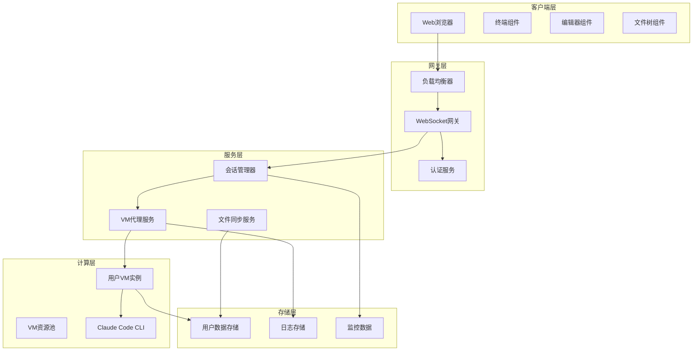
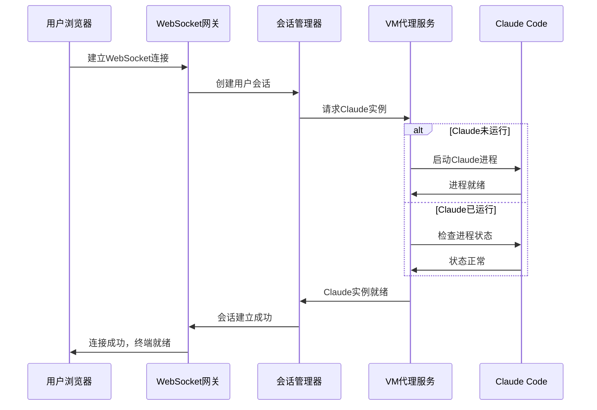
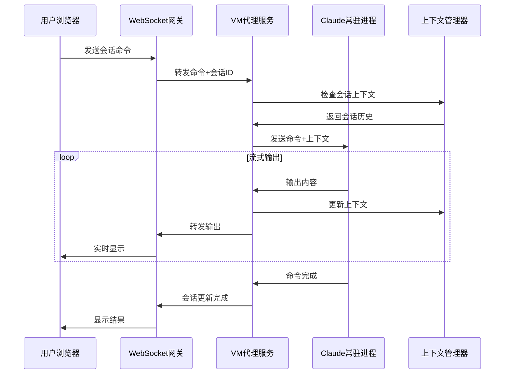
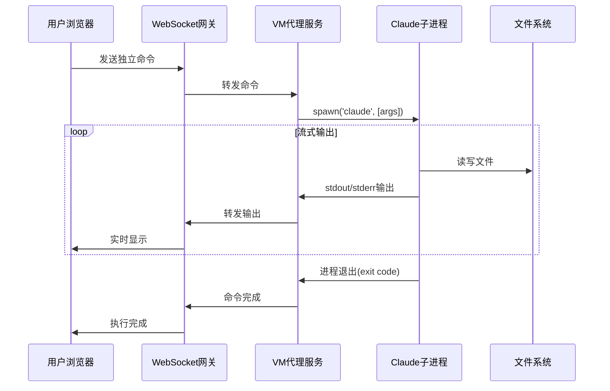
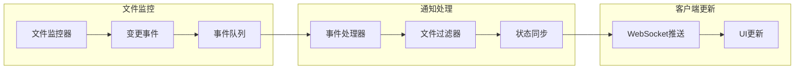
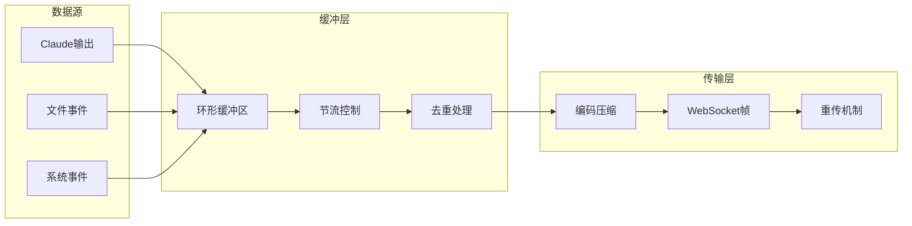
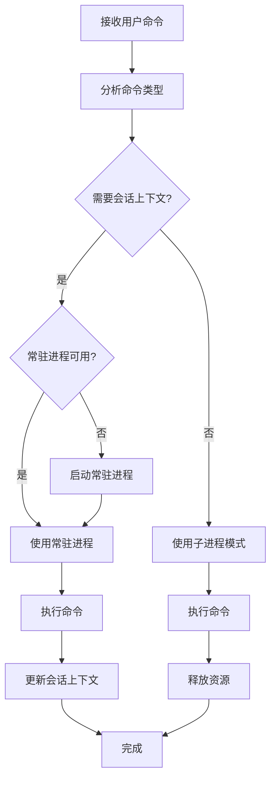
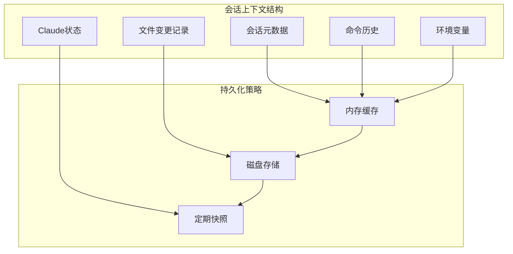
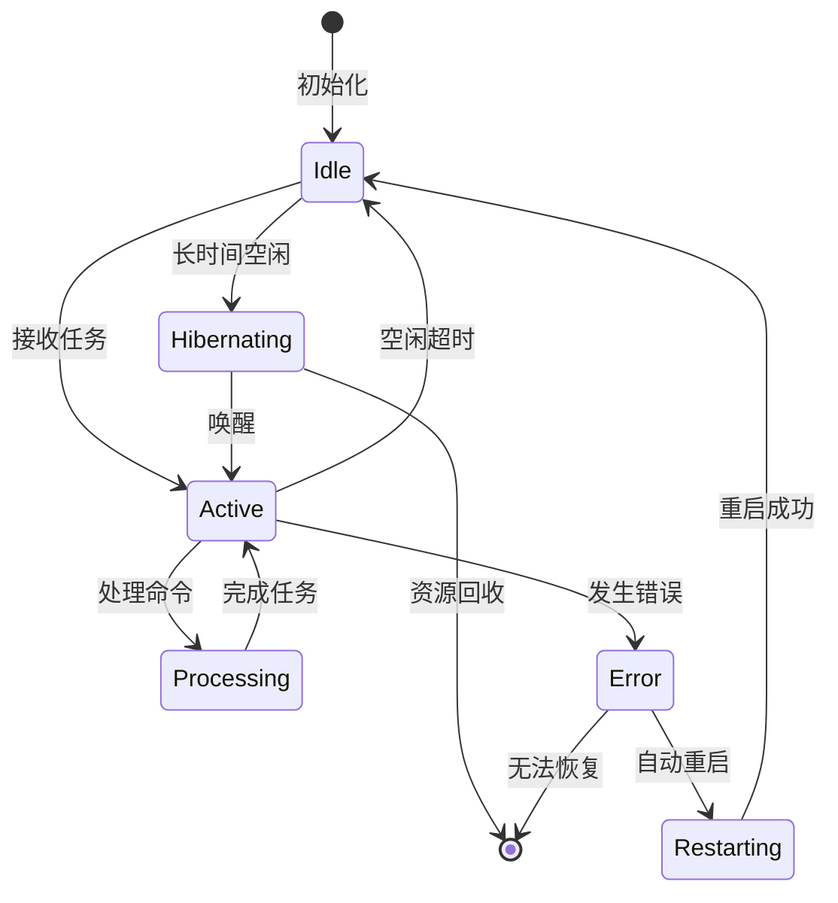

## 概述

本方案旨在通过虚拟机为每个用户提供独立且完整的 Claude Code 开发环境，支持用户在浏览器中实时与 Claude Code 进行交互。方案遵循 SOLID 原则，确保系统的可维护性、可扩展性和稳定性。

### 核心目标

1. **功能完整性**：确保 Claude Code 的所有功能在云端环境中都能正常使用
2. **用户体验**：提供流畅的实时交互体验，最小化网络延迟影响
3. **安全隔离**：每个用户拥有独立的计算环境，数据完全隔离
4. **可扩展性**：支持从单用户到大规模用户的平滑扩展
5. **成本可控**：通过资源池化和智能调度控制运营成本

---

## 系统架构设计

### 整体架构图



### 核心组件职责（单一职责原则）

1. **WebSocket 网关**

   - 职责：管理 WebSocket 连接，处理消息路由
   - 不负责：业务逻辑处理、VM 管理

2. **会话管理器**

   - 职责：维护用户会话状态，管理会话生命周期
   - 不负责：VM 操作、文件处理

3. **VM 代理服务**

   - 职责：与 VM 通信，执行命令，收集输出
   - 不负责：会话管理、认证授权

4. **文件同步服务**
   - 职责：监控文件变化，同步文件状态
   - 不负责：命令执行、VM 管理

---

## 流程设计

### 1. 用户端

- **Web 浏览器**
  - 终端界面：用于实时输入和查看 CLI 输出
  - 代码编辑器：支持实时同步和代码高亮
  - 文件树：展示项目结构和文件变更

### 2. 云服务器

- **WebSocket 网关**

  - 连接管理：管理用户连接，维护会话状态
  - 消息路由：将用户指令传递给对应的虚拟机

- **虚拟机环境**
  - 独立 VM：每个用户分配一个虚拟机，防止资源争夺
  - 内置 Claude Code：支持所有功能，无权限限制
  - 完整文件系统：持久化用户数据，支持高效读写

---

## 交互流程

### 1. 初始化连接

1. 用户通过浏览器访问 Web 页面，页面加载 WebSocket 客户端。
2. WebSocket 客户端请求建立连接，并通过 JWT 进行用户认证。
3. 服务器创建或唤醒用户专属的虚拟机。
4. Claude Code 在虚拟机中启动，准备就绪。

### 2. 命令执行流程

1. 用户在终端界面输入命令。
2. 命令通过 WebSocket 传至云服务器。
3. 云服务器根据任务类型选择执行模式：
   - **常驻进程模式**：用于需要保持上下文的长会话任务
     - 通过 IPC 或 Unix Domain Socket 通信
     - 保持会话状态和历史记录
     - 支持连续对话和上下文引用
   - **子进程模式**：用于独立的一次性任务
     - 直接创建子进程执行 `claude` 命令
     - 任务完成后立即释放资源
     - 提供更好的隔离性和安全性
4. Claude Code 执行命令，实时输出结果。
5. 执行结果通过 WebSocket 实时返回用户浏览器。

### 3. 文件操作

1. Claude Code 可以在虚拟机中创建、修改、删除文件。
2. 每次文件更改都会触发事件通知给 WebSocket 网关。
3. WebSocket 网关将文件变更通知同步到浏览器。
4. 浏览器实时更新文件树与代码编辑器。

---

## 详细时序图

### 用户连接初始化时序



### 命令执行时序（混合模式）

#### 常驻进程模式（会话任务）



#### 子进程模式（独立任务）



### 文件变更通知流程



---

## 流式通信设计

### WebSocket 消息协议

#### 消息结构定义

```json
{
  "id": "消息唯一标识",
  "type": "消息类型",
  "timestamp": "时间戳",
  "data": "消息载荷"
}
```

#### 消息类型

1. **控制消息**

   - `connection.init`: 初始化连接
   - `connection.ready`: 连接就绪
   - `connection.close`: 关闭连接

2. **命令消息**

   - `command.execute`: 执行命令
   - `command.cancel`: 取消执行
   - `command.status`: 命令状态

3. **输出消息**

   - `output.stdout`: 标准输出
   - `output.stderr`: 错误输出
   - `output.complete`: 输出完成

4. **文件消息**
   - `file.changed`: 文件变更
   - `file.created`: 文件创建
   - `file.deleted`: 文件删除
   - `file.renamed`: 文件重命名

### 流式数据处理



### 背压处理机制

当客户端处理速度跟不上服务端推送速度时的处理策略：

1. **缓冲策略**

   - 服务端维护固定大小的环形缓冲区
   - 超出缓冲区容量时丢弃最旧的数据
   - 发送缓冲区溢出通知给客户端

2. **流控策略**

   - 客户端发送 ACK 确认已处理的消息
   - 服务端根据 ACK 调整发送速率
   - 实现滑动窗口机制

3. **优先级策略**
   - 错误消息优先级最高
   - 文件变更次之
   - 普通输出最低

---

## 执行模式选择策略

### 模式决策流程



### 模式特性对比

| 特性           | 常驻进程模式       | 子进程模式         |
| -------------- | ------------------ | ------------------ |
| **启动开销**   | 低（仅首次）       | 高（每次执行）     |
| **内存占用**   | 持续占用           | 按需使用           |
| **上下文保持** | ✓ 支持             | ✗ 不支持           |
| **并发处理**   | 队列化处理         | 天然并发           |
| **故障隔离**   | 需要监控重启       | 自然隔离           |
| **适用场景**   | 连续对话、项目开发 | 单次查询、独立任务 |

### 上下文管理设计



### 常驻进程生命周期管理



---

## 技术实现细节

### 技术栈

- **前端**: HTML, CSS, JavaScript, WebSocket, xterm.js, Monaco Editor
- **后端**: Node.js, Express, WebSocket, Docker
- **虚拟机管理**: 通过云提供商 API 动态管理虚拟机生命周期

### 安全与隔离

- 用户间环境完全隔离，保证数据安全
- 各 VM 独立的网络、存储和计算资源
- 使用防火墙规则和权限控制加强安全性

### 性能与扩展性

- 支持多个区域的部署以减少网络延迟
- 自动扩缩 VM 以应对变化的用户需求
- 实施负载均衡来优化资源利用率

---

## 结论

该技术方案通过为每个用户提供独立的虚拟机环境，使得 Claude Code 的强大能力得以充分发挥，同时确保了安全与性能。这种策略不仅提升了用户体验，还支持了大规模的部署和灵活的扩展。
