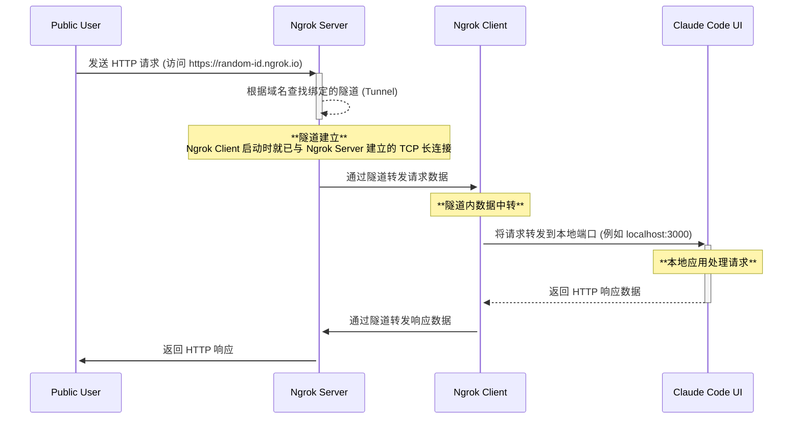
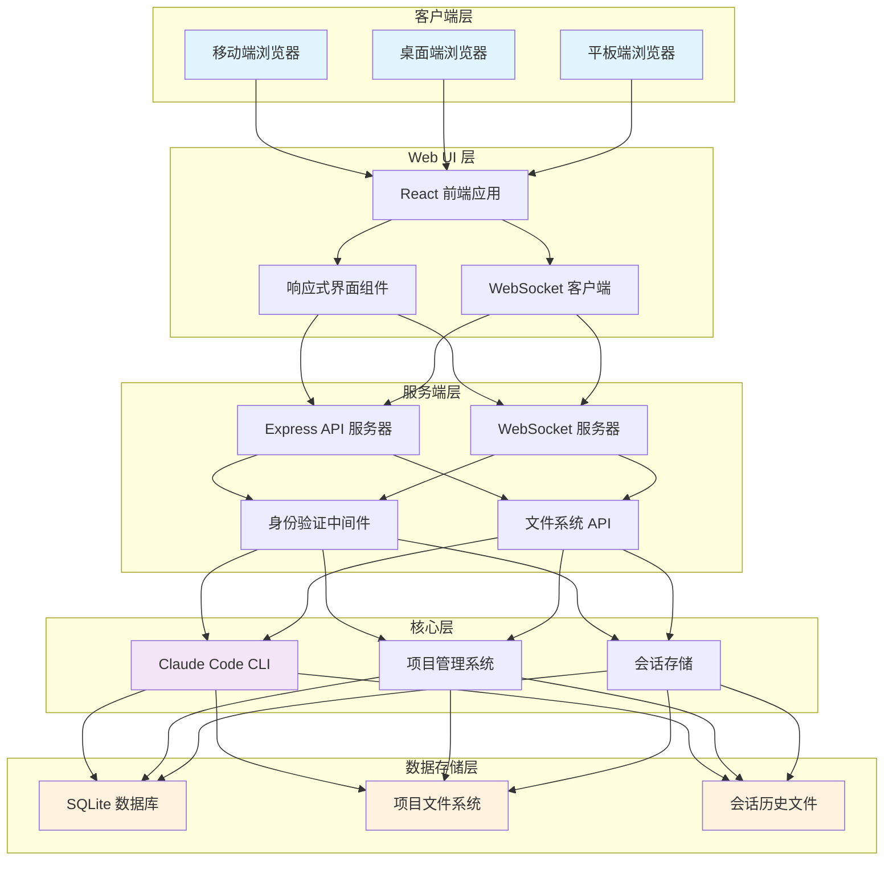
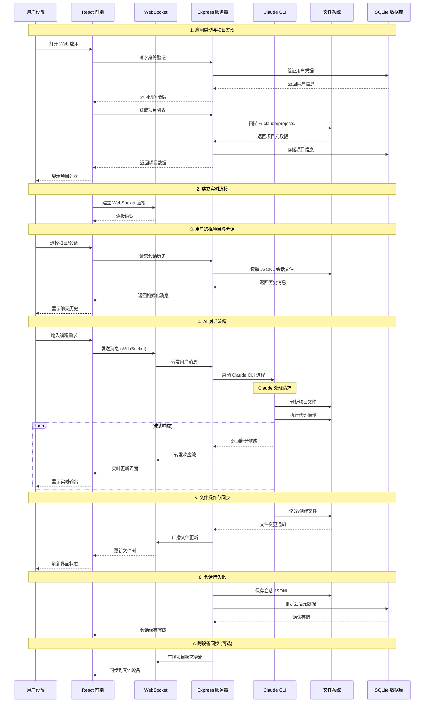

## 用手机提 PR

上周我结合在手机上 AI Coding ，给 Nacos 的项目提了一个 PR： https://github.com/nacos-group/nacos-mcp-router/pull/37

这怎么搞的呢？ 其实步骤和原理都比较简单，一个项目通过 Web 端代理 Claude Code 在 terminal 中的交互, 一个项目将 Web 页面暴露到公网即可。

## 快速开始

### 1. 本地启动 claudecodeui

项目地址：https://github.com/siteboon/claudecodeui

选好一个目录执行以下命令：

```shell
git clone https://github.com/siteboon/claudecodeui.git && cd claudecodeui &&
npm install && cp .env.example .env && npm run dev
```

如果有偏好的话，可以更改 `.env` 中配置比如端口，默认就是 3009 端口避免和常见端口冲突。

### 2. 通过 ngrok 访问本地端口

MacOS 直接打开： https://dashboard.ngrok.com/get-started/setup/macos

Windows 系统直接打开： https://dashboard.ngrok.com/get-started/setup/windows


按照 Ngrok 的页面上说明按照步骤操作即可，注意需要选择静态域名方便后面移动端访问。

绑定域名之后启动 ngrok:

```bash
ngrok http --url=your-static-domain 3009
```

可以看到控制台上显示暴露出来公网域名 your-static-domain ，并且这个域名指向本地的 3009 端口。


这时通过 your-static-domain 就可以访问 claudecodeui 了，效果示例： 

### 3. 愉快远程使用 CC

Cloud Code UI 巧妙地将命令行工具的强大功能转化为现代化的 Web 体验，让 AI 编程真正做到"随时随地"。而且我们可以语音输入，也可以同时开始多个对话，让 CC 在电脑上同时干活。不过除了 AI Coding, 远程使用 CC 本质上是给予了我们一个私人 Agent ，它可以被授权访问自己电脑上任意工作目录、和我们做一样的工作而不会泄露任何隐私和数据！

这其实也对应着某种创业机会，相比于 Manus 这些希望提供云端 Agent 功能的公司。

其实这篇文章大部分内容也是手机上 Claude Code 帮我完成的，包括后面介绍项目技术原理的部分 ：）


## 展望：每个人的私人助理

**每个人都可以拥有一个与 AI Agent 共同协作的私人移动工作空间**，每个人不管什么职业、身份都可以有自己的私人助理，24 h 待命。因为我对象之前是班主任 ，我让 AI 写了个小故事说明老师怎么用CC 或者说 Agent 来帮助自己的工作。也不知道真不真实，图一乐。

---

"张老师！刘小雨又没写作业！"上午第二节下课，班长王朵朵冲进办公室告状。小张老师刚想发火，手机"叮"的一声——家长群里炸了锅。

刘小雨妈妈："老师，孩子说作业太难了，全班都不会..."

王朵朵妈妈："我家孩子说数学作业写到11点..."

李豆豆爸爸："是不是作业布置太多了？现在不是说要减负吗？"

小张老师眼前发黑。她知道接下来要发生什么——23个家长会轮流上阵，从作业量吵到教育政策，最后变成"老师不负责任"的批斗大会。上次类似事件，她被校长叫去谈话，回家路上边开车边哭。

于是小张老师开始和 CC 对话，CC 的工作目录就在桌面。她问 CC 马上要和家长吵起来了怎么办，CC 立即开始干活：调出她上学期家长会做的《学生作业困难调查》PPT（她自己做的问卷，有家长填写的真实数据）；翻出她存了3年的《家长常见问题及标准回答》文档；找出她之前处理类似争议的微信群话术模板。

三分钟后，小张老师发群里："各位家长，关于作业难度问题，我上学期做过问卷调查，全班32名家长中，18人反馈孩子能在30分钟内完成，8人需要1小时，6人超过90分钟。针对刘小雨同学的情况，我建议：1.先让孩子口述解题思路再动笔；2.把错题拍照我统一讲评；3.实在不会的题标星号我重点讲解。附上我上学期做的《如何辅导数学作业》供大家参考..."

群里瞬间安静。十分钟后，刘小雨妈妈发了个红包："老师辛苦了，买杯咖啡。"王朵朵妈妈发了个"老师最棒"的表情包。连平时最爱挑刺的李豆豆爸爸都发了句："张老师比我们有方法。"

之后每次家长会，小张老师还会把CC整理的"家长常见问题及标准答案"打印出来，发给大家。有老师问她秘诀，她笑笑说："哪有啥秘诀，有个 Agent 一直帮你看事就可以了"。

---

## 📋 注意事项

1. Ngrok 目前的免费计划每个月有流量限制，静态域名也只能开一个。开源免费的有 Ngrok 1.0
2. 远程运行 claudecodeui 的电脑如果休眠了，端口将会关闭。对于 Mac 用户可以在 “电池” 选项卡中开启“屏幕关闭电脑不休眠” 选项。 
3. 手机上远程使用 shell 暂不支持

以下面向技术同学，从架构和交互时序层面介绍 Ngrok 和 claudecodeui 两个项目的技术原理。

## 原理介绍

### Ngrok



隧道(Tunnel): 一个持续开放、安全可靠的 TCP 连接，通过多路复用技术高效地承载着从公网到本地的请求，以及从本地到公网的响应，从而完美地解决了内网服务暴露到公网的难题。

### CloudCodeUI

#### 系统架构概览

ClaudeCodeUI 采用现代化的三层架构设计，通过 Web 界面为 Claude Code CLI 提供跨平台支持：



#### 完整交互时序图

以下时序图展示了用户从打开应用到完成 AI 编程任务的完整流程：


