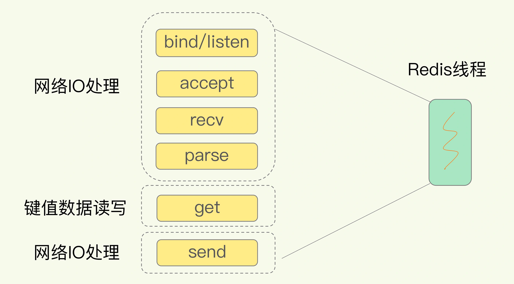
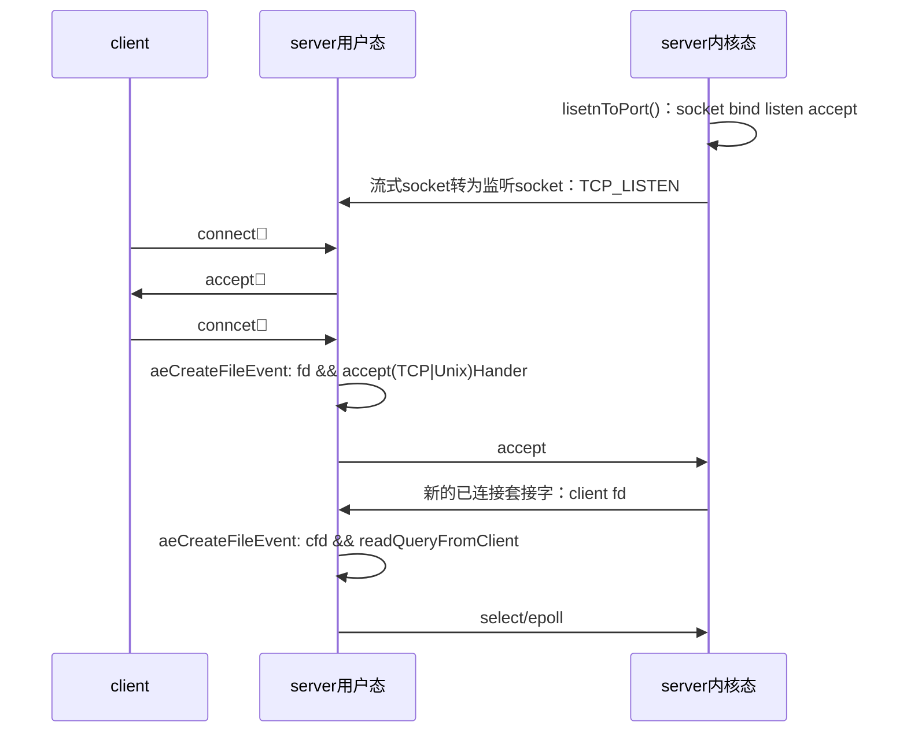

## 1. Redis的逆袭
Redis最早的需求和Tair诞生的背景类似，当时是antirez这个人想要自己的网站支持用户浏览实时更新的访客记录列表，然后发现查Mysql这种数据库太慢，而市面上居然只有Mysql这种持久化数据库，所以他选择自己写一个内存里面的列表，于是2009年Redis诞生了，同年Tair也诞生了。
>Redis is an open source (BSD licensed), in-memory **data structure store,** used as a database, cache, and message broker. Redis provides data structures such as **strings, hashes, lists, sets, sorted sets** with range queries, **bitmaps, hyperloglogs, geospatial indexes,** and **streams.** Redis has built-in replication, Lua scripting, LRU eviction, transactions, and different levels of on-disk persistence, and provides high availability via Redis Sentinel and automatic partitioning with Redis Cluster.
>Redis is written in ANSI C and works in most POSIX systems like Linux, *BSD, and OS X, without external dependencies. ~~SmartOS~~ ~~Windows~~


### 1.1. 缓存的逆袭之道
- 本地缓存
    - 语言类库中实现的Map生命周期随着jvm的销毁而结束，并且在多实例的情况下，每个实例都需要各自保存一份缓存，缓存不具有一致性；
- 分布式缓存
    - redis分布式缓存，在多实例的情况下，各实例共用一份缓存数据，缓存具有一致性

1. Redis 最多容纳2的32 次方（超过40亿）数目的key,并且每个实例可以处理2.5亿个key[^number1]；Map只能容纳`1<<30`即2的30次方个哈希桶
- Redis `String`类型可以最大512M，对于每一个数据结构可以容纳` 2^32 - 1 `个元素[^number2]
- Map因为通过`(n-1) & hash`来取余，容量n必须保证是2的次幂，然而又因为Integer.MAX_VALUE==2^31 - 1，所以Map只能让MAX_CAPACITY为2^30.

2. Redis 可持久化，Map 是内存对象--~~断电~~
- 在磁盘格式方面数据结构是以紧凑的以追加的方式产生的--他们不需要随机进行访问
3. Redis对数据结构的操作都是原子的
- Redis的数据类型都是基于基本数据结构的同时对程序员透明，无需进行额外的抽象。

4. Redis 可以实现分布式的缓存，Map 只能存在创建它的程序里

5. Redis 缓存有过期机制，Map 本身无此功能

6. Redis 有丰富的 API，Map 就get(),set(),contains()这些

7. Redis 可以处理每秒百万级的并发，是专业的缓存服务，Map 只是一个普通的对象

[^number1]: https://redis.io/topics/faq
[^number2]: https://redis.io/topics/data-types

## 2. 一个简单的K-V数据库主要架构
- 内存：IO快但断电会丢
- 外存：IO慢但持久


**Redis 5.0.8:**

### 2.1. 访问框架-deps.hiredis
- 提供给外部的调用函数，动态链接到本地
- 网络框架以Socket通信的形式对外提供键值对操作
    - 接收网络包
    - 解析协议
    - 数据存取
    - 用一个线程，多个线程还是多个进程来处理IO？
        - 单线程阻塞
        - 多线程竞争
#### 2.1.1. RESP协议
RESP（Redis Serialization Protocol）是一种redis自定义的序列化协议，主要用作redis客户端和服务端之间通信。redis集群节点之间使用另一种二进制协议进行数据交换。RESP是二进制安全协议，并且处理批量数据无须逐个请求处理，因为批量数据传输时，在请求参数中添加了**数据长度**作为前缀。传输层基于`TCP`协议，默认端口为6739。[^RESP]

[^RESP]: https://developer.aliyun.com/article/553255

### 2.2. 操作模块-src

- PUT：写入或更新
- GET
- DELETE
- SCAN：根据一段key的范围返回相应的value
- EXISTS

#### 2.2.1. 单线程为什么这么快？-src.server.c
**单线程做了哪些事？哪些事单线程没有做？**
Redis 的主流程

- 网络 IO
- 键值对读写
是由一个线程来完成的:


Redis 的其他功能，比如

- 持久化
- 异步删除（lazyfree.c ）--后台 IO 线程引用记数算法
- 集群数据同步等
其实是由额外的线程执行的


**总体流程代码**[^redis5][^redis3]

[^redis5]: https://github1s.com/redis/redis/blob/5.0/src/ae.c
[^redis3]: https://github1s.com/huangz1990/redis-3.0-annotated/blob/unstable/src/redis.c

当`redis-cli -h host -p port`:
```c
// 5.0.8 伪代码
int main(int argc,char **argv){
    ...
    initServer();
    ...
    aeCreateFileEvent(fd,acceptxxxHandler,...);
    ...
    aeMain(server.el);
    ...
    return 0;
}

/**
* 1. 创建数据结构，初始化数据结构
* 2. 打开TCP监听端口与Unix本地端口
* 4. 为socket关联应答处理器
* 3. 初始化AOF，集群，脚本系统，BIO等
**/
void initServer() {
...
    /* Open the TCP listening socket for the user commands. */
    // 打开 TCP 监听端口，用于等待客户端的命令请求
    if (server.port != 0 &&
        listenToPort(server.port,server.ipfd,&server.ipfd_count) == REDIS_ERR)
        exit(1);
...

    /* Create the serverCron() time event, that's our main way to process
     * background operations. */
    // 为 serverCron() 创建时间事件,后台线程操作
    if(aeCreateTimeEvent(server.el, 1, serverCron, NULL, NULL) == AE_ERR) {
        redisPanic("Can't create the serverCron time event.");
        exit(1);
    }

    /* Create an event handler for accepting new connections in TCP and Unix
     * domain sockets. */
    // 为 TCP 连接关联连接应答（accept）处理器
    // 用于接受并应答客户端的 connect() 调用
    for (j = 0; j < server.ipfd_count; j++) {
        if (aeCreateFileEvent(server.el, server.ipfd[j], AE_READABLE,
            acceptTcpHandler,NULL) == AE_ERR)
            {
                redisPanic(
                    "Unrecoverable error creating server.ipfd file event.");
            }
    }

    // 为本地套接字关联应答处理器
    if (server.sofd > 0 && aeCreateFileEvent(server.el,server.sofd,AE_READABLE,
        acceptUnixHandler,NULL) == AE_ERR) redisPanic("Unrecoverable error creating server.sofd file event.");

    /* 32 bit instances are limited to 4GB of address space, so if there is
     * no explicit limit in the user provided configuration we set a limit
     * at 3 GB using maxmemory with 'noeviction' policy'. This avoids
     * useless crashes of the Redis instance for out of memory. */
    // 对于 32 位实例来说，默认将最大可用内存限制在 3 GB
    if (server.arch_bits == 32 && server.maxmemory == 0) {
        redisLog(REDIS_WARNING,"Warning: 32 bit instance detected but no memory limit set. Setting 3 GB maxmemory limit with 'noeviction' policy now.");
        server.maxmemory = 3072LL*(1024*1024); /* 3 GB */
        server.maxmemory_policy = REDIS_MAXMEMORY_NO_EVICTION;
    }
}

/*
 * 根据 mask 参数(比如AE_READABLE)的值，监听 fd 文件的状态，
 * 绑定fd到传入的acceptHandler或writeHandler.etc（即*proc这个函数指针）
 */
int aeCreateFileEvent(aeEventLoop *eventLoop, int fd, int mask,
        aeFileProc *proc, void *clientData)
{
    if (fd >= eventLoop->setsize) {
        errno = ERANGE;
        return AE_ERR;
    }

    if (fd >= eventLoop->setsize) return AE_ERR;

    // 取出文件事件结构
    aeFileEvent *fe = &eventLoop->events[fd];

    // 监听指定 fd 的指定事件
    // 把fd加入到链表中
    if (aeApiAddEvent(eventLoop, fd, mask) == -1)
        return AE_ERR;

    // 设置文件事件类型，以及事件的处理器
    // 当 fd 可用时，执行 proc 函数
        // 比如绑定fd到传入的acceptHandler
    fe->mask |= mask; // 或运算后再进行可读或可写判断
    if (mask & AE_READABLE) fe->rfileProc = proc;
    if (mask & AE_WRITABLE) fe->wfileProc = proc;

    // 私有数据
    fe->clientData = clientData;

    // 如果有需要，更新事件处理器的最大 fd
    if (fd > eventLoop->maxfd)
        eventLoop->maxfd = fd;

    return AE_OK;
}

/*
 * 事件处理器的主循环
 */
void aeMain(aeEventLoop *eventLoop) {

    eventLoop->stop = 0;
    // 这样写死循环，给后面关闭这个死循环留下了口子，比如测试以及性能评测时
    while (!eventLoop->stop) {

        // 如果有需要在事件处理前执行的函数(beforesleep)，那么运行它
        if (eventLoop->beforesleep != NULL)
            eventLoop->beforesleep(eventLoop);

        // 开始处理事件
        // 多路复用：将所有fd作为select的入参以求内核返回可读或可写的fd再处理
        aeProcessEvents(eventLoop, AE_ALL_EVENTS);
    }
}

```

**事件接受函数**
```c
/**
* 将fd以aeFileEvent的形式加入aeEventLoop这个大链表当中
**/
static int aeApiAddEvent(aeEventLoop *eventLoop, int fd, int mask) {
    aeApiState *state = eventLoop->apidata;

    if (mask & AE_READABLE) FD_SET(fd,&state->rfds);
    if (mask & AE_WRITABLE) FD_SET(fd,&state->wfds);
    return 0;
}

/* aeCreateFileEvent() -> File event structure */
typedef struct aeFileEvent {
    int mask; /* one of AE_(READABLE|WRITABLE|BARRIER) */
    aeFileProc *rfileProc;
    aeFileProc *wfileProc;
    void *clientData;
} aeFileEvent;

/* State of an event based program */
typedef struct aeEventLoop {
    int maxfd;   /* highest file descriptor currently registered */
    int setsize; /* max number of file descriptors tracked */
    aeFileEvent *events; /* Registered events */
    int stop;
    aeBeforeSleepProc *beforesleep;
    aeBeforeSleepProc *aftersleep;
} aeEventLoop;

```
**事件处理函数**
```c
/*
 * 创建一个 TCP 连接处理器
 */
void acceptTcpHandler(aeEventLoop *el, int fd, void *privdata, int mask) {
...
//     控制最大TCP连接数
    while(max--) {
        // accept 客户端连接--> 由内核自动生成的一个全新的fd，代表与返回client的TCP连接
        cfd = anetTcpAccept(server.neterr, fd, cip, sizeof(cip), &cport);
        if (cfd == ANET_ERR) {
            if (errno != EWOULDBLOCK)
                serverLog(LL_WARNING,
                    "Accepting client connection: %s", server.neterr);
            return;
        }
        // 为客户端创建客户端状态（redisClient）！
        acceptCommonHandler(cfd,0,cip);
    }
}

/**
* 为每一个链接都创建一个专属的客户端
**/
static void acceptCommonHandler(int fd, int flags) {
    // 创建客户端
    redisClient *c;
    //     createClient比如aeCreateFileEvent(config.el,c->context->fd,AE_WRITABLE,writeHandler,c);
    if ((c = createClient(fd)) == NULL) {
        redisLog(REDIS_WARNING,
            "Error registering fd event for the new client: %s (fd=%d)",
            strerror(errno),fd);
        close(fd); /* May be already closed, just ignore errors */
        return;
    }
    /* If maxclient directive is set and this is one client more... close the
     * connection. Note that we create the client instead to check before
     * for this condition, since now the socket is already set in non-blocking
     * mode and we can send an error for free using the Kernel I/O */
    // 如果新添加的客户端令服务器的最大客户端数量达到了
    // 那么向新客户端写入错误信息，并关闭新客户端
    // 先创建客户端，再进行数量检查是为了方便地进行错误信息写入
    if (listLength(server.clients) > server.maxclients) {
        char *err = "-ERR max number of clients reached\r\n";

        /* That's a best effort error message, don't check write errors */
        if (write(c->fd,err,strlen(err)) == -1) {
            /* Nothing to do, Just to avoid the warning... */
        }
        // 更新拒绝连接数
        server.stat_rejected_conn++;
        freeClient(c);
        return;
    }
}

/**
* 将fd放入链表，同时绑定readQueryFromClient
* （而不是处理新客户端连接的acceptHandler）
**/
client *createClient(int fd) {
    client *c = zmalloc(sizeof(client));

    /* passing -1 as fd it is possible to create a non connected client（like a lua acript）.
     * This is useful since all the commands needs to be executed
     * in the context of a client. When commands are executed in other
     * contexts (for instance a Lua script) we need a non connected client. */
    if (fd != -1) {
        anetNonBlock(NULL,fd);
        anetEnableTcpNoDelay(NULL,fd);
        if (server.tcpkeepalive)
            anetKeepAlive(NULL,fd,server.tcpkeepalive);
            //复用aeCreateFileEvent绑定处理客户端redis命令的函数readQueryFromClient
        if (aeCreateFileEvent(server.el,fd,AE_READABLE,
            readQueryFromClient, c) == AE_ERR)
        {
            close(fd);
            zfree(c);
            return NULL;
        }
    }
    ...
}
```


**总体交互时序图**[^socket]
对于每一个socket fd都分配以监听或读事件或写事件处理器以aeFileEvent的结构挂到aeEventLoop的链表中。

[^socket]:https://www.cnblogs.com/straight/articles/7660889.html




由于只有一个线程在监听这些文件描述符fd[^fd]并处理。所以即使**客户端并发地发送命令**，后面仍然是依次取出命令，**顺序执行**，避免了线程之间的资源抢占，也简化了数据结构的操作。这就是使用了Reactor模式[^Reactor模式]的Redis单线程模型[^soloIO]：

- 响应IO事件：aeMain()的IO多路复用
- 连接应答处理器：监听连接的文件描述符所绑定的函数 acceptxxxHandler。
- 命令请求处理器: 监听客户端命令（读事件）的文件描述符绑定的函数 readQueryFromClient。
- 命令回复处理器: 监听客户端响应（写事件）的文件描述符绑定的函数 sendReplyToClient。

[^Reactor模式]: 一个负责响应 IO 事件，一个负责交给相应的事件处理器去处理.
[^fd]: 每打开或创建一个文件(socket也是)，内核就会向进程返回一个fd，第一个打开文件是0,第二个是1,依次递增。一个socket fd在`/proc/net/tcp`之下可以看到像`socket:[12345]`这样的形式，其中12345被称作inode号。
[^soloIO]:https://mp.weixin.qq.com/s/keVI4Fn8N42VhIhODkuqBA

**FAQ**
监听套接字fd不会挂上读事件处理器吗？
#### 2.2.2. IO 多路复用复用了什么？[^multiIO]

[^multiIO]:https://mp.weixin.qq.com/s/keVI4Fn8N42VhIhODkuqBA

IO开销两大头：用户态到内核态的切换开销，read(fd)判断fd是否可用的系统调用开销
select,poll,epoll是同类型的IO模式，主要是用户态向内核态做文件描述符fd请求，判断当前持有的fd是否准备就绪。

- select一次性向内核态传入多个fd（不超过1024或2048），内核态同步遍历，最后返回就绪的fd数量
- poll一次性向内核态传入不限数量的fd，其他同select
- epoll在首次接收fd之后内核态会保存一份fd列表，当事件到来时异步IO获取就绪的fd，最后直接返回有效的fd本身。
    - epoll_create创建文件fd或者说句柄
    - epoll_ctl添加fd到内核维护的红黑树
    - epoll_await事件允许当数据ready后，将其从红黑树移动到链表，再await异步获取链表中准备好数据的fd
    - 
    

#### 2.2.3. 单线程的问题


Redis 单线程模型，综合了select/epoll 与Reactor模式，提供了基于事件的回调机制，即针对不同事件的发生，调用相应的处理函数，使得效率和代码优雅都得到了兼顾。但是单线程也有自己的问题。

1. 任意一个请求在server中一旦发生耗时，都会影响整个server的性能，也就是说后面的请求都要等前面这个耗时请求处理完成，自己才能被处理到。耗时的操作包括以下几种：
    a、操作bigkey：写入一个bigkey在分配内存时需要消耗更多的时间，同样，删除bigkey释放内存同样会产生耗时；
    b、使用复杂度过高的命令：例如SORT/SUNION/ZUNIONSTORE，或者O(N)命令，但是N很大，例如`lrange key 0 -1`一次查询全量数据；
    c、大量key集中过期：3.0之前Redis的过期机制也是在主线程中执行的，大量key集中过期会导致处理一个请求时，耗时都在删除过期key，耗时变长；
    d、淘汰策略：3.0之前淘汰策略也是在主线程执行的，当内存超过Redis内存上限后，每次写入都需要淘汰一些key，也会造成耗时变长；
    e、AOF刷盘开启always机制：每次写入都需要把这个操作刷到磁盘，写磁盘的速度远比写内存慢，会拖慢Redis的性能；
    f、主从全量同步生成RDB：虽然采用fork子进程生成数据快照，但fork这一瞬间也是会阻塞整个线程的，实例越大，阻塞时间越久；
2. 并发量非常大时，单线程读写客户端IO数据存在性能瓶颈，虽然采用IO多路复用机制，但是读写客户端数据依旧是同步IO，只能单线程依次读取客户端的数据，无法利用到CPU多核。

针对问题2，Redis在6.0推出了多线程。

#### 2.2.4. 6.0为什么又要引入多线程？
将原本单线程工作的主要内容，IO处理与业务读写两部分，把前者使用多线程改造，使得可以并行连接客户端。
##### 2.2.4.1. FAQ
**mysql为什么不使用IO多路复用？**
　　
### 2.3. 存储模块

i
#### 2.3.1. 内存分配器-deps.jemalloc
- PUT：需要为新的键值对分配存储空间
- DELETE：删除键值对，释放相应的内存空间

内存分配器比如C中`glibc`的`malloc`和`free`.但是键值对通常大小不一，保存数据规模过大或擦除次数过多时，就会引发内存碎片问题。因此为了避免对系统性能产生影响，Redis 使用了 `jemalloc` 库替换了 glibc 库的内存分配器,优化包括：

- 低地址优先的策略，来降低内存碎片化。
- 相对未使用的页面，优先使用dirty page，提升缓存命中。
#### 2.3.2. 虚拟内存VM
Redis提高数据库容量的办法有两个，一个是将数据分割到多个Redis Server上面，另一个就是虚拟内存机制。区分出热数据与冷数据（不常用的数据），并将冷数据交换到磁盘。同时为了保证查找的速度，只会将value交换出去，而在内存中保留所有的key。因此当Key也很大的时候，VM机制作用有限。
#### 2.3.3. 持久化-src.rdb

如果每次都对新的键值对调用文件系统写盘，性能差；所以只能周期性地保存。但这样面临数据丢失的风险。
• RDB：Redis Database ，指定时间内执行指定次数**写操作**，将客户端内存中的数据写入服务器磁盘。 RDB默认开启。
• AOF：Append Only File ，默认每秒将**写操作日志**追加写入到磁盘。AOF 需要手动开启，完整性更高。

**以后应该会更多地支持NVM**
>"应用 + 缓存 + 持久存储"的架构模型-- >"应用 + 具备持久能力的内存数据库"[^Tair介绍]

- NVM：非易失性存储器（Non-Volatile Memory）或非依电性存储器，指当电流关掉后，所存储的资料不会消失的资料存储设备。
    - NVMe SSD:NVM接口标准的固态硬盘
- AEP： Inter推出的持久化内存Optane Memory,又称为Apache Pass(`AEP`)，弥补DRAM与传统NSND SSD之间的内存读取速度鸿沟（1000倍以上[^1000gap]）。
- CloudStream：Optane NVMe SSD，又称为Clouidstream，

存储结构层次：

[^1000gap]:https://cloud.tencent.com/developer/article/1672694


比如CDB：

比如HiKV：改造Redis全局哈希表高效支持范围操作；支持NVM，扩大键值数据库内存

**最终数据冷热分层结合DRAM/SCM/ESSD等不同存储池实现不同存储策略[^Tair介绍]**

[^Tair介绍]:https://topic.atatech.org/articles/181140#16

#### 2.3.4. 数据结构
##### 2.3.4.1. 概述
互联网应用的业务场景越来越复杂，面对的数据类型也不再是传统的层次模型和关系性模型能满足的，因此持久化数据库层面层次模型、网状模型、关系模型、文档模型和图模型等多样化数据模型风起云涌，内存数据库为了避免应用程序对象到数据库实体之间的转换相关的开销[^dataspend]，如Redis提供字符串，哈希，列表，集合，排序集合，位图，位域，HyperLogLog，地理空间索引和流作为本机数据结构。并对于每个数据结构，Redis也维护专用命令以对于每个数据结构最有效的方式执行多种类型的操作。


- string 类型是二进制安全的。意思是 redis 的 string 可以安全传输任何数据，比如jpg图片或者序列化的对象。
- Redis hash 是一个 string 类型的 field 和 value 的映射表
    - {key(string)->value(string)},类似于Java中的map<String,String>
    - 适合用于表示和存储对象，但受限于value类型是string
- 集合是通过哈希表实现的，所以添加，删除，查找的复杂度都是 O(1)。毫无疑问list就得O(n)
- zset/sorted set在set基础上每个元素都会关联一个double类型的分数，redis正是通过分数来为集合中的成员排序。


[^dataspend]: https://yuque.antfin-inc.com/tair-userdoc/cloud-redis/dhhm1g
[^Serial]: https://www.cnblogs.com/JKayFeng/p/5911544.html

##### 2.3.4.2. 对C中字符串的改造--SDS
- C中的字符串（即以`\0`结尾的`char[]`/`char*`）,
    - strlen(s)--O(N)
    - realloc--O(N)
    - strcmp("Hello","Hello\0Hello") == 0
        - 程序在读字符串的时候就会忽略空字符后面的字符

- 简单动态字符串:Simple Dynamic String[^sds]
[^sds]: https://www.cnblogs.com/aboutblank/p/4510120.html

```java
private final char value[]; //JDK8
private final byte[] value; //JDK11
```
```c
// 结构体定义
typedef char *sds;
struct sdshdr {

    // buf 已占用长度
    int len;

    // buf 剩余可用长度
    int free;

    // 实际保存字符串数据的地方
    // 利用c99(C99 specification 6.7.2.1.16)中引入的 flexible array member
    // sizeof的结果不包含结构体空间，作为符号地址存在
    // 通过buf来引用sdshdr后面的地址，
    char buf[];
};


/*
 * 新建字符串对象
 *
 * T = O(N)
 */
sds sdsnewlen(const void *init, size_t initlen) {

    struct sdshdr *sh;

    // 有初始值:sdshdr长度+字符串长度+一个结束符'\0'
    if (init) {
    // zmallloc O(N)
        sh = zmalloc(sizeof(struct sdshdr)+initlen+1);
    } else {
        sh = zcalloc(sizeof(struct sdshdr)+initlen+1);
    }

    // 内存不足，分配失败
    if (sh == NULL) return NULL;

    sh->len = initlen; // 不包括结构体的长度
    sh->free = 0;

    // 如果给定了 init 且 initlen 不为 0 的话
    // 那么将 init 的内容复制至 sds buf
    // memcpy() O(N)
    if (initlen && init)
        memcpy(sh->buf, init, initlen);

    // 加上终结符
    sh->buf[initlen] = '\0';

    // ！！返回 buf 而不是整个 sdshdr
    return (char*)sh->buf;
}

/*
* 得到字符串长度（而不是结构体的长度）
* T=O（1）
*/
static inline size_t sdslen(const sds s) {
    // 如前所说，sizeof不返回柔性数组大小，因此指针运算减去两个int长度后就得到了sds的地址指针sh
    struct sdshdr *sh = (void*)(s-(sizeof(struct sdshdr)));
    return sh->len;
}

/*
 * 字符串复制进入原字符串操作
 * 将一个 char 数组的前 len 个字节复制至 sds
 * 如果 sds 的 buf 不足以容纳要复制的内容，
 * 那么扩展 buf 的长度，让 buf 的长度大于等于 len 。
 *
 * T = O(N)
 */
sds sdscpylen(sds s, const char *t, size_t len) {

    struct sdshdr *sh = (void*) (s-(sizeof(struct sdshdr)));

    // 是否需要扩展 buf ？
    size_t totlen = sh->free+sh->len;
    if (totlen < len) {
        // 扩展 buf 长度，让它的长度大于等于 len
        // 具体的大小请参考 sdsMakeRoomFor 的注释
        // T = O(N)
        s = sdsMakeRoomFor(s,len-sh->len);
        if (s == NULL) return NULL;
        sh = (void*) (s-(sizeof(struct sdshdr)));
        totlen = sh->free+sh->len;
    }

    // O(N)
    memcpy(s, t, len);
    s[len] = '\0';

    sh->len = len;
    sh->free = totlen-len;

    return s;
}

/*
 * 字符串追加操作
 * 按长度 len 扩展 sds ，并将 t 拼接到 sds 的末尾
 *
 * T = O(N)
 */
sds sdscatlen(sds s, const void *t, size_t len) {
    struct sdshdr *sh;
    size_t curlen = sdslen(s);
    
    // O(N)
    s = sdsMakeRoomFor(s,len);
    if (s == NULL) return NULL;

    // 复制
    // O(N)
    memcpy(s+curlen, t, len);

    // 更新 len 和 free 属性
    // O(1)
    sh = (void*) (s-(sizeof(struct sdshdr)));
    sh->len = curlen+len;
    sh->free = sh->free-len;

    // 终结符
    // O(1)
    s[curlen+len] = '\0';

    return s;
}

/* 
 * 对 sds 的 buf 进行扩展，扩展的长度不少于 addlen 。
 *
 * T = O(N)
 */
sds sdsMakeRoomFor(
    sds s,
    size_t addlen   // 需要增加的空间长度
) 
{
    struct sdshdr *sh, *newsh;
    size_t free = sdsavail(s);
    size_t len, newlen;

    // 剩余空间可以满足需求，无须扩展
    if (free >= addlen) return s;

    sh = (void*) (s-(sizeof(struct sdshdr)));

    // 目前 buf 长度
    len = sdslen(s);
    // 新 buf 长度
    newlen = (len+addlen);
    // 如果新 buf 长度小于 SDS_MAX_PREALLOC 长度
    // 那么将 buf 的长度设为新 buf 长度的两倍
    if (newlen < SDS_MAX_PREALLOC)
        newlen *= 2;
    else
        newlen += SDS_MAX_PREALLOC;

    // 扩展长度
    newsh = zrealloc(sh, sizeof(struct sdshdr)+newlen+1);

    if (newsh == NULL) return NULL;

    newsh->free = newlen - len;

    return newsh->buf;
}
```

1. 长度计算只需O(1)时间复杂度；
2. 字符串追加更高效；
3. SDS是二进制安全的（并发安全且不会被篡改）
    - SDS引入len,按长度读就不会丢失字符
4. 缺点：不会主动释放内存


**空间换时间，跳表也是**
所以讲到最后终于发现了一个可能存在的优化点，这是不看源码不能发现也不好理解的：
即在复制与追加字符串操作中，如果预期的新字符串长度比redis定义的`SDS_MAX_PREALLOC`（默认1024*1024byte==`1MB`）小,那么sdsMakeRoomFor会double其长度；如果大于`SDS_MAX_PREALLOC`，会直接加上`SDS_MAX_PREALLOC`。即每扩容一次多给一倍的空间以减少内存分配的次数--和HashMap达到threshold时resize类似。如果业务场景中原本容量较大之后小容量的append操作较多，可以适当减少`SDS_MAX_PREALLOC`的值，不然有点浪费内存。

**吐槽一下；造名词**
在字符串变长时，每次多分配一些空间，以便下次变长时可能由于 buf 足够大而不用重新分配（*2），这个叫**空间预分配**。
在字符串变短时，并不立即重新分配内存而回收缩短后多出来的字符串，而是用 free 来记录这些空闲出来的字节（就是个int变量记录），这又减少了内存分配的次数，这叫**惰性空间释放**。

### 2.4. 索引模块
#### 2.4.1. 概述
根据key找到相应value的存储位置，进而执行操作

- 哈希表
- B+树
- 红黑树
- 跳表
- 字典树

Memcached和Redis采用哈希表作为key-value索引，RocksDB使用跳表
内存键值数据库如Redis采用哈希表作为索引，也是因为键值数据基本保存在内存中，而**内存的高性能随机访问特性**可以很好地与哈希表`O（1）`的操作复杂度相匹配。
此外对于value部分同样需要一些高效的索引结构来帮助通过key找到value后再在value中找到实际需要的数据。
#### 2.4.2. 全局哈希表[^hashtable]
[^hashtable]: https://www.cnblogs.com/aboutblank/p/4529115.html

##### 2.4.2.1. dict的结构


```c
//定义dict字典结构体
typedef struct dict {

    // 对应不同类型，操作键值对的函数不同
    dictType *type;

    // 类型处理函数的私有数据-->提供给dicType的参数不同
    void *privdata;

    // 哈希表（2个）,用于rehash
    dictht ht[2];

    // 记录 rehash 进度的标志，值为-1 表示 rehash 未进行
    int rehashidx;

    // 当前正在运作的安全迭代器数量
    int iterators;      

} dict;


// 定义哈希表
typedef struct dictht {

    // 哈希表节点指针数组（俗称桶，bucket）
    // 数组中的元素都是一个指向dictEntry结构的指针,*table[]
    dictEntry **table;      

    // 指针数组的大小
    unsigned long size;     

    // 指针数组的长度掩码，用于计算索引值
    unsigned long sizemask; 

    // 哈希表现有的节点数量
    unsigned long used;     
}dictht;

// 定义哈希桶
typedef struct dictEntry {

    // 键
    void *key;

    // 值，保存类型包括指针或无符号64位整数或64位整数
    union {
        void *val;
        uint64_t u64;
        int64_t s64;
    } v;

    // 链往后继节点-->开链法解决哈希冲突，头插入
    struct dictEntry *next; 

} dictEntry;

// 定义key与value所指向的对象
typedef struct redisObject {

    // 类型
    unsigned type:4;

    // 编码
    unsigned encoding:4;

    // 对象最后一次被访问的时间
    unsigned lru:REDIS_LRU_BITS; /* lru time (relative to server.lruclock) */

    // 引用计数
    int refcount;

    // 指向底层数据结构的指针：sds/hash/ziplist/quicklist/skiplist/intset
    void *ptr;

} robj;
```

FAQ: **头插入不会产生1.7时HashMap的并发死锁吗？**
##### 2.4.2.2. hashCode与hash值的计算

- 与JDK定位到哈希桶entry的方法类似，都是hash与数组容量取余得到数组下标

1. 为每一个对象生成唯一的hashCode
2. 通过hash函数计算hash值
**HotSpot VM生成hashCode与JDK生成hash值的方法**
```java
//1. 为什么不能用hashcode直接做hash?
//在容量为16,即(n-1) 为15(0x1111)时，散列值hash真正生效的只是低4位。
//如果直接使用hashcode做hash,
//那么当新增的键的hashcode()是2，18，34这样恰好以16的倍数为差的等差数列，就产生了大量碰撞。
//2. 为什么要进行这样的扰动hashCode？
//高位参与运算--h和h右移16位做异或运算
    //事实上是用混合后的低位掺杂高位的部分特征，变相保留高位信息作索引
// 1000000的二进制: 00000000 00001111 01000010 01000000
// 右移16位：       00000000 00000000 00000000 00001111
// 异或后:          00000000 00001111 01000010 01001111
hash = (key == null) ? 0 : (h = key.hashCode()) ^ (h >>> 16)
```

在JVM的启动参数中可以通过`-XX:Hashcode=1`这种方式来指定对象hashcode的生成方式，**也只有这种方式是与对象内存地址有关**。


**redis的生成hash值的方法**--`Dict.c`文件[^dicthash]

- 64 bit Mix Functions:根据`dict`**结构体**的当前状态生成一个标识，只要dict的内容变化，指纹也会变化

[^dicthash]:https://blog.csdn.net/jasper_xulei/article/details/18364313
    
```c
A fingerprintis a 64 bit number that represents the state of the dictionary
 * at a given time, it's just a few dictproperties xored together.
 * When an unsafe iterator is initialized, weget the dict fingerprint, and check
 * the fingerprint again when the iterator isreleased.
 * If the two fingerprints are different itmeans that the user of the iterator
 * performed forbidden operations against thedictionary while iterating. */
long longdictFingerprint(dict *d) {
    long long integers[6], hash = 0;
    int j;
    //将dict结构体中的几个状态放入到数组中，以便后面应用到64 bit MixFunctions中。
    //dict结构体其实就是一个hash表的实现，而这些状态其实就是第一、第二哈希表的表地址、表大小与
    //已用条目的数量
    integers[0] = (long) d->ht[0].table;
    integers[1] = d->ht[0].size;
    integers[2] = d->ht[0].used;
    integers[3] = (long) d->ht[1].table;
    integers[4] = d->ht[1].size;
    integers[5] = d->ht[1].used;

    /* We hash N integers by summing everysuccessive integer with the integer
     * hashing of the previous sum. Basically:
     *
     * Result =hash(hash(hash(int1)+int2)+int3) ...
     *
     * This way the same set of integers in adifferent order will (likely) hash
     * to a different number. */
    //利用64 bit Mix Functions，将这些状态信息混合到hash中，组成最后的指纹，如果这些状态中有一个
    //出现变化，可以通过一个算法逆推出该状态变化之前的值。例如，d->ht[0].size发生变化，则我们可
    //以通过hash和其他的几个状态，逆推出d->ht[0].size的最初值。
    for (j = 0; j < 6; j++) {
        hash += integers[j];
        /* For the hashing step we use TomasWang's 64 bit integer hash. */
        hash = (~hash) + (hash << 21); //hash = (hash << 21) - hash - 1;
        hash = hash ^ (hash >> 24);
        hash = (hash + (hash << 3)) +(hash << 8); // hash * 265
        hash = hash ^ (hash >> 14);
        hash = (hash + (hash << 2)) +(hash << 4); // hash * 21
        hash = hash ^ (hash >> 28);
        hash = hash + (hash << 31);
    }
    return hash;
}

```
    
- MurmurHash2s:针对一个**字符串**生64bit哈希值[^dicthash]

```c
/* MurmurHash2, byAustin Appleby
 * Note - This code makes a few assumptionsabout how your machine behaves -
 * 1. We can read a 4-byte value from anyaddress without crashing
 * 2. sizeof(int) == 4
 *
 * And it has a few limitations -
 *
 * 1. It will not work incrementally.
 * 2. It will not produce the same results onlittle-endian and big-endian
 *   machines.
 */
unsigned intdictGenHashFunction(const void *key, int len) {
    /* 'm' and 'r' are mixing constantsgenerated offline.
     They're not really 'magic', they justhappen to work well.  */
    uint32_t seed = dict_hash_function_seed;
    const uint32_t m = 0x5bd1e995;
    const int r = 24;
 
    /* Initialize the hash to a 'random' value*/
    uint32_t h = seed ^ len;
 
    /* Mix 4 bytes at a time into the hash */
    const unsigned char *data = (const unsignedchar *)key;
 
    while(len >= 4) {
        uint32_t k = *(uint32_t*)data;
 
        k *= m;
        k ^= k >> r;
        k *= m;
 
        h *= m;
        h ^= k;
 
        data += 4;
        len -= 4;
    }
 
    /* Handle the last few bytes of the inputarray  */
    switch(len) {
    case 3: h ^= data[2] << 16;
    case 2: h ^= data[1] << 8;
    case 1: h ^= data[0]; h *= m;
    };
 
    /* Do a few final mixes of the hash toensure the last few
     * bytes are well-incorporated. */
    h ^= h >> 13;
    h *= m;
    h ^= h >> 15;
 
    return (unsigned int)h;
}

```


3. 直接定位到哈希桶entry元素
```java
// n 永远是2的次幂，取余后的结果一定在容量n内
first = tab[(n - 1) & hash]// hash % n
```

##### 2.4.2.3. rehash和渐进式rehash

redis的哈希表会随着对其操作而增大或减小，那么为了让负载因子保持合理，也保持字典的高效，需要在哈希表中数量太多或太少时进行扩展或收缩。

-  Redis没有在生成RDB和重写AOF

redis最小哈希表大小 `DICT_HT_INITIAL_SIZE` = 4，扩展操作的话ht[1]的大小为第一个大于等于 `ht[0].used*2`的 2^n ；收缩操作ht[1]的大小为第一个大于等于ht[0].used的2^n。然后将ht[0]中的所有键值对rehash到ht[1]上，当全部rehash之后，**把ht[1]置为ht[0]**，并为**ht[1]新创建一个空白哈希表**，为下次rehash做准备。[^rehash]

[^rehash]:https://www.cnblogs.com/aboutblank/p/4529115.ht

渐进式rehash，让字典同时持有ht[0]和ht[1]，将rehashidx设为0，表示rehash开始；在rehash期间，每次对字典进行增删查改操作时，redis除了执行指定的操作以外，还会**顺带把ht[0]哈希表在rehashidx索引上的所有键值对rehash到ht[1]**，当rehash完成，rehashidx++；随着时间及操作的执行，最终ht[0]的所有键值对会rehash到ht[1]上，然后把rehashidx置为-1；表示rehash结束。

在渐进式rehash的过程中，字典的删除，查找，更新等操作会在两个哈希表上进行，新增的键值对会保存到ht[1]里面，这样保证了ht[0]里的键值对只增不减，最终变为空表。这样就巧妙地把一次性大量拷贝的开销，**分摊到了多次处理请求的过程中**，避免了耗时操作，保证了数据的快速访问。


**与线上数据库不停服迁移：双写**
类似，数据库也通过媒介比如binlog来同步操作。
#### 2.4.3. 对链表的改造--ziplist SkipList quicklist
普通链表存在两个问题：内存利用率低和容易产生内存碎片[^quicklist]。

- ziplist 使用连续内存，减少内存碎片，提供内存利用率。但是更改就得重新分配内存。
- skiplist 可以用相对简单的实现，达到和红黑树近似的查找效率(常数项)。
- quicklist 使用分段的ziplist组成双向链表，从而保证性能的前提下，尽可能的提高内存利用率。

[^quicklist]:https://www.cnblogs.com/BeiGuo-FengGuang/p/11313178.html

### 2.5. 更多没介绍的
-  原子操作上，缺乏更多value类型的操作模块：LPUSH/LPOP，SADD/SREM，HGET/HSET，SCAN...
- 数据结构上，value缺乏广泛的数据结构
    - 内存利用率上，没有压缩数据结构
- 内存安全性上，缺乏内存过载的淘汰算法
- 高可用、高扩展上，可参考[Redis架构演化之路](https://mp.weixin.qq.com/s/3818RiO0gNF261AsS_1tVA)

## 3. 展望
到2023年实时数据将占到全球数据圈24.5%的份额，这给存储系统带来了挑战。这一趋势必然会让NVM与Redis这种内存数据库得到更多的运用，以提升数据中心的运行效率。“全球内存数据库市场，将以19.65%的复合年增长率不断迅速发展。”
并且Redis正从分布式缓存迈向分布式数据库系统，据说Redis7.0将整合`RedisRaft`，目标帮助开发多个Redis数据库之间的数据复制，实现分布式强一致性部署[^Redisraft]。

[^Redisraft]: https://www.jdon.com/54901

