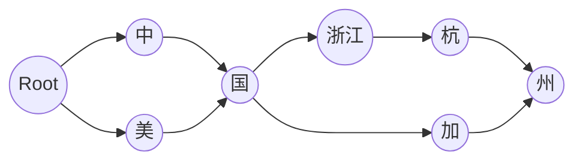

## 1. 理解 MySQL 索引
### 1.1. MySQL 索引会常驻内存吗?
会.
### 1.2. MySQL索引怎么被加载到内存的?
在Linux中,innoDB 引擎中为`Innodb_buffer_pool`通过`mmap()`直接向操作系统申请内存,每次申请的大小为`innodb_buffer_pool_chunk_size`,最终会申请`innodb_buffer_pool_size`大小的文件映射段动态内存.以上初始化后,`Innodb_buffer_pool`缓存每次查询加载的目录页和数据页,直到`innodb_buffer_pool_size`大小的物理内存占用.直到在线减少`innodb_buffer_pool_size`或是关闭MySQL才会通过`munmap()`方式释放内存给操作系统.[^mysql_memory]
### 1.3. 既然常驻内存,那MySQL索引如何被淘汰?
无外乎还是那几个缓存淘汰算法。`Innodb_buffer_pool`的内存主要是通过 Free List、LRU List、FLU List、Unzip LRU List 等 4 个链表来进行管理分配。[^mysql_memory]

- Free List：缓存空闲页

- LRU List：缓存数据页

- FLU List：缓存所有脏页

- Unzip LRU List：缓存所有解压页

### 1.4. 为什么选择B+树?
索引的本质在**查询关键字**与**数据库记录**之间建立的一种支持快速查找的数据结构 ，不一定是b+树，也可以是hash索引，也可以是b树/二叉树/数组/n叉树等等。
因为磁盘相比主存慢十万倍，而且磁盘一次能取一个扇区的数据[^WhyB]，因此索引的设计应当使每次磁盘`I/O`取到内存的数据都能帮助后续记录的定位，尽可能减少IO的次数。

索引结构经历了**Hash -> 二叉树 -> 平衡二叉树（BST） -> 多路平衡二叉树（B-Tree） -> B+树 -> `B*`树**的演变过程，依次提供了一些功能或解决了一些问题：
- 直接给每个记录唯一的键(hash值)，并通过唯一键给记录定位是最直接的想法
	- 不同索引键可能存在相同 Hash 值而碰撞，且不支持Key比较，且不支持范围遍历
- 支持范围查找O(log2n)
	- 树结点因为包括<指针，主键，(记录)）>所需空间变大
- 分叉少容易树高则查找次数变多
- 支持n叉，尽可能在3次IO内定位记录，充分利用每次磁盘I/O取到内存的索引(每一次取的数据包含下一次的索引)
- 受限于每一个数据**页**（结点）的存储空间`16k`(InnoDB),分开存储各级索引与记录以便每层存储更多索引，降低树深
- 结点必要时换父亲，尽可能减少页分裂的次数
红黑树虽然也是B-Tree类型的树，但不会控制树的高度，所以不适合利用磁盘存储的MySQL 的。而因为B-Tree每一块的大小是固定的，如果有新的元素处于一个满了数据块的范围内，则会触发该数据块分裂,最糟糕时情况是一次插入操作所有的数据块都分裂了一遍，则带来的问题就是存储浪费，所以它不适合内存。
所以综合各方面考虑，MySQL 在当时的历史节点最后选择了 B+树。
### 1.5. B-tree和Log-Structured Merge Tree本质区别是什么？
LSM-tree将数据分为可变大小的顺序段，仅追加文件；B-tree则将数据分到固定大小（通常 4kb）的页中，并一个主键对应一个数据，在本页更新数据。
### 1.6. B+树和倒排索引本质区别是什么?
注意倒排索引也是LSM的一种，所以它们的本质区别其实就是B树与LSM树的区别。不过在细节地方，它们也是各不相同：
同样的一张表

| id  |  name  | age |   address    |
| --- | ------ | --- | ------------ |
| 1   | lele   | 20  | 中国浙江杭州   |
| 2   | youyou | 21  | 中国江苏连云港 |
| 3   | papa   | 18  | 中国安徽芜湖   |
| 4   | anan   | 20  | 中国浙江宁波   |
| 5   | nunu   | 20  | 美国加州      |

#### 1.6.1. 以id列为主键的B+树的聚簇索引
为方便说明，假设目录页不受限制，数据页只能存储两条用户数据。


#### 1.6.2. 以address列为索引的二级索引
假设该二级索引 中address 列按字典序排列。二级索引包含了索引列以及指向主键的指针。


#### 1.6.3. 为address列建立的倒排索引
- Term Distionary:{"中国","浙江","杭州","宁波","江苏","连云港","美国","芜湖","加州"}
- Term Index: 通过FST 返回`Term Distionary`对应的地址





以中国浙江杭州“和“美国加州”两个Term 集合为例构成的FST，查询时”走到“中国”会返回`[1,2,3,4]`,走到“中国浙江”会返回`[1,4]`，走完路径“中国浙江杭州”会返回`[1]`。

- Posting List: 通过倒排链返回对应的document的主键值

| term  | posting list |
| ----- | ------------ |
| 中国   | [1, 2, 3, 4] |
| 浙江   | [1, 4]       |
| 杭州   | [1]          |
| 宁波   | [4]          |
| 江苏   | [2]          |
| 连云港 | [2]          |
| 美国   | [5]          |
| 加州   | [5]          |

### 1.7. B+树的分叉数是多少?
B+树的每个结点都是一个`16k`大小的页,目录页/索引页和数据页都是如此.目录页和数据页的数据结构也一样,通常包括File Header等占用的空间有1k,剩下的15k用于存索引键和页号.页号是固定的4byte大小,
1. 假设**索引键是`Bigint`(8byte)**

那么索引页中的一条仅含索引键的数据也就是
<center>4byte + 8byte = 12byte</center>
假设分叉数为N,则
<center>N = 15*1024b/12b = 1280</center>

<span id='1.5'></span>

### 1.8. 为什么B+树的每个结点都是16kb大小?
首先这个大小是怎么来的？因为innodb_buffer_pool 中默认page size 就是16kb。而这个16kb是在更少的磁盘IO、更快的查询速度和向操作系统申请更多的完整page_size大小内存之间的trade off。
第二为什么要使用固定大小的page_size？这个要和存储空间分配的细节联系起来看了。固定大小的页可以

- 减少数据对齐的带来的B+树结点修改、锁的开销
- 减少磁盘的碎片化
- 减少缓存的碎片化
### 1.9. 可是File Sysytem的页大小是4kb啊？
是的，File System的页固定为4kb已经是历史原因了。这带来的后果就是目前MySQL没有办法一次性写入磁盘，如果什么都不做，内存缓存区的页要分4次才能写入磁盘。写4次的过程中就可能因为硬件故障或者断电丢失数据。所以MySQL采用了`Double Write Buffer`的办法，即在硬盘上又开了一个2M的文件缓冲区，内存缓冲区的数据在写入真正的数据文件之前，先写入这个2M的文件缓冲区。
### 1.10. B+树一页能存多少数据?
毫无疑问这取决于页中每行数据的大小.
1. 假设**一行数据1K**

那么除去File Header等的空间,还有15k,所以能存15条数据.
### 1.11. B+树为什么控制层高?一般控制为多少？
首先层级越高,第一次取到目标页的磁盘IO次数就越多.
另一方面,因为层级越高,目标页对应的目录页占用的空间也越大.当内存不足时,部分索引将被淘汰出缓存, 这样下次再访问这些索引结点还需要磁盘IO.因此为了提高性能,用尽可能少的磁盘IO获取页,必须控制层高.
当
1. 只有一棵B+树
2. B+树的层级是3
3. 这颗树是一个完全N叉树
4. 该B+树的每个结点都是`16k`大小的页

则该B+树的大小就是
$16 k + 1280*16k + 1280*1280*16k \approx 2600w KB = 25 GB$
其中，

- 16k: 第一个目录页结点的大小，也是第一层的结点大小
- 1280: [[#1.7. B+树的分叉数是多少?|1.7节]] 推导出B+树分叉数为1280

可以看到此时一颗3层的完全B+树索引需要25GB的存储空间。

### 1.12. 为什么都说Mysql单表不要超过2000w条数据?
假如是3层的满B+树，有多少条数据呢？按照前述的假设可以得到

$1280*1280*15 \approx 2.45kw$

即一颗三层的满B+树大约2400万的数据量。
如果超过这个量级，一方面是初次查询一条数据则可能需要4次IO，绝对会变慢；另一方面是内存需要加载的索引会更多，从而更容易频繁汰换内存索引，以及未命中索引的查询更多都会导致此时单表的查询性能大幅下降。
所以会有MySQL单表不要超过2000w条数据的说法。
那是不是MySQL申请的内存足够大，即使超过2000w条也没有关系？理论上是的，但是上面说的只是一颗B+树的索引，MySQL的缓存要存储更多的B+树、写数据的缓存、临时表、辅助buffer等。 MySQl8.0默认的buffer pool为128MB[^mysql_memory]。

### 1.13. 以上算了一遍，然后呢？
上面的讨论有两个很重要的假设：

1. 假设**索引键是`Bigint`(8byte)**
2. 假设**一行数据1K**

所以最后我们推算出Mysql单表不要超过2400w条数据，但实际上索引键的大小和一行数据的大小都不止上面的大小，所以实际中Mysql单表建议的数据量更小，且随着索引键以及一行数据的大小越大越小。
所以我们设计Mysql 表时要注意主键的选择和必要的垂直拆分。

## 2.索引优化与慢SQL预防
### 如何建立主键索引?

 一个列可以选择多种数据类型时,数字类型->日期/二进制类型->字符类型,并且选择占用空间小的类型.
#### 区分业务主键与数据库主键
业务主键用于标识业务数据,进行表与表之间的关联。 Innodb要求每个表中都要有主键,按照**主键的顺序**逻辑存储.如果没有主键,会选择非空列的唯一索引.如果还没有,Innodb会生成6Byte的隐含主键.
最好主键可以顺序增长,避免数据的逻辑迁移,减少IO;同时主键的字段类型应该尽可能的小,使一页中存储的主键数量更多
#### 索引可以用已有的唯一键，如trade_no吗？
首先，普通索引不一定要求键要唯一；而如果建唯一索引或者主键索引，则应当自己建顺序主键。因为
- trade_no具有自己的业务意义，不一定永远保证唯一性（比如对接了不同的trade_no合并到一张表）
- trade_no较长，主键使用空间多，二级索引空间也多
- trade_no一般为了安全会有一定随机性，这会使得建B*树时，不能顺序插入而被动随机插入，最后造成数据不够紧凑

### 慢SQL 预防与排查
[[Prevention and Monitoring of Slow SQL]]
### 如何优化索引
#### 索引是最左匹配的
- 优化条件的从左到右的匹配顺序，以便利用索引
- 如果还不行，使用`FORCE INDEX`优化已有索引

```sql
SELECT * FROM `database`.`table` FORCE INDEX(create_time) WHERE create_time >= 1508360400 and create_time <= 1508444806 ORDER BY create_time asc LIMIT 4000, 1000;
```
- 添加唯一索引
- 添加组合索引(必要的组合索引，或者利用覆盖索引)
#### 默认的索引下推优化
```sql
select * from item where itemName like “前缀” and itemSize = 20
```

假如itemName是索引，那么MySQL5.6之后优化为在索引遍历过程中，对索引中包含的itemSize先做判断，直接过滤掉不满足条件的记录-->减少回表次数[^敖丙调优]。
#### 隐藏索引
Mysql8中引入隐藏索引,这种索引不会被优化器所使用,从而可以利用它来快速测试删除索引后对SQL查询性能的影响,如果有用则设置可见即可,而避免索引删除与重建耗费时间.

[^SQL优化]:[如何让你的SQL运行得更快](https://blog.csdn.net/gprime/article/details/1687930)
[^敖丙调优]:[「数据库调优」屡试不爽的面试连环combo](https://juejin.cn/post/6844904201437315079)
## 3. MySQL分库分表的问题
[[Possible Problems with Sharding and Partitioning]]

[^mysql_memory]: [ MySQL 内存管理初探](https://mp.weixin.qq.com/s/jlFueo-WnR3gILR38uzeIg)
[^mysql_memory]:[MySQL8.0之内存消耗关键因素](https://cloud.tencent.com/developer/article/1800973)