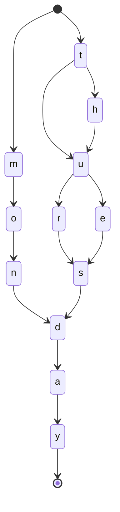
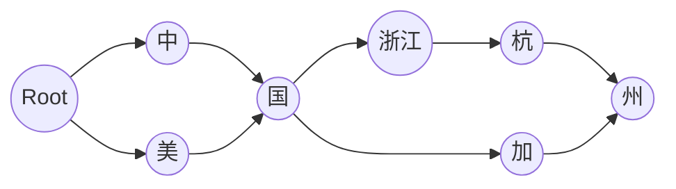

## 1. 数据类型
- 结构化数据：典型的如可以使用二维表结构来逻辑表达和实现的数据。
- 非结构化数据：不定长或无固定格式的数据，比如图片、音视频、Word文档等信息。
- 半结构化数据：可以根据需要按结构化数据处理，也可以当作非结构化数据的数据，比如XML、HTML等具有自己特定的标签格式的数据。

## 2. 数据检索
### 2.1. B+Tree
通常结构化数据会通过关系型数据库进行存储和管理，比如Mysql、Oracle等。以Mysql的InnoDB存储引擎为例，默认会使用B+树的聚簇索引方式组织二维表格结构化数据中的每一条记录，以下摘录整理自《Mysql是怎样运行的？》：

- 使用记录主键值的大小进行记录和页（磁盘和内存之间的基本单位）的排序
    - 页（包括叶子结点和内节点）内的记录按照主键的大小顺序排成一个单向链表，页内的记录被划分为若干组，每个组中主键值最大的记录在页内的偏移量会被当作槽依次存放在页目录中。可以通过二分法快速定位到主键列等于某个值的记录
    - 各个存放用户记录的页也是根据用户记录的主键大小顺序排成一个双向链表
    - 存放目录项记录的页分为不同的层级，在同一层级中的页也是通过页中目录项记录的主键大小顺序排成双向链表
- B+树的叶子节点存储的是完整的用户记录（包括默认的隐藏列）

### 2.2. 倒排索引（inverted index）
而对于非结构化数据，则需要将从非结构化数据选取某些信息提取出来再进行组织成索引。比如ElasticSearch使用的Lucene工具包中提供的倒排索引（inverted index）。
#### 2.2.1. 倒排索引的组成部分

1. 对原始文档`Doc`进行分词后得到倒排索引里面最小的存储和查询单元称为`Term`，对于英文来说是一个单词，对于中文来说一般指分词后的一个词。
2. 文档集合中出现的**不重复**词条 Term 的**有序**集合称之为词典`Term Dictionary`。因为是有序集合，所以可以使用二分法在LogN的时间复杂度内查找到对应Term。
3. 为了避免磁盘的随机读`random access`操作（10ms), 在词典之上再建立`term`前缀到词典的索引`Term Index`。Term Index 大小只有所有 term 的几十分之一，因此可以在内存中
3. 通过Term Index索引到的每条词典中的也是一条索引项，其记载term本身的一些信息以及指向倒排列表`Posting list`的指针。
4. 倒排表可以简单是一个int数组，记录某个词属于哪个文档的文档编号。其中每条记录称为一个倒排项`Posting`。
5. 所有单词的`Posting list`一般顺序地存储在磁盘的倒排文件`Inverted File`。
6. 被写入磁盘的Posting list是Immutable（不可变）的一段段（`Segment`）

`Term Index`、`Term Dictionary`与`Posting list`的关系如下图所示[^TermRelationship]：

图中的Posting List只描述了document id以示意，一般Posting会包括：

- 这个Term的 document list

- 这个Term的所有 document 的数量：`IDF`（inverse document frequency）

- 这个Term在每个 document 中出现的次数：`TF`（term frequency）

- 这个Term在这个 document 中的次序

- 每个 document 的长度：length norm

- 这个Term的所有 document 的平均长度

通常来说，TF也被称为词频，TF越高，这个Term可能对这个doc越重要；但是如果IDF很大，而每个TF还很高，这个Term对整体就越不重要。

#### 2.2.2. Term Index
##### 2.2.2.1. Trie 树
Trie 树即字典树，是一种空间换时间的数据结构，利用字符串的公共前缀来减少查询时间，最大限度地减少无谓的字符串比较。其通常可视化如下，遍历路径就是单词本身：

假设字符的种数有`ALPHABAT_SIZE`种，有`N`个长度为`L`的字符串构成了一个Trie树。则在最坏的情况下，每个节点的出度为ALPHABET_SIZE（即每个节点的可能子节点数量为ALPHABET_SIZE），Trie树的高度为L,此时Trie树的最坏空间复杂度为O(` ALPHABET_SIZE` * `N` * `L`)，相比二叉搜索树（BST）的`O(N*L)`毫无疑问是巨大的空间浪费。但是TRIE树总是可以沿着树的一个个分支高效的向下逐个字符的查询,其最坏时间复杂度`O(L)`，高于BST的`O(L * logN)`,这正是空间换时间的体现。
##### 2.2.2.2. FSM
Term Index 与字典树Trie树类似，但是为了**极致的降低存储空间**，还进行了压缩，使用了一种称为确定无环状态转化器`FST`（`Deterministic Acyclic Finite State Transducer`）的结构来构建词典。FST首先是一个有限状态机`FSM`(`Finite State Machines`)，即用来表示有限个状态的集合以及这些状态之间转移和动作的数学模型，简单说它有三个特征[^FSM]：

- 状态总数（state）是有限的。
- 任一时刻，只处在一种状态之中。
- 某种条件下，会从一种状态转变（transition）到另一种状态。
举个现实的例子：网页上有一个菜单元素。鼠标悬停的时候，菜单显示；鼠标移开的时候，菜单隐藏。如果使用有限状态机描述，就是这个菜单只有两种状态（显示和隐藏），鼠标会引发状态转变。

##### 2.2.2.3. FSA
前面提到Term Dictionary是一个有序集合，对有序集合索引通常可以使用多路平衡二叉树实现，但也可以使用FSM的一种有限状态接收机`FSA`(`finite state acceptor`)来实现。FSA具有这样的特性：

- 确定：意味着指定任何一个状态，只可能最多有一个转移可以访问到。
- 无环： 不可能重复遍历同一个状态
- 接收机：有限状态机只“接受”特定的输入序列，并终止于final状态。

举个FSA的简单例子--“大笑机”[^Laugh]：

图中的节点可以表示定义的某种状态，简单来说可以分为两类：non-final state与其中4代表的final state。➡️上的字母代表该字母的输入可以使前一个状态转移到后一个状态。为什么称之为大笑机呢？因为这个机器能识别笑声！
比如，我们以输入的笑声到达终态作为笑声的判定条件。它可以接收`ha!`,节点状态1->2->3->4;也可以接收`haha!`,节点状态1->2->3->2->3->4;还能接收`hahaha!`,节点状态最后会转移到final state...然而它不能接收`haha`,易知节点会停在2这个non-final state；它也不能接收`hoho`,因为节点状态从1转移到2后，`o`本身就不被当前节点接收来作为转移条件。

大笑机也可以如下表示[^Laugh2]：

作为转换的条件当然也可以是两个字母当成的一个组合。

事实上传统的前缀树或者说字典树也是一种FSA，但TRIE树只共享前缀，而FSA不仅共享前缀还共享后缀[^FSA]。
假设我们用星期一、二、四去掉共同的`day`后缀组成一个Set: mon,tues,thurs。相应的TRIE是这样的，只共享了前缀。

TRIE有重复的3个final state:3、8、11。 而8、11都是s转移，是可以合并的，FSA共享后缀后：

上图来自申艳超的博客，个人认为t->u对应的状态应该是2，可能是ta画错了。

##### 2.2.2.4. FST
FST和FSA很像，但比它给定一个key除了能回答是否存在，还能输出一个关联的值[^FSA]。

具有这样的特性：

- 确定：意味着指定任何一个状态，只可能最多有一个转移可以遍历到。
- 无环： 不可能重复遍历同一个状态
- transducer：接收特定的序列，终止于final状态，同时**会输出一个值**。

FST最通常的运用就是翻译，比如a走过FST后返回b即翻译成了b[^ab]。

依然以`{mon,tues,thurs}`这个集合为例，以星期天为一周的第1天，我们的mon对应2，tues对应3，thurs对应5，那么最后生成的FST就如下图所示，`/`后表示要输出的值：

- 路径m->o->n将会输出2
- 路径t->u->e->s将会输出3
- 路径t->h->u->r->s将会输出5

当然，满足上诉输出条件并不只有这一种FST，比如`m -> o -> n`的路径上的`m/2`改成`o/1`与`n/1`.

##### 2.2.2.5. LevenShtein自动机
通常我们接触到的索引都假定具有确切的数据，并允许查询键的确切值或排序值的取值范围。但对于拼写错误的Term，索引不支持查询。那么Lucene是如何支持错误Term或者部分Term模糊查询的呢？
事实上，FST可以转换成[LevenShtein自动机](https://www.cnblogs.com/med-dandelion/p/4532276.html)，这允许Lucene能够在某个编辑距离[^termDiff]内搜索文本。Leetcode第72题《Edit Distance》便是计算编辑距离的题目。

##### 2.2.2.6. FAQ
以Term: Monday、TuesDay、ThursDay为例，FSA可以变成下面这样吗？

提示：Final State 怎么确定？

### 2.3. B+树与倒排索引实例

给这样一张表

| id  |  name  | age | gender |   address    |
| --- | ------ | --- | ------ | ------------ |
| 1   | lele   | 20  | 女      | 中国浙江杭州   |
| 2   | youyou | 21  | 女      | 中国江苏连云港 |
| 3   | papa   | 18  | 男      | 中国安徽芜湖   |
| 4   | anan   | 20  | 男      | 中国浙江宁波   |
| 5   | nunu   | 20  | 男      | 美国加州      |
#### 2.3.1. 索引完全不同

##### 2.3.1.1. 以id列为主键的B+树的聚簇索引
为方便说明，假设目录页不受限制，数据页只能存储两条用户数据。

##### 2.3.1.2. 以address列为索引的二级索引
假设该二级索引 中address 列按字典序排列。二级索引包含了索引列以及指向主键的指针。

##### 2.3.1.3. 为address列建立的倒排索引
- Term Distionary:{"中国","浙江","杭州","宁波","江苏","连云港","美国","芜湖","加州"}
- Term Index: 通过FST 返回`Term Distionary`对应的地址

以中国浙江杭州“和“美国加州”两个Term 集合为例构成的FST，查询时”走到“中国”会返回`[1,2,3,4]`,走到“中国浙江”会返回`[1,4]`，走完路径“中国浙江杭州”会返回`[1]`。

- Posting List: 通过倒排链返回对应的document的主键值

| term  | posting list |
| ----- | ------------ |
| 中国   | [1, 2, 3, 4] |
| 浙江   | [1, 4]       |
| 杭州   | [1]          |
| 宁波   | [4]          |
| 江苏   | [2]          |
| 连云港 | [2]          |
| 美国   | [5]          |
| 加州   | [5]          |

#### 2.3.2. 联合索引查询方式不同
假设现在查询人员信息，给定查询过滤条件 age=18 与gender= 女 ，对于Mysql来说如果只是如果你给 age 和 gender 两个字段都建立了索引，查询的时候会先采样选一个最好的，然后另外一个条件是在遍历行的过程中在内存中计算之后过滤掉；如果是建立了联合索引age-gender，那才可能一次定位到age=18 与gender= 女 的页。而Lucene的检索流程其实是[^AND]

先从 term index 找到 18 在 term dictionary 的大概位置，然后再从 term dictionary 里精确地找到 18 这个 term，然后得到一个 posting list 或者一个指向 posting list 位置的指针。然后再查询 gender= 女 的过程也是类似的。最后得出 age=18 AND gender= 女 就是把两个 posting list 做一个“与”的合并。

"与"的操作并不好做，通常有两种办法：
- 使用 skip list 数据结构。同时遍历 gender 和 age 的 posting list，互相 skip；
- 使用 bitset 数据结构。对 gender 和 age 两个 filter 分别求出 bitset，对两个 bitset 做逻辑操作。

##### 2.3.2.1. 利用 Skip List 合并[^AND]

以上是三个 posting list。我们现在需要把它们用 AND 的关系合并，得出 posting list 的交集。首先选择最短的 posting list，然后从小到大遍历。遍历的过程可以跳过一些元素，比如我们遍历到绿色的 13 的时候，就可以跳过蓝色的 3 了，因为 3 比 13 要小。
最后得出的交集是 [13,98]，所需的时间比完整遍历三个 posting list 要快得多。

##### 2.3.2.2. 利用 Bitset 合并[^AND]
bitset 是一种很直观的数据结构，对应 posting list 如：

[1,3,4,7,10]

对应的 bitset 就是：

[1,0,1,1,0,0,1,0,0,1]

每个文档按照文档 id 排序对应其中的一个 bit。Bitset 自身就有压缩的特点，其用一个 byte 就可以代表 8 个文档。所以 100 万个文档只需要 12.5 万个 byte。但是考虑到文档可能有数十亿之多，在内存里保存 bitset 仍然是很奢侈的事情。而且对于个每一个 filter 都要消耗一个 bitset，比如 age=18 缓存起来的话是一个 bitset，18<=age<25 是另外一个 filter 缓存起来也要一个 bitset。
Lucene 会对bitset再进行压缩，称之为 Roaring Bitmap。压缩的思路其实很简单:与其保存 100 个 0，占用 100 个 bit;还不如保存 0 一次，然后声明这个 0 重复了 100 遍。

这两种合并使用索引的方式都有其用途。Elasticsearch 对其性能有详细的[对比](https://www.elastic.co/blog/frame-of-reference-and-roaring-bitmaps)。简单来说对于简单的相等条件的过滤缓存成纯内存的 bitset 还不如需要访问磁盘的 skip list 的方式要快。

#### 2.3.3. 倒排索引的其他特性
##### 2.3.3.1. 分段存储

>适当的索引可以加速读取查询，但每个索引都会减慢写速度。--《数据密集型系统设计》

数据库维护索引除了占用存储空间，也会减慢写速度。
如果为整个文档集合创建一个庞大的倒排索引，当索引需要更新时，相比每次只更新索引的一小部分，全量替换原有索引成本太高。所以倒排索引会被拆分为多个子文件存储。每个子文件为一段，所以倒排索引其实是分段（`Segment`）存储的。当段太多时会触发段合并，即将多个段合并生成新段，合并结束后会将老的段删除。
##### 2.3.3.2. 不可变
前面提到Lucene使用FST尽可能地压缩Term Index的大小，因为压缩的缘故，Term Index实际上不方便直接在原数据结构上做修改了。所以一开始倒排索引就被设计成Inmmutable不可变[^BenefitOfImmutable]：

- 因为已有的倒排索引不会改变，所以理论上读请求都会直接命中内存中的Term Index，不会发生走到磁盘的Term Dictionary的情况。
- 同理，建有的其他缓存（比如Filter缓存）在索引的生命周期内始终有效。
- 因为已有索引本身不被更新，所以也不用考虑并发修改数据的问题。

既然索引不可变，那数据本身改变了怎么办呢？所以数据更新与删除其实都是“伪”的，即

- 新增数据时，其实是新增一个段
- 对旧数据更新时，其实是新增一个段来存储数据并标记为新的，最后在返回结果时对结果进行更新
- 对旧数据进行删除时，其实也是对旧数据在`.del`文件中做标记，最后采用bitset的办法在原索引搜索出结果后进行过滤

在原数据之外另外维护数据的变动来实现增删改的效果自然要付出代价，

- 如果新增数据太多，则新建段的数量太多，对服务器的资源如文件句柄的消耗很大，而且每个段都会参与搜索结果的逻辑操作，段越多搜索也越慢
- 若有一条数据反复更新，其实还是反复新建段...也浪费空间
- 删除旧数据可能是为了释放存储空间，但短时间内不会有效果

##### 2.3.3.3. 延迟写
同样为了提升写的性能ES不可能同步写数据:[^Fsync]

1. 每当需要新增数据（可能是为了更新），会将其先写到JVM的内存中。
2. 当达到默认的时间(**1s**）或者内存中的数据够大时，会触发Refresh,将内存中的数据生成到一个新的段上并缓存到操作系统的文件缓存系统上。
3. 因为在最终落盘之前数据是可能因为宕机而丢失的，所以数据在落盘前还会记录一份到事务日志中。因为是直接顺序记录，IO压力比刷新到磁盘小很多。
4. 当事务日志超过512M或者时间超过30min或者超过文件系统缓存限制才会真正通过`Fsync`刷新到磁盘上。

必须注意的是，JVM内存中的数据并不是以段存储的，所以不能提供搜索功能；当数据被refresh到文件缓存系统中时才可以,所以以Lucene为基础的会被称为"近实时搜索引擎".

### 2.4. B+树 Vs 倒排索引

B+树和倒排索引其实分别适用于两种不同的应用场景:

- OLTP:On-Line Transaction Processing,联机事务处理,重点在执行数据库的写操作(增删改)
- OLAP:On-Line Analytical Processing,联机分析处理,重点在执行数据库的读操作

当数据在源源不断生产,我们离不开Mysql这类偏OLTP的数据库,但为了优化读,我们可以通过后续再把数据清洗一部分到OLAP数据库中做专门的查询分析,如ES.如此,两类数据库共存,各自发挥了自己最擅长的事.
#### 2.4.1. 优点
非结构化数据如果使用关系数据库中存储，再使用like的方式模糊查询，因为不能利用索引，效率是很低的；但是结构化数据如果使用倒排索引的方式去组织，查询尤其过滤查询性能仍然会得到提升。

- 相对于B+树即使是目录页也在磁盘中，倒排索引的不仅设计了Term Dictionary这样的目录页，还在其上又设计了一层使得定位Term更为迅速的Term Index，并且通过FST压缩使得能完全在内存中使用Term Index
- 在 Mysql 中给两个字段独立建立的索引无法联合起来使用，必须对联合查询的场景建立复合索引，而Mysql 如果经过索引过滤之后可能仍然要加载很多行。而 lucene 可以任何 AND 或者 OR 组合使用索引进行检索。
  
- Elasticsearch 支持 nested document，可以把一批数据点嵌套存储为一个 document block，减少需要索引的文档数。

- Lucene 支持分 segment，Elasticsearch 支持分 index。Elasticsearch 可以把分开的数据当成一张表来查询和聚合。相比之下 Mysql 如果自己做分库分表的时候，联合查询不方便。
    - 当索引上数据量太大，ES可以水平拆分，这并不像InnoDB的页分裂，因为数据并不会重新排序，而像Mysql数据量太大时的分库分表的水平拆分。拆分出来的索引数据块称为分片（sharding）。

#### 2.4.2. 缺点
搜素引擎可以带来查询性能提升，但是相对Mysql也有一定局限性，比如

- 对深分页支持效果不好
    - 例如pageSize = 100,pageNo = 101,一共有个6个shard.则需要在6个shard上都排序算分(score)10100条数据,最后再在coordinating node上之后捞出来的人60600条数据,这很容易OOM
    - 搜索最好不要超过5000条(ES的`max_result_window`默认为10000)
- 搜索结果的排序、统计在大数据量时结果不稳定(可能是因为分片堆排序的原因)
- 更新慢,当出现索引较大更新时，因为倒排索引本身不可变需要重新构建整个索引

## 3. 使用注意事项

1. 使用的索引ID最好要有规律性，UUID那种非常不适合Lucene查询
2. 如果字段本身不需要分词,看不同的产品注意设置为不分词,不然白白创建分词后的索引
3. 索引刷新间隔默认为1s,业务不需要如此高的实时性的话,可以更改
4. 段合并会消耗大量磁盘I/O,注意设置参与段合并的线程数量
5. 大数据量写入的场景,会占用大量的网络带宽,很可能会使节点之间的心跳超时(通常默认1s)
6. 创建索引的时候就确定好主分片的数量并且最好不要改变这个数量，因为分片后原本对查询的路由都会无效
7. 为了提高集群稳定性和读时的高并发，还可以对索引数据做副本（Copy）。不过这同时也会增加写成本

以上部分参考: https://c1n.cn/gC52J

[^TermRelationship]:https://www.infoq.cn/article/database-timestamp-02?source=app_share
[^FSM]:http://www.ruanyifeng.com/blog/2013/09/finite-state_machine_for_javascript.html
[^Laugh]:https://cs.union.edu/~striegnk/courses/nlp-with-prolog/html/node2.html#l1.fsas
[^Laugh2]:https://cs.union.edu/~striegnk/courses/nlp-with-prolog/html/node3.html#l1.examples
[^FSA]:https://www.shenyanchao.cn/blog/2018/12/04/lucene-fst/
[^ab]:https://cs.union.edu/~striegnk/courses/nlp-with-prolog/html/node13.html#l2.transducers
[^termDiff]: Levenshtein distance，编辑距离为1表示已经添加、删除或替换了一个字母。
[^AND]: https://www.infoq.cn/article/database-timestamp-02?source=app_share
[^BenefitOfImmutable]:https://xie.infoq.cn/article/5501ae1652c9adac088c10646?source=app_share
[^Fsync]:https://mp.weixin.qq.com/s/PIl9_1ogyKVDd0nxz8PhUw