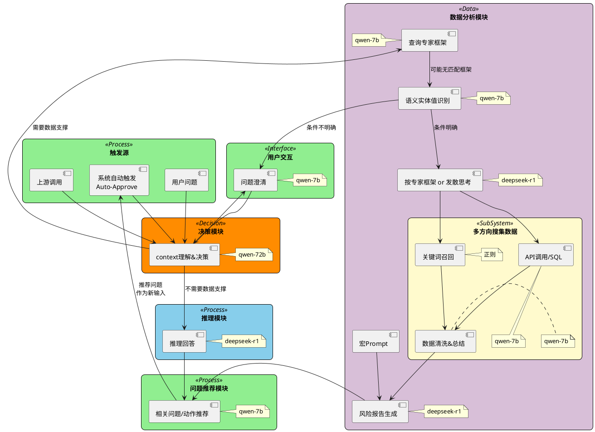

所谓Deep Research ,针对的是所有搜索资料-分析-得出结论的研究性问题。具体到各行各业的应用场景中，可能就有“这个零食的销售额怎么下降了？”、“这个保险产品的赔付率为什么上升了？”、“我要去潮汕旅游，有什么好吃好玩的推荐”等等问题。这种问题中，核心要解决几个问题：

1. 找什么资料？
2. 什么资料符合标准？
3. 根据当前的资料还能有什么启发？
4. 找到什么时候停止？
5. 用什么方式来解读这些资料？

可以适用以下架构： 

