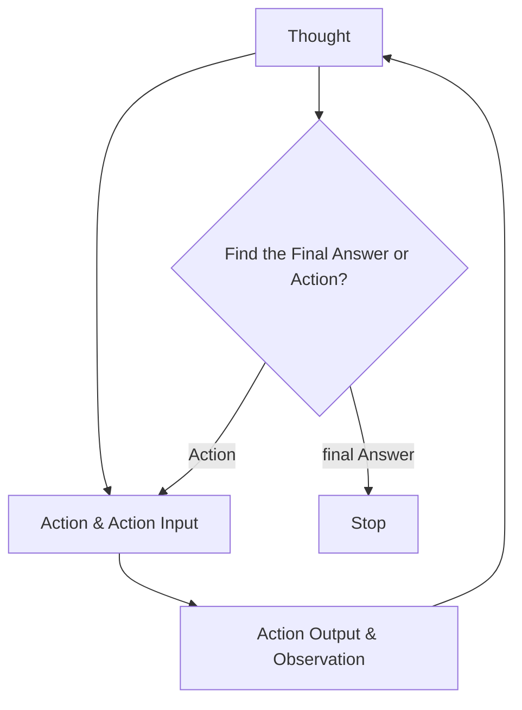
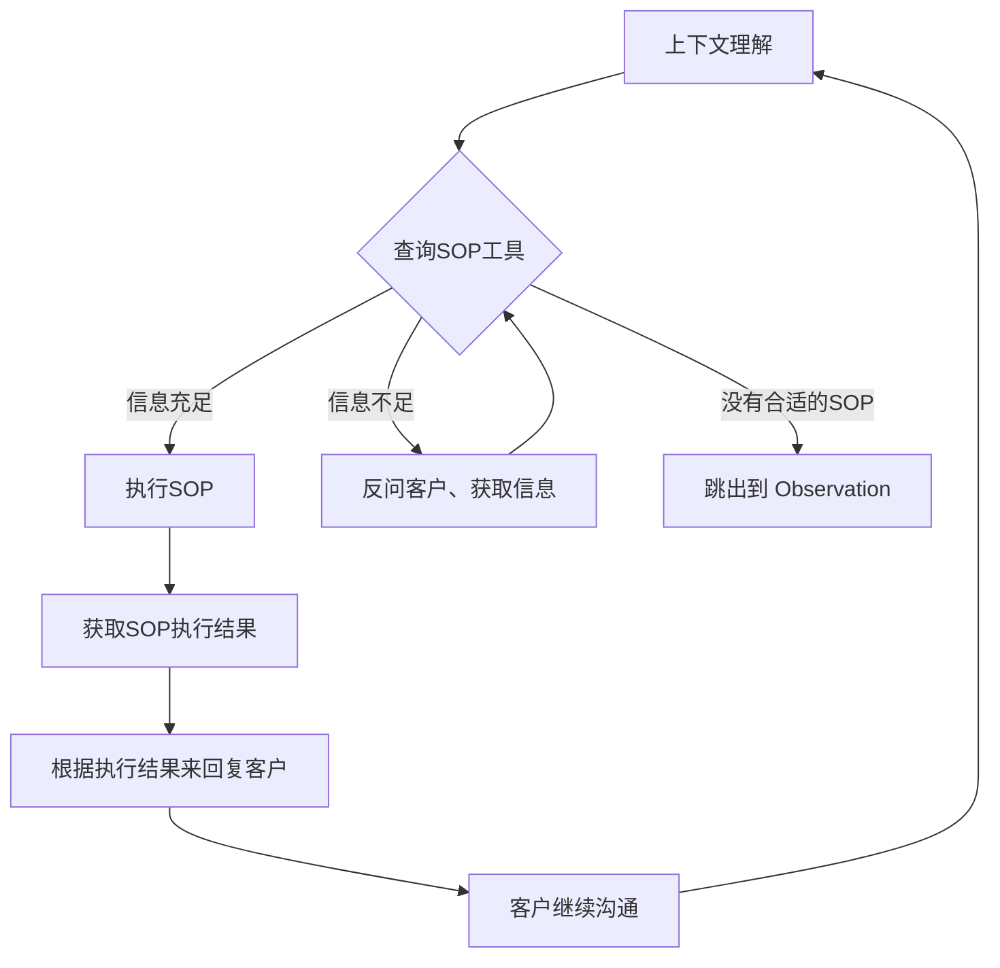

AutoGen、Crew AI 和 LangGraph 等新兴框架提供了丰富的方法来构建多智能体问题解决方案，特别是 ChatDev，这是一组运行虚拟软件公司的智能体的开源实现-- https://www.deeplearning.ai/the-batch/issue-241/
## ReAct(Reason & Act) 框架
 [LLM Powered Autonomous Agents](https://lilianweng.github.io/posts/2023-06-23-agent/):
 
 


上图很好地解释了Agent的工作原理，其中Memory 结合 Planning 使得 Agent 可以事前 Thought,事后 Observation。然后继续 Thought 判断下一步的Action, Action 则是利用 Tools 对现实世界产生影响。这个也被称为 ReAct(Reason & Act) 框架：


不过这个框架很容易出现死循环的情况，即LLM在多轮思考、执行、观察之后发现依然需要重复执行，就会消耗大量token，也完成不了任务，也停不下来。

### Action
其中一个Action流程是：


## Search Vs Explore
>作为一名专业律师，我在双显示器屏幕前度过了数千小时。我的右屏用于“真正”的工作，比如给客户起草法律意见书或诉状，这项工作专业性要求很高。我的左屏用于辅助我的工作，比如翻阅数百页的尽职调查报告，从庞大的案例库中搜寻相关判例，并对成千上万的证据材料进行梳理分析，目的仅在于挖掘出少数几个关键的法律问题和证据线索。这项工作，既不具挑战性也不令人愉快，但确是现阶段必要的。

索性我们现在进入新的SaaS时代，
>
>**从软件即服务（Software-as-a-Service）向服务即软件（Service-as-a-Software）转变**。到目前为止，软件帮助知识工作者更好地完成他们的工作……但在不远的将来，一个AI agent将完全为他们完成这些工作。-- https://a16z.com/announcement/investing-in-hebbia/


目前文档搜索类产品的**局限性集中在：**

1.用户提出的问题太复杂，需要深层次分析能力，**在现有文档中没有回答，**它们应该是人工智能自行生成的全新见解。

2.**搜索过程太复杂了，**需要很多步骤（不仅仅是一次搜索）才能得到一个可以直接使用的结果。

3.答案不是单纯的**文字**，而是**图表、表格、图像**，无法直接输出结构化数据。

4.输出结果非常重要，容错率很低，因此过程不能依赖**黑匣子系统。**

**Hebbia**以引用的形式提供答案，并且所有的这些都在一个电子表格的形式中呈现。对于每个文档（行！），你将得到一组问题（列！）的答案，除了总结每个查询外，它还展示了得出结论的来源和各个步骤，并允许用户验证，提供AI处理流程的透明度，建立用户对输出结果的信任和信心。

## 证明者和验证者
OpenAI [发现](https://openai.com/index/prover-verifier-games-improve-legibility/) 如果一个比较弱的小型模型能被大模型的方案说服，那么这个方案人类更容易理解。

## 知识图谱增加可解释性
https://neo4j.com/labs/genai-ecosystem/llm-graph-builder/

## 有向无环图Plan

```

```