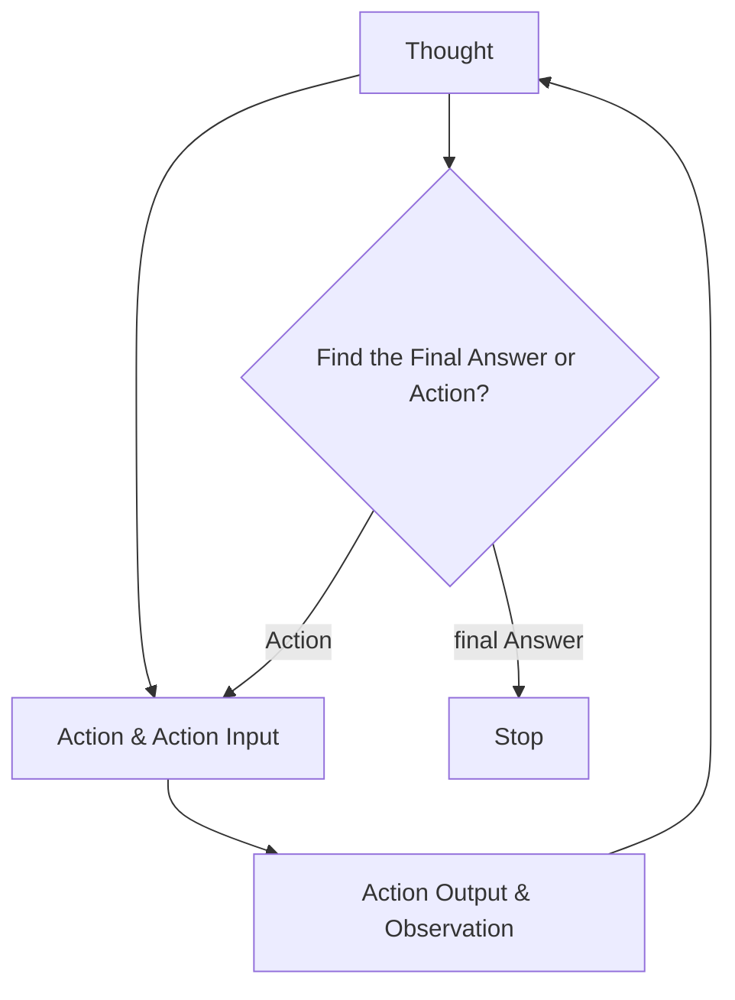
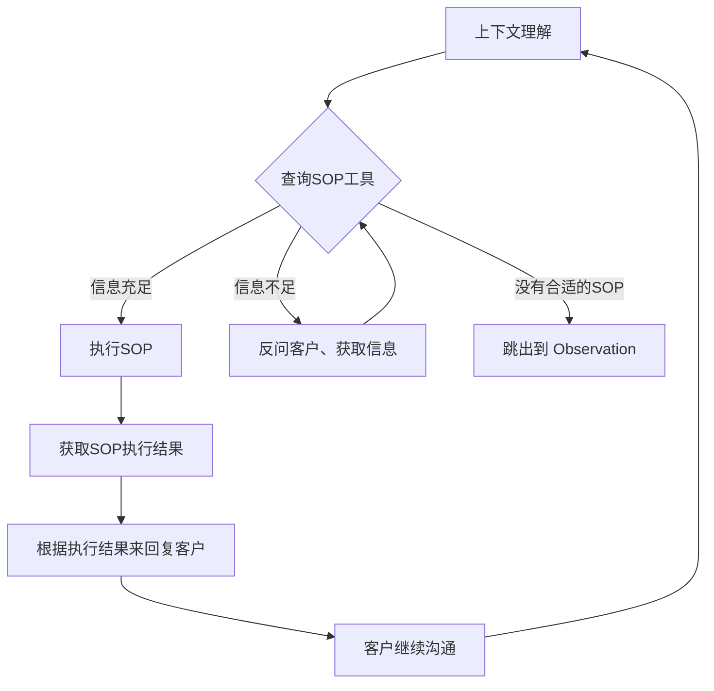

AutoGen、Crew AI 和 LangGraph 等新兴框架提供了丰富的方法来构建多智能体问题解决方案，特别是 ChatDev，这是一组运行虚拟软件公司的智能体的开源实现-- https://www.deeplearning.ai/the-batch/issue-241/
## ReAct(Reason & Act) 框架
 [LLM Powered Autonomous Agents](https://lilianweng.github.io/posts/2023-06-23-agent/):
 
 

上图很好地解释了Agent的工作原理，其中Memory 结合 Planning 使得 Agent 可以事前 Thought,事后 Observation 然后继续 Thought 判断下一步的Action, Action 则是利用 Tools 对现实世界产生影响。这个也被称为 ReAct(Reason & Act) 框架：

不过这个框架很容易出现死循环的情况，即LLM在多轮思考、执行、观察之后发现依然需要重复执行，就会消耗大量token，也完成不了任务，也停不下来。

## Action
其中一个Action流程是：

