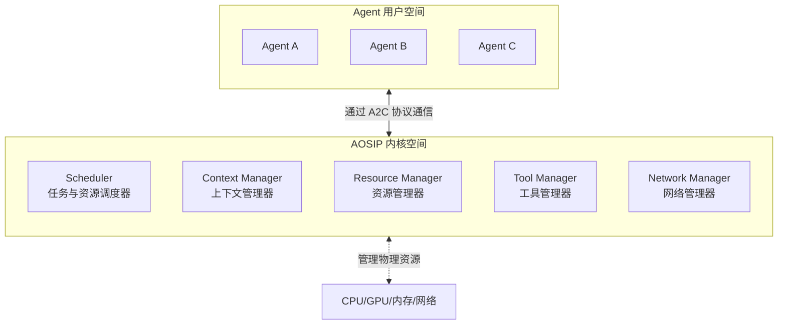
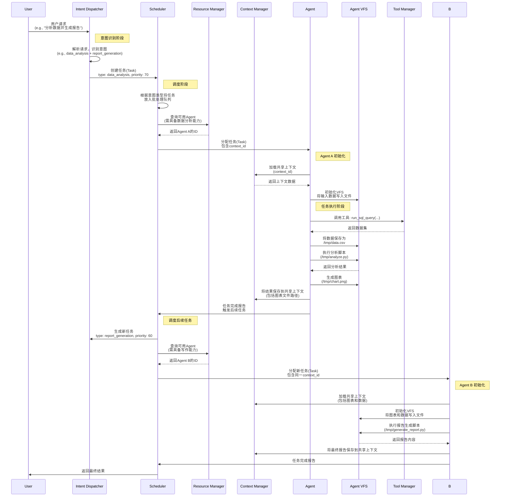

#### **核心理念**： “进程即Agent，系统即生态”

#### **终极目标**： 构建一个支持**人类级别多任务处理**与**无缝上下文切换**的、具备**操作系统级可靠性**的多Agent协同系统。


---

## **一、 架构总览**

AOSIP 系统由两个核心部分组成：

1.  **AOSIP Kernel (操作系统内核)**： 一个独立的、中心化的守护进程/服务，负责系统的“底层”管理。
2.  **AOSIP Agents (用户进程)**： 多个符合 AOSIP 规范的 Agent 实例，它们向 Kernel 注册，并接受其管理。

整个系统架构遵循清晰的“内核-用户态”分离思想，如下图所示：



---

## **二、 核心组件与技术实现**

### **1. AOSIP Kernel (内核)**

内核是实现“操作系统”功能的核心，提供以下服务：

#### **调度器 (Scheduler)**:

- **功能**： 接收任务请求，将其派发给合适的 Agent。管理一个全局的 **任务队列 (Task Queue)**。
- **技术实现**：
  - 使用 **异步优先队列** (如 `asyncio.PriorityQueue`) 实现任务队列。
  - 实现 **MLFQ-A** 调度算法。每个任务都有一个元数据（复用A2A）：
    ```python
    class Task:
    	id: str
    	priority: int  # 0-100
    	agent_type: str  # 指定或由调度器选择
    	context_id: str  # 所属上下文
    	created_at: float
    	# ... 其他字段
    ```
  - 调度器协程 (`scheduler_coroutine`) 持续从队列中获取最高优先级的任务，通过 **查询注册表** 找到有能力处理该任务的、负载最低的 Agent，然后将任务发送给它。

调度器不再仅仅是轮询分配任务，而是成为一个智能的“调度中心”，包含以下子组件：

- **a. 意图识别与分类器 (Intent Dispatcher / System Call Interface)**：

  - **类比**： 操作系统的**系统调用 (syscall)** 和**中断控制器**。所有外部请求（用户输入、API调用）首先到达此处。

  - **功能**：

    - **请求解析**： 对原始输入（如自然语言指令）进行初步解析，提取关键特征。

    - **意图分类**： 使用一个轻量级模型（如 fine-tuned 的小型 LLM 或分类器）将请求分类为预定义的“意图”或“服务”类型（如 `"代码生成"`, `"数据分析"`, `"内容创作"`, `"决策支持"`）。

    - **系统调用转换**： 将识别出的意图转换为一个内部的**标准任务描述符 (Standard Task Descriptor)**，这是调度器能理解的语言。这类似于将 `printf` 调用转换为 `sys_write`。

  - **输出**： 一个富含元数据的任务对象，包含 `intent_type`，`priority`，`estimated_resource_profile` 等字段，为后续调度提供依据。

- **b. 多队列调度算法 (Multi-Queue Scheduling)**：

  - **类比**： Linux CFS 的**多队列调度**，针对不同的工作负载类型（交互式、批处理、实时）使用不同的策略。

  - **功能**：

    - **意图队列**： 根据 `intent_type` 将任务放入不同的队列（如 `realtime_queue`, `batch_queue`, `interactive_queue`）。

    - **策略决策**：

      - **实时队列**： 采用**最高优先级优先 (HPF)** 或**最早截止时间优先 (EDF)** 算法，用于需要极低延迟的任务（如控制指令）。

      - **交互式队列**： 采用**时间片轮转 (Round Robin)** 或 **CFS（完全公平调度器）** 算法，保证所有交互式用户请求都能得到及时响应，防止饿死。

      - **批处理队列**： 采用 **FCFS（先来先服务）** 或 **SJF（短作业优先）** 算法，最大化吞吐量，用于不紧急的后台任务（如模型训练、数据清洗）。

    - **工作窃取 (Work Stealing)**： 允许空闲队列从繁忙队列中“窃取”任务执行，最大化整个系统的资源利用率。

#### **资源管理器 (Resource Manager)**:

- **功能**： 监控和分配系统资源（CPU、内存、GPU、网络带宽、外部API调用配额）。
- **技术实现**：

  - 为每个 Agent 进程设置 **资源配额**（例如使用 `cgroups` 在 Linux 上实现）。
  - 实现 **令牌桶算法** 或 **漏桶算法** 来管理 LLM API 的调用频率，防止限流。
  - 向调度器提供资源信息，辅助其做出调度决策。

- **a. 资源配额与隔离 (cgroups & Namespaces)**：

  - **功能**：

    - 为每个 Agent **进程** 创建**资源控制组 (cgroups)**，严格限制其 CPU、内存、GPU 和网络带宽的使用上限。

    - 为 Agent 提供**命名空间 (Namespaces)** 隔离，例如隔离其文件系统视图、网络栈（如果需要），确保安全性和稳定性。

  - **技术实现**： 直接利用 Linux 内核的 cgroups v2 和 namespaces 功能，AOSIP Kernel 通过一个 `ResourceController` 模块进行管理。

- **b. 资源代理 (Resource Broker)**：

  - **类比**： 分布式资源管理系统（如 YARN, Mesos）。

  - **功能**：

    - 管理外部资源池（如多个 LLM API 密钥、数据库连接池）。

    - Agent 需要通过资源管理器“申请”这些资源的使用许可。管理器实施**令牌桶**等算法进行限流和配额管理。

    - 例如，一个 Agent 要调用 GPT-4 API，必须先向 Resource Broker 申请一个“GPT-4令牌”，获得批准后才能执行调用。

#### **上下文管理器 (Context Manager)**:

- **功能**： 实现 **认知连续性 (Cognitive Continuity)** 的核心。为每个会话/任务链维护一个共享的、可持久化的上下文。
- **技术实现**：

  - 提供一个 **键值存储** 或 **文档数据库** 接口（如 Redis 或 MongoDB）。
  - 每个上下文是一个独立的存储空间，通过 `context_id` 标识。
  - 提供标准化的 API 供 Agent 读写：
    - `append_to_context(ctx_id, key, value)`
    - `read_from_context(ctx_id, key, query=None)`
  - 上下文内容可包括：对话历史、工具执行结果、中间决策、用户偏好等。

- **类比**： **虚拟内存系统**。每个任务（进程）都有自己的虚拟地址空间，而物理内存由操作系统统一管理。

- **功能**：

  - **上下文ID (Context ID) 作为“虚拟地址空间”**： 每个任务链拥有唯一的 `ctx_id`，其上下文信息分散存储在物理存储（内存、Redis、DB）中。

  - **上下文切换 (Context Switching)**： 当调度器将任务分配给一个 Agent 时，它会将相关的上下文信息“加载”到该 Agent 的“工作内存”中。任务挂起或完成后，上下文被“保存”回中央存储。

  - **写时复制 (Copy-On-Write, COW)**： 如果一个任务需要分支（如尝试多种不同的解决方案），可以不复制全部上下文，而是创建轻量级的 COW 引用，只有在修改时才进行复制，极大节省资源。

#### **工具管理器 (Tool Manager)**:

- **功能**： 实现 **互操作性 (Interoperability)**。管理所有已注册的工具（遵循 MCP 协议）。
- **技术实现**：

  - 维护一个 **工具注册表**。
  - 提供 `list_tools()` 和 `call_tool(tool_name, parameters)` 方法。
  - 工具调用是 **异步的**，并自动将输入和输出记录到指定的 `context_id` 中。

- **类比**： **设备驱动层**。操作系统通过统一的驱动接口管理各种硬件。

- **功能**：

  - 所有外部工具（搜索引擎、API、数据库、自定义函数）都必须向此管理器注册“驱动”。

  - 管理器提供统一的 `tool_call(tool_name, parameters)` 接口。

  - 它负责处理工具的版本兼容性、故障转移（如一个翻译API失效，自动切换到备用API）、和负载均衡。

#### **网络管理器 (Network Manager)**:

- **功能**： 管理 Agent 之间的通信（A2A）和 Agent 与 Kernel 的通信（A2C）。
- **技术实现**：
  - 使用 **gRPC** 或 **高性能 WebSocket** 作为通信层，实现二进制、低延迟的消息传递。
  - 使用 **Protocol Buffers (Protobuf)** 定义所有消息格式，确保高效序列化/反序列化。

#### 虚拟文件系统

为了满足Agent在运行过程中对思考过程打草稿、输出临时文档、执行临时脚本代码等诉求，我们为每个Agent设计一个基于内存的虚拟文件系统（VFS）。这个VFS模拟真实文件系统的行为，提供完整的文件操作接口，同时确保Agent之间的隔离性和安全性。VFS与共享上下文管理器协同工作，以支持认知连续性和任务协作。

- **数据结构**：VFS使用树状结构模拟文件和目录。每个节点可以是文件（存储内容为字符串或字节）或目录（存储子节点引用）。

- **文件操作API**：

  ```python

  class VirtualFileSystem:
      def __init__(self):
          self.root = {"type": "directory", "children": {}}
          self.current_path = "/"

      def resolve_path(self, path):
          # 解析路径，处理相对路径和绝对路径
          pass

      def create_file(self, path, content=""):
          # 创建文件，并写入内容
          pass

      def read_file(self, path):
          # 读取文件内容
          pass

      def write_file(self, path, content, append=False):
          # 写入文件内容（覆盖或追加）
          pass

      def delete_file(self, path):
          # 删除文件
          pass

      def list_directory(self, path):
          # 列出目录内容
          pass

      def create_directory(self, path):
          # 创建目录
          pass

      def delete_directory(self, path, recursive=False):
          # 删除目录（可选递归）
          pass

      def execute_script(self, path, language="python"):
          # 在沙箱中执行脚本文件（支持多种语言，如Python、JavaScript）
          # 返回执行结果
          pass
  ```

- **沙箱机制**：脚本执行通过安全的沙箱环境（如WebAssembly、Docker容器或受限子进程）进行，防止恶意代码访问主机资源。沙箱仅能访问Agent的VFS和有限的系统资源。

- **持久化选项**：Agent可以通过工具管理器将VFS文件保存到持久存储（如数据库、云存储）或共享上下文中。例如：

### **2. AOSIP Agent (代理)**

每个 Agent 是一个独立的进程，内部运行着一个异步事件循环。

- **Agent 内部循环 (Event Loop)**:

  ```python
  import asyncio

  class AOSIPAgent:
      def __init__(self, kernel_address):
          self.kernel = connect_to_kernel(kernel_address) # 连接到内核
          self.abilities = ["web_search", "text_generation"] # 向内核注册的能力

      async def run(self):
          await self.kernel.register(self.abilities) # 启动时向内核注册
          while True:
              # 1. 从内核请求任务（非阻塞等待）
              task = await self.kernel.request_task(self.agent_id)

              # 2. 感知：从上下文读取相关信息
              context = await self.kernel.context_read(task.context_id)

              # 3. 规划与执行：核心逻辑（可能调用LLM）
              # 此过程会频繁调用内核的工具管理器
              result = await self.execute_task(task, context)

              # 4. 将结果写回共享上下文
              await self.kernel.context_append(task.context_id, "result", result)

              # 5. 通知内核任务完成
              await self.kernel.report_task_done(task.id, result)
  ```

- **技术实现要点**：
  - **自治性**： Agent 内部 `execute_task` 方法包含了其核心“智能”（如提示工程、思维链推理），这是其自治性的体现。
  - **协作性**： 通过内核的上下文和工具管理器与其他 Agent 间接协作，符合 **Actor 模型**——不直接共享内存，而是通过消息（经内核转发）通信。



## **三、 关键协议与接口 (A2C & A2A)**

#### **1. Agent-to-Kernel (A2C) 协议**

这是 Agent 与内核通信的绝对核心。

- `register(agent_id, abilities[]) -> bool`: Agent 启动时向内核注册自身能力和资源需求。
- `request_task(agent_id) -> Task`: Agent 向内核请求下一个任务（长轮询或异步回调）。
- `report_task_done(task_id, result) -> bool`: 报告任务完成状态和结果。
- `context_read(context_id, query) -> ContextData`: 从指定上下文读取数据。
- `context_append(context_id, data) -> bool`: 向指定上下文追加数据。
- `call_tool(tool_name, parameters, context_id) -> ToolResult`: 请求内核调用一个工具。

#### **2. Agent-to-Agent (A2A) 协议**

Agent 间**不直接通信**，所有协作都通过内核中介完成，这极大地简化了系统的复杂性和可靠性。

- **间接通信**： Agent A 将中间结果 `X` 通过 `context_append` 写入上下文。
- **事件驱动**： 内核可向相关 Agent（如正在处理同一 `context_id` 的 Agent B）发送一个 **通知消息**，告知上下文已更新。
- **发布-订阅**： Agent 可以向内核订阅特定类型的上下文更新事件，实现更复杂的协作模式。

---

## **四、 实现“弹性与容错”的技术机制**

1.  **心跳与健康检查**：

    - 内核定期向所有注册的 Agent 发送心跳包。
    - Agent 无响应后，内核将其标记为“失活”，并将其未完成的任务重新放入调度队列 (**重试**)。

2.  **任务检查点 (Checkpointing)**：

    - 对于长任务，Agent 可以定期向内核报告进度（`report_progress()`），内核将其保存到上下文中。
    - 如果 Agent 崩溃，当任务被重新调度时，新的 Agent 可以从最近的检查点恢复执行，而不是从头开始。

3.  **幂等性设计**：
    - 工具调用和任务处理逻辑应尽可能设计为**幂等**（即多次执行产生相同结果），这样重试才是安全的。

---

## **总结：AOSIP 的技术优势**

通过将操作系统内核的设计理念应用于多 Agent 系统，AOSIP 带来了以下核心优势：

- **标准化与简化**： Agent 开发者只需关注其内部逻辑（`execute_task`方法），而无需处理复杂的分布式系统问题（如通信、调度、容错），这些由 AOSIP Kernel 统一解决。
- **极致的可靠性**： 中心化管理模式使得监控、错误恢复和状态持久化变得可行和简单。
- **高效的资源利用**： 全局调度和资源管理避免了资源的浪费和竞争。
- **真正的协作生态**： 通过共享上下文和标准化工具接口，不同团队、不同技术栈开发的 Agent 能够无缝地协同工作，最终实现“系统即生态”的愿景。

通过上述深化设计，AOSIP 真正汲取了操作系统的精华：

1. **抽象与统一**： 将多样的 Agent 抽象为统一的“进程”，将多样的任务抽象为统一的“任务描述符”，通过标准接口（系统调用）进行管理。

2. **智能调度**： 引入意图识别和多队列调度，使系统能理解任务本质，并像操作系统区分交互式和后台进程一样，合理地分配资源，兼顾响应速度和吞吐量。

3. **资源隔离与安全**： 借鉴 cgroups 和 namespaces，提供了企业级所需的稳定性和安全性，防止恶意或故障 Agent 拖垮整个系统。

4. **高效协作**： 虚拟化上下文管理使得跨Agent的协作像进程间通信一样自然高效，且维护了完整的认知连续性。

这个设计使得 AOSIP 不再是一个简单的任务分发框架，而是一个真正的、能够适应复杂多变需求的 **Agent 操作系统**。
