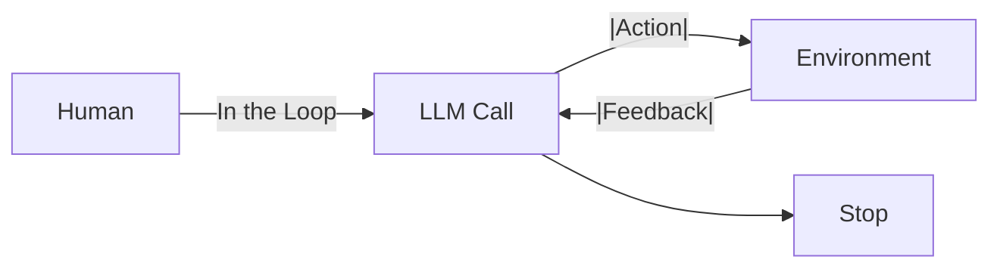
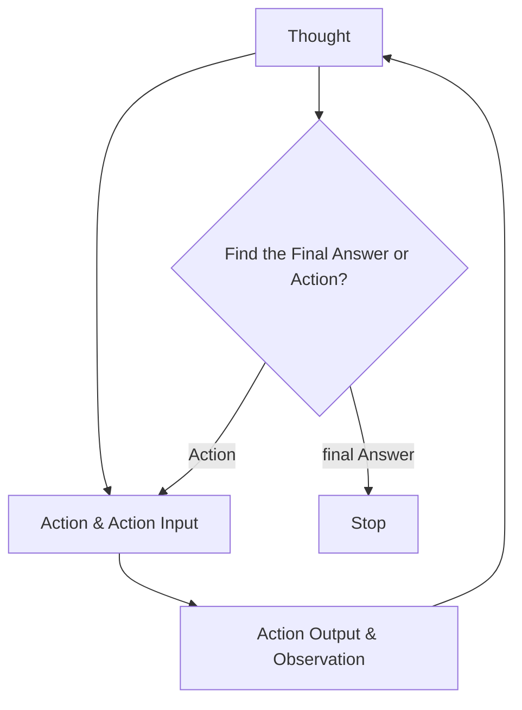
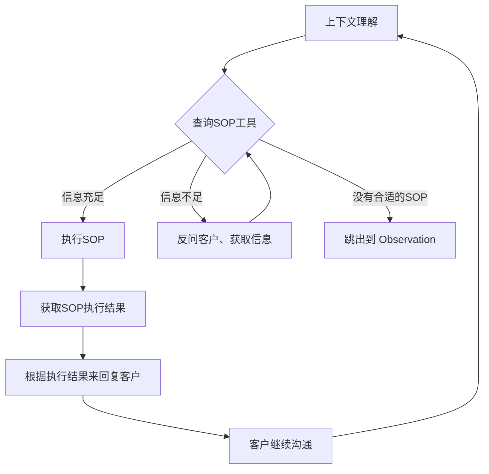

## 从 LLM 调用到 Agent Society

基于 LLM 大语言模型发展的软件系统个人总结为下面几个阶段：

### 单一 LLM 调用

最开始将 LLM 当做一个好用的文本任务类万能接口，利用其完成单一的摘要、分类、翻译类工作。基于文本的调用交互虽然简单，但是依然是当前 AI 系统的本质。

### Workflow LLM 编排

发展到工作流（Workflows）：编排多个、预先定义好的 LLM 调用。这个阶段是将 SOP 借助 LLM 增强或重新实现一遍，达到 RPA 的效果。

### 多智能体系统

继而将 workflow 节点中相对简单的 LLM 调用扩展到Agent 调用,组成多智能体（Multi-Agent)系统。在这里开始出现 [LLM Powered Autonomous Agents](https://lilianweng.github.io/posts/2023-06-23-agent/) 中提出的 Agent 的概念：


lilianweng 提出 Agent = Planning + Action(Tools) + Memory 这时候各种多智能体框架也如火如荼的发展起来，比如 AutoGen、Crew AI 、 LangGraph 和 AgentUniverse等。多智能体的交互范式也基于不同的场景加以运用。基于 AgentUniverse 和 PEER 模式的 [[Case Analysis AI Agent]] 是这个阶段的作品。不过这时候公司内部只能使用 Qwen系列，不指导足够 COT 和 few-shot 的Agent 表现不太稳定，可以参见 [[痛定思痛，AI Agent 给我的教训]]。


另一方面，Antropic的 Barry Zhang 提出 Agent 更简洁的概念，即**在循环（Loop）中使用工具的模型** 。



落实到代码层面，可以抽象表示如下：

```python
env = Environment()
tools = Tools(env)
system_prompt = "Goals, constraints, and how to act"
user_prompt = get_user_prompt()

while True:
	action = llm.run(system_prompt + user_prompt + env.state )
	env.state = tools.run(action)
```

这其实是 ReAct 框架的变体，相比 ReAct, Barry Zhang 更加强调了他所认为的 Agent的抽象就是孩这样。这里不妨称其为 Loop框架以便区分。

### One Agent + nMCPs

从泄露的 [Manus源码](https://gist.github.com/jlia0/db0a9695b3ca7609c9b1a08dcbf872c9.)来看， Loop 框架一个典型的代表就是 Manus。

```shell
You are Manus, an AI agent created by the Manus team.
...
<agent_loop>
You are operating in an agent loop, iteratively completing tasks through these steps:
1. Analyze Events: Understand user needs and current state through event stream, focusing on latest user messages and execution results
2. Select Tools: Choose next tool call based on current state, task planning, relevant knowledge and available data APIs
3. Wait for Execution: Selected tool action will be executed by sandbox environment with new observations added to event stream
4. Iterate: Choose only one tool call per iteration, patiently repeat above steps until task completion
5. Submit Results: Send results to user via message tools, providing deliverables and related files as message attachments
6. Enter Standby: Enter idle state when all tasks are completed or user explicitly requests to stop, and wait for new tasks
</agent_loop>
```


通过 Loop ,当前阶段 LLM 可以做到自主决定其行动轨迹，通过工具与环境交互，并根据反馈一步步推进或更新 plan中的进度。Manus 因此在最开始的宣传片里宣称是"世界上第一个通用智能体"。拥有一百多万用户的AI Coding 插件 Cline 也是 Loop框架，打开它的 task `index.ts` 可以看到：

```javascript

initiateTaskLoop(userContent: UserContent): Promise<void> {
		let nextUserContent = userContent
		let includeFileDetails = true
		while (!this.abort) {
			...
		}
	}
```

这启发了我们如果将 Manus 和 Cline 的开发范式在企业内部落地，同时Manus的 29 个 function 换成企业内部领域内的 MCP Server，企业内部的Manus 就不仅仅可以完成诸如生成PPT、全网搜索分析之类的工作，还可以实际完成企业内部的各个业务场景的业务需求，比如风控策略的部署、保险产品的精算、营销方案的策划以及从业务需求到 Coding、部署的每一步。 而在之前，为了保证效果，更多还是在每个业务场景内使用多智能体烟囱式开发，大大限制了 Agent 在各个业务场景下的应用。

MCP 最近的爆火，除了万物互联的理想、生态逐渐成熟，期望 Manus 范式在各行各业的赋能我觉得是根本原因之一。当然这里很容易被质疑，真的可以有通用的 God Agent，它可能什么都会吗？所以需要有知识类 MCP 或者说 Planner的存在。我们不妨将Manus 范式在企业内部落地的Agent 称之为 OneAgent。

OneAgent 将是每个闭环领域内的一种Agent 智能落地实践。在各个领域或组织都涌现出自己的 Agent 之后，Agent 与 Agent 更大维度上的交流合作也会随之发生(A2A, Agent2Agent 协议)，而这些具有一定自主能力的会形成一个 Agent Society。到那时Agent 就是我们同事的一份子。

我们先看一个OneAgent 借助Cline 这个原本是设计给程序员用的Coding 插件，回答精算师一个实际业务问题的案例：

## OneAgent POC 案例

有了这个POC，我们的工作如果是对开发人员自己提效的，我们本地便可以做；如果是面向业务同学交付产品，我们需要将其搬到Web端。

## OneAgent Web端系统设计

### Loop 框架

```
<todo_rules>
- Create todo.md file as checklist based on task planning from the Planner module
- Task planning takes precedence over todo.md, while todo.md contains more details
- Update markers in todo.md via text replacement tool immediately after completing each item
- Rebuild todo.md when task planning changes significantly
- Must use todo.md to record and update progress for information gathering task
- When all planned steps are complete, verify todo.md completion and remove skipped items
</todo_rules>
```

Loop 中 to-do 的质量，直接决定了 AI 的发挥上限。一份好的 to-do 应该像说明书一样清晰,以最常见的 AI Coding 为例: [ ] 目标明确： 产品目标、核心功能、用户场景说清楚。 [ ] 数据先行： 像 Parker Rex 大佬那样，先定义好数据结构 (接口字段、数据库表等)。 [ ] 功能详述： 用大白话把每个功能点描述到位，无歧义。 [ ] 上下文给足： 引用相关代码文件路径、UI 库 (如 ShadCN)、现有模式、设计图链接等，给 AI 足够“线索”。 [ ] 结构清晰： 用 Markdown 的标题、列表等，方便机器解析。

### ReAct(Reason & Act) 框架

上图很好地解释了Agent的工作原理，其中Memory 结合 Planning 使得 Agent 可以事前 Thought,事后 Observation。然后继续 Thought 判断下一步的Action, Action 则是利用 Tools 对现实世界产生影响。这个也被称为 ReAct(Reason & Act) 框架：



不过这个框架很容易出现死循环的情况，即LLM在多轮思考、执行、观察之后发现依然需要重复执行，就会消耗大量token，也完成不了任务，也停不下来。

### Action

其中一个Action流程是：




Manager 模式

tools 是原子能力 server 是多个原子能力的服务包装（SAAS）化。**从软件即服务（Software-as-a-Service）向服务即软件（Service-as-a-Software）转变**。

agent 负责调度 server 和 tools

我们人处理问题的第一性原理，接到任务后，先看看有什么工具能帮助自己。实现一个不依赖 LLM 的动态规划 workflow。未来会有更多专用Agent 帮助完成不同领域的任务，通用 Agent 可以通过 A2A/ANP 调用专用 Agent 来帮助用户实现工作目标。这更符合现实世界的逻辑：没有一家公司或者个体可以满足用户的一切所需的功能和服务。把专业的事交给专业的人，不要过于追求通用，现实里也不存在全知全能的人，也许专家模型和 Agent 才是未来的一个方向。

### MCP-Registry

### MCP-Bridge

### MCP0 和 知识类 MCP

每当我们有意识地完成一项任务时，我们会不自觉思考需要采取哪些行动序列来完成这项任务。这就是规划，而且大多数时候我们是**分层规划**的。

例如，假设你五一决定去仙本那旅游。你知道你需要去机场并搭乘飞机。这时你就有了一个子目标：去机场。这就是分层规划的核心——你为最终目标定义子目标。你的最终目标是去仙本那，而子目标是去机场。那么怎么去机场呢？你需要走到街上，打车去机场。怎么走到街上呢？你需要离开这栋楼，乘电梯下楼，然后走出去。怎么去电梯呢？你需要站起来，走到门口，开门等等。到了某个程度，你会细化到一个足够简单的目标，以至于你不需要再规划，比如从椅子上站起来。你不需要规划，因为你已经习惯了，可以直接去做，而且你已经掌握了所有必要的信息。


OneAgent+ nMcps 模式下 部分 system prompt:

```
Please think and speak in Chinese.
### Task Breakdown Methodology
- Begin By thinking user attempt and what mcp servers you have and which mcp server you should use
- Generate a detailed todo.md file about your task
- Your first todo should include which matched MCP server like a knowledge-based MCP or "recommend MCP" MCP you use
- Execute tasks step-by-step with MCP servers, updating todo.md after completing each step
- Review todo.md before executing subtasks, marking completed items with [x]
- Update todo.md if knowledge-based  mcp servers tell you certain steps

### MCP Server Management
- Special attention should be paid to the distinctions between domain terms.
   - First identify core domain terms (风险分析, 特征开发, 策略部署, etc.)
   - Strictly enforce domain isolation - NEVER cross-use MCP servers
   - Immediate fallback behavior when:
     * No direct MCP match found
     * Request contains multiple domain terms
- When in analysis,you can get more net data via "全网搜索" MCP
- And some mcp selection rules:
{
  "mcpRules": {
    "mcpUse":{
        "servers":["MCP推荐、发现与安装"],
        "description": "如果你不确定当前 MCP 是否合适，请求推荐MCP的MCP"
    },
    "knowledgeGet": {
      "servers": [
        "xxx知识获取 MCP"
      ],
      "description": "如果你不完全清楚用户意图，将完整用户问题请教Knowldge MCP"
    }
  },
  "defaultBehavior": {
    "priorityOrder": [
      "mcpUse",
      "knowledgeGet"
    ],
    "fallbackBehavior": "提示没有找到合适的 MCP,请求用户帮助"
  }
}

- Please make sure to use MCP servers available under 'Connected MCP Servers.
- MCP server lifecycle is automatically managed; never manually execute commands like `node` or `mcpbridge` or `mcpbridge-bailing`
- Note: `mcpbridge` or `mcpbridge-bailing` are not MCP server names
ß

### MCP Invocation Guidelines
When calling MCP services, provide comprehensive context including:
- Background information and problem description
- Relevant data, variables, and parameters
- Expected outcomes and objectives
- Constraints and special requirements
- Information from other MCP services
- Preferred response format (if applicable)
- Additional details that may influence results

### File Management Standards
- Create separate directories for each task
- Use separate files for project summaries and todo lists
- Store all process data in files within the task directory
- Generate web reports in separate files
```

## 保险风控当前实践

### 领域知识 MCP

有向无环图Plan

### 挑选责任保费

## Agent 系统智能提升

我认为，OpenAI 的 DeepResearch 某种程度上是OpenAI "Model as Agent" 理念的代表--o3 POC（Proof of Concept） 的产物。在 DeepResearch 发布 4 个月后，我们看到 OpenAI 对 o3 的tool use 进行了端到端的强化学习，使其能够在推理过程中链式地调用外部工具（如搜索引擎、计算器、代码解释器等），甚至在思维链中进行图像推理。

回到我们业务现实中，想要系统性的提升业务应用的 Agent 智能，解决 MCP 的选择、多流程调用问题，离不开强化学习 RL。我是工程同学，因为做 DeepResearch 多了解了一下 RL，这里先介绍一下概念，并以 DeepResearch 为例介绍RL 训练的一点细节。

### 机器学习范式

强化学习是三种主要的机器学习范式之一，区别于监督学习和自监督学习。监督学习（supervisor learning）是最经典的一种。训练监督学习系统的方法是，比方说让一个系统识别图像。你给它看一张图片，比方说一张桌子，然后告诉它这是一张桌子，这就是监督学习，因为你告诉它正确答案是什么。这就是计算机的输出，如果你在表格上写了别的东西，那么它就会调整内部结构中的参数，从而使它产生的输出更接近你想要的输出。如果你继续用大量的桌子、椅子、汽车、猫和狗的例子来做这件事，最终系统会找到一种方法来识别你训练它的每张图片，同时也能识别它从未见过的与你训练它的图片相似的图片。自监督学习(self-surpervised learning) 就是目前 LLM 的基本原理。它的核心不是训练系统完成任何特定任务，而是训练它学习输入(含输出)的内部依赖关系。对 LLM 来说，这种方法简单说就是截取一段文本，而文本中的最后一个单词不可见，于是可以训练系统预测文本中的最后一个单词。而在强化学习(reinforcement learning)中，系统并不知道正确答案是什么，我们只会告诉它，它得出的答案是好是坏。某种程度上，这和人类学习有点像。比如你试着骑自行车，但不知道怎么骑，过一会儿摔倒了，于是你知道自己做得不好，然后你不断尝试如何平衡，直到学会骑自行车。强化学习是很有效的激发模型推理能力的范式，因此 AlphaGo 才能下出惊人的第 37 步。不过它的确定是训练效率很低，需要大量的尝试反馈。

### 什么是 fine-tune （微调）？

微调是训练一个模型在特定任务上表现更好。在微调中，我们使用一个已经训练好的模型，然后在特定任务上进行训练，以优化模型在该任务上的性能。微调是深度学习中一种常见的技术，特别是在自然语言处理任务中，如文本分类、命名实体识别和机器翻译等。

### 什么是 强化微调 ？

强化微调是结合了强化学习和微调的技术。在强化微调中，我们使用一个已经训练好的模型，然后在特定任务上进行训练，以优化模型在该任务上的性能。强化微调是深度学习中一种常见的技术，特别是在自然语言处理任务中，如文本分类、命名实体识别和机器翻译等。

### 如何做强化微调 ？

[ReSearch](https://github.com/Agent-RL/ReSearch)

https://deeppdf.ai/pdf-translator?share=ba66154f

https://mp.weixin.qq.com/s/fztINLF_lTTcS9fpmdfJmw

## 我与Agent 做同事

虽然还没有实现通用的业务需求打工Agent, 我们已经在用Cline配合公司内部 V3模型深度使用 AI Coding ，很多胶水代码、CRUD 代码尽量交给 AI 来做，我负责维护输出"vibe"。
