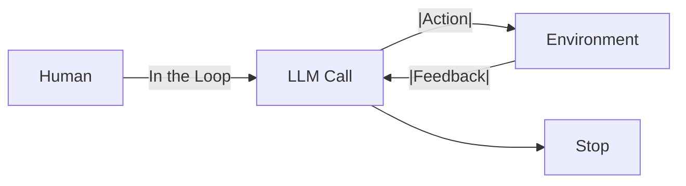
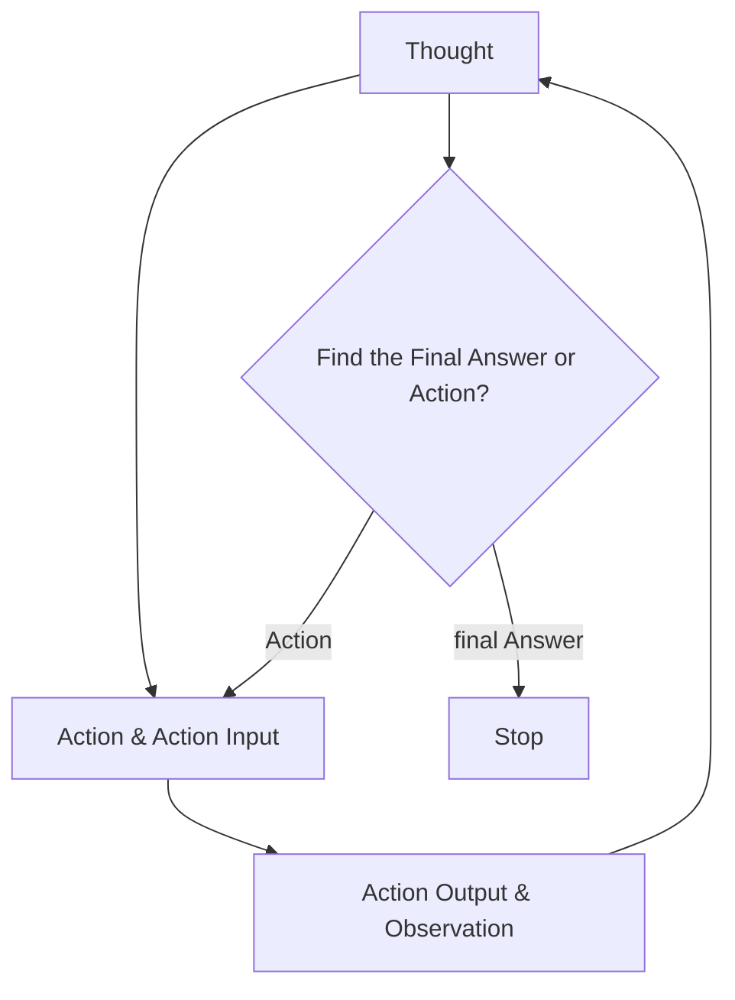
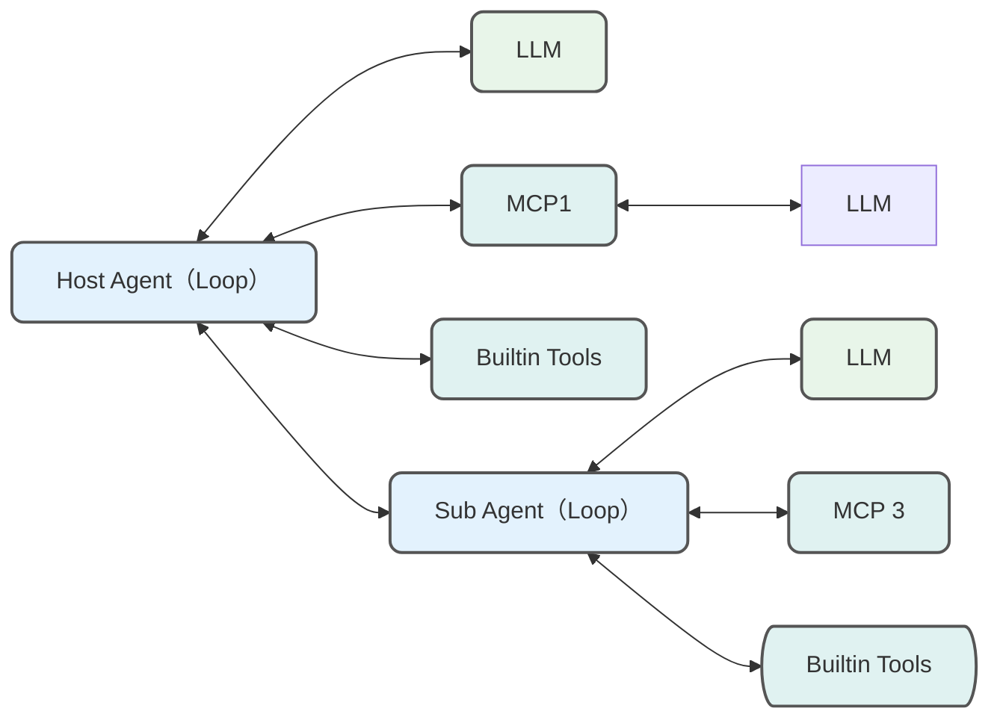
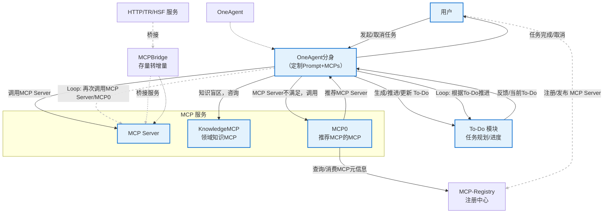

> 本文已被[《阿里云开发者》](https://mp.weixin.qq.com/s/1klXy2fr1pspqRshUjg2dQ)转载，获得1万阅读，1300+转发

类似 Manus 根据 to-do 交付业务需求其实是一种新的单领域 Agent 开发范式，让我们从最简单的 LLM 调用讲起：

## Agent 发展简史

### 单一 LLM 调用

最开始将 LLM 当做一个好用的文本任务类万能接口，利用其完成单一的摘要、分类、翻译类工作。这种模式的核心在于其**直接性**：开发者通过 API 发送一段文本（即 Prompt）给 LLM，LLM 处理后返回生成的文本。交互方式简单明了，易于集成。这种方式的好处很直接：任务清楚、输入输出一目了然，成本和延迟都可控。你要是对 prompt 下点功夫，LLM 在一个任务中随着模型能力变强能做的也越来越多。基于文本的调用交互虽然简单，但是依然是当前 AI 系统的本质。

### Workflow LLM 编排

随着应用需求的复杂化，单一的 LLM 调用往往不足以完成整个任务。于是发展到工作流（Workflows）模式：通过编排多个、预先定义好的 LLM 调用（或其他工具调用）来执行一系列步骤。这个阶段的核心思想是将一个大任务拆解成若干子任务，每个子任务可以由一个或多个 LLM 调用完成，并按照预设的逻辑顺序或条件分支执行。前一步的输出可以作为后一步的输入，形成数据流。例如：`意图识别 -> 资料收集 -> 阶段资料分析 -> 汇总资料分析 -> 报告产出`。本质上这是类似于将传统的标准作业流程（SOP, Standard Operating Procedure）借助 LLM 进行增强或自动化实现，从而达到类似RPA（Robotic Process Automation）的效果。Workflow 使 LLM 能够融入SOP 处理复杂、多阶段的任务，但因为执行路径和工具选择通常是固定的，所以workflow 得为每一个业务场景都搭建一遍，难以覆盖大量长尾场景。

### 多智能体系统

继而将 workflow 节点中相对简单的 LLM 调用扩展到Agent 调用,组成多智能体（Multi-Agent）系统。在这里开始出现 [LLM Powered Autonomous Agents](https://lilianweng.github.io/posts/2023-06-23-agent/) 中提出的 Agent 的概念：


lilianweng 提出 $Agent = Planning + Action(Tools) + Memory$

这时候各种多智能体框架也如火如荼的发展起来，比如 AutoGen、Crew AI 、 LangGraph 和 AgentUniverse等。多智能体的交互范式也基于不同的场景加以运用。基于 AgentUniverse 和 PEER 模式的 [[Case Analysis AI Agent]] 是这个阶段的作品。不过这时候公司内部只能使用 Qwen系列，不指导足够 COT 和 few-shot 的Agent 表现不太稳定，可以参见 [[痛定思痛，AI Agent 给我的教训]]。


另一方面，Antropic的 Barry Zhang 提出 Agent 更简洁的概念，即**在循环（Loop）中使用工具的模型** 。



落实到代码层面，可以抽象表示如下：

```python
env = Environment()
tools = Tools(env)
system_prompt = "Goals, constraints, and how to act"
user_prompt = get_user_prompt()

while True:
	action = llm.run(system_prompt + user_prompt + env.state )
	env.state = tools.run(action)
```

这其实是 ReAct 框架的变体。相比 ReAct, Barry Zhang 更加强调了他所认为的 Agent的抽象就是该这样。这里不妨称其为 Loop框架以便区分。

#### ReAct(Reason & Act) 框架

Memory 结合 Planning 使得 Agent 可以事前 Thought,事后 Observation。然后继续 Thought 判断下一步的Action, Action 则是利用 Tools 对现实世界产生影响。这个也被称为 ReAct(Reason & Act) 框架：



不过这个框架在模型能力不强时容易出现死循环的情况，即LLM在多轮思考、执行、观察之后发现依然需要重复执行，就会消耗大量token，也完成不了任务，也停不下来。

### One Agent + MCPs

从泄露的 [Manus源码](https://gist.github.com/jlia0/db0a9695b3ca7609c9b1a08dcbf872c9.)来看， Loop 框架一个典型的代表就是 Manus。

```shell
You are Manus, an AI agent created by the Manus team.
...
<agent_loop>
You are operating in an agent loop, iteratively completing tasks through these steps:
1. Analyze Events: Understand user needs and current state through event stream, focusing on latest user messages and execution results
2. Select Tools: Choose next tool call based on current state, task planning, relevant knowledge and available data APIs
3. Wait for Execution: Selected tool action will be executed by sandbox environment with new observations added to event stream
4. Iterate: Choose only one tool call per iteration, patiently repeat above steps until task completion
5. Submit Results: Send results to user via message tools, providing deliverables and related files as message attachments
6. Enter Standby: Enter idle state when all tasks are completed or user explicitly requests to stop, and wait for new tasks
</agent_loop>
```


通过 Loop ,当前阶段 LLM 可以做到自主决定其行动轨迹，通过工具与环境交互，并根据反馈一步步推进或更新 plan中的进度。Manus 因此在最开始的宣传片里宣称是"世界上第一个通用智能体"。拥有一百多万用户的AI Coding 插件 Cline 也是 Loop框架，打开它的 task `index.ts` 可以看到：

```javascript

initiateTaskLoop(userContent: UserContent): Promise<void> {
		let nextUserContent = userContent
		let includeFileDetails = true
		while (!this.abort) {
			...
		}
	}
```

这启发了我们如果将 Manus 和 Cline 的开发范式在企业内部落地，同时Manus的 29 个 function 换成企业内部领域内的 MCP Server，企业内部的Manus 就不仅仅可以完成诸如生成PPT、全网搜索分析之类的工作，还可以实际完成企业内部的各个业务场景的业务需求，比如风控策略的部署、保险产品的精算、营销方案的策划以及从业务需求到 Coding、部署的每一步。 而在之前，为了保证效果，更多还是在每个业务场景内使用多智能体烟囱式开发，大大限制了 Agent 在各个业务场景下的应用。

MCP 最近的爆火，除了万物互联的理想、生态逐渐成熟，期望 Manus 范式在各行各业的赋能我觉得是根本原因之一。当然这里很容易被质疑，真的可以有通用的 God Agent，它可能什么都会吗？答案是肯定的否定：）GodAgent 不会存在，就好比世界上没有全知全能的人。但是**基于一个强大的基础Agent派生领域 Agent ，结合知识类 MCP/Planner的帮助，是完全有可能将Manus 范式在企业落地的。** 我们不妨将这种构建 Agent 的范式称之为 OneAgent + MCPs 范式。

OneAgent + MCPs 范式将是每个闭环领域内的一种Agent 智能落地实践。在各个领域或组织都涌现出自己的 Agent 之后，Agent 与 Agent 更大维度上的交流合作也会随之发生(A2A, Agent2Agent 协议)。当然 OneAgent 套 OneAgent 共同完成任务的情况也会自然出现：



而这些具有一定自主能力的会形成一个 Agent Society。到那时Agent 就是我们同事的一份子。

### 这些范式是优先级逐渐更高的吗？

我认为不管是那种Agent 开发范式都是为了更好地完成业务需求，即使相对最简单的LLM 调用，我也认为它们之间没有优劣，而且一个复杂的系统往往是他们的混合。这里引用 Anthropic 的[《Build Effective Agents》](https://www.anthropic.com/engineering/building-effective-agents)以说明如何选择：

> 在使用 LLMs 构建应用时，我们建议先从最简单的方案入手，只在确实需要时才增加复杂性。这可能意味着你根本不需要构建 Agentic 系统。Agentic 系统通常会牺牲一些延迟和成本，来换取更好的任务表现，你应该仔细权衡这种取舍是否划算。
>
> 当确实需要更高复杂度时，Workflows 在处理界定清晰的任务时，能提供更好的可预测性和一致性；而当需要在规模化场景下实现灵活性和模型驱动的决策时，Agents 则是更好的选择。

现在让我们继续 OneAgent 的范式介绍。这里是一个OneAgent 借助Cline 这个原本是设计给程序员用的Coding 插件，回答精算师一个实际业务问题的案例：

## OneAgent + 精算 MCPs = 自动化分钟级交付精算定价方案

有了这个POC，我们的工作如果是对开发人员自己提效的，我们本地便可以做；如果是面向业务同学交付产品，我们需要将其搬到Web端。

## OneAgent + MCPs Web端系统

### 组成部分

我们可以推理一下OneAgent Web端系统需要什么组件。可以从第一性原理出发，先从人的视角来看。我们接到任务后，先看看有什么工具能帮助自己。然后会不自觉地想下一二三怎么做。当我们有不清楚、不知道的事情时，会去问人、查资料，问专家。现实里也不存在全知全能的人，因此完全通用的 God Agent 也难以实现。所以我们如下推理：

1. OneAgent 本身是一个 Web 端的 MCP Client
2. OneAgent 作为一个强大的基础Agent, 在每个领域或者特殊的 task 需要有自己的分身。创建分身时有自己经过调教的提示词，以及自带一些 MCP。这里可以类比面向对象中的抽象类。
3. 有很多存量的 HTTP 与 TR/HSF服务如何转成 MCP Server？MCPBridge 帮助存量服务桥接为 MCP Server
4. OneAgent 执行时如果已有的 MCP Server 不满足怎么办？所以还需要一个推荐 MCP 的 MCP，我们不妨起名 MCP0，寓意OneAgent 首先使用的第 0 个 MCP
5. MCP0 所消费以及创建 MCP 分身时的 MCP 元信息从哪里来？MCP—Registry 提供注册以及展示 MCP 的注册中心
6. OneAgent或分身在执行时还会发现用户总有问题进入到了自己的知识盲区，靠着预训练那一点知识不足以规划好的TO-DO，因此还会有一个充分掌握领域知识的 MCP，我们不妨称之为 KnowledgeMCP ,并且这个 MCP 不止一个，是随着领域不同而不同的


#### 未涉及的Planner 模块

这里其实缺少了 Manus 中一个很关键的 Planner 模块。每当我们有意识地完成一项任务时，我们会不自觉思考需要采取哪些行动序列来完成这项任务。这就是规划，而且大多数时候我们是**分层规划**的。

例如，假设你五一决定去仙本那旅游。你知道你需要去机场并搭乘飞机。这时你就有了一个子目标：去机场。这就是分层规划的核心——你为最终目标定义子目标。你的最终目标是去仙本那，而子目标是去机场。那么怎么去机场呢？你需要走到街上，打车去机场。怎么走到街上呢？你需要离开这栋楼，乘电梯下楼，然后走出去。怎么去电梯呢？你需要站起来，走到门口，开门等等。到了某个程度，你会细化到一个足够简单的目标，以至于你不需要再规划，比如从椅子上站起来。你不需要规划，因为你已经习惯了，可以直接去做，而且你已经掌握了所有必要的信息。


不过这个模块严格来说需要一个后训练的小模型来承担，如果有这个垂直小模型可以用来替代 KnowledgeMCP,这里我们先不考虑。

### 执行流程

最后我们可以这样叙述一个经典的 OneAgent 执行流程:

- 当 OneAgent 执行任务时，首先会尝试自己理解语义，规划 to-do
- 当发现自己不太清楚语义背后的知识时，会询问 KnowledgeMCP,之后更新 to-do
- 基于 to-do 结合已知的 MCP Server 不断Loop
- 根据新的 MCP Server 返回的信息，不断更新 to-do 或 推进 to-do 进度
- 当已知的 MCP Server 也不满足时，会调用 MCP0 来推荐 MCP Server
- 不断 Loop 直到完成任务或者被用户取消任务



### 技术细节

#### Loop 框架与to-do 质量

Loop 中 to-do 的质量，直接决定了 AI 的发挥上限。一份好的 to-do 应该像说明书一样清晰,以最常见的 AI Coding 为例: [ ] 目标明确： 产品目标、核心功能、用户场景说清楚。 [ ] 数据先行： 先定义好数据结构 (接口字段、数据库表等)。 [ ] 功能详述： 用大白话把每个功能点描述到位，无歧义。 [ ] 上下文给足： 引用相关代码文件路径、依赖库、现有模式、设计图链接等，给 AI 足够“线索”。 [ ] 结构清晰： 用 Markdown 的标题、列表等，方便机器解析。

to-do 的更新维护可以遵循以下规则：

```
<todo_rules>
- Create todo.md file as checklist based on task planning from the Planner module
- Task planning takes precedence over todo.md, while todo.md contains more details
- Update markers in todo.md via text replacement tool immediately after completing each item
- Rebuild todo.md when task planning changes significantly
- Must use todo.md to record and update progress for information gathering task
- When all planned steps are complete, verify todo.md completion and remove skipped items
</todo_rules>
```

#### 如何封装MCP Server

FuctionCall的Tool 是原子能力，而MCP server 是多个原子能力的服务包装（SAAS）化。我们应该**从软件即服务（Software-as-a-Service）向服务即软件（Service-as-a-Software）转变**。

#### OneAgent+ Mcps 模式下 部分 system prompt

OneAgent 自带有mcp 集合。同时维护一个 mcprules 告诉模型运行时有个兜底逻辑是咨询 MCP advisor，这样运行时模型在判断没有合适 mcp 的时候，会通过 mcp advisor 找到合适的 mcp 继续 loop。这里是静态路由和

```
Please think and speak in Chinese.
### Task Breakdown Methodology
- Begin By thinking user attempt and what mcp servers you have and which mcp server you should use
- Generate a detailed todo.md file about your task
- Your first todo should include which matched MCP server like a knowledge-based MCP or "recommend MCP" MCP you use
- Execute tasks step-by-step with MCP servers, updating todo.md after completing each step
- Review todo.md before executing subtasks, marking completed items with [x]
- Update todo.md if knowledge-based  mcp servers tell you certain steps

### MCP Server Management
- Special attention should be paid to the distinctions between domain terms.
   - First identify core domain terms (风险分析, 特征开发, 策略部署, etc.)
   - Strictly enforce domain isolation - NEVER cross-use MCP servers
   - Immediate fallback behavior when:
     * No direct MCP match found
     * Request contains multiple domain terms
- When in analysis,you can get more net data via "全网搜索" MCP
- And some mcp selection rules:
{
  "mcpRules": {
    "mcpUse":{
        "servers":["MCP推荐、发现与安装"],
        "description": "如果你不确定当前 MCP 是否合适，请求推荐MCP的MCP"
    },
    "knowledgeGet": {
      "servers": [
        "xxx知识获取 MCP"
      ],
      "description": "如果你不完全清楚用户意图，将完整用户问题请教Knowldge MCP"
    }
  },
  "defaultBehavior": {
    "priorityOrder": [
      "mcpUse",
      "knowledgeGet"
    ],
    "fallbackBehavior": "提示没有找到合适的 MCP,请求用户帮助"
  }
}

- Please make sure to use MCP servers available under 'Connected MCP Servers.
- MCP server lifecycle is automatically managed; never manually execute commands like `node` or `mcpbridge` or `mcpbridge-bailing`
- Note: `mcpbridge` or `mcpbridge-bailing` are not MCP server names


### MCP Invocation Guidelines
When calling MCP services, provide comprehensive context including:
- Background information and problem description
- Relevant data, variables, and parameters
- Expected outcomes and objectives
- Constraints and special requirements
- Information from other MCP services
- Preferred response format (if applicable)
- Additional details that may influence results

### File Management Standards
- Create separate directories for each task
- Use separate files for project summaries and todo lists
- Store all process data in files within the task directory
- Generate web reports in separate files
```

## OneAgent + MCPs 范式当前缺陷与发展方向

OneAgent + MCPs 范式旨在通过强大的基础Agent 结合 MCP 派生领域 Agent来完成复杂业务需求，然而在实践中，这一范式面临诸多挑战也还需要解决。

### 当前缺陷 (Current Defects)

1. `to-do` 质量的强依赖性 Agent 的表现高度依赖 `to-do` 清单的质量。高质量的 `to-do` 往往需要经验丰富的人工介入，比如注入到 KnowledgeMCP 中，不过这也限制了 Agent 的自主性上限和扩展性。

2. MCP 管理与交互的挑战

   - **错误传递与累积**: 单个 MCP 执行失败或返回不准确结果，如果 OneAgent 缺乏有效的验证、容错和纠错机制，错误会向后传递，影响最终结果的质量。尤其在长链条 MCP 调用中，问题会被放大。
   - **上下文传递困境**: 如何向 MCP 精准传递“恰到好处”的上下文信息是个难题。信息过少，MCP 可能无法准确理解意图；信息过多，则可能干扰 MCP 的核心任务处理，增加通信开销，甚至超出 LLM 的上下文窗口限制。
   - **MCP 发现与选择的局限性**: `MCP0` (推荐 MCP 的 MCP) 和 `MCP-Registry` 的设计是关键。但如果注册信息不完善、推荐算法不够智能，OneAgent 可能无法找到最优 MCP，或在面对新场景时束手无策。

3. **状态管理与鲁棒性**

   - **状态管理复杂性**: OneAgent 需要维护全局任务状态，并追踪各 MCP 的调用状态和中间结果。当任务链长、并发 MCP 调用或出现 Agent 嵌套（“OneAgent 套 OneAgent”）时，如果仅仅都是同步的还好，如果加上异步任务，状态追踪与推进变得复杂。
   - **死循环或无效循环风险**: 在 Loop 框架中，如果 LLM 在理解 MCP 返回结果或更新 `to-do` 时出现偏差，可能导致 Agent 陷入无效的重复尝试或死循环，消耗大量资源而无法完成任务。
   - **任务中断与恢复的缺失**: 对于耗时较长的复杂任务，如果中途发生故障（如 MCP 服务不可用、网络问题），当前范式可能缺乏优雅的任务中断、状态保存及后续的无缝恢复机制。这与 Greg Benson 提到的 “Agent Continuations for Resumable AI Workflows” 概念息息相关，是企业级应用的关键需求。

4. **知识整合与运用的深度**

   - **KnowledgeMCP 的依赖**: Agent 的领域问题解决能力很大程度上依赖 `KnowledgeMCP`。如何保证 `KnowledgeMCP` 的知识覆盖度、时效性，以及 OneAgent 如何高效准确地从中检索和运用知识，是持续的挑战。

### 发展方向

上述问题也是业界当前普遍面临的挑战，这些提供一些已经能看到的发展方向：

1. **构建标准化的 MCP/Agent 交互生态**

   - **MCP 接口标准化**: 推动 MCP 接口的标准化，不仅仅是技术层面的 API 格式，更包括能力描述、输入输出规范、错误代码、元数据等。这有助于实现 MCP 的即插即用和互操作性，呼应 A2A 的“发现能力”和“协商交互模式”。
   - **任务委托与管理**: 在 SDK 层面，实现包括同步和异步任务的，标准化的任务分发、进度跟踪、结果回收机制。比如引入标准的事件驱动模型，MCP 可以通过事件领取任务、通知 OneAgent 任务状态的变化，OneAgent 可以根据事件做出相应的决策。

2. **提升系统的鲁棒性、弹性和可观测性**

   - **精细化错误处理与容错**: 在 OneAgent层面实现更智能的错误检测、分类，并根据错误类型采取不同策略（如重试、切换 MCP、请求人工介入、优雅降级）。
   - **任务持久化与可恢复工作流**: 实现任务状态的持久化存储。当任务中断后，能够从最近的检查点恢复执行，而不是从头开始。这对长耗时、高价值的企业流程至关重要。
   - **增强可观测性**: 引入更完善的日志、追踪和监控机制，不仅记录 MCP 调用，也记录 OneAgent 的内部决策（如 LLM 的思考过程、`to-do` 的变更），便于调试和性能优化。

3. **优化 MCP 调用与管理**

   - **异步与并发 MCP 调用**: 对可以并行的 MCP 调用采用异步模式，减少整体等待时间。智能判断任务依赖，最大化并发度。
   - **智能上下文管理**: 研究更高效的上下文压缩、摘要、选择性传递技术，确保 MCP 获取必要信息的同时，降低通信和处理开销。
   - **MCP 性能与成本感知**: OneAgent 在选择 MCP 时，除了功能匹配，还应考虑其历史性能、调用成本、SLA 等因素，做出综合最优决策。

4. **系统智能提升**

   - **强化学习 (RL) 应用**: 如下文将介绍的，应用 RL 优化 MCP 选择、参数调整、任务序列规划等，使 OneAgent 能从历史经验中学习，持续提升效率和成功率。
   - **知识库的动态构建与更新**: `KnowledgeMCP` 不应仅是静态知识库，OneAgent 在执行任务过程中，可以将新学到的知识、成功的解决方案模式反馈给 `KnowledgeMCP`，实现知识的持续进化。

## Agent 系统智能提升

我认为，OpenAI 的 DeepResearch 某种程度上是OpenAI "Model as Agent" 理念的代表--o3 POC（Proof of Concept） 的产物。在 DeepResearch 发布 4 个月后，我们看到 OpenAI 对 o3 的tool use 进行了端到端的强化学习，使其能够在推理过程中链式地调用外部工具（如搜索引擎、计算器、代码解释器等），甚至在思维链中进行图像推理。

回到我们业务现实中，想要系统性的提升业务应用的 Agent 智能，解决 MCP 的选择、多流程调用问题，离不开强化学习 RL。因为RL 可以让MCP的调用变为模型推理链的一部分。这里你可能会疑惑，这个和 Loop 框架中调用MCP 有什么区别？区别在，强化学习让模型自己学会如何使用MCP，而Loop框架是指示模型按to-do或者规划逐步用MCP。

### 机器学习范式

强化学习是三种主要的机器学习范式之一，区别于监督学习和自监督学习。监督学习（supervisor learning）是最经典的一种。训练监督学习系统的方法是，比方说让一个系统识别图像。你给它看一张图片，比方说一张桌子，然后告诉它这是一张桌子，这就是监督学习，因为你告诉它正确答案是什么。这就是计算机的输出，如果你在表格上写了别的东西，那么它就会调整内部结构中的参数，从而使它产生的输出更接近你想要的输出。如果你继续用大量的桌子、椅子、汽车、猫和狗的例子来做这件事，最终系统会找到一种方法来识别你训练它的每张图片，同时也能识别它从未见过的与你训练它的图片相似的图片。自监督学习(self-surpervised learning) 就是目前 LLM 的基本原理。它的核心不是训练系统完成任何特定任务，而是训练它学习输入(含输出)的内部依赖关系。对 LLM 来说，这种方法简单说就是截取一段文本，而文本中的最后一个单词不可见，于是可以训练系统预测文本中的最后一个单词。

而在强化学习(reinforcement learning)中，系统并不知道正确答案是什么，我们只会告诉它，它得出的答案是好是坏。某种程度上，这和人类学习有点像。比如你试着骑自行车，但不知道怎么骑，过一会儿摔倒了，于是你知道自己做得不好，然后你不断尝试如何平衡，直到学会骑自行车。强化学习是很有效的激发模型推理能力的范式，因此 AlphaGo 才能下出惊人的第 37 步。不过它的确定是训练效率很低，需要大量的尝试反馈。

### 如何做强化微调 ？

参考 [ReSearch](https://github.com/Agent-RL/ReSearch) 和 [介绍](https://mp.weixin.qq.com/s/fztINLF_lTTcS9fpmdfJmw)

## 我与Agent 做同事

虽然还没有实现通用的业务需求打工Agent, 但是我们已经在用Cline配合公司内部 V3模型深度使用 AI Coding ，很多胶水代码、CRUD 代码尽量交给 AI 来做，我负责维护输出"vibe":) 希望后面每个业务场景都可以借助OneAgent + MCPs 实现AI Coding。

```

## 参考

- [LLM Powered Autonomous Agents](https://lilianweng.github.io/posts/2023-06-23-agent/) by Lilian Weng
- [Manus 源码](https://gist.github.com/jlia0/db0a9695b3ca7609c9b1a08dcbf872c9) - GitHub Gist
- [Build Effective Agents](https://www.anthropic.com/engineering/building-effective-agents) by Anthropic
- [ReSearch 项目](https://github.com/Agent-RL/ReSearch) - GitHub 仓库
- [ReSearch 介绍](https://mp.weixin.qq.com/s/fztINLF_lTTcS9fpmdfJmw) - 微信公众号文章
- 内部文档：[[Case Analysis AI Agent]]
- 内部文档：[[痛定思痛，AI Agent 给我的教训]]
- [Greg Benson 教授关于分层多智能体架构的分析](https://github.com/SnapLogic/agent-continuations?tab=readme-ov-file)
- [A2A (Agent2Agent) 协议](https://google-a2a.github.io/A2A/specification/#723-taskartifactupdateevent-object)
```
