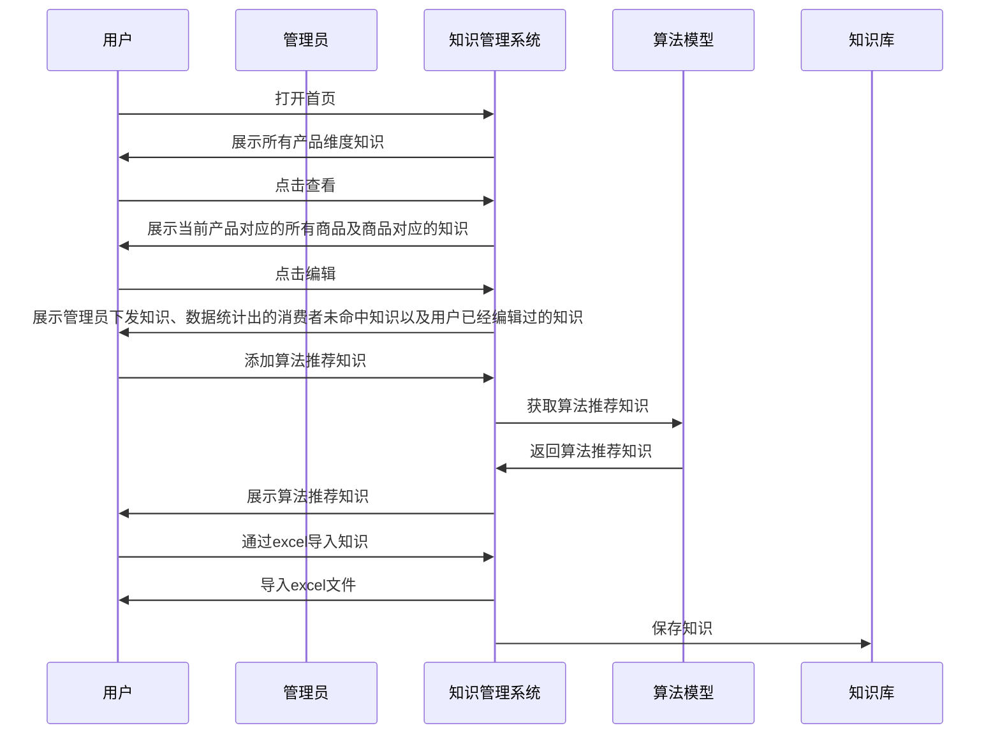

客服知识管理系统时序图描述
1. 二个角色用户、管理员
2. 用户界面，用户打开首页展示所有产品维度知识
3. 用户点击查看展示当前产品对应的所有商品及商品对应的知识：视频知识、视频封面知识、使用说明知识、FAQ知识、算法推荐知识
4. 用户点击编辑，编辑页面展示管理员下发知识、数据统计出的消费者未命中知识以及用户已经编辑过的知识
5. 用户可以添加算法推荐知识以及通过excel导入知识

```mermaid
sequenceDiagram
  participant 用户
  participant 管理员
  participant 知识管理系统

  用户 ->> 知识管理系统: 打开首页
  知识管理系统 ->> 用户: 展示所有产品维度知识
  用户 ->> 知识管理系统: 点击查看
  知识管理系统 ->> 用户: 展示当前产品对应的所有商品及商品对应的知识
  用户 ->> 知识管理系统: 点击编辑
  知识管理系统 ->> 用户: 展示管理员下发知识、数据统计出的消费者未命中知识以及用户已经编辑过的知识
  用户 ->> 知识管理系统: 添加算法推荐知识
  知识管理系统 ->> 算法模型: 获取算法推荐知识
  算法模型 ->> 知识管理系统: 返回算法推荐知识
  知识管理系统 ->> 用户: 展示算法推荐知识
  用户 ->> 知识管理系统: 通过excel导入知识
  知识管理系统 ->> 用户: 导入excel文件
  知识管理系统 ->> 知识库: 保存知识

```