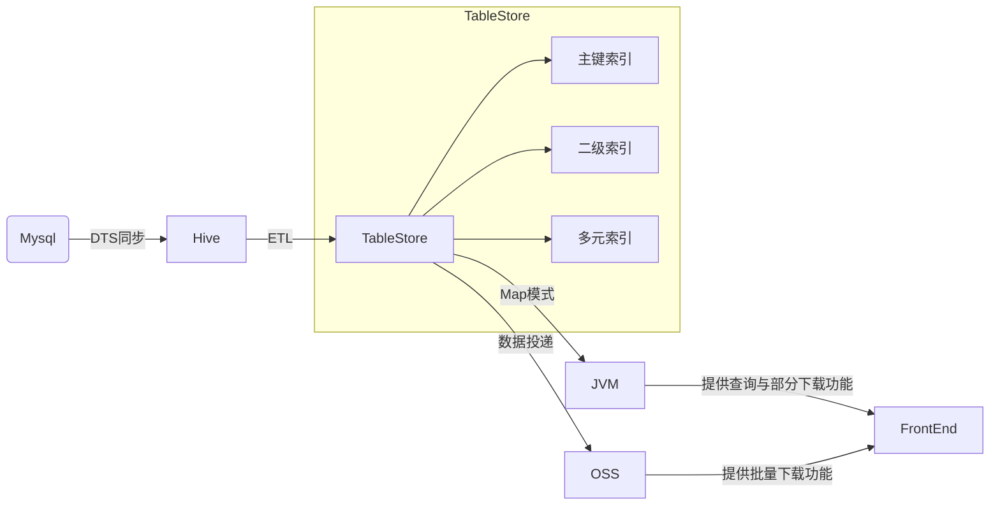

## 1. 项目背景
ToB的财务关系中，有一条很经典的链路:[[Finance Technology Area Relation.canvas]]

钱账票在业务链路上是天然的顺序关系，所以是否能将这整个过程自动化，即智能感知市场报价，根据交易计费、结算后，自动化地生成账单和发票是一个业务上、效率上和数据质量上都值得思考的问题。其中账单负责各个计费业务，比如物流、营销、运费险的已经发生过的交易的呈现，具有以下技术挑战：
1. 账单平台数据量过百亿，接入计费业务很多
2. 账单存量和增量数据质量保证难度大，因为历史业务和代码开发人员的变动，按年的跨度使离线数据处理繁琐
3. 之前各业务账单分开建设，每接入一个账单都要提供独立的查询、下载服务；也因为数据结构没有统一，每接入一个账单都要新建数据表、DAO层
4. 因为前端结构不能随着数据响应，业务频繁更改前端展示顺序、结构等消耗开发精力

## 整体数据架构
[[Classic Process Data Infrastructure.canvas|Classic Process Data Infrastructure]]

## 数据存储与处理的统一
### 数据库选型
- PostgreSQL
- BigTable
- OSS
### 2.1. 数据流转

总体来看我们整个业务的数据流转流程图如下：



ETL的全称为`Extraction-Transformation-Loading`,中文名为数据抽取、清洗和加载。这里用ETL用来概括我们处理数据的过程。对于批处理，上游会每个周期(`T`)开始直接从在线表中同步 `T-1` 的 数据，然后我们消费`T-1`的数据；对于流处理，这个过程对于进入处理流程的每条记录实时消费 。得到这个原始在线表数据的过程便是ETL中的`Extraction`,消费这个数据的过程便是`Transformation`,最后将处理好的数据加载到数据仓库提供对外的服务，便是`Loading`。

### 2.2. 数据质量保证
当我们把数据导入数据仓库时，ETL中的每个步骤中都可能会遇到数据质量错误，比如

- 与源系统的连接错误，抽取数据可能会失败
- 由于数据类型冲突，数据转换可能会失败
- 由于数据生产者新增或变更了存储逻辑，导致处理后的数据异常

对于ETL过程中不是单点的错误，我们监控一些数据任务的指标。
#### 2.2.1. 数据任务监控
1. 校验每天新增的记录数波动范围:比如突然下降了100%（即一条数据都没有），这种肯定是不正常的
2. NULL和0 值 校验:保证每天增量数据中的NULL或0值不能超过新增数据的99%
3. 主键校验：通常来说基于主键的数据不应该重复

而对于长期维护数据消费逻辑的过程中，每一条记录的数据质量保证，最好还得基于约定和测试。
#### 2.2.2. 命名和数据类型约定
标准化命名和类型约定将节省大量繁琐的工作。命名上比如数据表中使用`a_b_c`,应用中统一是`aBC`；类型上比如数据库中存储的统一是`String`格式，日期格式统一采用`yyyy-MM-dd hh:mm:ss`。这将使我们也能够标准化数据类型。

#### 2.2.3. 参数化测试
如前所述，账单涉及数据时间跨度长，计费规则也常变，如何既覆盖各种异常case，同时长期保证transformation 的数据质量值得思考。
物流服务费账单因为实际计费口径和希望给用户展示的口径不一致，后台需要处理来自三个不同接口的4份数据，然后再按照订单包裹维度解析。然而4份数据：物流费、包材费、防护费和仓内操作费都没有办法和订单包裹关联上，只能按照一定的顺序和商品的关系关联，又因为历史上包材计费的系统迁移过，历史数据格式大变过且是灰度逐渐切流，更增加了数据处理的难度。基于此，可以采用参数化测试。
这就是最简单的参数化测试：将数据和逻辑分离。同样地，我开发了[`@JsonFileSource`](https://github.com/istarwyh/TestMuseum/tree/main/junit-extensions) 传入JSON格式的对象，并将每个时期变动的计费逻辑都覆盖到，于是我们对数据处理正确的信心大大增加了。
```java
@ParameterizedTest
@CsvSource(value = {
		"1,2",
		"3,4"
})
void should_show_how_to_parse_multi_args_with_csv(Integer in,Integer out){
	assertEquals(out,in + 1);
}
```
### 2.3. 数据索引
考虑如下的数据模型：
```json
{
    "供应商1":{
        "物流服务费":{
            "订单1#包裹1":{
                "包材费":"10.00",
                "操作费":"10.00",
                "物流费":"10.00"
            },
            "订单1#包裹2":{
                "包材费":"10.00",
                "操作费":"10.00",
                "物流费":"10.00"
            }
        },
        "仓发返利费":{
            "idA":{
                "单量补贴":"100.00",
                "爆单补贴":"100.00"
            }
        }
    },
    "供应商2":{
        "物流服务费":{
            "订单2#包裹1":{
                "包材费":"10.00",
                "操作费":"10.00",
                "物流费":"10.00"
            }
        },
        "仓发返利费":{
            "idB":{
                "单量补贴":"100.00",
                "爆单补贴":"100.00"
            }
        }
    }
}
```
将以上的业务模型表示为二维表格的形式则为：

| owner_id | bill_type |  bill_id   |     attributes...      |
| -------- | --------- | ---------- | ---------------------- |
| 供应商1   | 物流服务费  | 订单1#包裹1 | 10.00｜  10.00 ｜10.00 |
| 供应商1   | 物流服务费  | 订单1#包裹2 | 10.00｜  10.00 ｜10.00 |
| 供应商1   | 仓发返利费  | idA        | 100.00｜100.00         |
| 供应商2   | 物流服务费  | 订单2#包裹1 | 10.00｜  10.00 ｜10.00 |
| 供应商2   | 仓发返利费  | idB        | 100.00｜100.00         |


这里`owner_id`、 `bill_type`、`bill_id`因为通过它们恰好可以唯一确定一行数据，所以这里将它们共同作为一行数据的主键。其中第一个主键列即`owner_id`也是分区键。TableStore 会根据数据表中每一行分区键的值所属的范围自动将一行数据分配到对应的分区和机器上以负载均衡。具有相同分区键值的行属于同一个数据分区，一个分区可能包含多个分区键值。一般来说，为了防止分区过大无法切分，单个分区键值所有行的大小可以达到10 GB。
#### 2.3.1. 二级索引与多元索引
在大规模账单系统中，存在以下常见需求：

- 查询某商家过去一段结算的物流服务费
- 查询某商家过去一段顾客已支付的商品所花的成本
- 查询在某商家过去一段时间内的成本支出列表
……

因此，开发者**对于数据库在非主键查询、多列的自由组合查询等复杂查询需求上会有比较高的要求**。传统的订单系统会使用 Elasticsearch 或者 阿里的Haven ASK 3.0 来实现这一需求，但伴随而来的是更高的系统复杂度和更加昂贵的系统维护成本。Tablestore 的多元索引，基于倒排索引和列式存储，则既可以支持此类数据检索工作，且具有操作简单、维护成本低等特点，可以将开发者从索引建立、数据同步、集群维护等工作中解放出来。
多元索引实际上会对其中的每一列都建立倒排索引，倒排索引记录了某个值对应的所有主键的集合，即`value` -> `list`，这里的`list`也被称作`Posting List`,倒排列表。当需要查询属性列为某个value的所有记录时，直接通过倒排索引获取倒排列表，再进行筛选某个Value值的记录筛选;当需要进行多个字段的组合查询时，**因为筛选多个字段的数据本质为计算多个倒排列表的交并集**，所以直接先通过倒排索引获取符合条件的倒排列表，再对其求交并集即可。
另一方面，如果查询模式比较固定、对性能要求很高或者需要范围查询，TableStore也允许使用类似MySQL索引的二级索引，即先建索引表，先对要查询的的预定义列排序再按照主键排序，完成基于主键列和预定义列的数据查询。[^tablestore]

#### 2.3.2. 冷热数据处理
对低频数据做冷处理，从贵的存储中淘汰换到便宜的存储中有利于降低存储成本，也避免在线服务的慢SQL出现。
因为多元索引利用的倒排索引本身设计为不可变的数据结构，所以之前设置了多元索引的表不支持数据生命周期（Time To Live，简称`TTL`）的管理。不过现在多元索引已经支持天级别的TTL了。所以TableStore中的冷热数据可以

- 设置多元索引以某个时间字段的TTL，默认情况下为创建该行数据时的时间戳
- 周期性从 Tablestore 投递数据进入 OSS，归档全量历史数据。OSS数据分区可以使用 列式存储，更适合对接批处理工具。

## 详情数据查询与下载的统一


### 3.1. 添加新字段
Google BigTable,查出来的数据是Map结构。因为是Map的结构，如果指定查询全部字段则不需要做任何改变透传Map结构的数据返回体即可。

### 3.2. 接入新业务
IaC是怎么面对新的基础设施加入的？
#### 3.2.1. 构建查询参数
对于支持JDBC协议的数据库，我们可以直接利用ORM工具如MyBatis Plus来生成SQL，我们甚至可以自己定义DSL来生成SQL。而即使数据库不支持JDBC而是自己定义的语法，依然可以自己设计DSL，比如一个简单的JSON配置，然后通过一个工具类将该JSON成为实际查询参数。设计成JSON而不是代码编写的好处在于，JSON可以通过外部服务获取，进而动态更改。DSL如下：
```json
{
"type":"X_TYPE",
"fields":[{"field":"","type":"","comment":""}],
"search":[{"queryType":"=","targetFiled":""}],
"order":[{"orderType":"desc","targetFiled":""}]
}
```
这个简单的DSL包括了查询的对象、Select 参数、Where 参数与排序参数。
#### 3.2.2. 组装查询结果
## 聚合数据渲染的统一
前端的图形抽象。抽象出模型后，配合对应的模块加载器，实现输入一段结构体的JSON，输出前端所需要的所有结构和数据的功能。这样就可以将JSON暴露给不会代码的同事，实现无代码开发。

## 数据导出的统一
- 直接查询导出:可能导致OOM
- 在线迭代器导出:流式读取数据后上传OSS再返回下载链接，速度大约10万条数据/3min
- 在线预处理待下载数据#
- 离线预处理待下载数据
- [总结](https://mp.weixin.qq.com/s/4QbhTs_OEpWKQTXP48j6kQ)
- GEI Alibaba
## 钱账票开发规范
1. 资金流、账单和发票原则上应该保持一致
2. 对第一点举例，如果资金流是按照订单+最细粒度计费项维度去计费结算，账单应该展示到订单+最细粒度计费项，发票应该按照已有账单开票，而不应该从其他维度再行计算

[^tablestore]:[海量结构化数据存储技术揭秘：Tablestore表设计最佳实践](https://developer.aliyun.com/article/711715)