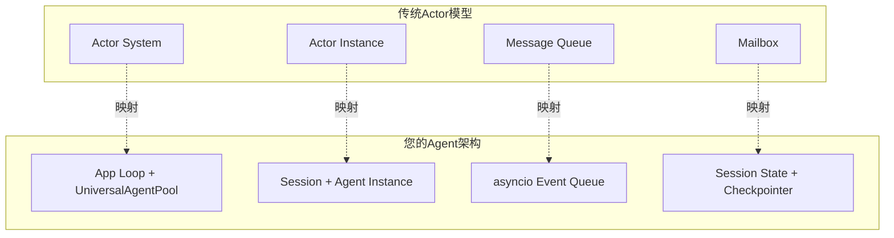
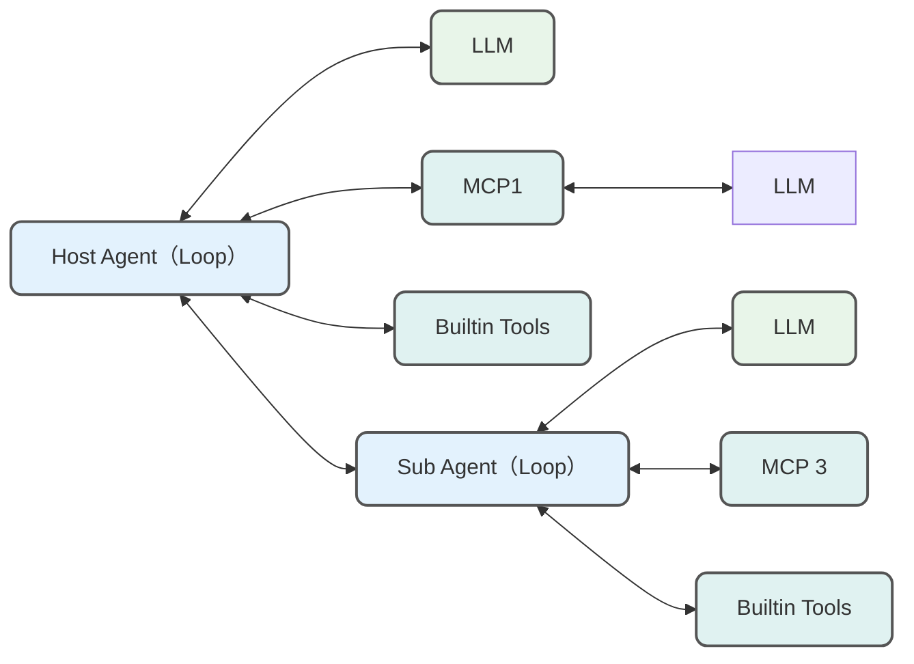
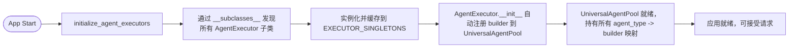
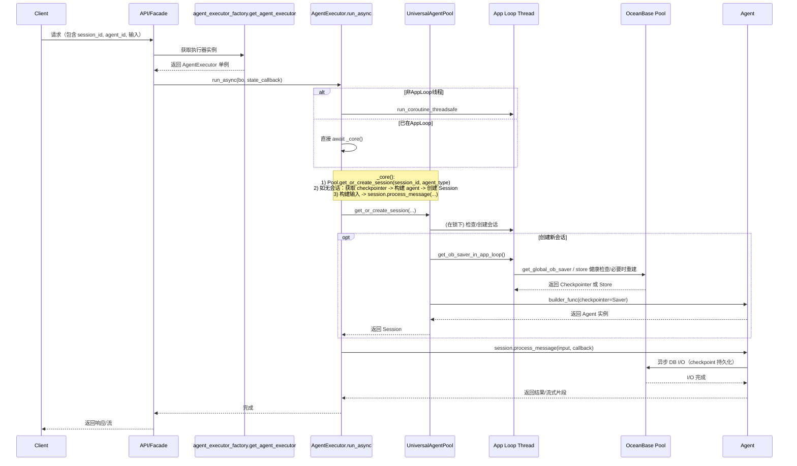

## 目录

0. 前言与适用范围
1. 项目简介
2. Agent Runtime组成
3. 运行期调用链：请求 → 执行器 → 会话 → Agent → Checkpointer& Store
4. 容量规划与性能调优
5. 总结

---

## 0. 前言与适用范围

之前我在 [[领域 Agent 如何像 Manus 交付业务需求|OneAgent + MCPs 范式]] 一文中梳理了四个Agent 构建范式——单一LLM调用、Workflow编排、Multi-Agent系统，到受Manus 和 Claude Code 启发的 OneAgent + MCPs模式。那么当我们基于强大的基础Agent结合 MCP 服务器来快速派生领域单一Agent 之后，比如说我们通过脚本可以本地运行这个Agent了 ，我们如何将其部署上线，充分满足多用户的并发使用需求呢？ 说起来本人之前是Javaer, 因为AI Agent 顺应时代浪潮转向了Python 技术栈，本文也将结合自身实际的应用部署架构介绍 Python 技术栈下一个长期运行的服务化 Agent 系统（多请求并发、多轮对话、用户画像）。因为Python 开发年限尚浅，若有错漏，欢迎斧正：）

## 1. 项目简介

这里我介绍的项目原型是我在蚂蚁做的一个智能体应用。如果读者了解过 Actor 模型，大概会发现每个 Agent 天然适合作为一个Actor 来看待： 

我在处理Agent 时也是希望往Actor 模型上靠拢，后续会提到的概念映射如下：



下面内容可能比较干，可以对照下项目整体架构与技术栈： 

## 2. Agent Runtime组成

Agent运行时抽象为“构造器 + 执行器 + 会话池”的组合：

- **构造器（Builder）**：Agent Builder集中在 service 层，每个service 文件中负责实际构造一个Agent。
- **执行器（Executor）**：`AgentExecutor` 的子类，封装统一的 run 接口与会话访问。
- **会话池（Session Pool）**：`UniversalAgentPool` 负责 session 维度的 Agent 实例复用与过期清理。

通过这样的职责拆分，属于领域知识和每个业务自己会参与进来的“如何构造Agent ”与基础设施关注的如何提供接口、如何调度和运行Agent 就做到了一个解耦。

### 2.1 Agent Builder

Agent 实例化方法集中在 service 层，每个service 文件中负责实际构造一个Agent。比如 我在 deep_search_agent_service 构造 `deep_search_agent`，你可以在xx业务下构造一个xxAgent。这里**不应该限制Agent 的构造方式和构造**，无论是单一的LLM 调用，还是Workflow编排、Multi-Agent 编排，或者OneAgent + MCPs模式 都可以，不过我应用里目前都是基于 OneAgent 范式，即通过强大的基础的Agent派生的。



Agent 构建方式不限制，不过自然地所有的Agent 都需要遵循统一的接口。接口参数的设计中，入参需要考虑不同业务的诉求，除了通用的 prompt、内置工具、MCP 配置等，还需要考虑是否需要审计、是否需要压缩 ToolMessage 等诉求；出参则需要更为注意，因为Agent 不仅仅会用于流式的对话，还可能会用于批处理或者就是简单的同步调用。参考LangGraph 的设计, 一个Agent 应该支持以下4个接口：

| 接口名 | 设计理念 | 设计原理 | 应用场景 |
| --- | --- | --- | --- |
| **stream()** | 同步流式处理，实现实时数据流输出 | • 返回Iterator迭代器<br>• 支持多种StreamMode组合<br>• 内置调试和中断机制<br>• 支持子图流式处理<br>• 可控制输出键和检查点 | • 需要实时反馈的同步应用<br>• 调试开发阶段监控执行过程<br>• 简单的流式数据处理场景 |
| **astream()** | 异步流式处理，支持高并发实时输出 | • 返回AsyncIterator异步迭代器<br>• 与同步版本保持接口一致性<br>• 内置异步队列和事件循环管理<br>• 支持并发执行多个流处理任务 | • **实时聊天/交互系统**<br>• 高并发场景下的流式处理<br>• **长时间运行任务**（配合checkpoints）<br>• **调试开发**（配合debug=True）<br>• **MCP工具集成的流式场景** |
| **invoke()** | 同步一次性调用，获取完整执行结果 | **• 内部基于stream()实现**<br>• 收集所有流式输出后返回最终结果<br>• 支持values和updates模式选择<br>• 简化的参数接口设计 | • 只需要最终结果的同步简单调用 |
| **ainvoke()** | 异步一次性调用，高性能获取完整结果 | **• 内部基于astream()实现**<br>• 异步收集所有流式输出<br>• 支持高并发环境下的批量调用 | • **批处理任务**（推荐场景）<br>• **MCP工具集成**（关键在连接管理）<br>• 高并发环境下的一次性调用<br>• 只需最终结果的异步应用场景 |

### 2.2 Agent Executor

执行器为 `AgentExecutor` 接口的子类，

- 基于底层统一的Agent 接口封装统一的面向API的接口，供应用的 Facade或者Controller层接口调用。
- 统一内聚问题改写相关的逻辑，也可以委托给对应 service中的 `build_input` 接口
- 重点是管理线程和DB 连接池的运行资源

这里我们展开说一下第三点，如果是在Java 应用中就不需要了。Java 线程模型基于操作系统原生线程实现 1:1 的映射，即每个 Java 线程对应一个操作系统线程。Python （CPython 实现) 虽然也是如此，但是因为**GIL（Global Interpreter Lock）**，**同一时刻只有一个线程能执行 Python 字节码**。下面是Python 和Java 一个简单的线程模型对比关系： 

说这些有什么用呢？ 哎，包有用的！当我在Python 中因为高并发需要引入一些不能被轻易销毁的资源，比如数据库连接池的时候，因为GIL 的存在，我的项目中的线程资源其实就**被绑定在了创建数据库连接池的那个线程上！** 即所有 OceanBase/aiomysql 的创建、使用、关闭，统一都只能在一个Event Loop、一个线程内上执行。如果不这样做，报错 `got Future … attached to a different loop` 大概会崩到脸上。

数据库作为Agent 底层设施，凡是涉及到Agent 的调用不可能不使用数据库，所以Executor 中需要再对原有Agent接口封装线程和协程的调度逻辑，禁止原有 `asyncio.run` 和 `asyncio.Lock`的常见写法：

- 异步优先：`AgentExecutor.run_async()` 始终保证在 App Loop 上执行核心逻辑，避免跨 Loop 误用 DB 资源。
- 同步包装：`AgentExecutor.run_sync()` 通过`run_in_app_loop(self.run_async(...))` 获取 `Future` ，用于需要同步返回的调用者。

那么如果不用连接池可以吗？ 当然是可以的，这样没有池管理，不用考虑事件循环归属、并发、泄漏、优雅关闭等。不过这样缺点也很明显：

- 高并发下频繁握手成本高：每次请求/步骤新建TCP和认证，延迟与CPU开销大。
- 无连接复用与背压：容易出现瞬时连接风暴，触发 OceanBase/MySQL 最大连接数限制。
- 无资源共享：每个执行上下文独占连接，无法平滑限制并发与保护数据库。

### 2.3 Agent 实例化池

会话池 `UniversalAgentPool` 负责 session 维度的 Agent 实例复用与过期清理。

#### 应用启动时初始化池

- `initialize_agent_executors()` 会遍历 `AgentExecutor` 子类，实例化并缓存到 `EXECUTOR_SINGLETONS`。
- 在 `AgentExecutor.__init__()` 中，执行器会调用 `get_global_agent_pool()` 并把自身的 `build_agent` 注册为对应 `agent_type` 的构造器。

有Java 的同学看到这里肯定会说，这不就是做了个最简单的 Spring 容器吗，但是为什么你这里不注册 Agent的实例，而只是注册 `build_agent`这样的回调函数呢？是的，这里确实只是做了一个简单的 Agent 容器，但是并不单例化Agent ,原因：

1. 构造器（`build_agent`）作为回调注入池中，池在运行期按需调用，解耦"注册时机"与"构造时机"。
2. **Agent 不能单例化！** 对于同一个会话中**使用过的Agent** 来说，Agent 和Agent 所相关的资源应该被复用，比如一个会话可能同时多次切换与调用搜索生成Agent、报告Agent、验证Agent，这些Agent 应该保证自身及资源的复用； 但是对于不同会话中的 Agent 来说,每一个Agent 因为可能本次希望调用的 LLM 不同，因为用户圈选的MCP 工具不同，特比地，因为Agent 基于之前的Agent 沉淀的用户身份、偏好信息不同，所以它们是不同的，必须在运行时每次会话重新构造。



#### Session 生命周期与复用策略

- `UniversalAgentPool.get_or_create_session(...)`：
  - 命中：校验过期；可在 agent_type 改变时热切换 Agent（保持 checkpointer 和 Store 绑定 session）。
  - 未命中/过期：调用 `_create_new_session()`，在 App Loop 上获取健康的 Saver，并调用注册的 `builder_func` 构建 Agent。
- 周期性清理：
  - `_periodic_cleanup()` 定期扫描过期会话，释放会话级资源（不直接关闭全局连接池）。

## 3. 运行期调用链：请求 → 执行器 → 会话 → Agent → Checkpointer & Store

当前对于每一个 gunicorn 启动的Python 应用worker ,即每个应用进程：

- 只有一个长寿命 App Loop 线程
- 一个 OceanBase `aiomysql` 连接池 + 若干 DB Saver/Store 实例（在 App Loop 上创建并绑定）。
- 用户请求时，多个 WSGI 请求线程（如 Gunicorn gthread）并发接入，协程执行统一投递到 App Loop。

目前应用中一个请求的主链路时序如下（略去了缓存和消息中间件的逻辑）：



当前项目中基于LangGraph 区分Saver 和 Store 的运用：

- **DB Saver** 用作 Agent Checkpointer 的实现：面向Agent “执行轨迹/中间状态”的快照与恢复，用于可回溯、可重放、断点续跑。多轮对话依赖 Saver 实现。
- DB Store 用作Agent 个性化的实现：比如当Agent 初始化时加载用户画像，会话异步总结为Memory等。
- 读多写少和一致性要求不高的场景可配合“缓存层”降低 DB 压力。这里没有标出。

注意⚠️：

- 创建/获取会话与 DB Saver/Store 均在 App Loop 内进行，确保连接池归属正确。
- 同一 `session` 的请求复用会话、Agent以及DB 连接，避免重复构建与状态丢失。

---

## 4. 容量规划与性能调优

### 水平扩展

读者应该注意到了，当前部署架构的缺陷：当机器上只部署了一个worker的时候，其实就只会有一个 CPU 核被利用。如果你是 CPU 密集型任务，那么如果要充分利用机器资源，需要在一个机器上再水平扩展多个woker,这时候每进程自有一套 Loop 与连接池。 水平扩展后，对于下游资源需要进一步评估，以连接池为例，总连接消耗 ≈ `进程数 × pool.maxsize`，需与 OceanBase 限额对齐。

### 连接池

- DSN 查询参数（`pool_size/maxsize/minsize/pool_recycle/saver_count`）按并发与 OceanBase 限额调优。
- 结合压测：观察连接等待、慢查询、平均/尾延迟。
- 健康性：`_health_check_saver()` 与 `_rebuild_ob_pool()` 在获取失败时重建，日志用于观测异常波动。

### App Loop 负载

当前应用单进程内多个请求线程并发进入 Flask/WSGI。

- 一个 App Loop 线程调度所有协程（协作式并发，I/O 处 `await` 让出）。
- `aiomysql` 连接池限制并发连接数（`maxsize`），超出部分在“获取连接”处 `await`，形成自然背压（Natural Backpressure），防止高并发数据库被压垮
- App Loop 仅承载 async I/O；CPU 密集或同步阻塞 I/O（如大批量解析、第三方同步 SDK）应该隔离到线程/进程池，不然App Loop可能因为阻塞所有协程导致整个**应用假死**。
- CPU 极重的场景建议使用 `ProcessPoolExecutor`，从协程调用 `loop.run_in_executor(process_pool, fn, ...)` 以获得真正多核并行。下面是一个例子：

```python
# 从协程中把阻塞函数丢到线程池
import asyncio

def blocking_fn(arg: str) -> str:
  # 同步阻塞调用，例如 CPU 密集或第三方 SDK
  return arg.upper()

async def step():
  result = await asyncio.to_thread(blocking_fn, "payload")
  return result
```

## 5. 总结

当前项目的设计实际上是**将Python的劣势（GIL和Asyncio的限制）转化为了DB资源隔离的一种特性**，并将**业务与基础设施解耦**,使得不同团队可以独立开发Agent逻辑和基础设施。 不过当前项目并没有使用原生异步的框架比如 Uvicorn 来替换Gunicorn +gthread ，理论上如果项目切换为 Gunicorn + Uvicorn 性能会更好:

- **Gunicorn (在外层):** 充当**进程管理器**。它负责启动和管理多个工作进程（例如 `-w 4` 启动4个进程），利用服务器的**所有CPU核心** (实现并行)。它还负责监控这些进程的健康状况，并在进程崩溃时自动重启它们。
- **Uvicorn (在内层):** 充当**工作单元** (`-k uvicorn.workers.UvicornWorker`)。在Gunicorn启动的*每一个*进程内部，Uvicorn会接管并运行其高性能的 `asyncio` 事件循环（实现并发）。

此外必须强调的是，在Python 中任何没有被正确`await`的I/O或同步CPU计算（如复杂的数据处理、JSON序列化一个大对象、循环处理） 都会阻塞唯一的App Loop。最后这个Agent Runtime 还只是很基础的版本。理论上应该做到，对于任意会话，Agent 可以随时被中断、回滚、**热切换**，Agent 可以工作时调度多个哪怕跨应用的Agent,以及用户可以在Agent 工作事调度多个Agent... 目前我只能做到Agent随时被中断、回滚、**热切换**, Agent 工作时跨应用的Agent做了一半，其他还没做。这里涉及的是意图路由和基于消息队列的A2A交互的部分，后面有时间再分享。希望后面可以做到多 Agent 和人像在一个群里面一样干活吧，我把任务给 Agent甲，甲干活的时候我又给了Agent乙布置了个任务，然后我再和甲说我走了，你待会儿收一下乙的作业一起给丙... hh 这样比较有意思。
