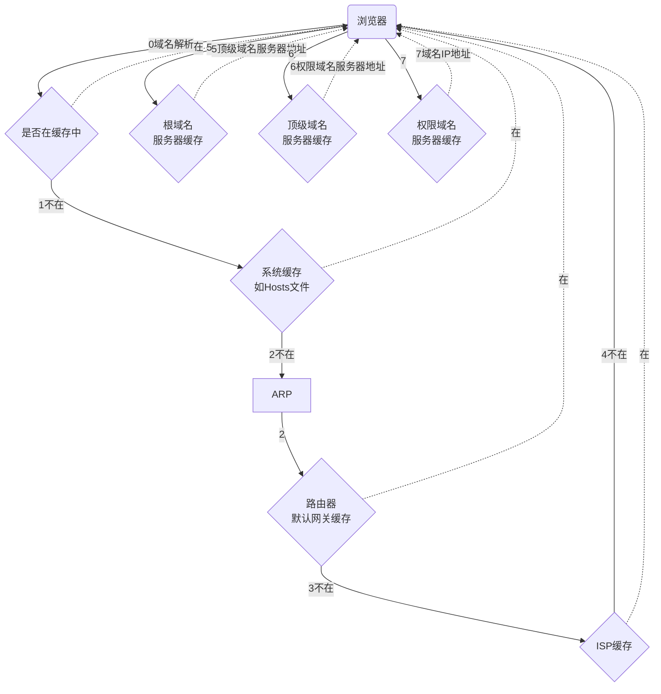

>Web具有天然的低成本流动性，更易于传播，一串URL就可以将服务和用户连接，而性能渐强的浏览器已遍布几乎所有终端。

这个仓库试图回答一个古老的面试问题：当你在浏览器中输入 google.com 并且按下回车之后发生了什么？

不过我们不再局限于平常的回答，而是想办法回答地尽可能具体，不遗漏任何细节。

这将是一个协作的过程，所以深入挖掘吧，并且帮助我们一起完善它。仍然有大量的细节等待着你来添加，欢迎向我们发送 Pull Requset！

这些内容使用 `Creative Commons Zero`_ 协议发布。

[toc]

**总体流程如下图:[^0]


## 1. 按下"g"键

接下来的内容介绍了物理键盘和系统中断的工作原理，但是有一部分内容却没有涉及。当你按下“g”键，浏览器接收到这个消息之后，会触发自动完成机制。浏览器根据自己的算法，以及你是否处于隐私浏览模式，会在浏览器的地址框下方给出输入建议。大部分算法会优先考虑根据你的搜索历史和书签等内容给出建议。你打算输入 "google.com"，因此给出的建议并不匹配。但是输入过程中仍然有大量的代码在后台运行，你的每一次按键都会使得给出的建议更加准确。甚至有可能在你输入之前，浏览器就将 "google.com" 建议给你。
## 2. 回车键按下
为了从零开始，我们选择键盘上的回车键被按到最低处作为起点。在这个时刻，一个专用于回车键的电流回路被直接地或者通过电容器间接地闭合了，使得少量的电流进入了键盘的逻辑电路系统。这个系统会扫描每个键的状态，对于按键开关的电位弹跳变化进行噪音消除(debounce)，并将其转化为键盘码值。在这里，回车的码值是13。键盘控制器在得到码值之后，将其编码，用于之后的传输。现在这个传输过程几乎都是通过通用串行总线(USB)或者蓝牙(Bluetooth)来进行的，以前是通过PS/2或者ADB连接进行。

*USB键盘：*

- 键盘的USB元件通过计算机上的USB接口与USB控制器相连接，USB接口中的第一号针为它提供了5V的电压

- 键码值存储在键盘内部电路一个叫做"endpoint"的寄存器内

- USB控制器大概每隔10ms便查询一次"endpoint"以得到存储的键码值数据，这个最短时间间隔由键盘提供

- 键值码值通过USB串行接口引擎被转换成一个或者多个遵循低层USB协议的USB数据包

- 这些数据包通过D+针或者D-针(中间的两个针)，以最高1.5Mb/s的速度从键盘传输至计算机。速度限制是因为人机交互设备总是被声明成"低速设备"（USB 2.0 compliance）

- 这个串行信号在计算机的USB控制器处被解码，然后被人机交互设备通用键盘驱动进行进一步解释。之后按键的码值被传输到操作系统的硬件抽象层

*虚拟键盘（触屏设备）：*

- 在现代电容屏上，当用户把手指放在屏幕上时，一小部分电流从传导层的静电域经过手指传导，形成了一个回路，使得屏幕上触控的那一点电压下降，屏幕控制器产生一个中断，报告这次“点击”的坐标

- 然后移动操作系统通知当前活跃的应用，有一个点击事件发生在它的某个GUI部件上了，现在这个部件是虚拟键盘的按钮

- 虚拟键盘引发一个软中断，返回给OS一个“按键按下”消息

- 这个消息又返回来向当前活跃的应用通知一个“按键按下”事件
## 3. 产生中断[非USB键盘]
键盘在它的中断请求线(`IRQ`)上发送信号，信号会被中断控制器映射到一个中断向量，实际上就是一个整型数 。CPU使用中断描述符表(`IDT`)把中断向量映射到对应函数，这些函数被称为中断处理器，它们由操作系统内核提供。当一个中断到达时，CPU根据IDT和中断向量索引到对应的中断处理器，然后操作系统内核出场了。
### 3.1. (Windows)一个 ``WM_KEYDOWN`` 消息被发往应用程序
HID把键盘按下的事件传送给 ``KBDHID.sys`` 驱动，把HID的信号转换成一个扫描码(Scancode)，这里回车的扫描码是 ``VK_RETURN(0x0d)``。 ``KBDHID.sys`` 驱动和 ``KBDCLASS.sys`` (键盘类驱动,keyboard class driver)进行交互，这个驱动负责安全地处理所有键盘和小键盘的输入事件。之后它又去调用 ``Win32K.sys`` ，在这之前有可能把消息传递给安装的第三方键盘过滤器。这些都是发生在内核模式。

``Win32K.sys`` 通过 ``GetForegroundWindow()`` API函数找到当前哪个窗口是活跃的。这个API函数提供了当前浏览器的地址栏的句柄。Windows系统的"message pump"机制调用 ``SendMessage(hWnd, WM_KEYDOWN, VK_RETURN, lParam)`` 函数， ``lParam`` 是一个用来指示这个按键的更多信息的掩码，这些信息包括按键重复次数（这里是0），实际扫描码（可能依赖于OEM厂商，不过通常不会是 ``VK_RETURN`` ），功能键（alt, shift, ctrl）是否被按下（在这里没有），以及一些其他状态。

Windows的 ``SendMessage`` API直接将消息添加到特定窗口句柄 ``hWnd`` 的消息队列中，之后赋给 ``hWnd`` 的主要消息处理函数 ``WindowProc`` 将会被调用，用于处理队列中的消息。

当前活跃的句柄 ``hWnd`` 实际上是一个edit control控件，这种情况下，``WindowProc`` 有一个用于处理 ``WM_KEYDOWN`` 消息的处理器，这段代码会查看 ``SendMessage`` 传入的第三个参数 ``wParam`` ，因为这个参数是 ``VK_RETURN`` ，于是它知道用户按下了回车键。
### 3.2. (Mac OS X)一个 ``KeyDown`` NSEvent被发往应用程序
中断信号引发了I/O Kit Kext键盘驱动的中断处理事件，驱动把信号翻译成键码值，然后传给OS X的 ``WindowServer`` 进程。然后， ``WindowServer`` 将这个事件通过Mach端口分发给合适的（活跃的，或者正在监听的）应用程序，这个信号会被放到应用程序的消息队列里。队列中的消息可以被拥有足够高权限的线程使用 ``mach_ipc_dispatch`` 函数读取到。这个过程通常是由 ``NSApplication`` 主事件循环产生并且处理的，通过 ``NSEventType`` 为 ``KeyDown`` 的 ``NSEvent`` 。
### 3.3. (GNU/Linux)Xorg 服务器监听键码值
当使用图形化的 X Server 时，X Server 会按照特定的规则把键码值再一次映射，映射成扫描码。当这个映射过程完成之后， X Server 把这个按键字符发送给窗口管理器(DWM，metacity, i3等等)，窗口管理器再把字符发送给当前窗口。当前窗口使用有关图形API把文字打印在输入框内。

## 4. DNS 查询···
通过URL寻找用IP地址标志的哪台机器上有你需要资源的过程或者说技术。[^1]
### 4.1. URL: Uniform Resource Location
浏览器地址栏上的地址就是`URL`.以url:`https://segmentfault.com/a/12345#item-1-1`为例:

`https://` ~~WWW.~~ `segmentfault.com` ~~.~~ ~~:443~~ `/a/12345` `#item-1-1`

- 协议,如`https`
- 主机服务器,如`www.segmentfault.com`
- 域名,如`segmentfault.com`
- 端口,如`443`
- 套接字,如`https://WWW.segmentfault.com:443`
- 服务器内路径,如`/a/12345`
- 锚点(目录/书签),如`#item-1-1`
- WWW:一组**分布式**通信应用程序和系统软件,使用`超文本数据结构`建立在Internet上的**信息组织形式**与表现形式,包括`Web客户端`(Client)与`Web服务器端`(Server).S端往往由大量的计算机集群组成.
- IP地址:标志了某台计算机在网络中的位置.如果它是服务器,则可以响应Client的请求.

于是浏览器通过 URL 能够知道下面的信息：

- ``Protocol`` "http"
    使用HTTP协议
- ``Resource`` "/"
    请求的资源是主页(index)
### 4.2. 输入的是 URL 还是搜索的关键字？
当协议或主机名不合法时，浏览器会将地址栏中输入的文字传给默认的搜索引擎。大部分情况下，在把文字传递给搜索引擎的时候，URL会带有特定的一串字符，用来告诉搜索引擎这次搜索来自这个特定浏览器。
### 4.3. 检查 HSTS 列表···
* 浏览器检查自带的“预加载 HSTS（HTTP严格传输安全）”列表，这个列表里包含了那些请求浏览器只使用HTTPS进行连接的网站
* 如果网站在这个列表里，浏览器会使用 HTTPS 而不是 HTTP 协议，否则，最初的请求会使用HTTP协议发送
* 注意，一个网站哪怕不在 HSTS 列表里，也可以要求浏览器对自己使用 HSTS 政策进行访问。浏览器向网站发出第一个 HTTP 请求之后，网站会返回浏览器一个响应，请求浏览器只使用 HTTPS 发送请求。然而，就是这第一个 HTTP 请求，却可能会使用户收到 `downgrade attack`_ 的威胁，这也是为什么现代浏览器都预置了 HSTS 列表。
### 4.4. 转换非 ASCII 的 Unicode 字符
* 浏览器检查输入是否含有不是 ``a-z``， ``A-Z``，``0-9``， ``-`` 或者 ``.`` 的字符
* 这里主机名是 ``google.com`` ，所以没有非ASCII的字符，如果有的话，浏览器会对主机名部分使用 `Punycode`_ 编码
    * 比如浏览器最终会把中文用 字符编码+`Percent Encode`翻译为真正的url再发给服务器。浏览器地址栏里的中文只是想让用户体验好些而已[^深入理解GET与POST]。
### 4.5. DNS:Domain Name Server
- 一种用于TCP/IP应用程序的**分布式数据库**[^2]
    - 本地域名服务器
        - ISP:Internet Service Provider
    - 根域名服务器,如`.`
    - 顶级域名服务器,如`com`
    - 权限域名服务器,如`google.com`

* 如果 DNS 服务器和我们的主机在同一个子网内，系统会先对 DNS 服务器进行 ARP查询
* 如果 DNS 服务器和我们的主机在不同的子网，系统只能先对默认网关进行查询
### 4.6. ARP
要想发送 ARP 广播，我们需要有一个目标 IP 地址，同时还需要知道用于发送 ARP 广播的接口的 MAC 地址。

* 首先查询 ARP 缓存，如果缓存命中，我们返回结果：目标 IP = MAC

如果缓存没有命中：


* 查看路由表，看看目标 IP 地址是不是在本地路由表中的某个子网内。是的话，使用跟那个子网相连的接口，否则使用与默认网关相连的接口。
* 查询选择的网络接口的 MAC 地址
* 我们发送一个二层 ARP 请求：

``ARP Request``::

    Sender MAC: interface:mac:address:here
    Sender IP: interface.ip.goes.here
    Target MAC: FF:FF:FF:FF:FF:FF (Broadcast)
    Target IP: target.ip.goes.here

根据连接主机和路由器的硬件类型不同，可以分为以下几种情况：

直连：

* 如果我们和路由器是直接连接的，路由器会返回一个 ``ARP Reply`` （见下面）。

集线器：

* 如果我们连接到一个集线器，集线器会把 ARP 请求向所有其它端口广播，如果路由器也“连接”在其中，它会返回一个 ``ARP Reply`` 。

交换机：

* 如果我们连接到了一个交换机，交换机会检查本地 CAM/MAC 表，看看哪个端口有我们要找的那个 MAC 地址，如果没有找到，交换机会向所有其它端口广播这个 ARP 请求。
* 如果交换机的 MAC/CAM 表中有对应的条目，交换机会向有我们想要查询的 MAC 地址的那个端口发送 ARP 请求
* 如果路由器也“连接”在其中，它会返回一个 ``ARP Reply``


``ARP Reply``::

    Sender MAC: target:mac:address:here
    Sender IP: target.ip.goes.here
    Target MAC: interface:mac:address:here
    Target IP: interface.ip.goes.here


现在我们有了 DNS 服务器或者默认网关的 IP 地址，我们可以继续 DNS 请求了：

* 使用 `53` 端口向 DNS 服务器发送 `UDP` 请求包，如果响应包太大，会使用 `TCP` 协议
* 如果本地/ISP DNS 服务器没有找到结果，它会发送一个递归查询请求，一层一层向高层 DNS 服务器做查询，直到查询到起始授权机构，如果找到会把结果返回

在不需要VPN的情况下访问`google.com`的DNS总体解析流程示意如下:


## 5. 使用Socket
### 5.1. 逐层封包
当浏览器得到了目标服务器的 IP 地址，以及 URL 中给出来端口号（http 协议默认端口号是 `80`， https 默认端口号是 `443`），它会调用系统库函数 ``socket`` ，请求一个TCP流Socket，对应的参数是 ``AF_INET`` 和 ``SOCK_STREAM`` 。

* 这个**请求**首先被交给传输层，在传输层请求被封装成 TCP segment。目标端口会被加入头部，源端口会在系统内核的动态端口范围内选取（Linux下是`ip_local_port_range`)
* **TCP segment** 被送往网络层，网络层会在其中再加入一个**IP 头部**，里面包含了目标服务器的IP地址以及本机的IP地址，把它封装成一个TCP packet。
* 这个 **TCP packet** 接下来会进入链路层，链路层会在封包中加入 **frame头部**，里面包含了本地内置网卡的MAC地址以及网关/本地路由器的 MAC 地址。像前面说的一样，如果内核不知道网关的 MAC 地址，它必须进行 ARP 广播来查询其地址。

到了现在，TCP 封包已经准备好了，可以使用下面的方式进行传输：

* `以太网`_
* `WiFi`_
* `蜂窝数据网络`_

对于大部分家庭网络和小型企业网络来说，封包会从本地计算机出发，经过本地网络，再通过调制解调器把数字信号转换成**模拟信号**，使其适于在电话线路、有线电视光缆和无线电话线路上传输。在传输线路的另一端，是另外一个调制解调器，它把模拟信号转换回数字信号，交由下一个 `网络节点`_ 处理。节点的目标地址和源地址将在后面讨论。

大型企业和比较新的住宅通常使用光纤或直接以太网连接，这种情况下信号一直是**数字**的，会被直接传到下一个 `网络节点`_ 进行处理。

最终封包会到达管理本地子网的路由器。从那里出发，它会继续经过自治区域的边界路由器和其他自治区域，最终到达目标服务器。一路上经过的这些路由器会从IP数据报头部里提取出目标地址，并将封包正确地路由到下一个目的地。IP数据报头部`TTL`域的值每经过一个路由器就减1，如果封包的TTL变为`0`，或者路由器由于网络拥堵等原因封包队列满了，那么这个包会被路由器丢弃。

### 5.2. TCP连接
上一步DNS解析拿到了服务器的IP地址,客户端在http对应的端口号,一般是`80`发起TCP连接,而启动后的服务端一直在`80`端口监听,处于`Listen`状态.之后建立连接的过程可以描述为三次握手.为了实现应用层的服务,这里是`http`,客户端需要在传输层与服务端间建立TCP连接.

1. 客户端选择一个初始序列号(`ISN`)，将设置了 `SYN` 位的封包发送给服务器端，表明自己要建立连接并设置了初始序列号
2. 服务器端接收到 SYN 包，如果它可以建立连接：
   * 服务器端选择它自己的初始序列号
   * 服务器端设置 SYN 位，表明自己选择了一个初始序列号
   * 服务器端把 (`客户端ISN + 1`) 复制到 ACK 域，并且设置 `ACK` 位，表明自己接收到了客户端的第一个TCP segment
        * `+x`原本是表明接受了x Byte的数据,但是因为含有SYN或FIN标志位的包并不携带有效数据,所以这里不会对有效数据的计数产生影响
3. 客户端通过发送下面一个TCP segment来确认这次连接：
   * 自己的序列号+1
   * 接收端 ACK+1
   * 设置 ACK 位

* 数据通过下面的方式传输：
   * 当一方发送了N个 Bytes 的数据之后，将自己的 SEQ 序列号**也增加N**
   * 另一方确认接收到这个数据包（或者一系列数据包）之后，它发送一个 ACK 包，ACK 的值设置为接收到的数据包的最后一个序列号
* 关闭连接时：
   * 要关闭连接的一方发送一个 `FIN` 包
   * 另一方确认这个 FIN 包
   * 另一方再发送自己的 FIN 包
   * 要关闭的一方使用 ACK 包来确认接收到了 FIN

### 5.3. 为什么握手,和你很熟吗?
1. 为什么要握手,为什么不能像UDP一样直接发送?
- `http`协议,只能Client发起请求,单工
- `tcp`协议,C/S可以双向数据传输,双工.为了准确性,双方同时发,必须要知道对方的**序列号**,才能知道对方是收到了我的哪一个消息.知道是哪一个消息后才能做到:

    1. 接收方去除重复的数据
    2. 接受方按序接受
    3. 告诉发送方数据包已被接受
>序列号不会从0开始,因为C/S之间会有很多连接,也会断开又建,连接之间如果从0开始,不同连接之间产生互相影响产生混淆.所以序列号会被随机初始化.且为了安全性,序列号不应被猜出,所以随机生成算法会采用 MD5 等hash算法.

因此为了同步序列号,包括其他的状态信息如最大的报文长度/同步的滑动窗口大小必须客户端与服务端之间进行握手.

2. 什么是连接?
事实上,RFC对TCP连接的定义正是TCPs对字节流的状态信息,包括`Socket`,`序列号`和`窗口大小`的初始化与维护.建立一个TCP连接实际是要C/S达成三个状态信息的共识:
- Socket: 由IP地址和端口号组成
- 序列号:用来解决乱序问题
- 窗口大小:用来做流量控制(来不及接收也会被丢弃)

这也正是说TCP是面向连接的协议的意思,即使用TCP前必须先建立连接.


3. 为什么是3次握手?

- 正常想法应该是4次,一次发序列号,一次收到,一次发序列号,一次收到

>可以用排除法:
1. 先看为什么不能是4次:

- 关连接的时候让连接继续处于半打开状态传输消息,而握手的时候不允许处于半打开的状态就传输消息--而这被TCP规范所不允许,这样Server在回ack的情况下就必须发回自己的序列号,因而是三次握手;此外,本来服务端发回序列号的时候也可以一起发回ack

2. 再看为什么不能是2次?

- 因为二次握手不能使发送方拒绝由网络中阻塞的旧的`SYN`导致的历史连接.
两次握手可能造成阻塞的`SYN`到达后多个无效的连接被建立,而三次握手则允许客户端通过上下文判断出这个是历史连接后,发送`RST`报文给服务端终止这个历史连接.
>当然还应该正面回答!


### 5.4. TLS连接
* 客户端**明文**发送一个 ``Client hello`` 消息到服务器端，消息中同时包含了它的`TLS`(Transport Layer Security)版本、可用的加密算法和压缩算法。
* 服务器端向客户端**明文**返回一个 ``Server hello`` 消息，消息中包含了服务器端的TLS版本，服务器选择了哪个加密和压缩算法，以及服务器的公开证书，证书中包含了公钥。客户端会使用这个**公钥加密接下来的握手过程，直到协商生成一个新的对称密钥**。
* 客户端根据可信`CA`(Certification Authority)列表，验证服务器端的证书是否有效。如果基于CA建立了信任，客户端会生成**一串伪随机数**，并使用服务器的**公钥加密**它并发送。这串随机数被用于生成新的对称密钥。
* 服务器端使用自己的私钥解密上面提到的随机数，然后同样使用这串随机数生成自己的对称密钥
* 客户端发送一个 ``Finished`` 消息给服务器端，其中使用了对称密钥加密以下可能的4种内容生成hash值（The client sends a Finished message to the server, encrypting a hash of the transmission up to this point with the symmetric key.）
    * 到此刻为止的所有通讯内容
    * `Finished`的内容
    * `Finished`的内容一部分
    * 之前两次发送过程中夹带发送的某一内容（如某个随机数）
* 服务器端也根据以下可能的2种情况生成自己的 hash 值，然后解密客户端发送来的hash值，检查这两个值是否匹配。如果匹配，就向客户端发送一个 ``Finished`` 消息，之后也使用协商好的对称密钥加密
    * 到此刻为止的所有通讯内容
    * 之前两次发送过程中夹带发送的某一内容（如某个随机数）
* 从现在开始，接下来整个 TLS 会话都使用对称秘钥进行加密，传输应用层（HTTP）内容
## 6. 发送HTTP请求
注意如果浏览器是 Google 出品的，它不会使用 HTTP 协议来获取页面信息，而是会与服务器端发送请求，商讨使用 SPDY 协议。
### 6.1. Http的诞生
`HyperText Transfer Protocol`是为了实现网络中主机**资源**（注意是个名词）共享而提出的通讯协议，最早用作B/S之间交互HTML和表单；后来又被被广泛的扩充到接口格式的定义上。浏览器可以**在第三次TCP握手的时候携带信息**,此时可将 IP 地址打在协议上，同时协议搭载请求参数,


一个http请求中的url原意描述的是一个资源。
### 6.2. Http请求格式
#### 6.2.1. 原生请求格式

```xml
<request-line>
<headers>
<blank line>
[<request-body>]
```

1. 请求的第一行必须是一个`request line`:

- 请求类型
- 要访问的资源
- 使用的HTTP版本
- (querystring,不是必要的附加的参数)

2. 紧接着才是俗称的http**首部**(`headers`)，用来说明服务器要使用的附加信息;这里我们假设浏览器没有违反HTTP协议标准的bug，同时浏览器使用 ``HTTP/1.1`` 协议，不然的话头部可能不包含 ``Host`` 字段，同时 ``GET`` 请求中的版本号会变成 ``HTTP/1.0`` 或者 ``HTTP/0.9`` 。

    - 请求头一般指的是 `request-line`+ `headers`
3. 在首部之后一定会跟一个空行
4. 最后是`body`部分,这里理论上可以添加任意的其他数据

**GET**请求
对于www.baidu.com的GET请求如下所示：
```http
GET / HTTP/1.1
Host: www.baidu.com
User-Agent: Mozilla/5.0 (Windows; U; Windows NT 5.1; en-US; rv:1.7.6) Gecko/20050225 Firefox/1.0.1
Connection: Keep-Alive
```
上述请求依次告诉服务器什么信息?
```xml
<request-line>
我是GET请求 我请求该域名的根目录(`/`) 我用的是HTTP 1.1版本
<headers>
我向www.baidu.com域名发起请求
User-Agent是帮助我出去的浏览器"指纹"信息:User-Agent，这里它是Firefox 1.0.1\
因为预计后面还有很多请求走这,我要Keep-Alive(其实http 1.1默认长连接)
<blank line>

```
在发送完这些请求和头部之后，浏览器发送一个换行符(即`<blank line>`)，表示要发送的内容已经结束了。
如果发送者指示这次连接在响应结束之后会断开,则将`Keep-Alive`换为`close`。不支持持久连接的 HTTP/1.1 必须在每条消息中都包含 "close" 选项。 
通常,GET请求的附加参数以queryString的形式位于url请求后部，但其实http协议对此没有规定.

>浏览器上方的地址栏中直接输入地址触发的一般就是GET请求

**POST请求**
可以看到这里的POST请求的header多了两个必要的参数:`Content-Type`与`Content-Length`.
```http
POST / HTTP/1.1
Host: www.baidu.com
User-Agent: Mozilla/5.0 (Windows; U; Windows NT 5.1; en-US; rv:1.7.6)
Gecko/20050225 Firefox/1.0.1
Content-Type: application/x-www-form-urlencoded
Content-Length: 40
Connection: Keep-Alive
```
这是因为浏览器的POST请求都来自表单(`form`)提交,表单的数据被浏览器用编码到HTTP请求的body里,这里就分为多种格式(`Content-Type`):

- application/x-www-form-urlencoded,用来传输简单的数据
    - "key1=value1&key2=value2"这样的格式
    - json:可以有嵌套结构,从而被服务器代码映射为业务实体
- multipart/form-data格式,用来传文件
- GraphQL

**注意以上都是在浏览器的情境下**
http其实相当自由,理论上允许参数放url的path里、querystring里、body里或header里.
而且如果是Ajax或者其他HTTP Client发出去的POST请求，其body格式也非常自由了，常用的有json，xml，文本，csv……甚至是你自己发明的格式。只要前后端能约定好即可[^深入理解GET与POST]。
所以原生的http扯皮也会比较多,于是诞生了一些接口规范/风格,比如著名的`Restful`.

#### 6.2.2. Rest请求格式
REST的设计目标是解决互联网级别的信息共享和互操作问题[^大宽宽]，url主体是资源，是个名词[^Vincross]。
- `GET` + URL : 获取资源或者资源列表
    - <Header>
- `POST` + URL : **创建**一个资源
    - <Header>
    - {json串}
- `PUT` + URL : **替换**一个已有记录
    - <Header>
    - {json串}
- `DELTE` + URL : 请求删除一个资源
    - <Header>
    - {json串}

**注意**

- `PUT`与`POST`的区别在于对于处理的资源名是否已经知道,即语义上PUT是已知资源替换资源,POST则是创建.
    - 如果开发者继续在原本语义上将`PUT`实现为没有则创建资源,将`POST`实现为有则更新资源,那么两者在结果上自然没有区别
- GET与POST具体怎么用还是要看实际:
    - Elastic Search的_search接口使用GET+body来查询.因为查询很复杂，用querystring很麻烦,在请求体中用json编码又更加容易,不用折腾percent encoding。那为什么不用POST?因为语义更重要.

#### 6.2.3. GET与POST的[比较](https://www.w3school.com.cn/tags/html_ref_httpmethods.asp)

<div>

<table class="dataintable">
<tr>
<th style="width:20%;">&nbsp;</th>
<th>GET</th>
<th>POST</th>
</tr>

<tr>
<td>后退按钮/刷新</td>
<td>无害</td>
<td>数据会被重新提交（浏览器应该告知用户数据会被重新提交)</td>
</tr>

<tr>
<td>书签</td>
<td>可收藏为书签</td>
<td>不可收藏为书签</td>
</tr>

<tr>
<td>缓存</td>
<td>能被缓存</td>
<td>不能缓存</td>
</tr>

<tr>
<td>编码类型</td>
<td>application/x-www-form-urlencoded</td>
<td>application/x-www-form-urlencoded 或 multipart/form-data,为二进制数据使用多重编码。</td>
</tr>

<tr>
<td>历史</td>
<td>参数保留在浏览器历史中。</td>
<td>参数不会保存在浏览器历史中。</td>
</tr>

<tr>
<td>对数据长度的限制</td>
<td>当发送数据时，GET 方法向 URL 添加数据,而URL 的长度是受限制的</td>
<td>无限制</td>
</tr>

<tr>
<td>对数据类型的限制</td>
<td>只允许 ASCII 字符</td>
<td>没有限制。也允许二进制数据。</td>
</tr>

<tr>
<td>安全性</td>
<td><p>与 POST 相比，GET 的安全性较差，因为所发送的数据是 URL 的一部分。</p>
</td>
<td>POST 比 GET 更安全，因为参数不会被保存在浏览器历史或 web 服务器日志中。</td>
</tr>

<tr>
<td>可见性</td>
<td>数据在 URL 中对所有人都是可见的</td>
<td>数据不会显示在 URL 中</td>
</tr>
</table>
</div>

**注意**

- HTTP协议是自由的,其本身对URL长度并没有做任何规定,实际的限制是由C(主要是Browser)/S决定的。如 IE max URL 2048 byte,其他略多但
受到S端限制8000+.

- <strong>在发送密码或其他敏感信息时绝不要使用 GET ！</strong>但其实用POST放Body里也不安全,还是得上`https`
### 6.3. 应用进程
之前为了支持HTTP,开放了80端口以建立TCP连接:

- 80端口,主要用于在WWW(`World Wide Web`，万维网)服务上传输信息(网页浏览)
- 8080端口：同80端口，一般用于WWW代理服务

自然根据应用**进程**需要协议的不同,还有其他port对应各自的应用进程,如:

- 21端口：主要用于`FTP`(File Transfer Protocol，文件传输协议)服务
- 23端口: 主要用于`Telnet`(远程登录)服务，是Internet上普遍采用的登录和仿真程序
- 25端口：为SMTP(Simple Mail Transfer Protocol，简单邮件传输协议)服务器所开放，主要用于发送邮件
- 53端口：为DNS(Domain Name Server，域名服务器)服务器所开放，主要用于域名解析
- 443端口：网页浏览端口，主要是用于`HTTPS`服务，是提供加密和通过安全端口传输后的HTTP

一般来说,1000以内的端口都有默认的配对的应用进程.1000以上的端口一般可以自己占用,但是有可能已经被其他运行中的进程占用:

- 1080端口: Socks代理服务使用的端口,允许防火墙后面的人通过一个IP地址访问INTERNET
- 4000端口: QQ服务端端口

### 6.4. 数据包分组发送

TCP工作在全双工模式，建立连接后TCP会将需要传输的数据包划分为`TCP Segment`在B/S之间双向数据传输，并允许同时进行。
1) 发送数据 ：服务器向客户端发送一个带有数据的数据包，该**数据包中的序列号**和确认号与建立连接第三步的数据包中的序列号和确认号相同；

2) 确认收到 ：客户端收到该数据包，向服务器发送一个确认数据包，该数据包中`序列号`为`上一个数据包中的确认号值`，而`确认号`为服务器发送的`上一个数据包中的序列号+该数据包中所带数据的大小`。

这里序列号用于确认收到,确认号则确认收到无误.在这里,如果只有确认号也可以达到保证收到及无误的作用,但是序列号还可以使:

- 接受方去除重复的数据
- 接受方可以根据数据包的序列号按序接受

因此不能省略序列号.
## 7. 服务器处理请求并返回HTTP报文
### 7.1. HTTP 服务器请求处理
HTTPD(HTTP Daemon)在服务器端处理请求/相应。最常见的 HTTPD 有 Linux 上常用的 Apache 和 nginx，以及 Windows 上的 IIS。

* HTTPD 接收请求
* 服务器把请求拆分为以下几个参数：
    * HTTP 请求方法(GET, POST, HEAD, PUT 和 DELETE)。在访问 Google 这种情况下，使用的是 GET 方法
    * 域名：google.com
    * 请求路径/页面：/ (我们没有请求google.com下的指定的页面，因此 / 是默认的路径)
* 服务器验证其上已经配置了 google.com 的虚拟主机
* 服务器验证 google.com 接受 GET 方法
* 服务器验证该用户可以使用 GET 方法(根据 IP 地址，身份信息等)
* 如果服务器安装了 URL 重写模块（例如 Apache 的 mod_rewrite 和 IIS 的 URL Rewrite），服务器会尝试匹配重写规则，如果匹配上的话，服务器会按照规则重写这个请求
* 服务器根据请求信息获取相应的响应内容，这种情况下由于访问路径是 "/" ,会访问首页文件（你可以重写这个规则，但是这个是最常用的）。
* 服务器会使用指定的处理程序分析处理这个文件，假如 Google 使用 PHP，服务器会使用 PHP 解析 index 文件，并捕获输出，把 PHP 的输出结果返回给请求者
### 7.2. Http响应格式
#### 7.2.1. 原生响应格式
```xml
<status-line>
<headers>
<blank line>
[<response-body>]
```
与请求唯一真正的区别在于第一行中用**状态信息**代替了**请求信息**。状态行（`status line`）通过提供一个状态码来说明所请求的资源情况。
以下就是一个HTTP响应的例子：
```http
HTTP/1.1 200 OK
Date: Sat, 31 Dec 2020 23:59:59 GMT
Content-Type: text/html;charset=utf-8
Content-Length: 2333

<html>
<head>
<title>Http Response</title>
</head>
<body>
<!-- body goes here -->
</body>
</html>
```
状态行之后是一个换行，接下来有效载荷(payload)，也就是 ``www.google.com`` 的HTML内容。服务器下面可能会关闭连接，如果客户端请求保持连接的话，服务器端会保持连接打开，以供以后的请求重用。

如果浏览器发送的HTTP头部包含了足够多的信息（例如包含了 Etag 头部，以至于服务器可以判断出，浏览器缓存的文件版本自从上次获取之后没有再更改过，服务器可能会返回这样的响应::
```http
304 Not Modified
[响应头部]
```
这个响应没有有效载荷，浏览器会从自己的缓存中取出想要的内容。
在解析完 HTML之后，浏览器和客户端会重复上面的过程，直到HTML页面引入的所有资源（图片，CSS，favicon.ico等等）全部都获取完毕，区别只是头部的 ``GET / HTTP/1.1`` 会变成 ``GET /$(相对www.google.com的URL) HTTP/1.1`` 。 

如果HTML引入了 ``www.google.com`` 域名之外的资源，浏览器会回到上面解析域名那一步，按照下面的步骤往下一步一步执行，请求中的 ``Host`` 头部会变成另外的域名。
#### 7.2.2. Http状态信息

位于响应报文的开始行中,常见的http状态码分为

* 1XX 保留 
* 2XX 表示成功 
* 3XX 表示URL已经被移走 
* 4XX 表示客户错误 
* 5XX 表示服务器错误 

具体常见的状态码:

| 状态号 |                  说明                   |
| ------ | --------------------------------------- |
| 200 OK | 请求成功（其后是对GET和POST请求的应答文档) |
301 Moved Permanently | 所请求的页面已经转移至新的url。如`http`转`https`
302 Redirected | 在 `Post/Redirect/Get` Web开发设计模式中频繁使用
304 Not Modified | 未按预期修改文档。客户端有对应缓存并发出请求:只想更新某一日期后;服务器告诉客户，原来缓存还可以继续使用
400 Bad Request|服务器未能理解请求.如SpringBoot启动后?
403 Forbidden|对被请求页面的访问被禁止.如访问外网或输入了不正确的用户名或密码
404 Not Found |服务器尚未找到与请求的 URI (统一资源标识符)匹配的任何内容
405 Method not allowed |  方法不被允许.可能因POST,如 Web 服务器没有被设为从客户端接受输入数据或权限不够,docker部署Metis
408 Request Timeout |请求超出了服务器的等待时间
500 Internal Server Error | 请求未完成。服务器遇到不可预知的情况
502 Bad Gateway |请求未完成。服务器从上游服务器收到一个无效的响应
504 Gateway Timeout | 网关超时(网关不可达?)
505 HTTP Version Not Supported | 服务器不支持请求中指明的HTTP协议版本
### 7.3. 记录客户端状态
#### 7.3.1. Http无状态
设计决策基于以下想法：上传到网站的内容可以位于多个不同的服务器上。[^full-stack]大多数Web流量与检索未更改的内容有关，服务器和浏览器软件的实现者不一定需要预留资源维护用户空间。

#### 7.3.2. Cookie
但是服务器端的业务往往需要是有状态的,如用户的登录次数,账号密码等。因此HTTP / 1.1允许服务器端生成Cookie，发送给**浏览器端**的`User-Agent`,User-Agent会将`Cookie`的`key/value`保存到某个目录下的文本文件内，下次请求同一网站时就发送该Cookie给服务器,如:
`__gads:ID=5ce68c103a29bff9:T=1584344058:S=ALNI_MaEB9uF5WNppBI895U2UNX44CMb0Q1`.
第三方传递cookie,最常见的是共享域名的方式.

#### 7.3.3. Session
`HttpServletRequest.getSession()`方法创建Session保存在服务器上,发到客户端的只有`Session id`；
当客户端再次发送请求会将这个**存储在cookie中**的`Session id`带上，服务器接受到请求之后就会依据Session id找到相应的`Session`;
如果没有找到,则将新的Cookie返回浏览器并启动新的Session.


#### 7.3.4. 应用场景
1. cookie不是很安全，别人可以分析存放在本地的COOKIE并进行COOKIE欺骗，考虑到安全应当使用session;

2. session会在一定时间内保存在服务器上,并且cookie--ascii,session--string,故Session的使用比Cookie方便,但访问加大会占用服务器的资源,降低性能。考虑到减轻服务器负担，应当使用COOKIE；

3. 服务端的session的创建是依赖客户端的cookie的,所以cookie被清除,或者cookie过期时,服务端的session会被动丢失.而当浏览器完全禁掉cookie时,session将无法使用;

4. 综合安全和性能考虑,可以将登陆信息等重要信息存放为session,其他信息如果需要保留，则放在cookie中.

## 8. 浏览器解析渲染页面[^DOM]
浏览器解释和展示 HTML 文件的方法，在 HTML 和 CSS 的标准中有详细介绍。这些标准由 Web 标准组织 W3C(World Wide Web Consortium) 维护。

不同浏览器的用户界面大都十分接近，有很多共同的 UI 元素：

* 一个地址栏
* 后退和前进按钮
* 书签选项
* 刷新和停止按钮
* 主页按钮
### 8.1. 浏览器高层架构
* **用户界面** 用户界面包含了地址栏，前进后退按钮，书签菜单等等，除了请求页面之外所有你看到的内容都是用户界面的一部分
* **浏览器引擎** 浏览器引擎负责让 UI 和渲染引擎协调工作
* **渲染引擎** 渲染引擎负责展示请求内容。如果请求的内容是 HTML，渲染引擎会解析 HTML 和 CSS，然后将内容展示在屏幕上
* **网络组件** 网络组件负责网络调用，例如 HTTP 请求等，使用一个平台无关接口，下层是针对不同平台的具体实现
* **UI后端** UI 后端用于绘制基本 UI 组件，例如下拉列表框和窗口。UI 后端暴露一个统一的平台无关的接口，下层使用操作系统的 UI 方法实现
* **Javascript 引擎** Javascript 引擎用于解析和执行 Javascript 代码
* **数据存储** 数据存储组件是一个持久层。浏览器可能需要在本地存储各种各样的数据，例如 Cookie 等。浏览器也需要支持诸如 localStorage，IndexedDB，WebSQL 和 FileSystem 之类的存储机制

一个 Webkit 内核的浏览器工作流程图:

### 8.2. HTML解析
#### 8.2.1. DOM树
浏览器渲染引擎从网络层取得请求的文档，一般情况下文档会分成`8kB`大小的分块传输。

HTML 解析器的主要工作是对 HTML 文档进行解析，生成解析树。

解析树是以 DOM 元素以及属性为节点的树。DOM是文档对象模型(`Document Object Model`)的缩写，它是 HTML 文档的对象表示，同时也是 HTML 元素面向外部(如Javascript)的接口。树的根部是"Document"对象。整个 DOM 和 HTML 文档几乎是一对一的关系。
#### 8.2.2. 解析算法
HTML不能使用常见的自顶向下或自底向上方法来进行分析。主要原因有以下几点:

* 语言本身的“宽容”特性
* HTML 本身可能是残缺的，对于常见的残缺，浏览器需要有传统的容错机制来支持它们
* 解析过程需要反复。对于其他语言来说，源码不会在解析过程中发生变化，但是对于 HTML 来说，动态代码，例如脚本元素中包含的 `document.write()` 方法会在源码中添加内容，也就是说，解析过程实际上会改变输入的内容

由于不能使用常用的解析技术，浏览器创造了专门用于解析 HTML 的解析器。解析算法在 HTML5 标准规范中有详细介绍，算法主要包含了两个阶段：标记化（tokenization）和树的构建。
#### 8.2.3. 解析结束之后
浏览器开始加载网页的外部资源（CSS，图像，Javascript 文件等）。

此时浏览器把文档标记为“可交互的”，浏览器开始解析处于“推迟”模式的脚本，也就是那些需要在文档解析完毕之后再执行的脚本。之后文档的状态会变为“完成”，浏览器会进行“加载”事件。

注意解析 HTML 网页时永远不会出现“语法错误”，浏览器会修复所有错误，然后继续解析。

执行同步 Javascript 代码。
### 8.3. CSS 解析
* 根据 `CSS词法和句法`_ 分析CSS文件和 ``<style>`` 标签包含的内容
* 每个CSS文件都被解析成一个样式表对象，这个对象里包含了带有选择器的CSS规则，和对应CSS语法的对象
* CSS解析器可能是自顶向下的，也可能是使用解析器生成器生成的自底向上的解析器
### 8.4. 页面渲染
* 通过遍历DOM节点树创建一个“Frame 树”或“渲染树”，并计算每个节点的各个CSS样式值
* 通过累加子节点的宽度，该节点的水平内边距(padding)、边框(border)和外边距(margin)，自底向上的计算"Frame 树"中每个节点首的选(preferred)宽度
* 通过自顶向下的给每个节点的子节点分配可行宽度，计算每个节点的实际宽度
* 通过应用文字折行、累加子节点的高度和此节点的内边距(padding)、边框(border)和外边距(margin)，自底向上的计算每个节点的高度
* 使用上面的计算结果构建每个节点的坐标
* 当存在元素使用 ``floated``，位置有 ``absolutely`` 或 ``relatively`` 属性的时候，会有更多复杂的计算，详见http://dev.w3.org/csswg/css2/ 和 http://www.w3.org/Style/CSS/current-work
* 创建layer(层)来表示页面中的哪些部分可以成组的被绘制，而不用被重新栅格化处理。每个帧对象都被分配给一个层
* 页面上的每个层都被分配了纹理(?)
* 每个层的帧对象都会被遍历，计算机执行绘图命令绘制各个层，此过程可能由CPU执行栅格化处理，或者直接通过D2D/SkiaGL在GPU上绘制
* 上面所有步骤都可能利用到最近一次页面渲染时计算出来的各个值，这样可以减少不少计算量
* 计算出各个层的最终位置，一组命令由 Direct3D/OpenGL发出，GPU命令缓冲区清空，命令传至GPU并异步渲染，帧被送到Window Server。
### 8.5. GPU渲染
* 在渲染过程中，图形处理层可能使用通用用途的 CPU，也可能使用图形处理器 GPU
* 当使用 GPU 用于图形渲染时，图形驱动软件会把任务分成多个部分，这样可以充分利用 GPU 强大的并行计算能力，用于在渲染过程中进行大量的浮点计算。
### 8.6. 后期渲染与用户引发的处理
渲染结束后，浏览器根据某些时间机制运行JavaScript代码(比如Google Doodle动画)或与用户交互(在搜索栏输入关键字获得搜索建议)。类似Flash和Java的插件也会运行，尽管Google主页里没有。这些脚本可以触发网络请求，也可能改变网页的内容和布局，产生又一轮渲染与绘制。
## 9. TCP挥手--连接结束
服务器在返回HTTP报文完毕后会发起TCP挥手。

1. 为什么要四次才会断开握手?

    因为TCP工作在全双工模式,每个方向上需要单独关闭.在一方请求关闭--收到确认(最后一次自己发送的报文收到的)报文关闭之后,另一方可能还需要发送数据,也需要重复这一过程,所以是四次握手

2. **主动关闭方收到`FIN`报文后为什么还要等待`2MSL`(TIME_WAIT倒计时)才进入`CLOSE`状态?**
    MSL:Maximum Segment Lifetime,报文最大生存时间(default `2min`,必须大于`TTL`(跳数为单位)).之所以用到它还是与网络报文到达的不确定性有关.
    - 如果主动关闭方的`ACK`报文丢失了,则会触发被动关闭方超时重传`FIN+ACK`报文段,之后主动关闭方再重传一次确认进行最后一次挥手,并**重新启动**2MSL计时器.
        - 那么在丢了ACK的情况下,如果不等待2MSL,被动关闭方将不能正常进入`CLOSED`状态.而触发超时重传到被动关闭方重发`FIN`到达的时间小于等于`2MSL`.
        - 所以MSL不可以太小,否则ACK丢了`FIN`重发到不了主动关闭方;也不可以太大,否则白白等待.
    - 另一方面,如果不等待2MSL就关闭,如果有历史连接请求到达被动关闭方,被动关闭方的回复就无法得到主动关闭方的响应,如`RST`报文的拒绝.而历史连接到达与服务器返回报文的时间最多就2MSL.
        - 等待2MSL之后,**本连接持续的时间内所产生的所有报文也就将从网络中消失**.

[^0]:[从URL输入到页面展现到底发生什么?](https://github.com/ljianshu/Blog/issues/24)
[^1]:[从输入URL到页面加载发生了什么](https://segmentfault.com/a/1190000006879700#item-1-1)
[^深入理解GET与POST]:[深入理解GET与POST](https://blog.csdn.net/bingxuesiyang/article/details/102474310?utm_medium=distribute.pc_relevant_bbs_down.none-task--2~all~first_rank_v2~rank_v28-9.nonecase&depth_1-utm_source=distribute.pc_relevant_bbs_down.none-task--2~all~first_rank_v2~rank_v28-9.nonecase)
[^2]:[一个用户在地址栏输入例如www.baidu.com,DNS解析大概有10个过程](https://www.cnblogs.com/fanfan0916/p/9369913.html)
[^大宽宽]:[WEB开发中，使用JSON-RPC好，还是RESTful API好？](https://www.zhihu.com/question/28570307/answer/541465581)
[^Vincross]:[WEB开发中，使用JSON-RPC好，还是RESTful API好？](https://www.zhihu.com/question/28570307/answer/163638731)
[^full-stack]: [HTTP协议无状态性和cookie](https://materiaalit.github.io/wepa-s17/part3/)
[^DOM]:[从 HTML，CSS 和 JS 的解析，DOM 树的建立；到最终的渲染，布局和动态调整](https://shaunlebron.github.io/pacman-mazegen/)