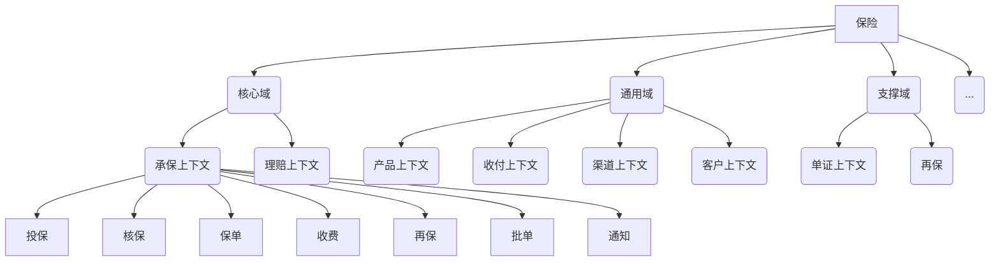

## 1. 核心概念
### 1.1. 从字面理解
2004年 Eric Evans 《Domain Driven Design》
- **通用语言**:产品有自己的语言,那么开发人员与之有对接鸿沟,故定义
- **限界上下文**:既是语义的限界,也是一个团队的范围--知识在团队内部流转,同时符合康威定律,也是组织架构的边界
- 实体
- 值对象
- **聚合根**
### 1.2. 从比较中理解
- **领域驱动型** vs **数据驱动型**

一般直接的开发方式便是先定义表字段,再面向数据表开发,典型的场景是使用Mybatis生成模板CRUD`sql`,后续直接操作sql。这便是数据驱动开发。相比于使用JPA(`Java Persistence API`)，国内普遍这样做可能是因为其效率更高。 [有人](https://www.zhihu.com/question/50729231/answer/563844811)评价:
>面向表结构编程把java对象仅当成数据容器，查询和模型变更都设计在一张表上，所谓业务逻辑就是一堆增删改查的sql集合

随着业务越来越复杂，人们发现分散的黑盒sql 以及不断膨胀的Service 非常不利于重构与复用。基于上述考虑着眼于整体业务模型的统一与同步的开发方式便是领域驱动开发.DDD致力于代码和模型相匹配:

>模型即设计,设计即代码

- **领域模型** vs **UseCase**
Usecase之间不突出相互交互。另一方面，领域事件可以通过IOC的方式,让IOC容器管理事件，摆脱每次只能更新一个聚合根的问题
## 2. 如何落地
### 2.1. 事件风暴找出微服务
#### 2.1.1. 方法
通过事件风暴的方式将概念与想法从每个人头脑中拿出来,步骤如下:

1. 使用便利贴将每个人对于业务流程小到**事件**的认知贴在白板上
	- 角色包括需求，产品，技术等，重点是**多视角**
1. 识别怎么触发事件(黄色内部事件,橙色外部事件),谁(蓝色命令/定时/回调/异常)**触发**事件
2. 归纳UseCase,找**聚合**，不一致的重定义通用语言。
	- 突出操纵事件的角色(绿色人工,浅绿色系统角色)
3. 拆分职责过多的"上帝对象",找出**限界上下文**(ContextDTO),归纳到不同部门(虚线域)
即虚线圈出的域负责域内事件，对于每个事件则是绿色操纵蓝色触发黄色/橙色

5. 梳理事件流，争取围绕**聚合根**实现原子性，并从战略视角以各自所需的实现方式将聚合根放入三个域:
- 核心域(价值链)
- 通用域(现有的开源的或商业的产品)
- 支撑域(具有业务特色的监控,运营等)
#### 2.1.2. 案例
- 以电商领域为例，划分后可初步得到下图结果：

- 以保险领域为例：

### 2.2. Domain Model 与DataBase交互
在得到聚合根以建立微服务后,传统的操作下,上游意图在经过泛Service层之后会全部被分解为CRUD(`Create`/`Retrieve`/`Update`/`Delete`)操作,但是因为对象和Database中的关系先天不匹配:Object之间继承,组合,多态等关系错综复杂,而关系型数据以表格表达自己,从而CRUD的操作在Domain Model层无法体现<svg t="1613551927172" class="icon" viewBox="0 0 1024 1024" version="1.1" xmlns="http://www.w3.org/2000/svg" p-id="1221" width="20" height="20"><path d="M665.6 374.4c-12.8-57.6-57.6-105.6-118.4-118.4-67.2-16-131.2 9.6-169.6 64-28.8 41.6 0 60.8 16 73.6 6.4 3.2 12.8 9.6 22.4 19.2 12.8 12.8 32 9.6 44.8-3.2 12.8-12.8 9.6-32-3.2-44.8-9.6-6.4-16-12.8-22.4-19.2 22.4-25.6 60.8-38.4 96-28.8 35.2 9.6 60.8 35.2 70.4 70.4 9.6 48-12.8 92.8-54.4 112-41.6 19.2-70.4 57.6-70.4 102.4l0 22.4c0 19.2 12.8 32 32 32 0 0 0 0 0 0 16 0 32-12.8 32-32l0-22.4c0-19.2 12.8-38.4 32-44.8C643.2 528 681.6 451.2 665.6 374.4zM480 729.6c-9.6 9.6-12.8 22.4-12.8 35.2 0 12.8 6.4 25.6 12.8 35.2 9.6 9.6 22.4 12.8 35.2 12.8 12.8 0 25.6-6.4 35.2-12.8 9.6-9.6 12.8-22.4 12.8-35.2 0-12.8-6.4-25.6-12.8-35.2C531.2 710.4 499.2 710.4 480 729.6zM512 67.2c-80 0-160 22.4-227.2 64C246.4 86.4 188.8 64 124.8 64 115.2 64 102.4 70.4 96 80c-6.4 9.6-6.4 22.4 0 32 0 0 32 54.4 41.6 137.6 3.2 16 16 28.8 32 28.8 0 0 3.2 0 3.2 0C192 275.2 204.8 262.4 204.8 243.2 198.4 201.6 188.8 163.2 179.2 137.6 204.8 144 230.4 160 249.6 188.8c0 0 0 0 0 0 0 0 0 0 0 0C252.8 192 252.8 192 252.8 195.2c0 0 3.2 3.2 3.2 3.2 3.2 0 3.2 3.2 6.4 3.2 3.2 0 3.2 3.2 6.4 3.2 3.2 0 3.2 0 6.4 0 3.2 0 3.2 0 6.4 0 3.2 0 3.2 0 6.4-3.2 3.2 0 3.2 0 6.4-3.2 0 0 0 0 0 0 0 0 0 0 0 0 64-44.8 140.8-67.2 217.6-67.2 211.2 0 384 172.8 384 384s-172.8 384-384 384-384-172.8-384-384c0-54.4 9.6-105.6 32-156.8 6.4-16 0-35.2-16-41.6-16-6.4-35.2 0-41.6 16C76.8 390.4 64 451.2 64 515.2c0 246.4 201.6 448 448 448 246.4 0 448-201.6 448-448C960 268.8 758.4 67.2 512 67.2z" p-id="1222" fill="#1296db"></path></svg>

因此需要`DTO`(Data Transfer Object)[^DTO]经过Domain Model 到达Database,但是为了同时适应查询和创建操作,DTO需要被设计的面面俱到,从而在传输中存在不必要的字段传递.
为了配合DDD,读写操作可以不围绕同一数据模型展开,特别是在读操作为主的高并发系统中应当区分读写职责.因此Bertrand Mayer提出了`CQRS`(Command-Query Responsibility Segregation)这种读写分离模式,提倡将Domain Model拆分为`Command`端与`Query`端两部分,Database也配合做读写分离(尽管原本是为了降低DB并发压力),其中Reader Database以**视图**的方式在每次查询前同步Event变化.崔皓的图:

### 2.3. 分布式的质量确保
1. 前后对比：
从代码的层面找出调用链，并"录制"http调用过程/Event,那么当代码修改后,重放一遍同时重检查每个库的变化,保证每一次修改至少不会引入破坏原有功能的bug
    - 复杂的业务模型中，`TDD`造数据的成本比较高,同时对于函数调用的测试覆盖不了业务流程
    - DDD中可以数据库或者某些共享媒介做中心检查
    - DDD结合CQRS后,Event Store便是起到了"录制"Event的作用
2. ArchUnit检验分层开发是否符合规范,比如Service只能被Service或者Controller访问
3. 阻塞流程充分利用回调接口
4. `Spring Event` vs `Guava Event Bus`(API多,友好)
## 3. 一些疑问
### 3.1. DDD为什么一直没被广泛运用？

1. "杀鸡焉用牛刀"，业务不够复杂的CRUD用不到
2. DDD致力于向网络中所有人暴露复杂性，不被接受
3. 专业术语过多
2. DDD是思想,不是技术,准备工作多,不好落地执行
4. 因为不好落地而缺乏实战案例，反过来因为案例少也难以落地
5. DDD更利于移植与更改，因为数据对象不依赖于数据源。但面向表结构继而面向sql更利于优化性能，因为sql可以优化的点太多了。[^DTO]

最后附上现场照片一张:-)

~~~~

[^DTO]:[Cocoon](https://www.zhihu.com/question/348496459):多表关联的数据也可以根据条件组装各种SQL,而以一个DTO接收所有数据