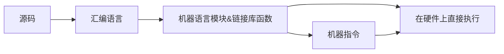
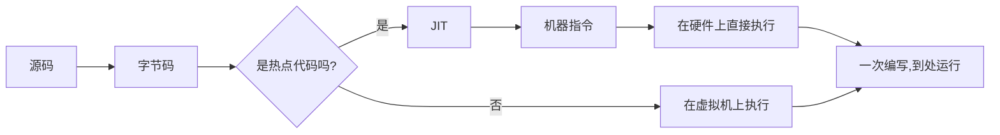

歌词经理:
>人类的语言学研究中有"语言决定论"这样的说法,在计算机世界中类似.如果我们把计算机语言解决的问题范围认为是计算机语言世界的边界:
>- python的学习者在学习计算机体系结构前难以理解C语言世界的设定
>- 对于C语言的学习者,也难以理解LISP机的运作机理,因为C语言对世界的解释和LISP 完全不同

Altman:
>语言是「压缩信息的好方法」，因此可能演化出智能。

所以如果希望语言决定论失效,就需要让不同语言的使用者去感受相同的世界.而我们学习不同的语言,**理解每一个词的本意**,才有可能靠近真正的世界.
核心要关注
## 1. 语言特性
### 设计初衷
* 面向硬件
>机器语言、汇编语言
* 面向过程
	>C
C语言并不受限于任何一种操作系统或者机器,也被用作编写编译器和操作系统，故被称作“系统编程语言”。在`IoT`、机器人包括各种小型设备上，C语言还大有可为。
* 面向对象/应用层级
	>C++、Java、C#

* 面向对象的可视化
	>Visual Basic
* 非过程
	>SQL
* 动态/脚本层级
	>Python、Ruby、JavaScript
- 面向 AST
	- Lisp

所有的编程语言核心只关注两个问题：
- 硬件的运行效率
- 程序员的开发效率
然而鱼与熊掌不可得兼，C语言尽管把硬件的运行效率压缩到极致，却带来了很差的使用体验。

### 对比

| 语言         | 仓库              | API                          | 语法                  | 语义                                      | 并发模型                       | 错误处理                | 执行                                             | 元编程                 | 集成                                |
| ---------- | --------------- | ---------------------------- | ------------------- | --------------------------------------- | -------------------------- | ------------------- | ---------------------------------------------- | ------------------- | --------------------------------- |
| C          |                 | 头文件                          | 函数可单独存在，可使用函数指针传递函数 |                                         | Thread                     |                     | 1. 静态编译[^静态编译]                                 |                     |                                   |
| C++        |                 |                              | OO，函数可单独存在          |                                         | Thread                     |                     |                                                |                     |                                   |
| Java       | maven;集中式       | Class                        | OO，函数不可单独存在         | 1. 静态类型、泛型擦除 2.反射 3.动态代理->AOP     | Thread, Virtual Thread (21) | 异常单独类型，但作为方法返回值的一部分 | 1. 字节码[^字节码] 2.JIT                             | 注解、Cglib、Java Agent |                                   |
| C#         |                 |                              |                     |                                         |                            |                     |                                                |                     |                                   |
| Python     | pip; poetry  |                              | OO；函数也是对象，可作为参数传递   | 1. 动态类型,Runtimes检查 2.运行时调用反射与修改方法或属性 |                            |                     | 1. 动态语言 2. 解释型[^解析型]->Python字节码 3.GIL单线程 |                     |                                   |
| JavaScript | npm;集中式         | 第三方                          | 函数式、闭包              |                                         |                            |                     | 1. 解释型 2.V8->字节码                            | 高阶函数                | Webpack从入口遍历所有依赖文件翻译;Babel打包向下兼容  |
| TypeScript | deno;分布式从网站直接导入 | [标准库](https://deno.land/std) |                     |                                         |                            |                     | AOT                                            |                     | 内置打包/格式清理/测试/安装/文档生成/linting/脚本编译 |
| Golang     |                 |                              |                     |                                         | Goroutine                  | 异常非单独类型，作为方法返回值的一部分 |                                                |                     |                                   |
| Rust       |                 |                              |                     |                                         |                            |                     | 静态编译                                           |                     |                                   |
| Lisp       |                 |                              | 函数式                 |                                         |                            |                     |                                                | Lisp Macros         |                                   |
| Erlang     |                 |                              |                     |                                         | Actor                      |                     |                                                |                     |                                   |

## 2. [技术圈图](https://coolshell.cn/articles/19307.html)

- Microsoft圈 
>Windows、.NET、ASP.NET、C#、Azure、SQL Server
- Java圈 
>Java、Spring
值得一提的是，Java不是任何一个平台的亲儿子，而它本身又是可以适配任何平台。Java的发展趋势主要在跨平台应用和大型非实时应用上。
- 手机圈 
>Android、 iOS、Kotlin、Swift、Firebase
- 前端圈 
>Javascript、React.js、Angular.js、PHP
- 大数据圈 
> Python、TensorFlow、Torch/PyTorch
- 基础平台圈 
> Linux、Shell、Vim、Docker、Kubernetes、Elasticsearch、Redis……
- 其它圈子
> C/C++/汇编圈子、Ruby圈子、Hadoop/Spark圈子、……

[^静态编译]: 系统级编程,操作系统/网络/数据库/虚拟机首选
[^字节码]:将编译器与不同的硬件解耦,通过虚拟机/解释器跨平台

[^解析型]:解释型语言遍历AST解释执行