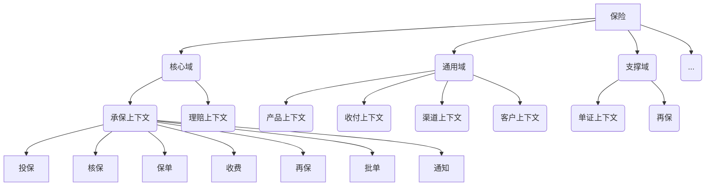

# 用代码画各种图
### 1.1. Mermaid
教程：
https://blog.csdn.net/fenghuizhidao/article/details/79440583
https://codechina.csdn.net/mirrors/knsv/mermaid?utm_source=csdn_github_accelerator

画思维导图
https://blog.csdn.net/skytruine/article/details/105828748

