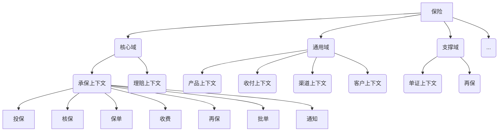
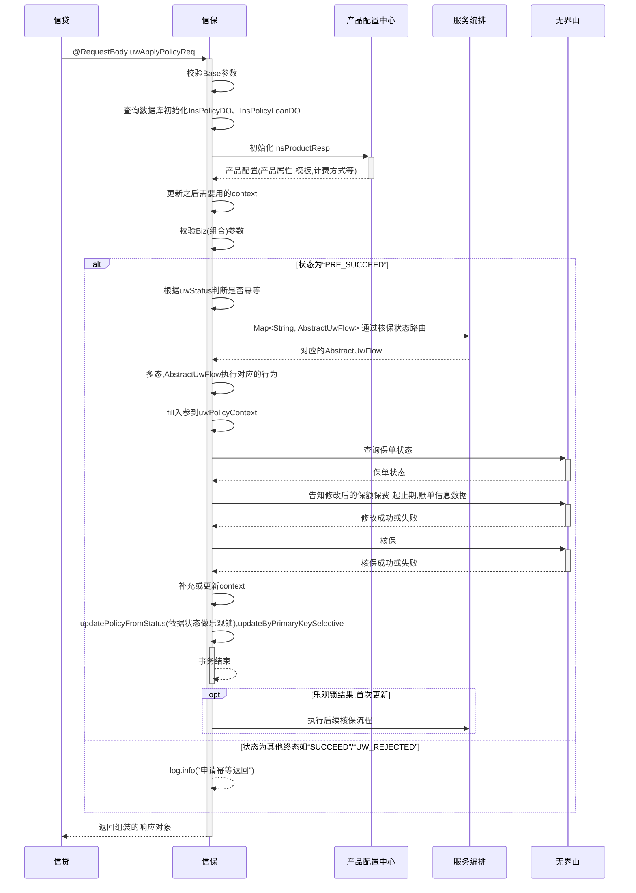

### 1. Mermaid
教程：
https://blog.csdn.net/fenghuizhidao/article/details/79440583
https://codechina.csdn.net/mirrors/knsv/mermaid?utm_source=csdn_github_accelerator

#### 1.1. 画思维导图
https://blog.csdn.net/skytruine/article/details/105828748

#### 1.2. 画时序图
https://www.imooc.com/article/292709?block_id=tuijian_wz

### 2. HTML
#### 2.1. 表格
<html>
  <head>
    <meta http-equiv="Content-Type" content="text/html; charset=UTF-8" />
    <meta http-equiv="Content-Style-Type" content="text/css" />
    <meta name="generator" content="Aspose.Words for .NET 17.1.0.0" />
    <title>Bug-1</title>
  </head>
  
<body>
    

      <table cellspacing="0" cellpadding="0" style="border-collapse: collapse;">
        <tbody>
          <tr>
            <td
              style="
                width: 92.9pt;
                border-style: solid;
                border-width: 0.75pt;
                padding-right: 5.03pt;
                padding-left: 5.03pt;
                vertical-align: middle;
              "
            >
              

                BugID
              

            </td>
            <td
              colspan="3"
              style="
                width: 300.3pt;
                border-style: solid;
                border-width: 0.75pt;
                padding-right: 5.03pt;
                padding-left: 5.03pt;
                vertical-align: middle;
              "
            >
              

                &nbsp;B-1
              

            </td>
          </tr>
          <tr>
            <td
              style="
                width: 92.9pt;
                border-style: solid;
                border-width: 0.75pt;
                padding-right: 5.03pt;
                padding-left: 5.03pt;
                vertical-align: middle;
              "
            >
              

                Bug
                标题
              

            </td>
            <td
              colspan="3"
              style="
                width: 300.3pt;
                border-top-style: solid;
                border-top-width: 0.75pt;
                border-right-style: solid;
                border-right-width: 0.75pt;
                border-left-style: solid;
                border-left-width: 0.75pt;
                padding-right: 5.03pt;
                padding-left: 5.03pt;
                vertical-align: middle;
              "
            >
              

                &nbsp;布尔表达式输入框为空时无提示
              

            </td>
          </tr>
          <tr>
            <td
              style="
                width: 92.9pt;
                border-style: solid;
                border-width: 0.75pt;
                padding-right: 5.03pt;
                padding-left: 5.03pt;
                vertical-align: middle;
              "
            >
              

                软件版本
              

            </td>
            <td
              style="
                width: 92.9pt;
                border-style: solid;
                border-width: 0.75pt;
                padding-right: 5.03pt;
                padding-left: 5.03pt;
                vertical-align: middle;
              "
            >
              

                &nbsp;CellCover1.0
              

            </td>
            <td
              style="
                width: 92.9pt;
                border-style: solid;
                border-width: 0.75pt;
                padding-right: 5.03pt;
                padding-left: 5.03pt;
                vertical-align: middle;
              "
            >
              

                测试环境
              

            </td>
            <td
              style="
                width: 92.9pt;
                border-style: solid;
                border-width: 0.75pt;
                padding-right: 5.03pt;
                padding-left: 5.03pt;
                vertical-align: middle;
              "
            >
              

                &nbsp;1
              

            </td>
          </tr>
          <tr>
            <td
              style="
                width: 92.9pt;
                border-style: solid;
                border-width: 0.75pt;
                padding-right: 5.03pt;
                padding-left: 5.03pt;
                vertical-align: middle;
              "
            >
              

                测试人员
              

            </td>
            <td
              style="
                width: 92.9pt;
                border-style: solid;
                border-width: 0.75pt;
                padding-right: 5.03pt;
                padding-left: 5.03pt;
                vertical-align: middle;
              "
            >
              

                &nbsp;王艺辉
              

            </td>
            <td
              style="
                width: 92.9pt;
                border-style: solid;
                border-width: 0.75pt;
                padding-right: 5.03pt;
                padding-left: 5.03pt;
                vertical-align: middle;
              "
            >
              

                开发人员
              

            </td>
            <td
              style="
                width: 92.9pt;
                border-style: solid;
                border-width: 0.75pt;
                padding-right: 5.03pt;
                padding-left: 5.03pt;
                vertical-align: middle;
              "
            >
              

                &nbsp;
              

            </td>
          </tr>
          <tr>
            <td
              style="
                width: 92.9pt;
                border-style: solid;
                border-width: 0.75pt;
                padding-right: 5.03pt;
                padding-left: 5.03pt;
                vertical-align: middle;
              "
            >
              

                创建时间
              

            </td>
            <td
              style="
                width: 92.9pt;
                border-style: solid;
                border-width: 0.75pt;
                padding-right: 5.03pt;
                padding-left: 5.03pt;
                vertical-align: middle;
              "
            >
              

                &nbsp;2020年5月31日
              

            </td>
            <td
              style="
                width: 92.9pt;
                border-style: solid;
                border-width: 0.75pt;
                padding-right: 5.03pt;
                padding-left: 5.03pt;
                vertical-align: middle;
              "
            >
              

                Bug状态
              

            </td>
            <td
              style="
                width: 92.9pt;
                border-style: solid;
                border-width: 0.75pt;
                padding-right: 5.03pt;
                padding-left: 5.03pt;
                vertical-align: middle;
              "
            >
              

                &nbsp;待解决
              

            </td>
          </tr>
          <tr>
            <td
              style="
                width: 92.9pt;
                border-style: solid;
                border-width: 0.75pt;
                padding-right: 5.03pt;
                padding-left: 5.03pt;
                vertical-align: middle;
              "
            >
              

                测试阶段
              

            </td>
            <td
              colspan="3"
              style="
                width: 300.3pt;
                border-right-style: solid;
                border-right-width: 0.75pt;
                border-left-style: solid;
                border-left-width: 0.75pt;
                border-bottom-style: solid;
                border-bottom-width: 0.75pt;
                padding-right: 5.03pt;
                padding-left: 5.03pt;
                vertical-align: middle;
              "
            >
              

                <input type="button" style="height: 11px; width: 10px;" />
                接口测试、
                <input
                  type="button"
                  id="default"
                  style="height: 11px; width: 10px;"
                />
                功能测试、
                <input type="button" style="height: 11px; width: 10px;" />
                配置测试、
                <input type="button" style="height: 11px; width: 10px;" />
                回归测试
              

            </td>
          </tr>
          <tr>
            <td
              style="
                width: 92.9pt;
                border-style: solid;
                border-width: 0.75pt;
                padding-right: 5.03pt;
                padding-left: 5.03pt;
                vertical-align: middle;
              "
            >
              

                Bug严重程度
              

            </td>
            <td
              colspan="3"
              style="
                width: 300.3pt;
                border-style: solid;
                border-width: 0.75pt;
                padding-right: 5.03pt;
                padding-left: 5.03pt;
                vertical-align: middle;
              "
            >
              

                <input type="button" style="height: 11px; width: 10px;" />
                紧急、
                <input type="button" style="height: 11px; width: 10px;" />
                严重、
                <input
                  type="button"
                  id="default"
                  style="height: 11px; width: 10px;"
                />
                一般、
                <input type="button" style="height: 11px; width: 10px;" />
                轻微
              

            </td>
            

          </tr>
          <tr>
            <td
              style="
                width: 92.9pt;
                border-style: solid;
                border-width: 0.75pt;
                padding-right: 5.03pt;
                padding-left: 5.03pt;
                vertical-align: middle;
              "
            >
              

                问题优先级
              

            </td>
            <td
              colspan="3"
              style="
                width: 300.3pt;
                border-style: solid;
                border-width: 0.75pt;
                padding-right: 5.03pt;
                padding-left: 5.03pt;
                vertical-align: middle;
              "
            >
              

                <input type="button" style="height: 11px; width: 10px;" />高
                、
                <input type="button" style="height: 11px; width: 10px;" />较高
                、
                <input
                  type="button"
                  id="default"
                  style="height: 11px; width: 10px;"
                />一般
                、
                <input type="button" style="height: 11px; width: 10px;" />低
              

            </td>
          </tr>
          <tr>
            <td
              style="
                width: 92.9pt;
                border-style: solid;
                border-width: 0.75pt;
                padding-right: 5.03pt;
                padding-left: 5.03pt;
                vertical-align: middle;
              "
            >
              

                问题来源
              

            </td>
            <td
              colspan="3"
              style="
                width: 300.3pt;
                border-style: solid;
                border-width: 0.75pt;
                padding-right: 5.03pt;
                padding-left: 5.03pt;
                vertical-align: middle;
              "
            >
              

                <input
                  type="button"
                  id="default"
                  style="height: 11px; width: 10px;"
                />测试、<input type="button" style="height: 11px; width: 10px;" />升级、<input type="button" style="height: 11px; width: 10px;" />其他
              

            </td>
          </tr>
          <tr>
            <td
              style="
                width: 92.9pt;
                border-style: solid;
                border-width: 0.75pt;
                padding-right: 5.03pt;
                padding-left: 5.03pt;
                vertical-align: middle;
              "
            >
              

                问题类型
              

            </td>
            <td
              colspan="3"
              style="
                width: 300.3pt;
                border-style: solid;
                border-width: 0.75pt;
                padding-right: 5.03pt;
                padding-left: 5.03pt;
                vertical-align: middle;
              "
            >
              

                <input type="button" style="height: 11px; width: 10px;" />功能问题、<input type="button" style="height: 11px; width: 10px;" />版本问题、<input type="button" style="height: 11px; width: 10px;" />遗留问题、<input type="button" style="height: 11px; width: 10px;" />新需求、<input type="button" style="height: 11px; width: 10px;" />配置错误、<input type="button" style="height: 11px; width: 10px;" />性能问题、<input type="button" id="default" style="height: 11px; width: 10px;" />设计问题、<input type="button" style="height: 11px; width: 10px;" />偶发性错误、<input type="button" style="height: 11px; width: 10px;" />其他
              

            </td>
          </tr>
          <tr>
            <td
              style="
                width: 92.9pt;
                border-style: solid;
                border-width: 0.75pt;
                padding-right: 5.03pt;
                padding-left: 5.03pt;
                vertical-align: middle;
              "
            >
              

                缺陷的触发条件
              

            </td>
            <td
              colspan="3"
              style="
                width: 300.3pt;
                border-style: solid;
                border-width: 0.75pt;
                padding-right: 5.03pt;
                padding-left: 5.03pt;
                vertical-align: middle;
              "
            >
              

                &nbsp;
              

            </td>
          </tr>
          <tr>
            <td
              style="
                width: 92.9pt;
                border-style: solid;
                border-width: 0.75pt;
                padding-right: 5.03pt;
                padding-left: 5.03pt;
                vertical-align: middle;
              "
            >
              

                操作步骤（简）
              

            </td>
            <td
              colspan="3"
              style="
                width: 300.3pt;
                border-style: solid;
                border-width: 0.75pt;
                padding-right: 5.03pt;
                padding-left: 5.03pt;
                vertical-align: middle;
              "
            >
              

                &nbsp;1.打开测试用例生成页面 2.设置表达式输入框为空 3.点击生成按钮
              

            </td>
          </tr>
          <tr>
            <td
              style="
                width: 92.9pt;
                border-style: solid;
                border-width: 0.75pt;
                padding-right: 5.03pt;
                padding-left: 5.03pt;
                vertical-align: middle;
              "
            >
              

                实际结果
              

            </td>
            <td
              colspan="3"
              style="
                width: 300.3pt;
                border-style: solid;
                border-width: 0.75pt;
                padding-right: 5.03pt;
                padding-left: 5.03pt;
                vertical-align: middle;
              "
            >
              

                &nbsp;无任何结果
              

            </td>
          </tr>
          <tr>
            <td
              style="
                width: 92.9pt;
                border-style: solid;
                border-width: 0.75pt;
                padding-right: 5.03pt;
                padding-left: 5.03pt;
                vertical-align: middle;
              "
            >
              

                预期结果
              

            </td>
            <td
              colspan="3"
              style="
                width: 300.3pt;
                border-style: solid;
                border-width: 0.75pt;
                padding-right: 5.03pt;
                padding-left: 5.03pt;
                vertical-align: middle;
              "
            >
              

                &nbsp;弹出"请重新输入表达式不为空"的提示框
              

            </td>
          </tr>
          <tr style="height: 96.1pt;">
            <td
              style="
                width: 92.9pt;
                border-style: solid;
                border-width: 0.75pt;
                padding-right: 5.03pt;
                padding-left: 5.03pt;
                vertical-align: middle;
              "
            >
              

                附图
              

            </td>
            <td
              colspan="3"
              style="
                width: 300.3pt;
                border-style: solid;
                border-width: 0.75pt;
                padding-right: 5.03pt;
                padding-left: 5.03pt;
                vertical-align: middle;
              "
            >
              

                (如果语言不清楚可附图，图过多可附件)
              

            </td>
          </tr>
        </tbody>
      </table>
      

        &nbsp;
      

    

  </body>
  
</html>