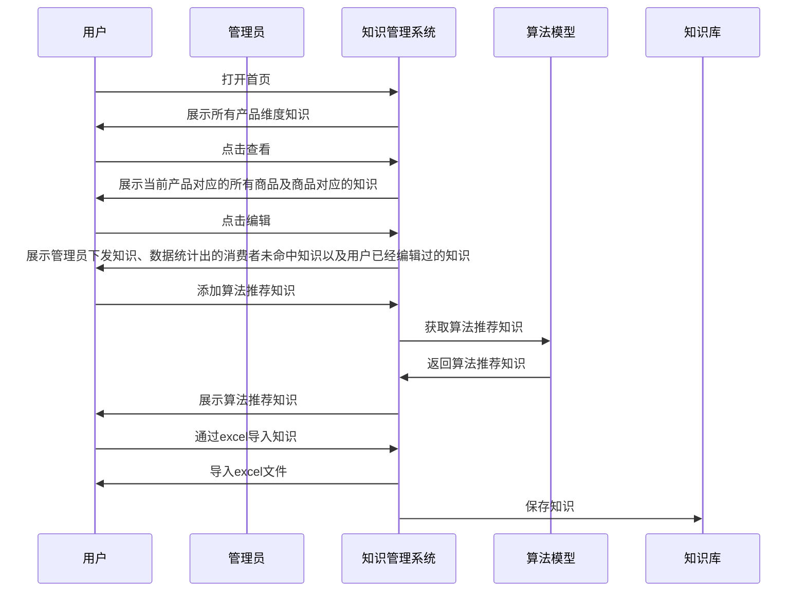

## 交互图

[[Knowledge-Management-System]]

### 概念
发布动作
- ADD
- CONTENT_MODIFY
- VERSION_UPDATE
- DELETE

知识的发布状态有两个语义
- 相对于版本
- 相对于内容

## 时序图

```mermaid
sequenceDiagram
  participant 用户
  participant 管理员
  participant 知识管理系统

  用户 ->> 知识管理系统: 打开首页
  知识管理系统 ->> 用户: 展示所有产品维度知识
  用户 ->> 知识管理系统: 点击查看
  知识管理系统 ->> 用户: 展示当前产品对应的所有商品及商品对应的知识
  用户 ->> 知识管理系统: 点击编辑
  知识管理系统 ->> 用户: 展示管理员下发知识、数据统计出的消费者未命中知识以及用户已经编辑过的知识
  用户 ->> 知识管理系统: 添加算法推荐知识
  知识管理系统 ->> 算法模型: 获取算法推荐知识
  算法模型 ->> 知识管理系统: 返回算法推荐知识
  知识管理系统 ->> 用户: 展示算法推荐知识
  用户 ->> 知识管理系统: 通过excel导入知识
  知识管理系统 ->> 用户: 导入excel文件
  知识管理系统 ->> 知识库: 保存知识

```