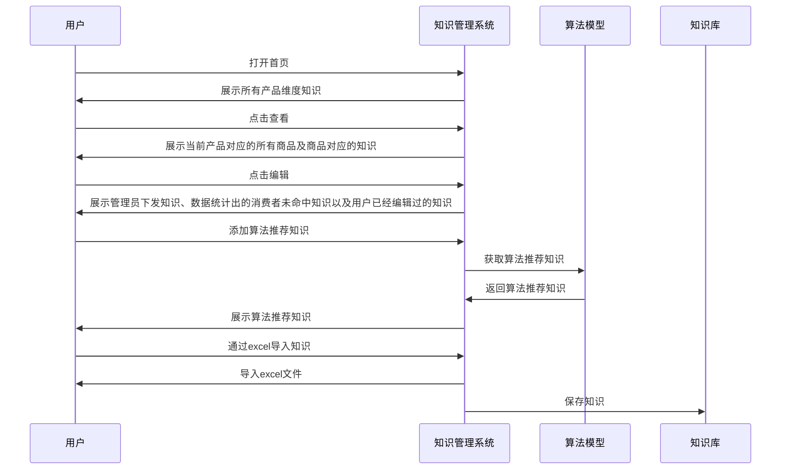

## 淘工厂客服
### 系统框架

[[Servicer-Chat-System.excalidraw]]
### 知识管理系统

[[Knowledge-Management-System]]

知识的状态核心就四个
- ADD
- CONTENT_MODIFY（相对于内容）
- VERSION_UPDATE（相对于版本）
- DELETE

### 服务指标洞察与提升

| 字段名                 | 数据类型          | 主键  | 描述                           |
| ------------------- | ------------- | --- | ---------------------------- |
| index_code          | text          | ✅   | 指标类型                         |
| index_name          |               |     |                              |
| biz_date            | date          | ✅   | 业务日期，yyyy-mm-dd              |
| index_value_decimal | numeric(10,4) |     | 指标值，nullable                 |
| index_value_string  | text          |     | 指标tag，nullable               |
| entity_type         | text          | ✅   | 实体类型，比如SUPPLIER              |
| entity_id           | text          | ✅   | 实体的唯一 ID，比如一级供应商ID           |
| entity_name         | text          |     |                              |
| biz_type            | text          | ✅   | 业务类型，比如自承接供应商维度：ZCJ_SUPPLIER |
| feature             | text          |     | 扩展字段                         |
| ds                  | text          |     | 指标原分区时间                      |

[[index-insight.excalidraw]]
#### 用户视角的时序图

### 问答系统
[[淘工厂客服知识库和问答相关的工作#问答接口]]
### 价格
调用 LLM 的成本还是有必要知道一下，这样才能判断其实用性。先说结论: 
目前客服一问一答，API成本可能要人民币1毛8。

你可能疑问，客服一问一答也百把字，1000 token 吧，怎么会这么贵！这是因为大模型的通用知识不够回复真正业务场景里的特定问题，所以必然需要召回特定知识。如下是 24 年 3 月份 GPT-3.5-turbo的价格，GPT-3.5-turbo 也是综合性能、价格和效果后使用较为普遍的LLM接口。

一般召回3-5个至知识点，1个知识点100-500个字不等，输入前 prompt+问题+输出答案，按照16K算，就是

$$16 * 0.0005（输入每 1k token 单价）* 7.3（汇率）=￥0.1752$$

输入后按照 500 token 计算，就是

$$0.5 * 0.0015（输入每 1k token 单价）* 7.3（汇率）=￥0.005475$$

所以一问一答成本相加就是 0.180675 元，即 1 毛8。

## 内部领域知识机器人
### 问答接口
区别于传统的关键词匹配，向量召回处理复杂查询更好，处理大量文档结果更高效，但是为了给LLM最优的上下文信息，还需要结合搜索知识，对文档粗排、重排、精排，提高文档准确性与多样性，最终提供更好的问答效果。
总体流程：
1. 基于Embedding对问题结合其聊天历史向量化解析 
2. 通过在线及离线方式检索融合知识库及网页端内容 
3. 基于LLM相关性模型进行精排再求解输出 
4. 大模型基于更全面与实时数据推理答案并召回数据

详细流程图：

[[Enhanced-Search-With-AI.excalidraw]]

### 钉钉机器人
[[Ding-Ding-Bot]]

