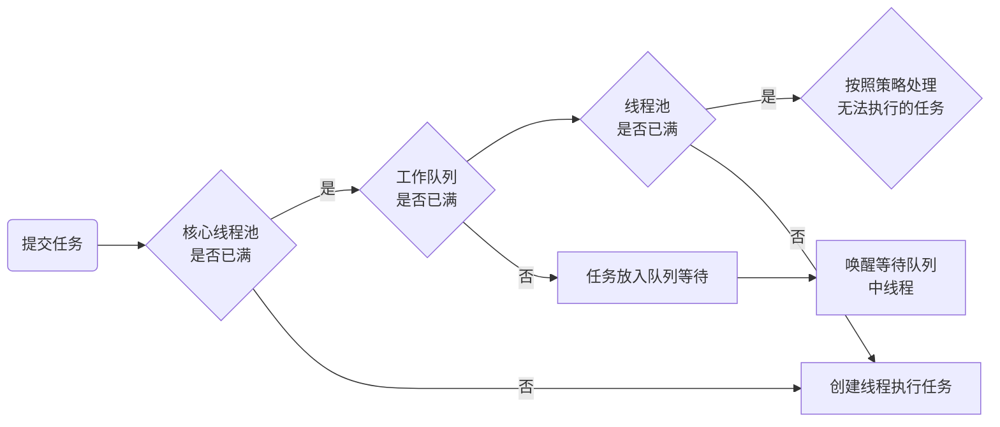
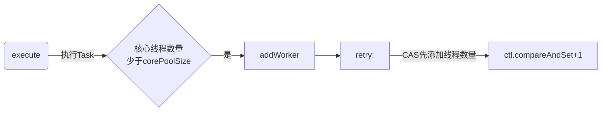

## 1.1. 配置
```java
var threadPool2 = new ThreadPoolExecutor(2, 3, 30, TimeUnit.SECONDS, new LinkedBlockingQueue<>(2),
                new UserThreadFactory("MBinPC"), new UserRejectHandler());
```
## 2. 题目／答案
>配置如上的线程池,核心线程数为2,最大线程数为3,工作队列容量为2,问连续`execute()`5个任务会怎么样?
```java
for (int i = 0; i < 5; i++) {
    threadPool2.execute(new Task());
}
```
最后在人工调试干预下：
```wsh
istarwyh-MBinPC-utf-1
Thread[istarwyh-MBinPC-utf-1,5,main]-执行任务
istarwyh-MBinPC-utf-2
Thread[istarwyh-MBinPC-utf-2,5,main]-执行任务
Thread[istarwyh-MBinPC-utf-1,5,main]-执行任务
Thread[istarwyh-MBinPC-utf-2,5,main]-执行任务
Thread[istarwyh-MBinPC-utf-1,5,main]-执行任务
```
正常运行结果：
```java
istarwyh-MBinPC-utf-1
istarwyh-MBinPC-utf-2
istarwyh-MBinPC-utf-3
Thread[istarwyh-MBinPC-utf-1,5,main]-执行任务
Thread[istarwyh-MBinPC-utf-2,5,main]-执行任务
Thread[istarwyh-MBinPC-utf-3,5,main]-执行任务
Thread[istarwyh-MBinPC-utf-1,5,main]-执行任务
Thread[istarwyh-MBinPC-utf-2,5,main]-执行任务
```
这应该是因为正常运行execute()提交任务的速度大于任一线程执行完firstTask再去workQueue中拿线程的速度，因此队列满的情况下又建了一个线程。因为线程池的主要处理流程如下：

而当连续提交6个线程，然后`task rejected`也可以证明这一点。
## 3. 分析
### 3.1. 添加worker


刚开始没线程，调用addWorker():
```java
if (workerCountOf(c) < corePoolSize) {
    if (addWorker(command, true))
        return;
    c = ctl.get();
}
```
`ctl`这个`AtomicInteger`变量分为两部分,前4位表示线程池的运行状态,后28位表示线程池中的线程数量。
新起线程运行Task,Task即传入的代码块:

Worker由Task和提供的线程工厂制造的线程组成。
```java
Worker(Runnable firstTask) {
    setState(-1); // inhibit interrupts until runWorker
    this.firstTask = firstTask;
    this.thread = getThreadFactory().newThread(this);
}
```

注意持有Worker的对象会将自己（`this`）传入,

- 需要传入的是Runnable的实现类，debug时this指向的对象worker正在初始化，即`java.util.concurrent.ThreadPoolExecutor$Worker`
- 因此后续`start()`时运行Worker中被重写的`run()`

拿到`mainLock`再对线程池操作：
```java
 final ReentrantLock mainLock = this.mainLock; mainLock.lock();
```
之后加入线程集合`workers.add(w);`，即一个`HashSet<Worker>`.
### 2.1. 调用run()
之后启动线程`t.start();`,这将会x进入Thread内部方法，加入线程组`group.add(this);`,然后调用native方法向操作系统申请线程`start0();`去运行Worker中被重写的`run()`:
```java
public void run() {
    runWorker(this);//this即worker对象本身
}
```

### 2.2. 从workQueue中拿线程
```java
final void runWorker(Worker w) {
    Thread wt = Thread.currentThread();//！！！
    Runnable task = w.firstTask;
    w.firstTask = null;
    w.unlock(); // allow interrupts
    boolean completedAbruptly = true;
    try {
        while (task != null || (task = getTask()) != null) {
            w.lock();
                beforeExecute(wt, task);
                task.run();//！！！
                afterExecute(task, null);
        }
    } finally {
        processWorkerExit(w, completedAbruptly);
    }
}
```
如果有`task`或者通过`getTask()`从工作队列里可以取到task，那么便会去运行它，并且不管是否成功都将`w.completedTasks++;`
那么什么时候就取不到task了呢？以下wc即workCount的缩写，为活跃线程数。

- `runStateAtLeast(c, SHUTDOWN) && (runStateAtLeast(c, STOP) || workQueue.isEmpty())`
- `(wc > maximumPoolSize || (timed && timedOut)) && (wc > 1 || workQueue.isEmpty())`
- `Runnable r = timed ? workQueue.poll(keepAliveTime, TimeUnit.NANOSECONDS) : workQueue.take();`
    - `boolean timed = allowCoreThreadTimeOut || wc > corePoolSize;`
    - 当允许超时或活跃线程数大于核心线程数时，如果一下子取不到task先等一会儿再取（`poll()`）,不然就算求

而如果没有任务了，便触发`processWorkerExit();`，将这个打工线程worker移走`workers.remove(w);`

- 移走后等待被GC？
### 2.3. 将Task放入workQueue
现在线程池里有线程了，而且线程池也在Running状态，那么继续被execute()提交的任务先放入工作队列`workQueue`里:
```java
if (isRunning(c) && workQueue.offer(command)) {
...if (workerCountOf(ctl.get()) == 0)
addWorker(null, false);
}
```
如果重新检查发现活跃线程workerCount为0的话，就以`addWorker(null, false);`添加一个worker进入workers中。
放入之后其实就变成了一个“生产者--消费者”模型。


`workQueue.offer(command)`生产，同时通过各种singal方法如`singalNotEmpty()`最后唤醒`AQS$ConditonObject`维护的**等待队列**中的`node.thread`进行消费:
```java
LockSupport.unpark(node.thread);
```
线程的使用顺序本质上是一个轮询.线程消费的时候调用上面提到的`getTask()`,再从workQueue取线程。