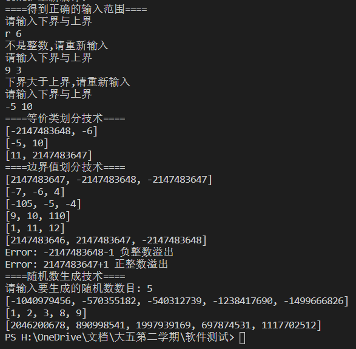

<font size=6ex><center> 基于三种黑盒测试技术生成测试用例</center></font>

[toc]
## 1. 需求与程序实现
### 1.1. 输入范围(从命令行输入)检查
#### 1.1.1. 详细需求描述
a. 整数类型检测，
b. 下界小于等于上界；
c. 不正确时提示重新输入；
#### 1.1.2. 程序设计
主要程序流程请见下图:


#### 1.1.3. 程序实现
```java
public int[] test1(int[] range){
        Scanner input = new Scanner(System.in);
        int errorType = 0;
        do {
            String stringLow = input.next();
            // System.out.println("low"+low);
            String stringHigh = input.next();
            // System.out.println("high"+high);

            if(this.isInteger(stringLow) && this.isInteger(stringHigh)){
                int low = Integer.parseInt(stringLow);
                int high = Integer.parseInt(stringHigh);
                if(this.isProper(low,high)){
                    range[0] = low;
                    range[1] = high;
                    break;
                }
                else{
                    errorType = 2;
                    this.alert(errorType);
                }
            } else {
                errorType = 1;
                this.alert(errorType);
            }
        } while (errorType != 0);
        input.close();
        return range;
    }
    public int[][] test2(int[] inputRange) {
        
    }
    // 是否是整数
    public boolean isInteger(String input) {
        // 检测整数的正则表达式
        final String regex = "^-?[1-9]\\d*$|0{0,1}";
        return input.matches(regex);
    }

    // 范围适合low<high
    public boolean isProper(int low, int high) {
        if (low > high)
            return false;
        return true;
    }

    // 错误报告
    public void alert(int errorType) {
        if(errorType == 1){
            System.out.println("不是整数,请重新输入");
        }
        if(errorType == 2){
            System.out.println("下界大于上界,请重新输入");
        }
    }
```
### 1.2. 等价类划分技术
#### 1.2.1. 详细需求描述
对输入范围划分,返回一个有效区间和两个无效区间
#### 1.2.2. 程序设计
通过形参传入区间上下界，通过等价类划分法划分区间:
(1).Integer.MIN_VALUE 到输入的区间下界减1[^为整数]
[^为整数]: 之所以减的是整数1因为根据第一个需求了解范围上下界应为整数,上界加1同理

(2).输入的区间下界到输入的区间上界
(3).输入的区间上界加一到 Integer.MAX_VALUE。
#### 1.2.3. 程序实现
```java
  public int[][] test2(int[] inputRange) {
        int[][] rangeArray = new int[3][2];
        rangeArray[0]= new int[]{Integer.MIN_VALUE,inputRange[0]-1};
        rangeArray[1]= inputRange;
        rangeArray[2]= new int[]{inputRange[inputRange.length-1]+1,Integer.MAX_VALUE};
        return rangeArray;
    }
```
### 1.3. 边界值分析技术
#### 1.3.1. 详细需求描述
对于各区间去边界值,并返回边界值,注意返回的边界值里没有重复值.
>个人理解:去边界值的意思为以边界值分析

#### 1.3.2. 程序设计
对各区间边界值一般采用`-1`或`+1`的方法在边界上处理,为防止值重复,设置不同的常量对`-1`或`+1`进行修正.
#### 1.3.3. 程序实现
```java
    public int[][] test3(int[][] rangeArray){
        final int Ten = 10;
        final int Hundred = 100;
        int[][] criticValues = new int[6][3];
        criticValues[0]= new int[]{rangeArray[0][0]-1,rangeArray[0][0],rangeArray[0][0]+1};
        criticValues[1]= new int[]{rangeArray[0][1]-1,rangeArray[0][1],rangeArray[0][1]+Ten};
        criticValues[2]= new int[]{rangeArray[1][0]-Hundred,rangeArray[1][0],rangeArray[1][0]+1};
        criticValues[3]= new int[]{rangeArray[1][1]-1,rangeArray[1][1],rangeArray[1][1]+Hundred};
        criticValues[4]= new int[]{rangeArray[2][0]-Ten,rangeArray[2][0],rangeArray[2][0]+1};
        criticValues[5]= new int[]{rangeArray[2][1]-1,rangeArray[2][1],rangeArray[2][1]+1};
        return criticValues;
    }
```
### 1.4. 随机值生成
#### 1.4.1. 详细需求描述
应用随机数生成器对每个区间生成指定数量(从命令行输入)的随机值.注意返回的值里没有重复值.
#### 1.4.2. 程序设计
1. 在等价类的三个区间内调用Math.random()随机生成n 个数
必须注意的是,为了防止整数溢出,必须对区间最大值与最小值的差值使用`long`类型.
2. 利用HashSet去重,利用指定的数量`n`
3. 最后再将这些数组打包成一个二维数组返回
#### 1.4.3. 程序实现
```java
    // 随机数生成
    public Object[] test4(int[][] rangeArray){
        System.out.print("请输入要生成的随机数数目: ");
        int n =input.nextInt();
        Object[] randomValues = new Object[3];
        for(int i = 0;i<randomValues.length;i++) 
            randomValues[i] = this.randomValueSet(i, n, rangeArray);

        return randomValues;      
    }
    public HashSet<Integer> randomValueSet(int index,int n,int[][] rangeArray){
        // 使用HashSet来去重
        HashSet<Integer> randomValueSet = new HashSet<Integer>();
        // 如果正常用int,这里减去一个Integer.MIN_VALUE就很容易整数溢出
        long gap = (long)rangeArray[index][1]-(long)rangeArray[index][0];
        while(randomValueSet.size() < n){
            int temp = (int)(Math.random()*gap+rangeArray[index][0])+1;
            randomValueSet.add(temp);
        }
        return randomValueSet;
    }
```
    
## 2. 程序测试
### 2.1. 程序实现
调用功能1,2,3,4主程序如下:
```java
import java.util.Arrays;
import java.util.HashSet;
import java.util.Random;
import java.util.Scanner;
public class Test2{
    // 声明一个静态的Scanner工具类,以便调用同时最后结束时才关闭
    public static Scanner input =new Scanner(System.in);
    public static void main(final String[] args) {
        int[] range = new int[2];
        Test2 t = new Test2();

        System.out.println("====得到正确的输入范围====");
        // 输入范围检查,并返回正确的输入范围
        int[] inputRange =t.test1(range);

        System.out.println("====等价类划分技术====");

        // 使用等价类划分技术返回三个区间
        int[][] equalClass = t.test2(inputRange);
        for(int[] row : equalClass)
            System.out.println(Arrays.toString(row));

        System.out.println("====边界值划分技术====");
        // 边界值分析返回六个边界值数组
        int[][] criticValues = t.test3(equalClass);
        for(int[] row : criticValues)
                System.out.println(Arrays.toString(row));
        t.alert(3);
        t.alert(4);

        System.out.println("====随机数生成技术====");
        //随机数生成返回随机数组
        Object[] randomValues = t.test4(equalClass);
        for(int i = 0;i<randomValues.length;i++){
            HashSet<Integer> row = (HashSet<Integer>)randomValues[i];
            System.out.println(row.toString());
        }

        input.close();
        
    }
```
### 2.2. 测试结果

## 3. 总结
基于三种黑盒测试技术生成测试用例,本作业([完整代码](https://blog.csdn.net/qq_31912571/article/details/105024592))使自己实践掌握了等价类/边界值分析/随机数生成三种黑盒测试技术的测试用例生成方法,也感觉到了测试用例生成的不易.并且再测试用例生成的过程中,也需要注意一些细节:
- Scanner类一次关闭后再次唤醒无用(所有的scanner类共享一个输入流[^Scanner]),如果需要在非main方法中调用需设置成`static`
- 为避免测试用例值的重复,可以使用不同的"偏移值"以及HashSet等
- 功能模块解耦后可以大大简化代码,逻辑也更清晰
- 等价类的无效区间理论上涉及到$+\infty$或$-\infty$,在计算机中用参数类型能取到的最大值/最小值代替,并且需要避免它们参与运算时造成整数溢出

[^Scanner]: [Exception in thread "main" java.util.NoSuchElementException](https://blog.csdn.net/liudongdong19/article/details/79672943)

