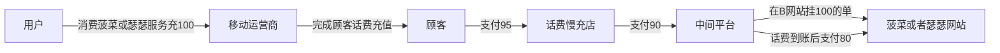

这个商业模式比较有意思。有人会说不就是团购吗？或许有的确实是团购，但还有一种你不知道。
话费慢充店说你给我95，我慢充100。当你充95给话费慢充店，话费慢充店给90给中间平台，中间平台再在菠菜或者瑟瑟网站上挂一个给你的话费充100的单，当用户要消费菠菜或者瑟瑟服务时，会实际给你的话费充100，当你的话费到账后，中间平台再把80块打给菠菜或者瑟瑟服务网站。

通过中间商，用户和顾客两个完全没有联系的人完成了交易，并且中间商洗白了自己。 