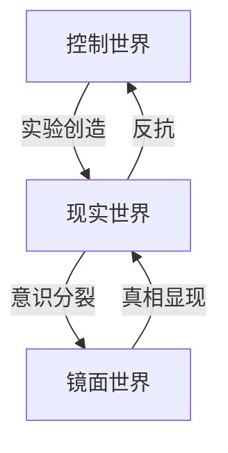

# 深渊里的镜面设定大纲

## 世界系统：因果链构造

### 控制世界

- **本质**：极权数据监控社会
- **目标**：通过实验寻找最优社会控制模型
- **特征**：
  - 数据预测系统（非完全准确）
  - 社会实验计划
  - 内部矛盾与裂痕

### 现实世界

- **特征**：表面理性社会
- **隐藏矛盾**：
  - 过度理性导致的人性压抑
  - 集体无意识的反弹
  - 社会系统的熵增现象

### 镜面世界形成

- **触发条件**：现实世界压抑达到临界点
- **本质**：被压抑意识的具象化
- **特性**：
  - 非确定性的量子态空间
  - 现实世界的扭曲反映
  - 真相的储存之地

## 核心人物：对立统一体

### 立军（现实世界研究员）

- **身份**：社会观察者
- **内在冲突**：
  - 理性与感性的撕裂
  - 责任与真相的抉择
- **人物弧光**：从观察者到参与者，最终成为改变者

### 晓灰（镜面人格）

- **本质**：立军压抑意识的具象化
- **功能**：
  - 真相的揭示者
  - 系统的破坏者
  - 改变的催化剂

## 叙事结构：螺旋上升

### 第一章：世界的裂缝

- 现实世界的异常征兆
- 立军发现数据监控的漏洞
- 镜面世界的初次显现

### 第二章：镜像相遇

- 立军进入镜面世界
- 与晓灰相遇，认知开始动摇
- 发现被隐藏的记忆碎片

### 第三章：真相浮现

- 控制世界的实验本质显露
- 立军身份认知的崩塌
- 改变的可能性出现

### 第四章：抉择与行动

- 立军与晓灰合作
- 策划对控制系统的反抗
- 引发社会觉醒运动

### 第五章：新的可能

- 控制世界秩序的动摇
- 现实世界的觉醒革新
- 开放式结局暗示希望

## 主题深化

### 表层叙事

- 个体觉醒的心理历程
- 反抗与改变的可能性

### 深层主题

1. 极权与自由的辩证关系
2. 理性社会的人性代价
3. 个体觉醒对集体改变的影响
4. 真相与希望的价值

### 创作要点

- 弱化刻意的镜像对应
- 强化人物动机的合理性
- 增加情节的不确定性
- 保留开放式的希望空间
