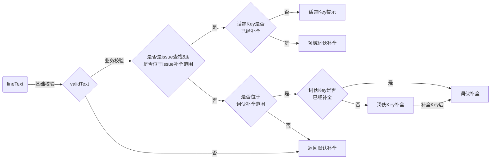
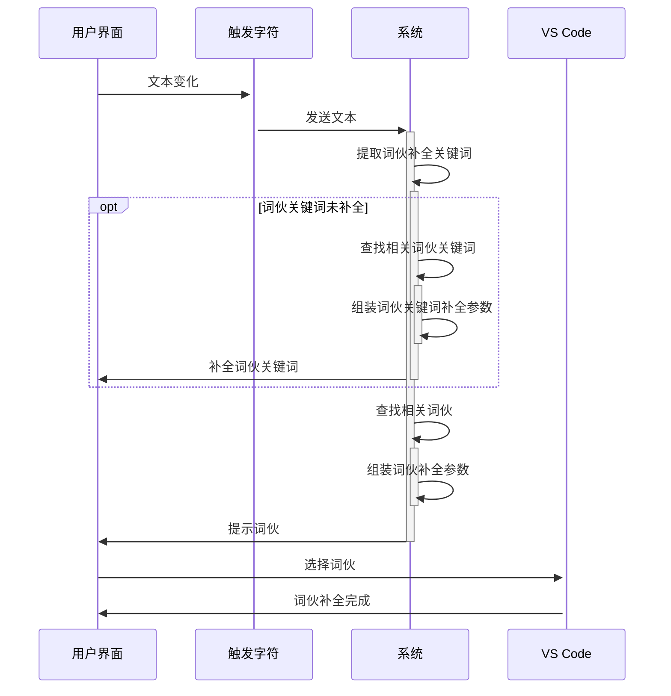
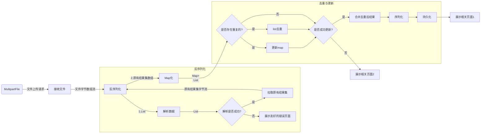
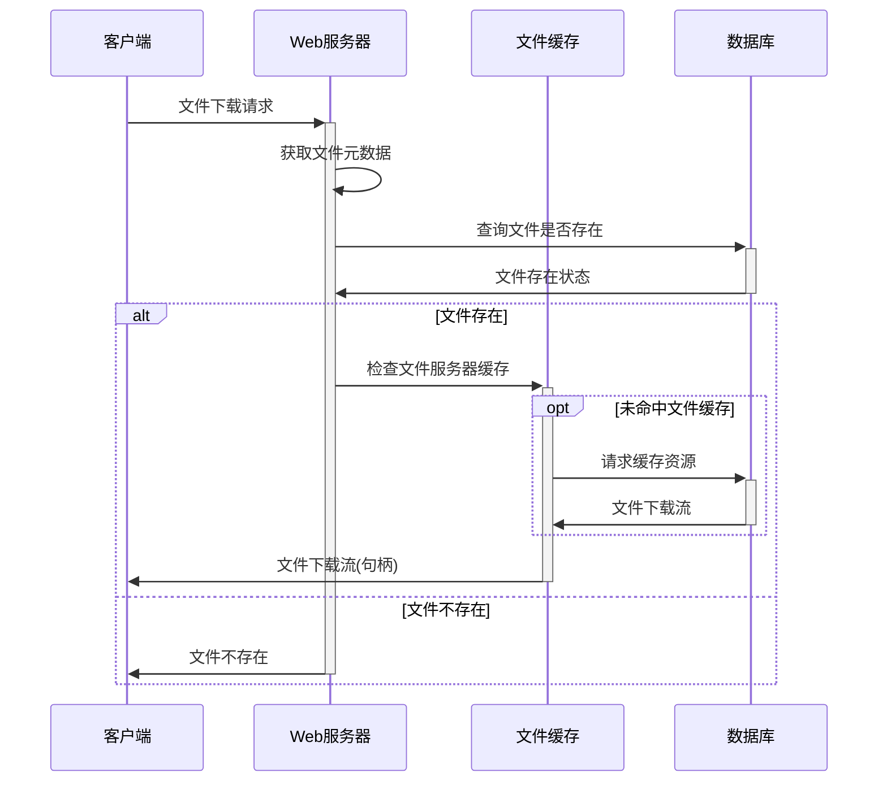
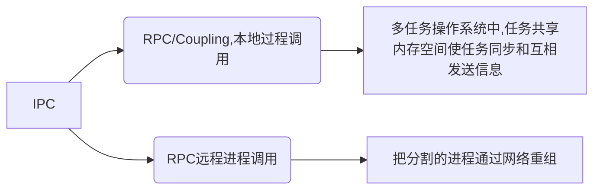

![[Pasted Image 20231230214231_885.png]]
## 1. 基于LSP的专业英语写作辅助客户端与服务器端设计与开发k
## 2. 写作背景


### 2.1. 需求
#### 2.1.1. 词伙补全（词伙，释义，图片）









词伙视频片段播放： https://www.playphrase.me/
#### 2.1.2. 字数提示
#### 2.1.3. 时间提示（图表题/议论文等）
#### 2.1.4. （拼写纠错/非常规表达提示）静态检查
#### 2.1.5. 学术写作规则约束
#### 2.1.6. 英语语言格式化--自己做一个Markdown预览
#### 2.1.7. 提供雅思真题仿写（填鸭式）
#### 2.1.8. 优化交互体验
##### 2.1.8.1. 补全允许取消

##### 2.1.8.2. 用户自定义
- 用户自定义触发字符
- 智能识别是否在补全后加标点符号或者空格,并提供配置功能允许用户选择补全后加空格或者不加空格.

### 2.2. 可能的需求
- 添加.english语言的定义
- 添加欢迎页面
    - 

- 划词翻译：主要用于写了不确定单词后的场景。主要是通过剪贴板调用翻译API实现。https://mp.weixin.qq.com/s/hB5u-jF5tvwtIeSXa2l4hg
## 3. 未知的

### 3.1. 通信形式
server supports **sockets**, **named pipes**, and **standard streams of the server process** to communicate with the client.

进程信息:
```json
arch: 'x64'
connected: true
pid: 11656
platform: 'win32'
resourcesPath: 'D:\\Microsoft VS Code\\resources'
ppid (get): ƒ ()
execPath: 'D:\\Microsoft VS Code\\Code.exe'
argv: (4) ['D:\\Microsoft VS Code\\Code.exe', 'h:\\Code\\lsp-sample-backup\\server\\out\\server.js', '--node-ipc', '--clientProcessId=6028']
versions: {node: '12.18.3', v8: '8.7.220.31-electron.0', uv: '1.38.0', zlib: '1.2.11', brotli: '1.0.7',openssl:'1.1.1',electron: '11.3.0',http_parser: '2.9.3' …}

```
H:\Code\eclipse.jdt.ls-master\org.eclipse.jdt.ls.product\target\repository>java -agentlib:jdwp=transport=dt_socket,server=y,suspend=n,address=1044 -Declipse.application=org.eclipse.jdt.ls.core.id1 -Dosgi.bundles.defaultStartLevel=4 -Declipse.product=org.eclipse.jdt.ls.core.product -Dlog.level=ALL -noverify -Xmx1G -jar ./plugins/org.eclipse.equinox.launcher_1.6.100.v20201223-0822.jar -configuration ./config_win -data G:\java-lsp4.metadata --add-modules=ALL-SYSTEM --add-opens java.base/java.util=ALL-UNNAMED --add-opens java.base/java.lang=ALL-UNNAMED -DCLIENT_PORT=3333 -DCLIENT_HOST=localhost

java '-agentlib:jdwp=transport=dt_socket,server=y,suspend=n,address=1044' '-Declipse.application=org.eclipse.jdt.ls.core.id1' '-Dosgi.bundles.defaultStartLevel=4' '-Declipse.product=org.eclipse.jdt.ls.core.product' '-Dlog.level=ALL' '-noverify' '-Xmx1G' -jar ./plugins/org.eclipse.equinox.launcher_1.6.100.v20201223-0822.jar '-configuration ./config_win' '-data G:\java-lsp4.metadata' '-debug -consolelog' '--add-modules=ALL-SYSTEM' '--add-opens java.base/java.util=ALL-UNNAMED' '--add-opens java.base/java.lang=ALL-UNNAMED' '-DCLIENT_PORT=3333' '-DCLIENT_HOST=localhost'
### 3.2. 算法
https://jojozhuang.github.io/algorithm/data-structure-trie
https://github.com/wolfgarbe/PruningRadixTrie
https://zhuanlan.zhihu.com/p/68447845
### 3.3. 框架
[Equinox OSGi](https://my.oschina.net/yygh/blog/499657)
### 3.4. 本身
1. 为什么微软不能用http协议,而自己搞一套协议?
## 4. 部署
### 4.1. 发布

### 4.2. Client与Server分离-IPC进程间通信
>进程间通信（`IPC`，`Inter-Process Communication`），指至少两个进程或线程间传送数据或信号的一些技术或方法。进程是计算机系统分配资源的最小单位。每个进程都有自己的一部分独立的系统资源，彼此是隔离的。为了能使不同的进程互相访问资源并进行协调工作，才有了进程间通信。这些进程可以运行在同一计算机上或网络连接的不同计算机上。 进程间通信技术包括消息传递、同步、共享内存和远程过程调用。 IPC是一种标准的Unix通信机制。[^进程间通信IPC、LPC、RPC]




客户机/服务器模式计算把远程过程调用与其它技术如消息传递一道，作为系统间通信的一种机制。客户机执行自己的任务，但靠服务器提供后端文件服务。RPC为客户机提供向后端服务器申请服 务的通信机制，如图R-4所示。如果你把客户机/服务器应用程序想作是一个分离的程序，服务器能运行数据访问部分，因为它离数据最近，客户机能运行数据表 示和与用户交互的前端部分。这样，远程过程调用可看作是把分割的程序通过网络重组的部件。


启动Server可能会报错:


一个守护进程,另外5个进程


When using CLIENT_PORT, Java LS is a TCP client and VS Code is a TCP server.
### 4.3. RPC跨机器进程通信
https://code.visualstudio.com/api/language-extensions/language-server-extension-guide
https://github.com/redhat-developer/vscode-java
https://github.com/eclipse/eclipse.jdt.ls


https://www.thoughtco.com/what-is-collocation-1211244#:~:text=Collocation%20refers%20to%20a%20group%20of%20two%20or,place.%20Collocation%E2%80%8Bs%20are%20words%20that%20are%20located%20together.

https://github.com/georgewfraser/java-language-server
https://github.com/lxtk-org/lxtk
https://github.com/pisv/lsp4j/blob/master/documentation/README.md

### 4.4. Docker

>`apt-get update`
同步 `/etc/apt/sources.list` 和 `/etc/apt/sources.list.d` 中列出的源的索引，获取到最新的软件包。

>`sudo add-apt-repository "deb [arch=amd64] http://mirrors.aliyun.com/docker-ce/linux/ubuntu $(lsb_release -cs) stable"`
添加阿里镜像源->如果添加后与原有链接冲突,则`/etc/apt/sources.list`注释掉这句：`deb [arch=amd64] https://download.docker.com/linux/ubuntu bionic stable`.注意sources.list文件是只读的，需要`chmod`为可写权限才能编辑

>`apt install docker.io`
#### 4.4.1. 开启docker远程服务端

Docker为C/S架构，服务端为`docker daemon`，客户端为`docker.service`.

默认不会监听任何端口，只能在本地直接或间接使用Docker API进行操作。这样做可能是为了安全,因为docker服务器端不会鉴别请求者.默认[这样](https://blog.beanbang.cn/2020/08/31/remote-access-and-deployment-of-docker/)开启`2375`端口,允许tcp连接.

**注意**
虽然防火墙如iptables默认是不打开的,但是不设防的接口可能被别人接管然后被打开防火墙,面对这种情况:
```sh
iptables -L -n --line-number 可以显示规则和相对应的编号
iptables -D INPUT 2
iptables -I INPUT -p tcp --dport 2375 -j ACCEPT
```
先这样吧.
#### 4.4.2. jar包->镜像->容器
0. 打包: `spring-boot-maven-plugin` -> `mvn package`
1. `scp -r H:/Code/code-generate/target/ root@121.36.48.66:/mnt/code-generate/target/`
因为本地2375端口总是提示被占用,但是又根本找不到谁占用了.

2. 打包image: `docker build -t code-generate-exec .`

3. 构建容器并启动:` docker run -di --name cg3 -p 8081:8081 code-generate-exec`

## 5. 竞品调研
### 5.1. Hallelujah输入法
hallelujah是我永远不会记住如何拼写的单词之一，但我知道它以“ halle”开头。--[hallelujah_autocompletion](https://daringfireball.net/2006/10/hallelujah_autocompletion)
### 5.2. 秘塔写作猫
### 5.3. 英语作文修改润色
以雅思官方8分范文为例，
Life skills are very important and by doing voluntary work, students learn not only how to communicate with others but also how to manage their time and improve their organisational skills. Unfortunately, teenagers today do not have many after-school activities. After-school clubs are no longer popular and students mostly go home and sit in front of the TV, browse the Internet or play video games.
#### 5.3.1. Grammar
也有office插件，并且会在office里嵌入检查。

#### 5.3.2. 改写匠
改写匠的批改结果并不好，所给的三个意见有两个是错的。

#### 5.3.3. AI辅助写作
#### 5.3.4. 搜狗翻译
搜狗翻译App的“作文批改”功能，AI写作助手便可针对用户输入的作文内容，指出写作中基础的语法或拼写等错误，提供8种经AI算法优化后的语句润色升级方式。用户还能利用批改前后对照功能，通过“输入-反馈-修正-对比”的良性循环方式，科学、高效的提升写作能力。
### 5.4. 其他
#### 5.4.1. 益加医
https://zhuanlan.zhihu.com/p/139657826


### 5.5. 其他
#### 5.5.1. 语言服务器的实现

语言服务器的实现是一门语言发展过程中的必经之路。正是因为有了语言服务器,一门特定的语言才可能实现在文本编辑器或IDE中的自动补全、定义跳转等功能。不过自然语言如英语与精通编译原理的大师们设计出来的程序语言有着天然的不同,前者是非结构化的非人为设计的语言,而后者可以按照编译原理对其生成抽象语法树或控制流图进行编译。 复杂的长句剖析出来离不开主干的包含必要成分而语法正确的短句。比如The warm sunshine at noon today makes me who was sad because of my grades feel a little happy,那么这个长句真正的主干短句只是Sunshine makes me happy。如王垠所说,这里的句子实际上可以看作make(a,b,c)这个语法函数的作用结果,参数便为这个短句中的宾语以及宾语补足语.按照代码的一般写法,即
public string make(sunshine,me,happy){
	return “Sunshine makes happy”.
}
而在英语中符合这种逻辑类比的语法及语句较为广泛,在这种理论基础上可以打造逻辑类的教学工具与课程,可能会很适合理工生学英语。

数据源除了第三方辅导资料，也应该使用经济学人、纽约时报国外权威媒体上的文章。

#### 5.5.2. 机器翻译
机器翻译与检索最开始是源于情报翻译的需求,它最开始被实现为一种机械的解读密码的方式,渐渐地人们认识到需要综合分析词法、句法和语义分析来实现,目前业界认为应该围绕英语文本写作打造词汇、语法、语义、内容与结构的全信息智能双语辅助学习工作系统.

#### 5.5.3. 可能的问题
问题1: 为什么会想要做这个?
答：因为笔者在备考雅思过程中切实感到了当前英语辅导写作中存在的一些痛点。并在阅读论文深入剖析英语写作过程的过程中了解到确实针对词伙策略开发的软件或工具存在空白，加上实现一个语言服务器本身是很有想象力的事，于是我选择了这个题目而没有选择传统的网页开发。
问题2：那你觉得你能完成吗？
答：有一定把握。因为语言服务器的实现是很广泛的，我可以学习已有的优秀实践。正是因为有了语言服务器,一门特定的语言才可能实现在文本编辑器或IDE中的自动补全、定义跳转等功能。不过自然语言如英语与精通编译原理的大师们设计出来的程序语言有着天然的不同,前者是非结构化的非人为设计的语言,而后者可以按照编译原理对其生成抽象语法树或控制流图进行编译。我需要深入学习Java语言服务器Eclipse JDT Language Server等打造一个专门为英语文本写作开发的英语语言服务器。 
问题3: 那你为什么不采用批改网那种的网页形式？
答： 因为我本身没有社区运营或者盈利的需求，并且对写作者来说，无论是否备考，离线都是更好的，因此采用单一的文本编辑器作为客户端载体是更符合开发初衷的。并且考虑到跨平台和跨文本编辑器的需要，采用了微软提出的LSP这个json RPC协议，在VS Code上也可以使用它已有的包括Hover,Completion等服务API更好的打造这个英语辅助工具。


[^进程间通信IPC、LPC、RPC]:[进程间通信IPC、LPC、RPC](https://www.cnblogs.com/gsk99/archive/2010/12/13/1904541.html)