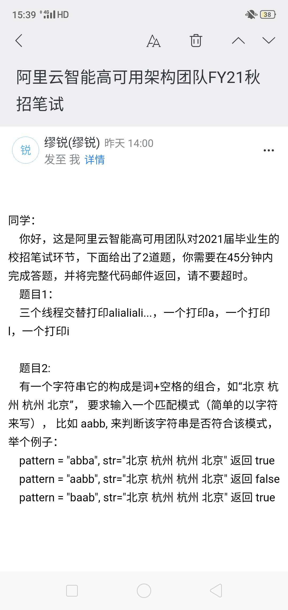

[帖子1](https://www.nowcoder.com/discuss/364739)
### Linux
进程命令
### 网络
- 三次握手四次挥手
- 输入网址发生了什么
- `http`报错402,502,505什么的
- http/https
### 操作系统
几大组成
post/get
pagecache
### Java
- 多线程如何实现
- Jvm内存泄漏


### 数据库
1. 高考考分数据库如何设计 
    - 加的是什么索引 
    - 数据库数据怎么导入

### 框架
遇到哪些问题,怎么优化
[hashMap](https://www.jianshu.com/p/3094437bc819)

实现一个登录页面,实现jdbc的增删改查.
### 算法
- LRU https://blog.csdn.net/Apeopl/article/details/90137398
- 100亿个数据如何排序

案例:
```java
1 下面程序期望通过过设置stop=true，使得线程B停止，但程序未按照期望执行，请说明为什么，如下提供了三个选项，哪些选项（多选）能实现当设置stop=true，线程B停止
public class CPUCacheTest {
  private static boolean stop = false;
  public static void main(String[] args){
    Thread a = new Thread("B"){
      public void run(){
        while (!stop) {
          int a = 1;
        }
        System.out.println("exit");
      }
    };
    a.start();
    pause(100);
    //停止标记，但未能停止线程B
    stop = true;
  }
  public static void pause(int time){
    try {
      TimeUnit.MILLISECONDS.sleep(time);
    }catch(Exception ex){
    }
  }
}
a stop变量使用volatile 关键字
b 在线程B的while语句里，增加pause(1)
c 在线程B的while语句里，增加 System.out.println(stop)
2  下列代码来自俩个日志输出框架Slf4j和common log，前者有占位符，后者字符串拼接，你觉得哪个好，为什么spring源码使用了后者
log.info(" order id {}，user id {}",order.getId(),order.getUserId());
log.info(" order id "+order.getId()+"，user id "+order.getUserId());
3  while (true) 和 for (;;) 哪个运行快,为什么，如何验证？
4 请列出下面代码需要调整的地方
Connection conn = null;
PrepareStatement ps = null;
try {
   conn = .....
   ps = conn.prepareStatement(sql);
   this.setPreparedStatementPara(ps, objs);
   int rs = ps.executeUpdate();
   return rs!=0;
} catch (SQLException e) {
  e.printStackTrace();
} finally {
  try{
    if(ps!=null){
      ps.close()
    }
    if(conn!=null){
      conn.close();
    }
  }catch(Exception ex){
    ex.printStackTrace();
  }
}
```