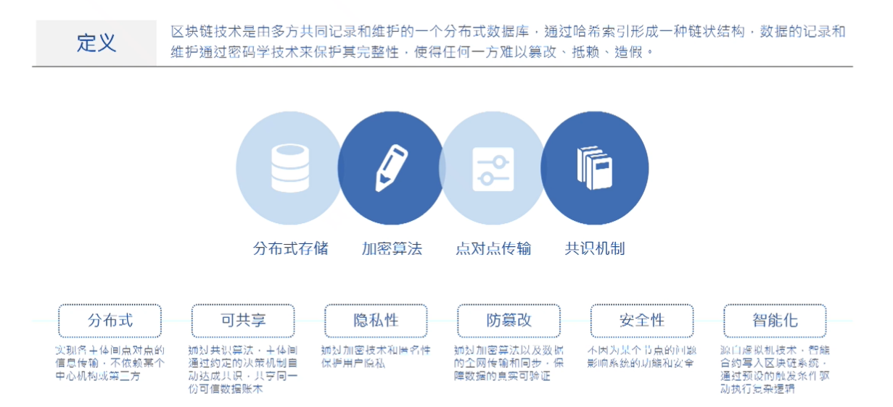
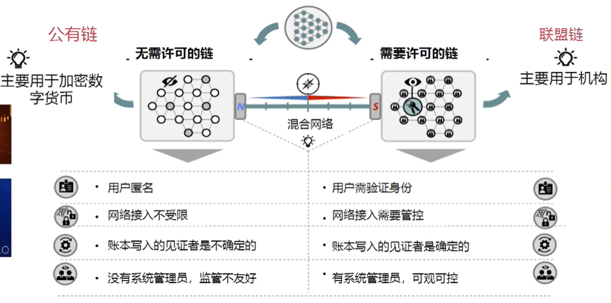
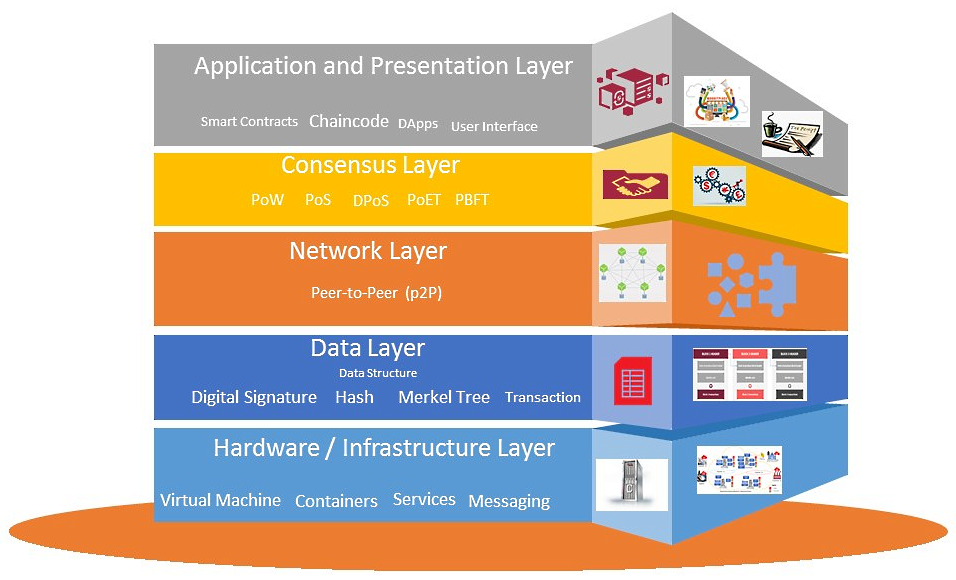
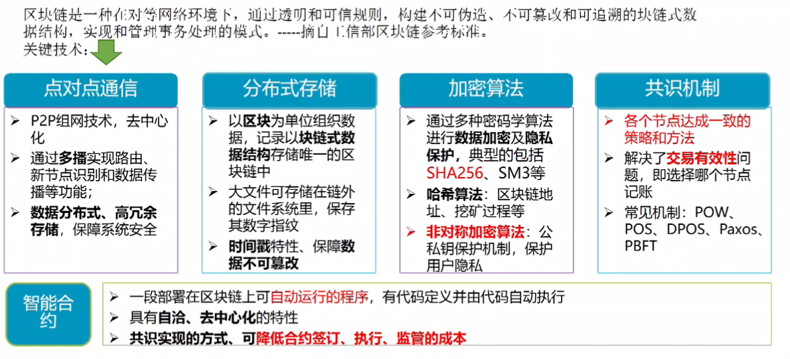
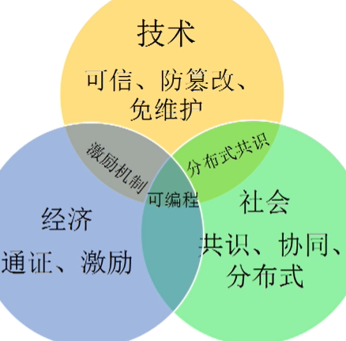
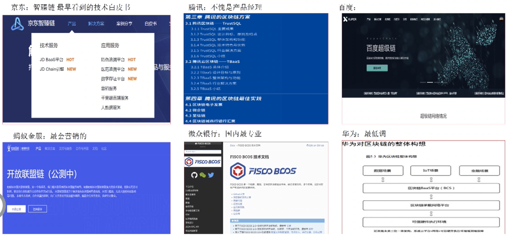
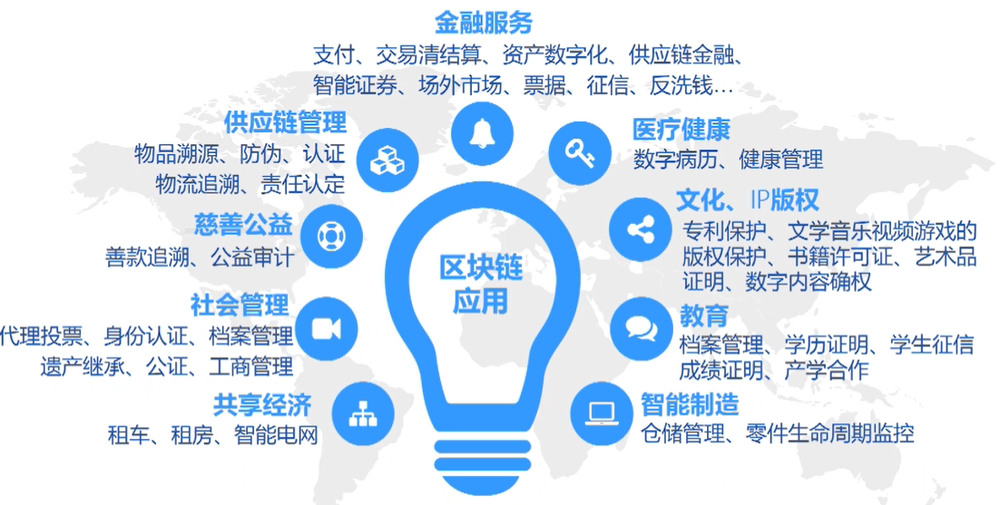
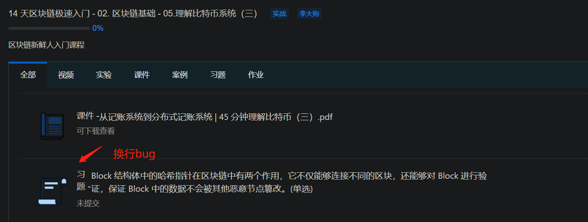
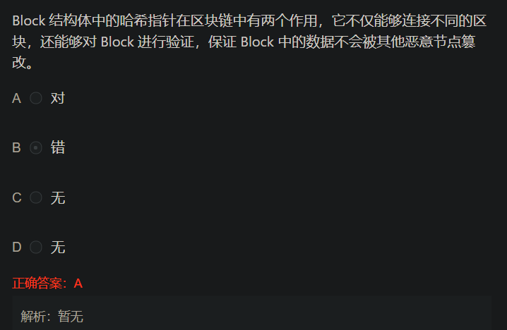

> BlockChian whtat is the next generation of Internet-the value of Internet will help small companies or invididuals to develop well aganist big or central platforms.
**$B = BlockChian**
## 1. 前言
### 1.1. 有关区块链的三个观点
1. 工具论:$B是一种多项技术的精巧集成,通过应用创新,解决信息交流的互信与溯源;
2. 价值论:$B使信息互联网升级为价值互联网
3. 时空论:区块链是新一代信任机制创造者,改变生产关系,进而释放生产力促进社会发展
### 1.2. $B相关概念
#### 1.2.1. $B定义

##### 1.2.1.1. 交易
交易不一定代表着金钱的转换，可抽象如下：
```json
{
    from: from_addr,
    to: to_addr,
    amount: amount, # 仅公链有效，对计算资源的消耗量
  gas: gas, # 手续费
  op: operation # 附带的操作,如在区块链数据库里存储一个值或在区块链上进行某些计算，这时区块链是一台「分布式计算机」。
}
```

##### 1.2.1.2. 有无Token
基于共识机制不同,分为两种链,即公链的`POW/POS`的共识机制，而与私链/联盟链的拜占庭或流言算法这一类的共识机制。联盟链大多没Token，上链积极性无法激发，社区做不起来；公链有Token，关于币的方面很活跃，真正与实体经济相联系的应用却很少。


公有链无需许可,主要用于加密货币.公链有激励机制并且公链面向所有人，目前公有链的认可度和使用人数都大于联盟链;联盟链主要用于机构,虽然大多没Token，上链积极性无法激发，社区做不起来,但是监管以及业务要求不能单纯用公链.
这其中联盟链用于适应各种业务场景，把各项业务的交易信息在联盟链里面进行交互。联盟链与公链的结合可能是大趋势,不管是联盟链over公链还是公链over联盟链,可能都需要业务参与方储存单独链,联盟链的共识信息再交互到公链,,和主链之间形成协同,帮助业务的落地。[^应用]

[^应用]:[区块链应用落地，公链与联盟链谁能担纲？](https://www.huxiu.com/article/252152.html)

##### 1.2.1.3. 有无合约
以太坊相比比特币区块链增强了可编程性,并且增加了智能合约的部署能力.
#### 1.2.2. $B分层架构与核心技术
**Layered structure of the blockchain architecture**[^layer]

**区块链核心技术**

[^layer]: [Layered structure of the blockchain architecture](https://subscription.packtpub.com/book/data/9781789804164/1/ch01lvl1sec06/layered-structure-of-the-blockchain-architecture)

#### 1.2.3. $B与其他技术的关系
- 物联网:数据采集
- 云计算:数据存储、计算
- 区块链:**数据组织、安全**
- 大数据:数据处理
- 人工智能:数据利用


## 2. 技术
### 2.1. 比特币私钥
比特币私钥的是密码学上面安全的，并不是说不可能出现重复的私钥，而是说不可能通过遍历的方式找到某一个特定的私钥，或者通过其它的方式找，而不通过私钥就能花费地址上面的比特币。[^私钥]
比特币的私钥，本质是一个数
选取私钥的过程如果不可预测或不可重复（是随机的），则私钥是密码学安全的

比特币的公钥（K），是 Secp256k1 定义的椭圆曲线上的一个点,并且满足`K=k⋅G`的关系,其中k便是私钥,G 为椭圆曲线上的一个固定点.数学原理保证了计算过程单向不可逆，能轻而易举的从私钥计算出其对应的公钥，反过来则无法实现。[^Secp256k1]

[^Secp256k1][比特币的私钥和公钥](https://aaron67.cc/2018/12/23/bitcoin-keys/)
[^私钥]:[比特币的私钥，公钥和地址是什么？](https://www.8btc.com/article/126232)

生成一个私钥，本质上就是选择一个数：
- 随机数生成（如RNG）
- random.org
- bitaddress.org
### 2.2. 常见非对称加密算法梳理
RSA，DSA，ECDSA，EdDSA和Ed25519都用于数字签名，但只有RSA也可以用于加密。

RSA（Rivest–Shamir–Adleman）是最早的公钥密码系统之一，被广泛用于安全数据传输。它的安全性取决于整数分解，因此永远不需要安全的RNG（随机数生成器）。与DSA相比，RSA的签名验证速度更快，但生成速度较慢。

DSA（数字签名算法）是用于数字签名的联邦信息处理标准。它的安全性取决于离散的对数问题。与RSA相比，DSA的签名生成速度更快，但验证速度较慢。如果使用错误的数字生成器，可能会破坏安全性。

ECDSA（椭圆曲线数字签名算法）是DSA（数字签名算法）的椭圆曲线实现。椭圆曲线密码术能够以较小的密钥提供与RSA相对相同的安全级别。它还具有DSA对不良RNG敏感的缺点。

EdDSA（爱德华兹曲线数字签名算法）是一种使用基于扭曲爱德华兹曲线的Schnorr签名变体的数字签名方案。签名创建在EdDSA中是确定性的，其安全性是基于某些离散对数问题的难处理性，因此它比DSA和ECDSA更安全，后者要求每个签名都具有高质量的随机性。

Ed25519是EdDSA签名方案，但使用SHA-512 / 256和Curve25519；它是一条安全的椭圆形曲线，比DSA，ECDSA和EdDSA 提供更好的安全性，并且具有更好的性能（人为注意）。
## 3. 可以看到的应用场景
### 3.1. 国内产品

### 3.2. 可能的落地点

### 3.3. 发展趋势
1. 分布式金融系统Defi
	- (跨领域)转账快捷,低手续费
	- 资产证券化**:对一个产权无限分割并确权，价值就可以无限大**
2. 去中心化DApp领域:
	○ 维基百科因为原本就有分布式数据库/版本控制和时间戳,挪到Everpedia后,然后使用区块链的运营理念,包括发币激励和数据保护
	○ 勇敢浏览器
	○ Tor技术-洋葱浏览器
	○ 磁力链接 Bit Torrent
3. Big Develepment
	○ 不可篡改的地契
	○ 代替Airbnb,Uber的平台
	○ privacy的保护
	○ 知识产权的保护
4. Digital Gold
　　非法币自有非法币的价值
## 4. 学习笔记
### 4.1. 自学python
从已有的Java与TypeScript语法基础以及面向对象思想出发，快速地学习Python语法，完成了第一个gen_keys类的改写。
### 4.2. 公私钥与账户
这个实验可以分拆讲解，并且已有内容有重复。

### 4.3. 问题
做实验时网页卡顿。

问法似乎有问题：
