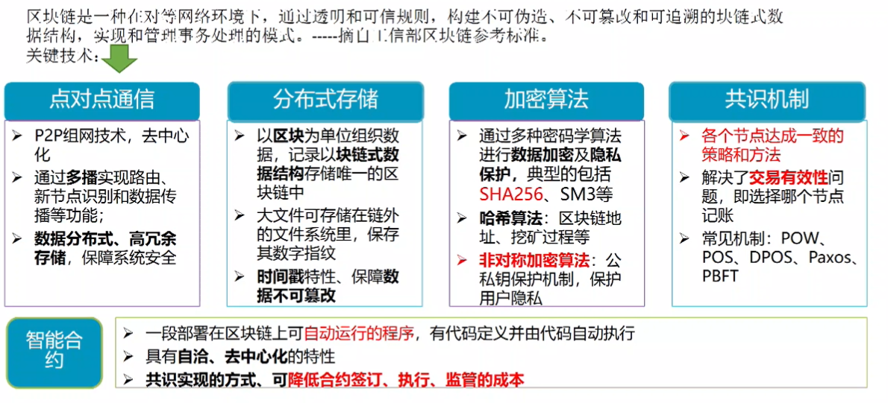
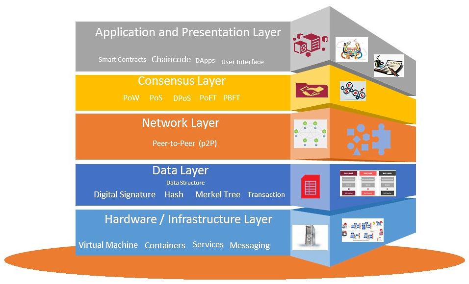

> BlockChain what is the next generation of Internet-the value of Internet will help small companies or individuals to develop well against big or central platforms.

**$B = BlockChain**
## 1. 前言
### 1.1. 有关区块链的三个观点
1. 工具论:$B是一种多项技术的精巧集成,通过应用创新,解决信息交流的互信与溯源;
2. 价值论:$B使信息互联网升级为价值互联网
3. 时空论:区块链是新一代信任机制创造者,改变生产关系,进而释放生产力促进社会发展

为什么互联网上到处都是广告？因为仍然没有针对内容的小额支付。
 
>区块链/Web3/Crypto是互联网的后半部分。它在非受信的网络上建立信任分层，当你把信任放在最上层的时候，你就可以把你无法拉到网上的所有其他经济活动都拉到网上。这是件大事。-- 马克安德森

### 1.2. $B相关概念
#### 1.2.1. $B定义
区块链技术指的是由原本没有关系的各方共同记录和维护分布式数据库的技术。通常其具有以下特点：

- 分布式：实现各个主体间点对点的信息传输，不依赖某个中心机构或者第三方
- 安全性：不依赖具体节点的工作，不会因为具体节点的故障导致功能不可用
- 可共享：天然共同持有一份可信的数据账本，且透明共享
- 不可篡改：通过加密算法以及数据的全网传输和同步，保证数据的完成性、可验证性
- 智能化：可以自动执行区块链中的逻辑
- 隐私性：在链上只有公钥和私钥是被认可的



##### 1.2.1.1. 交易
交易不一定代表着金钱的转换，可抽象如下：

```shell
{
    from: from_addr,
    to: to_addr,
    amount: amount, # 仅公链有效，对计算资源的消耗量
  gas: gas, # 手续费
  op: operation # 附带的操作,如在区块链数据库里存储一个值或在区块链上进行某些计算，这时区块链是一台「分布式计算机」。
}
```

##### 1.2.1.2. 有无Token
基于共识机制不同,分为两种链,即公链的`POW/POS`的共识机制以及联盟链的拜占庭或流言算法这一类的共识机制。
联盟链面向指定群体，大多没Token，上链积极性无法激发，社区做不起来；公链面向所有人,无需许可,用户匿名,有Token，关于币的方面很活跃，真正与实体经济相联系的应用却很少。
尽管公有链的认可度和使用人数都大于联盟链，但监管以及业务要求不能单纯用公链。联盟链与公链的结合可能是大趋势,不管是联盟链over公链还是公链over联盟链,可能都需要业务参与方储存单独链,联盟链的共识信息再交互到公链,,和主链之间形成协同,帮助业务的落地。[^应用]

[^应用]:[区块链应用落地，公链与联盟链谁能担纲？](https://www.huxiu.com/article/252152.html)

##### 1.2.1.3. 有无合约
以太坊相比比特币区块链增强了可编程性,并且增加了智能合约的部署能力.
#### 1.2.2. $B分层架构
**Layered structure of the blockchain architecture**[^layer]




[^layer]: [Layered structure of the blockchain architecture](https://subscription.packtpub.com/book/data/9781789804164/1/ch01lvl1sec06/layered-structure-of-the-blockchain-architecture)


## 2. 技术
### 2.1. 常见非对称加密算法
RSA，DSA，ECDSA，EdDSA和Ed25519都用于数字签名，但只有RSA也可以用于加密。

- RSA（Rivest–Shamir–Adleman）是最早的公钥密码系统之一，被广泛用于安全数据传输。它的安全性取决于整数分解，因此永远不需要安全的RNG（随机数生成器）。与DSA相比，RSA的签名验证速度更快，但生成速度较慢。

- DSA（数字签名算法）是用于数字签名的联邦信息处理标准。它的安全性取决于离散的对数问题。与RSA相比，DSA的签名生成速度更快，但验证速度较慢。如果使用错误的数字生成器，可能会破坏安全性。

- ECDSA（椭圆曲线数字签名算法）是DSA（数字签名算法）的椭圆曲线实现。椭圆曲线密码术能够以较小的密钥提供与RSA相对相同的安全级别。它还具有DSA对不良RNG敏感的缺点。

- EdDSA（爱德华兹曲线数字签名算法）是一种使用基于扭曲爱德华兹曲线的Schnorr签名变体的数字签名方案。签名创建在EdDSA中是确定性的，其安全性是基于某些离散对数问题的难处理性，因此它比DSA和ECDSA更安全，后者要求每个签名都具有高质量的随机性。

- Ed25519是EdDSA签名方案，但经过优化比DSA，ECDSA和EdDSA 提供更好的安全性，并且具有更好的性能。

### 2.2. RSA原理

RSA加密算法重点是找到了三个数`encryption_key` 、`decryption_key` 、`encryption_key_n` 满足以下性质[^RSA]：
```c
// 目标：传递数字message
// 1. message使用 encryption_key 和 n_encryption 加密
long cipher =  (long)pow(message,encryption_key) % encryption_key_n;
// 2. 只有持有 decryption_key 才能对cipher解密
long result = (long)pow(cipher,decryption_key) % encryption_key_n;
// 那么result就是原有要传递的数字
isTrue(result == message)
```


怎么找到的呢？源于对数学基本定理的推导，欧拉证明了对于任意两个素数p,q有如下定理：
$pow(message,(p-1) * (q-1)) \% (p * q) = 1$

名字分别为R，S，A开头的三位教授对等式作如下变换：
令 
$\phi = (p-1) * (q-1),encryption_key_n = p*q$

,则有
$pow(message,\phi) \% encryption_key_n = 1$

先对等式两边取任意正整数k次方，有
$pow(message,k*\phi) \% encryption_key_n = 1$

再对等式两边乘以message，有
$pow(message , ( k * φ + 1 )) \% encryption_key_n = message$

这时候如果将`k * φ + 1` 拆成两个数的乘积，即求解 
$encryption_key * decryption_key = k * φ + 1$

使得
$pow(message , ( encryption_key * decryption_key )) \% encryption_key_n = message$

即
$pow(pow(message , encryption_key) , decryption_key) \% encryption_key_n = message$

即
$pow(pow(message , encryption_key) \% encryption_key_n, decryption_key) \% encryption_key_n = message$

令
```c
long cipher =  (long)pow(message,encryption_key) % encryption_key_n;
```

有
$pow(cipher , decryption_key) \% encryption_key_n = message$


那么我们就找到了三个数`encryption_key` 、`decryption_key` 、`encryption_key_n` 满足开始说的以下性质(插入文本内超链接)


就可以得到 `encryption_key` 和 `decryption_key`，encryption_key_n 也即是上述推导公式中的而这样满足条件的密钥对有无数对。


这样就可以分发`encryption_key`和作为公钥来加密`decryption_key`作为私钥


[^RSA]:https://mp.weixin.qq.com/s/aVt1qj62YzwvU9sNPN9B_g

### 2.3. 椭圆曲线加密算法ECDSA
ECDSA 是比特币账户选择的加密算法。
比特币私钥就是一个数，并不是说不可能出现重复的私钥，而是说不可能通过遍历的方式找到某一个特定的私钥，或者通过其它的方式而不通过私钥就能交易地址上面的比特币。[^私钥] 同时选取私钥的过程如果不可预测或不可重复（是随机的），则私钥是密码学安全的。所以生成一个私钥，本质上就是选择一个数：

- 随机数生成（如RNG）
- random.org2.2. - bitaddress.org  

比特币的公钥（K）是 `Secp256k1`定义的椭圆曲线上的一个点,并且满足`K=k⋅G`的关系,**其中k便是私钥**,`G` 为椭圆曲线上的一个固定点。**椭圆曲线加密算法保证了计算过程单向不可逆**，能轻而易举的从私钥计算出其对应的公钥，反过来则无法实现。[^Secp256k1]

[^Secp256k1]:[比特币的私钥和公钥](https://aaron67.cc/2018/12/23/bitcoin-keys/)
[^私钥]:[比特币的私钥，公钥和地址是什么？](https://www.8btc.com/article/126232)

这样我们就得到了两个数a,b这样只能”乘法“不能“除法”的运算真的神奇！但我们可以想象一个

那我们得到了私钥和公钥后怎么加密呢？假设需要加密的数字信息是Message，则我们将信息加密为
$G、Message + K$
两部分传递即可。因为`K=k⋅G`，所以对于有私钥k的人信息就变成下面这个：
$G、Message + k*G$
通过简单的加减运算即可得到Message,
但对于没有私钥k的人来说，又因为不可能

## 3. 可以看到的应用场景
### 3.1. 国内产品
- 京东 智臻链
- 腾讯云区块链 TBaas
- 蚂蚁联盟链
- 微众 FISCO BCOS
### 3.2. 发展趋势
1. 分布式金融系统Defi
	- (跨领域)转账快捷,低手续费
	- 资产证券化**:对一个产权无限分割并确权，价值就可以无限大**
2. 去中心化DApp领域:
	○ 维基百科因为原本就有分布式数据库/版本控制和时间戳,挪到Everpedia后,然后使用区块链的运营理念,包括发币激励和数据保护
	○ 勇敢浏览器
	○ Tor技术-洋葱浏览器
	○ 磁力链接 Bit Torrent
3. Big Development
	○ 不可篡改的地契
	○ 代替Airbnb,Uber的平台
	○ privacy的保护
	○ 知识产权的保护
4. Digital Gold
　　非法币自有非法币的价值
