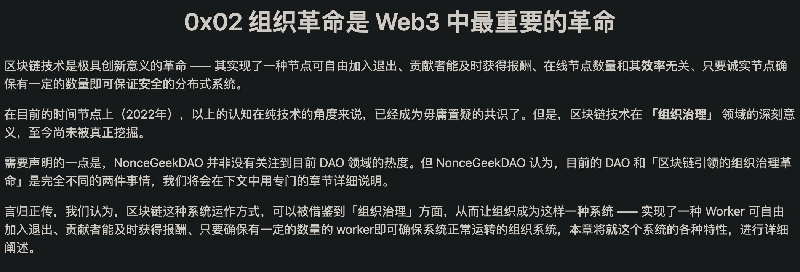
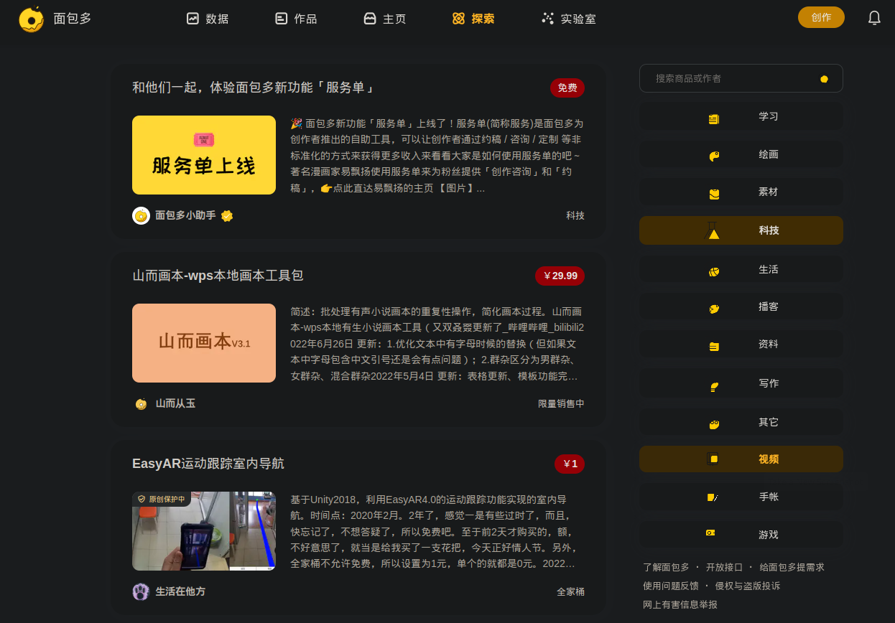
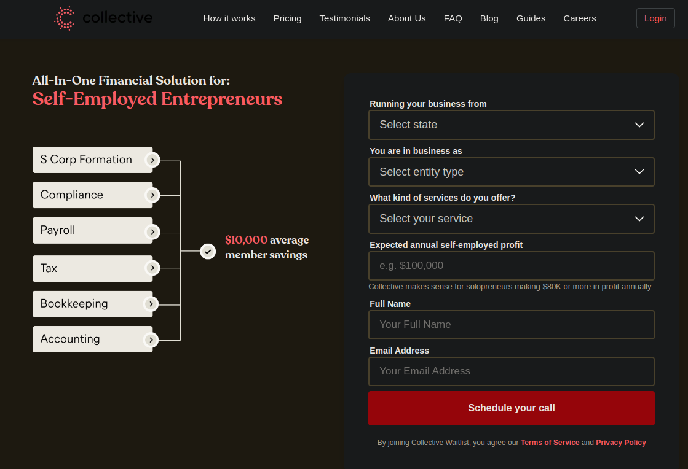

# 当我们说起DAO,我们在说什么
王建硕说,区块链就是以分布式的方式但实际提供给了世界一张共同的大表,大家共享这份表且都能在这张表上追加数据.又因为表里可以存代码,那大家就可以基于共同的代码运行合约.而DAO便是这种技术确保的共识下的组织形式.
>由章程和编码规则设定的自动化运行使DAO可以高效地运行,没有偏向,也无需信任任何一方.-- Scott David Meyer著;dave lin译

因为天然的信任,所以也无需监管,DAO实际上可以选择任意的治理结构,比如一人一票或者按贡献分权.权力的分配可以用代币来实现,并且还可以进行非常精细化的管理--有访问权限的代币,有修改权限的代币,有投票权限的代币等.
王建硕进一步[总结](https://mp.weixin.qq.com/s/JLqhzI92BuQ5bHTury4FPA)到,投票通过即转账，或许这就是 DAO 组织的最中心的，最重要的一个功能吧。而给 DAO 下一个定义，就是：**基于可量化的权力执行智能合约函数的组织**。

## 1. DAO的愿景是什么?
或者说我们的愿景是什么?一个人人平等、按劳分配、人尽其才的乌托邦世界.
DAO并不提高生产力,而是致力于解决分配和生产关系的问题.像DAO在做的事,一直在发生着,但和之前都不一样的是,现在我们设计的制度规则可以不再依赖人类自己来执行.
通过DAO有可能把成员变成真正的利益共同体从而真的接近那个乌托邦.

## 2. DAO变现还需要的
### 2.1. NonceGeekDAO
https://noncegeek.com/#/whitepaper

### 2.2. 面包多

### 2.3. Collective

### 2.4. 其他
https://github.com/easychen/lean-side-bussiness