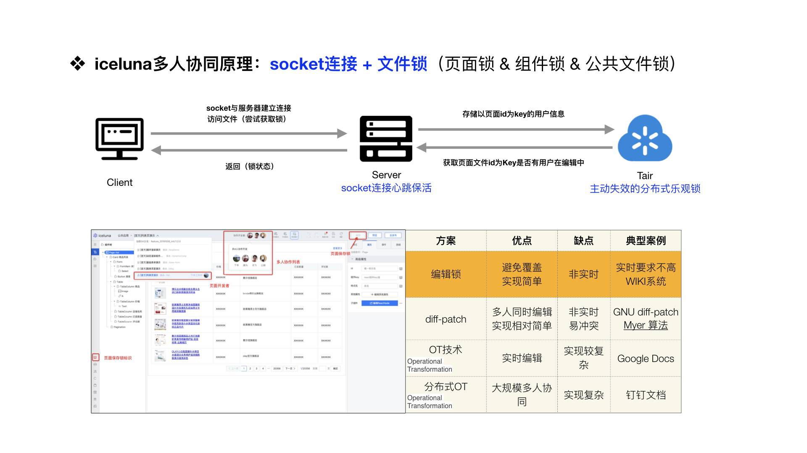

## 1. DevOps
1. [CI/CD](https://www.cnblogs.com/soymilk2019/p/11445773.html): 
- 持续集成（CONTINUOUS INTEGRATION）
- 持续交付（CONTINUOUS DELIVERY）
- 持续部署（CONTINUOUS DEPLOYMENT）
## 2. 语言
[Lisp:函数式语言实现各种算法](https://leanpub.com/progalgs/read#leanpub-auto-introduction)

## 3. Spring
[谈谈对Spring的理解](https://www.zhihu.com/question/48427693?sort=created)
[谈谈Bean](https://www.cnblogs.com/bossen/p/5824067.html)
## 4. TCP
[tcp](https://mp.weixin.qq.com/s?__biz=MzUxODAzNDg4NQ==&mid=2247484005&idx=1&sn=cb07ee1c891a7bdd0af3859543190202&chksm=f98e46cfcef9cfd9feb8b9df043a249eb5f226a927fd6d4065e99e62a645a584005d9921541b&mpshare=1&scene=1&srcid=&sharer_sharetime=1586105143609&sharer_shareid=f059618cb093f5efb49a39cd6562e90e&key=1511d86b2731e1c3fce9d31db1cd561a856c0af3e6538567ebb1ec791169ee22f6aefadfd007c649da861726c736268d0dcefa7715314a419b0eb52442ea0a07683859f5bdf7803cfa5fad7786da22b7&ascene=1&uin=MTM2NzczNTcyNQ%3D%3D&devicetype=Windows+10&version=62080079&lang=zh_CN&exportkey=A4cu64QiK9UQcFYp7uD2lbA%3D&pass_ticket=kHK9tI2bsS0GbhEAaq5h2HivE1Rl22anjR3frS7IDcVCuhi865duUItuzzZLJxhL)
### 4.1. Get/Post
[spring get/post](https://mp.weixin.qq.com/s?__biz=Mzg2OTA0Njk0OA==&mid=2247486635&idx=1&sn=9028d00727923f51240053666c9eb3a4&chksm=cea24360f9d5ca76e8afc7159c0dc463cf83adb798e68a39b2ba4f92f66971a60b70855384c4&scene=126&sessionid=1587650873&key=2e7b15926ee58d534bb61055bbcf5f6be38048621f41eecb36c7e80d5c2a6e1eebbaa2fea9fef7c7a2adf0367b0bd4570b1f191254f1caaebaa4155482b29d80bbf5d368f8f2213a833466d68cce5f87&ascene=1&uin=MTM2NzczNTcyNQ%3D%3D&devicetype=Windows+10&version=62080079&lang=zh_CN&exportkey=A0MDEsQHkxL7cGEnmMOMZWw%3D&pass_ticket=DNdQVzRiRNIsal3ptQFiDM%2Bvoj3dcpkR90GlPXnKpsx31rkShuO0yCmJWNuMdng%2F)

- GET - 从指定的资源**请求**数据
- POST - 向指定的资源**提交**要被处理的数据
[比较](https://www.w3school.com.cn/tags/html_ref_httpmethods.asp):
<div>

<table class="dataintable">
<tr>
<th style="width:20%;">&nbsp;</th>
<th>GET</th>
<th>POST</th>
</tr>

<tr>
<td>后退按钮/刷新</td>
<td>无害</td>
<td>数据会被重新提交（浏览器应该告知用户数据会被重新提交)</td>
</tr>

<tr>
<td>书签</td>
<td>可收藏为书签</td>
<td>不可收藏为书签</td>
</tr>

<tr>
<td>缓存</td>
<td>能被缓存</td>
<td>不能缓存</td>
</tr>

<tr>
<td>编码类型</td>
<td>application/x-www-form-urlencoded</td>
<td>application/x-www-form-urlencoded 或 multipart/form-data,为二进制数据使用多重编码。</td>
</tr>

<tr>
<td>历史</td>
<td>参数保留在浏览器历史中。</td>
<td>参数不会保存在浏览器历史中。</td>
</tr>

<tr>
<td>对数据长度的限制</td>
<td>当发送数据时，GET 方法向 URL 添加数据,而URL 的长度是受限制的（URL 的最大长度是 2048 个字符）</td>
<td>无限制</td>
</tr>

<tr>
<td>对数据类型的限制</td>
<td>只允许 ASCII 字符</td>
<td>没有限制。也允许二进制数据。</td>
</tr>

<tr>
<td>安全性</td>
<td><p>与 POST 相比，GET 的安全性较差，因为所发送的数据是 URL 的一部分。</p>
<strong>在发送密码或其他敏感信息时绝不要使用 GET ！</strong></td>
<td>POST 比 GET 更安全，因为参数不会被保存在浏览器历史或 web 服务器日志中。</td>
</tr>

<tr>
<td>可见性</td>
<td>数据在 URL 中对所有人都是可见的</td>
<td>数据不会显示在 URL 中</td>
</tr>
</table>
</div>

## 5. 注解是什么
https://blog.csdn.net/briblue/article/details/73824058?utm_medium=distribute.pc_relevant.none-task-blog-BlogCommendFromMachineLearnPai2-1.nonecase&depth_1-utm_source=distribute.pc_relevant.none-task-blog-BlogCommendFromMachineLearnPai2-1.nonecase
## 6. K-means算法
传统:https://www.cnblogs.com/multhree/p/11279140.html
改造：https://taohuawu.club/kmeans-algorithm-via-mapreduce

## 7. 异步编程
[async/await 阻塞了，如何异步不阻塞/并发](https://www.jianshu.com/p/5ef798a725d5)
### 7.1. 多人协作-锁

在 PaaS 平台，多人协作是一个不可缺少的一个能力，它的主要原理是通过 WebSocket 的连接加上一个文件锁的机制，文件锁目前在平台上包含页面锁、组件锁、应用级别公共文件锁这三个维度的锁。大体思路主要是利用WebSocket 的保活的机制，与 Tair 保持一个**心跳保活**的消息通信。在 Tair 侧则是存储一个主动失效的**分布式乐观锁**，然后去存储这个锁的信息，大概 10 秒钟之内没有新的心跳过来，这个锁就会失效。所以说一旦客户端或 Server 端的 client 断了之后，那这个文件锁就会被自动释放这样一个机制来做的多人协作服务。[我们](https://juejin.im/post/5e883bdee51d4546f70d0a7a)也对业界多人协作的方案做了一些调研，比如钉钉文档、Google Docs 等都利用了业界比较先进的 OT 技术，实现相对复杂，功能也更强大。对于低代码搭建编辑器场景来说，编辑锁的能力已经够用了。
### 7.2. 函数作为参数传递
[如何在Java中将函数作为参数传递？](http://www.imooc.com/wenda/detail/570759)
```java
package com.socket.demo;

import java.lang.reflect.Method;
public class Demo {

    public static void main(String[] args) throws Exception{
//      Class类保存着运行时系统为所有对象维护的被称为Runtimes的类型标志
        Class[] parameterTypes = new Class[1];
        parameterTypes[0] = String.class;
        Method method1 = Demo.class.getMethod("method1", parameterTypes);

        Demo demo = new Demo();
//        类的实例对象,反射调用的方法以及需要的message
        demo.method2(demo, method1, "Hello World");
    }

    public void method1(String message) {
        System.out.println(message);
    }
    /**
     * 把对象,方法作为参数传递
     * @param object
     * @param method
     * @param message
     * @throws Exception
     */
    public void method2(Object object, Method method, String message) throws Exception {
        Object[] parameters = new Object[1];
        parameters[0] = message;
        method.invoke(object, parameters);
    }
}
```
