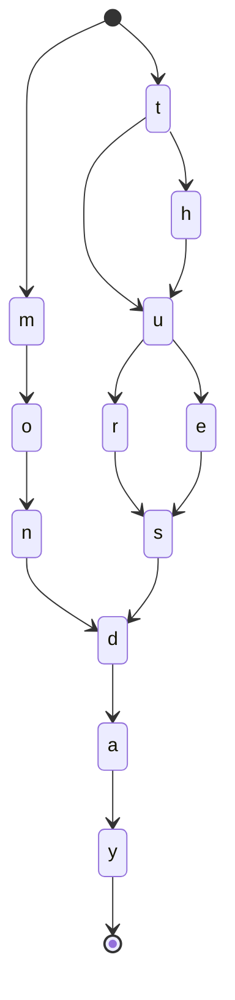

## 1. 数据类型
- 结构化数据：典型的如可以使用二维表结构来逻辑表达和实现的数据。
- 非结构化数据：不定长或无固定格式的数据，比如图片、音视频、Word文档等信息。
- 半结构化数据：可以根据需要按结构化数据处理，也可以当作非结构化数据的数据，比如XML、HTML等具有自己特定的标签格式的数据。
## 2. 数据检索
### 2.1. B+树
通常结构化数据会通过关系型数据库进行存储和管理，比如Mysql、Oracle等。以Mysql的InnoDB存储引擎为例，默认会使用B+树的聚簇索引方式组织二维表格结构化数据中的每一条记录：
- 使用记录主键值的大小进行记录和页（磁盘和内存之间的基本单位）的排序
    - 页（包括叶子结点和内节点）内的记录按照主键的大小顺序排成一个单向链表，页内的记录被划分为若干组，每个组中主键值最大的记录在页内的偏移量会被当作槽依次存放在页目录中。可以通过二分法快速定位到主键列等于某个值的记录
    - 各个存放用户记录的页也是根据用户记录的主键大小顺序排成一个双向链表
    - 存放目录项记录的页分为不同的层级，在同一层级中的页也是通过页中目录项记录的主键大小顺序排成双向链表
- B+树e的叶子节点存储的是完整的用户记录（包括默认的隐藏列）

### 2.2. 倒排索引（inverted index）
而对于非结构化数据，则需要将从非结构化数据选取某些信息提取出来再进行组织成索引。比如ElasticSearch使用的Lucene工具包中提供的倒排索引（inverted index）。
#### 2.2.1. 倒排索引的组成部分

1. 对原始文档`Doc`进行分词后得到倒排索引里面最小的存储和查询单元称为`Term`，对于英文来说是一个单词，对于中文来说一般指分词后的一个词。
2. 文档集合中出现的**不重复**词条 Term 的**有序**集合称之为词典`Term Dictionary`。因为是有序集合，所以可以使用二分法在LogN的时间复杂度内查找到对应Term。
3. 为了避免磁盘的随机读`random access`操作（10ms), 在词典之上再建立`term`前缀到词典的索引`Term Index`。Term Index 大小只有所有 term 的几十分之一，因此可以在内存中
3. 通过Term Index索引到的每条词典中的也是一条索引项，其记载term本身的一些信息以及指向倒排列表`Posting list`的指针。
4. 倒排表可以简单是一个int数组，记录某个词属于哪个文档的文档编号。其中每条记录称为一个倒排项`Posting`,倒排项还会存储单词出现的位置以及词频等信息。
5. 所有单词的`Posting list`一般顺序地存储在磁盘的倒排文件`Inverted File`。

`Term Index`、`Term Dictionary`与`Posting list`的关系如下图所示[^TermRelationship]：

[^TermRelationship]:https://www.infoq.cn/article/database-timestamp-02?source=app_share

#### 2.2.2. Term Index
##### 2.2.2.1. Trie 树
Trie 树即字典树，是一种空间换时间的数据结构，利用字符串的公共前缀来减少查询时间，最大限度地减少无谓的字符串比较。其通常可视化如下，遍历路径就是单词本身：

##### 2.2.2.2. FSM
Term Index 与字典树Trie树类似，但是为了极致的降低存储空间，还进行了压缩，使用了一种称为确定无环状态转化器`FST`（`Deterministic Acyclic Finite State Transducer`）的结构来构建词典。FST首先是一个有限状态机`FSM`(`Finite State Machines`)，即用来表示有限个状态的集合以及这些状态之间转移和动作的数学模型，简单说它有三个特征[^FSM]：

- 状态总数（state）是有限的。
- 任一时刻，只处在一种状态之中。
- 某种条件下，会从一种状态转变（transition）到另一种状态。
举个现实的例子：网页上有一个菜单元素。鼠标悬停的时候，菜单显示；鼠标移开的时候，菜单隐藏。如果使用有限状态机描述，就是这个菜单只有两种状态（显示和隐藏），鼠标会引发状态转变。

[^FSM]:http://www.ruanyifeng.com/blog/2013/09/finite-state_machine_for_javascript.html

##### 2.2.2.3. FSA
前面提到Term Dictionary是一个有序集合，对有序集合索引通常可以使用多路平衡二叉树实现，但也可以使用FSM的一种确定无环有限状态接收机`FSA`(`Deterministric acyclic finite state acceptor`)来实现。FSA具有这样的特性：

- 确定：意味着指定任何一个状态，只可能最多有一个转移可以访问到。
- 无环： 不可能重复遍历同一个状态
- 接收机：有限状态机只“接受”特定的输入序列，并终止于final状态。
传统的前缀树或者说字典树就是一种FSA，但TRIE树只共享前缀，而FSA不仅共享前缀还共享后缀[^FSA]。
假设我们有一个这样的Set: mon,tues,thurs。相应的TRIE是这样的，只共享了前缀。

TRIE有重复的3个final状态3，8，11. 而8，11都是s转移，是可以合并的，FSA共享后缀后：

[^FSA]:https://www.shenyanchao.cn/blog/2018/12/04/lucene-fst/

##### 2.2.2.4. FST
FST和FSA很像，但比它给定一个key除了能回答是否存在，还能输出一个关联的值[^FSA]。

具有这样的特性：

- 确定：意味着指定任何一个状态，只可能最多有一个转移可以遍历到。
- 无环： 不可能重复遍历同一个状态
- transducer：接收特定的序列，终止于final状态，同时**会输出一个值**。

##### 2.2.2.5. FAQ
以Term: Monday、TuesDay、ThursDay为例，FSA可以变成下面这样吗？

#### 2.2.3. 联合索引查询
假设现在查询学生信息，给定查询过滤条件 age=18 与gender= 女 ，对于Mysql来说如果只是如果你给 age 和 gender 两个字段都建立了索引，查询的时候会先采样选一个最好的，然后另外一个条件是在遍历行的过程中在内存中计算之后过滤掉；如果是建立了联合索引age-gender，那才可能一次定位到age=18 与gender= 女 的页。而Lucene的检索流程其实是[^AND]

>先从 term index 找到 18 在 term dictionary 的大概位置，然后再从 term dictionary 里精确地找到 18 这个 term，然后得到一个 posting list 或者一个指向 posting list 位置的指针。然后再查询 gender= 女 的过程也是类似的。最后得出 age=18 AND gender= 女 就是把两个 posting list 做一个“与”的合并。

[^AND]: https://www.infoq.cn/article/database-timestamp-02?source=app_share

>"与"的操作并不好做，通常有两种办法：
- 使用 skip list 数据结构。同时遍历 gender 和 age 的 posting list，互相 skip；
- 使用 bitset 数据结构。对 gender 和 age 两个 filter 分别求出 bitset，对两个 bitset 做 AN 操作。

##### 2.2.3.1. 利用 Skip List 合并

>以上是三个 posting list。我们现在需要把它们用 AND 的关系合并，得出 posting list 的交集。首先选择最短的 posting list，然后从小到大遍历。遍历的过程可以跳过一些元素，比如我们遍历到绿色的 13 的时候，就可以跳过蓝色的 3 了，因为 3 比 13 要小。
最后得出的交集是 [13,98]，所需的时间比完整遍历三个 posting list 要快得多。

##### 2.2.3.2. 利用 bitset 合并
>Bitset 是一种很直观的数据结构，对应 posting list 如：
[1,3,4,7,10]
对应的 bitset 就是：
[1,0,1,1,0,0,1,0,0,1]
每个文档按照文档 id 排序对应其中的一个 bit。Bitset 自身就有压缩的特点，其用一个 byte 就可以代表 8 个文档。所以 100 万个文档只需要 12.5 万个 byte。但是考虑到文档可能有数十亿之多，在内存里保存 bitset 仍然是很奢侈的事情。而且对于个每一个 filter 都要消耗一个 bitset，比如 age=18 缓存起来的话是一个 bitset，18<=age<25 是另外一个 filter 缓存起来也要一个 bitset。
Lucene 会对bitset再进行压缩，称之为 Roaring Bitmap。压缩的思路其实很简单。与其保存 100 个 0，占用 100 个 bit。还不如保存 0 一次，然后声明这个 0 重复了 100 遍。

这两种合并使用索引的方式都有其用途。Elasticsearch 对其性能有详细的[对比](https://www.elastic.co/blog/frame-of-reference-and-roaring-bitmaps)。简单来说对于简单的相等条件的过滤缓存成纯内存的 bitset 还不如需要访问磁盘的 skip list 的方式要快。
### 2.3. B+树 vs 倒排索引
>笼统的来说，b-tree 索引是为写入优化的索引结构。当我们不需要支持快速的更新的时候，可以用预先排序等方式换取更小的存储空间，更快的检索速度等好处，其代价就是更新慢，就像 ES。--Richard_Yi
#### 2.3.1. 优点
非结构化数据如果使用关系数据库中存储，再使用like的方式模糊查询，因为不能利用索引，效率是很低的；但是结构化数据如果使用倒排索引的方式去组织，查询尤其过滤查询性能仍然会得到提升。
‒ 相对于B+树即使是目录页也在磁盘中，倒排索引的不仅设计了Term Dictionary这样的目录页，还在其上又设计了一层使得定位Term更为迅速的Term Index，并且通过FST（Finite-state transducer）压缩使得能完全在内存中使用Term Index
‒ 在 Mysql 中给两个字段独立建立的索引无法联合起来使用，必须对联合查询的场景建立复合索引。而 lucene 可以任何 AND 或者 OR 组合使用索引进行检索。
    ‒ skip list过滤
    ‒ bitset的方式过滤
‒ Elasticsearch 支持 nested document，可以把一批数据点嵌套存储为一个 document block，减少需要索引的文档数。
‒ Mysql 如果经过索引过滤之后仍然要加载很多行的话，出于效率考虑 query planner 经常会选择进行全表扫描。所以 Mysql 的存储时间序列的最佳实践是不使用二级索引，只使用 clustered index 扫描主表。
‒ Lucene 支持分 segment，Elasticsearch 支持分 index。Elasticsearch 可以把分开的数据当成一张表来查询和聚合。相比之下 Mysql 如果自己做分库分表的时候，联合查询不方便。

#### 2.3.2. 缺点
搜素引擎可以带来查询性能提升，但是相对Mysql也有一定局限性，比如对深分页支持效果不好，搜索最好不要超过5000条，搜索结果的排序、统计在大数据量时结果不稳定等。然后我们再看集团内选哪款搜索引擎。
### 2.4. ElasticSearch更多优化

当索引上数据量太大，需要进行水平拆分，这并不像InnoDB的页分裂，因为数据并不会重新排序，而像Mysql数据量太大时的分库分表的水平拆分。拆分出来的索引数据块称为分片（sharding）。创建索引的时候就确定好主分片的数量并且最好不要改变这个数量，因为分片后原本对查询的路由都会无效。

为了提高集群稳定性和读时的高并发，还可以对索引数据做副本（Copy）。不过这同时也会增加写成本。

分Segment存储，Segment不可变

实时构建的索引为一个新的Segment

## 3. 使用注意事项
1. 使用的索引ID最好要有规律性，UUID那种非常不适合Lucene查询

