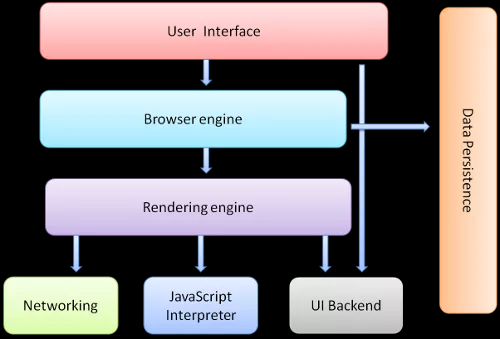

简单来说,浏览器地址栏上的地址就是Url.有时候那里还能看到中文。但浏览器最终会把中文用 字符编码+`Percent Encode`翻译为真正的url，再发给服务器。浏览器地址栏里的中文只是想让用户体验好些而已[^深入理解GET与POST]。


**总体流程如下图:[^0]

[^0]:[从URL输入到页面展现到底发生什么？](https://github.com/ljianshu/Blog/issues/24)


## 1. DNS解析
通过URL寻找用IP地址标志的哪台机器上有你需要资源的过程或者说技术。[^1]

[^1]:[从输入URL到页面加载发生了什么](https://segmentfault.com/a/1190000006879700#item-1-1)

- DNS:Domian name Server,一种用于TCP/IP应用程序的**分布式数据库**
    - 本地域名服务器
    - 根域名服务器,如`.`
    - 顶级域名服务器,如`com`
    - 二级域名服务器,如`segmentfault.com`
    - 主域名服务器,如`segmentfault.com`
    - DNS多级缓存:浏览器缓存->系统缓存(`hosts`文件中)->路由器缓存-> ISP服务器缓存-=>根域名服务器缓存，顶级域名服务器缓存，主域名服务器缓存[^2]
        - ISP:Internet Service Provider
[^2]:[一个用户在地址栏输入例如www.baidu.com,DNS解析大概有10个过程](https://www.cnblogs.com/fanfan0916/p/9369913.html)

- URL: Uniform Resorce Location,`https://segmentfault.com/a/1190000006879700#item-1-1`->`https://`~~WWW.~~`segmentfault.com`~~.~~  ~~:443~~`/a/1190000006879700``#item-1-1`
    - 协议,如`https`
    - 主机服务器,如`www.segmentfault.com`
    - 域名,如`segmentfault.com`
    - 端口,如`443`
    - 套接字,如`https://WWW.segmentfault.com:443`
    - 服务器内路径,如`/a/1190000006879700`
    - 锚点(目录/书签),如`#item-1-1`
- WWW:一组**分布式**通信应用程序和系统软件,使用`超文本数据结构`建立在Internet上的**信息组织形式**与表现形式,包括`Web客户端`(Client)与`Web服务器端`(Server).S端往往由大量的计算机集群组成.
- IP地址:标志了某台可以响应Client的请求的服务器

## 2. TCP连接

上一步DNS解析拿到了服务器的IP地址,客户端在http对应的端口号,一般是`80`发起TCP连接,而启动后的服务端一直在`80`端口监听,处于`Listen`状态.之后建立连接的过程可以描述为三次握手.
(为了实现应用层的服务,这里是`http`,客户端需要在传输层与服务端间建立TCP连接.)
### 2.1. 为什么握手,和你很熟吗?
1. 为什么要握手,为什么不能像UDP一样直接发送?
`http`协议,只能Client发起请求,单工
`tcp`协议,C/S可以双向数据传输,双工.为了准确性,双方同时发,必须要知道对方的**序列号**,才能知道对方是收到了我的哪一个消息.知道是哪一个消息后才能做到:

    1. 接收方去除重复的数据
    2. 接受方按序接受
    3. 告诉发送方数据包已被接受
- 序列号不会从0开始,因为C/S之间会有很多连接,也会断开又建,连接之间如果从0开始,不同连接之间产生互相影响产生混淆.所以序列号会被随机初始化.且为了安全性,序列号不应被猜出,所以随机生成算法会采用 MD5 等hash算法.
为了同步序列号,包括其他的状态信息如最大的报文长度/同步的滑动窗口大小必须客户端与服务端之间进行握手.

2. 什么是连接?
事实上,RFC对TCP连接的定义正是TCPs对字节流的状态信息,包括Socket,序列号和窗口大小的初始化与维护.建立一个TCP连接实际是要C/S达成三个状态信息的共识:
- Socket: 由IP地址和端口号组成
- 序列号:用来解决乱序问题
- 窗口大小:用来做流量控制(来不及接收也会被丢弃)

这也正是说TCP是面向连接的协议的意思,即使用TCP前必须先建立连接.

3. TCP连接过程

4. 为什么是3次握手?

- 正常想法应该是4次,一次发序列号,一次收到,一次发序列号,一次收到

先看为什么不能是4次:

- 关连接的时候让连接继续处于半打开状态传输消息,而握手的时候不允许处于半打开的状态就传输消息--而这被TCP规范所不允许,这样Server在回ack的情况下就必须发回自己的序列号,因而是三次握手;此外,本来服务端发回序列号的时候也可以一起发回ack

为什么不能是2次?

- 因为二次握手不能使发送方拒绝由网络中阻塞的旧的`SYN`导致的历史连接.
两次握手可能造成阻塞的`SYN`到达后多个无效的连接被建立,而三次握手则允许客户端通过上下文判断出这个是历史连接后,发送`RST`报文给服务端终止这个历史连接.

### 2.2. 实际TCP连接
#### 2.2.1. 网络请求耗时图
[Timing tab](https://developers.google.com/web/tools/chrome-devtools/network/reference#timing-explanation)源于调试浏览器的Network部分


#### 2.2.2. 以LSP为例
1. Create Connection
```ts
import {createCollection} from　'vscode-languageserver';
let connection = createConnection(ProposedFeatures.all);
```

- 对`createConnection<>(factories: Features<>,strategy)`有两个参数:
```ts
 * @param factories: the factories to use to implement the proposed API
            类似于Java中的工厂类:Features<PConsole , PTracer , PTelemetry , PClient , PWindow , PWorkspace , PLanguages,strategy>
 * @param strategy : An optional connection strategy to control additional settings:CallHierarchy & st.SemanticTokens
```
2. Initial connetion:初始化连接,一般就是TCP3次连接握手.这里应该在第三次握手携带信息Tell the client that what the server supports
```ts
connection.onInitialize((params: InitializeParams) => {
	return {
		capabilities: {
            // 双工通信?
			textDocumentSync: TextDocumentSyncKind.Full,
			completionProvider: {
				resolveProvider: false,
				triggerCharacters: ['<', '-', '+', '[', '(']
			},
			hoverProvider:true,
		}
	};
});
```
3. Initialized
```ts
connection.onInitialized(() => {
	connection.window.showInformationMessage("Welcome to DevUIHelper");//这里是弹窗本地显示,代表三次连接完成
	if (hasConfigurationCapability) {
		// Register for all configuration changes.
		connection.client.register(DidChangeConfigurationNotification.type, undefined);
	}
})
```
4. Monitored files have change in VSCode
```ts
connection.onDidChangeWatchedFiles(_change => {
	connection.console.log('We received an file change event');//用于调试
});
```
5. Make the text document manager listen on the connection;for open, change and close text document events.

```ts
documents.listen(connection);//猜测是服务器文本管理器对服务器响应的监听
```
6. Start listening on the input stream for messages to process.
一开始客户端和服务端都处于`Closed`状态,后来服务端打开端口,主动监听某个端口,处于`listen`状态.但是之后仍

```ts
connection.listen();//这里是必须的吗,保持监听?
```


## 3. 发送HTTP请求
### 3.1. Http的诞生
`HyperText Transfer Protocol`是为了实现网络中主机**资源**（注意是个名词）共享而提出的通讯协议，最早用作B/S之间交互HTML和表单；后来又被被广泛的扩充到接口格式的定义上。浏览器可以**在第三次TCP握手的时候携带信息**,此时可将 IP 地址打在协议上，同时协议搭载请求参数,


一个http请求中的url原意描述的是一个资源。
### 3.2. Http请求格式
#### 3.2.1. 原生请求格式

```xml
<request-line>
<headers>
<blank line>
[<request-body>]
```

1. 请求的第一行必须是一个`request line`:

- 请求类型
- 要访问的资源
- 使用的HTTP版本
- (querystring,不是必要的附加的参数)

2. 紧接着才是俗称的http**首部**(`headers`)，用来说明服务器要使用的附加信息;头部一般会包括HOST

    - 请求头一般指的是 `request-line`+ `headers`
3. 在首部之后一定会跟一个空行
4. 最后是`body`部分,这里理论上可以添加任意的其他数据

**GET**请求
对于www.baidu.com的GET请求如下所示：
```http
GET / HTTP/1.1
Host: www.baidu.com
User-Agent: Mozilla/5.0 (Windows; U; Windows NT 5.1; en-US; rv:1.7.6) Gecko/20050225 Firefox/1.0.1
Connection: Keep-Alive
```
上述请求依次告诉服务器什么信息?
```xml
<request-line>
我是GET请求 我请求该域名的根目录(`/`) 我用的是HTTP 1.1版本
<headers>
我向www.baidu.com域名发起请求
User-Agent是帮助我出去的浏览器"指纹"信息:User-Agent，这里它是Firefox 1.0.1\
因为预计后面还有很多请求走这,我要Keep-Alive(其实http 1.1默认长连接)
<blank line>

```
通常,GET请求的附加参数以queryString的形式位于请求后部，但其实http协议对此没有规定.

>浏览器上方的地址栏中直接输入地址触发的一般就是GET请求

**POST请求**
可以看到这里的POST请求的header多了两个必要的参数:Content-Type与Content-Length.
```http
POST / HTTP/1.1
Host: www.baidu.com
User-Agent: Mozilla/5.0 (Windows; U; Windows NT 5.1; en-US; rv:1.7.6)
Gecko/20050225 Firefox/1.0.1
Content-Type: application/x-www-form-urlencoded
Content-Length: 40
Connection: Keep-Alive
```
这是因为浏览器的POST请求都来自表单(`form`)提交,表单的数据被浏览器用编码到HTTP请求的body里,这里就分为多种格式(`Content-Type`):

- application/x-www-form-urlencoded,用来传输简单的数据
    - "key1=value1&key2=value2"这样的格式
    - json:可以有嵌套结构,从而被服务器代码映射为业务实体
- multipart/form-data格式,用来传文件
- GraphQL

**注意以上都是在浏览器的情境下**
http其实相当自由,理论上允许参数放url的path里，querystring里，body里或header里.
而且如果是Ajax或者其他HTTP Client发出去的POST请求，其body格式也非常自由了，常用的有json，xml，文本，csv……甚至是你自己发明的格式。只要前后端能约定好即可[^深入理解GET与POST]。
所以原生的http扯皮也会比较多,于是诞生了一些接口规范/风格,比如著名的`Restful`.

#### 3.2.2. Rest请求格式
REST的设计目标是解决互联网级别的信息共享和互操作问题[^大宽宽]，url主体是资源，是个名词[^Vincross]。
[^Vincross]:[WEB开发中，使用JSON-RPC好，还是RESTful API好？](https://www.zhihu.com/question/28570307/answer/163638731)
[^大宽宽]:[WEB开发中，使用JSON-RPC好，还是RESTful API好？](https://www.zhihu.com/question/28570307/answer/541465581)

- `GET` + URL : 获取资源或者资源列表
    - <Header>
-  `POST` + URL : **创建**一个资源
    - <Header>
    - {json串}
- `PUT` + URL : **替换**一个已有记录
    - <Header>
    - {json串}
- `DELTE` + URL : 请求删除一个资源
    - <Header>
    - {json串}

**注意**

- `PUT`与`POST`的区别在于对于处理的资源名是否已经知道,即语义上PUT是已知资源替换资源,POST则是创建.
    - 如果开发者继续在原本语义上将`PUT`实现为没有则创建资源,将`POST`实现为有则更新资源,那么两者在结果上自然没有区别
- GET与POST具体怎么用还是要看实际:
    - Elastic Search的_search接口使用GET+body来查询.因为查询很复杂，用querystring很麻烦,在请求体中用json编码又更加容易,不用折腾percent encoding。那为什么不用POST?因为语义更重要.

#### 3.2.3. GET与POST的[比较](https://www.w3school.com.cn/tags/html_ref_httpmethods.asp)

<div>

<table class="dataintable">
<tr>
<th style="width:20%;">&nbsp;</th>
<th>GET</th>
<th>POST</th>
</tr>

<tr>
<td>后退按钮/刷新</td>
<td>无害</td>
<td>数据会被重新提交（浏览器应该告知用户数据会被重新提交)</td>
</tr>

<tr>
<td>书签</td>
<td>可收藏为书签</td>
<td>不可收藏为书签</td>
</tr>

<tr>
<td>缓存</td>
<td>能被缓存</td>
<td>不能缓存</td>
</tr>

<tr>
<td>编码类型</td>
<td>application/x-www-form-urlencoded</td>
<td>application/x-www-form-urlencoded 或 multipart/form-data,为二进制数据使用多重编码。</td>
</tr>

<tr>
<td>历史</td>
<td>参数保留在浏览器历史中。</td>
<td>参数不会保存在浏览器历史中。</td>
</tr>

<tr>
<td>对数据长度的限制</td>
<td>当发送数据时，GET 方法向 URL 添加数据,而URL 的长度是受限制的</td>
<td>无限制</td>
</tr>

<tr>
<td>对数据类型的限制</td>
<td>只允许 ASCII 字符</td>
<td>没有限制。也允许二进制数据。</td>
</tr>

<tr>
<td>安全性</td>
<td><p>与 POST 相比，GET 的安全性较差，因为所发送的数据是 URL 的一部分。</p>
</td>
<td>POST 比 GET 更安全，因为参数不会被保存在浏览器历史或 web 服务器日志中。</td>
</tr>

<tr>
<td>可见性</td>
<td>数据在 URL 中对所有人都是可见的</td>
<td>数据不会显示在 URL 中</td>
</tr>
</table>
</div>

**注意**

- HTTP协议是自由的,其本身对URL长度并没有做任何规定,实际的限制是由C(主要是Browser)/S决定的。如 IE max URL 2048 byte,其他略多但
受到S端限制8000+.

- <strong>在发送密码或其他敏感信息时绝不要使用 GET ！</strong>但其实用POST放Body里也不安全,还是得上`https`
### 3.3. 应用进程
之前为了支持HTTP,开放了80端口以建立TCP连接:

- 80端口,主要用于在WWW(`World Wide Web`，万维网)服务上传输信息(网页浏览)
- 8080端口：同80端口，一般用于WWW代理服务

自然根据应用**进程**需要协议的不同,还有其他port对应各自的应用进程,如:

- 21端口：主要用于`FTP`(File Transfer Protocol，文件传输协议)服务
- 23端口: 主要用于`Telnet`(远程登录)服务，是Internet上普遍采用的登录和仿真程序
- 25端口：为SMTP(Simple Mail Transfer Protocol，简单邮件传输协议)服务器所开放，主要用于发送邮件
- 53端口：为DNS(Domain Name Server，域名服务器)服务器所开放，主要用于域名解析
- 443端口：网页浏览端口，主要是用于`HTTPS`服务，是提供加密和通过安全端口传输后的HTTP

一般来说,1000以内的端口都有默认的配对的应用进程.1000以上的端口一般可以自己占用,但是有可能已经被其他运行中的进程占用:

- 1080端口: Socks代理服务使用的端口,允许防火墙后面的人通过一个IP地址访问INTERNET
- 4000端口: QQ服务端端口

### 3.4. 数据包分组发送

TCP工作在全双工模式，建立连接后TCP会将需要传输的数据包划分为`TCP Segment`在B/S之间双向数据传输，并允许同时进行。
1)  发送数据 ：服务器向客户端发送一个带有数据的数据包，该**数据包中的序列号**和确认号与建立连接第三步的数据包中的序列号和确认号相同；

2)  确认收到 ：客户端收到该数据包，向服务器发送一个确认数据包，该数据包中`序列号`为`上一个数据包中的确认号值`，而`确认号`为服务器发送的`上一个数据包中的序列号+该数据包中所带数据的大小`。

这里序列号用于确认收到,确认号则确认收到无误.在这里,如果只有确认号也可以达到保证收到及无误的作用,但是序列号还可以使:

- 接受方去除重复的数据
- 接受方可以根据数据包的序列号按序接受

因此不能省略序列号.
## 4. 服务器处理请求并返回HTTP报文

### 4.1. Http响应格式
#### 4.1.1. 原生响应格式
```xml
<status-line>
<headers>
<blank line>
[<response-body>]
```
与请求唯一真正的区别在于第一行中用状态信息代替了请求信息。状态行（`status line`）通过提供一个状态码来说明所请求的资源情况。
以下就是一个HTTP响应的例子：
```http
HTTP/1.1 200 OK
Date: Sat, 31 Dec 2020 23:59:59 GMT
Content-Type: text/html;charset=utf-8
Content-Length: 2333

<html>
<head>
<title>Http Response</title>
</head>
<body>
<!-- body goes here -->
</body>
</html>
```

#### 4.1.2. Http状态信息

位于响应报文的开始行中,常见的http状态码分为

* 1XX 保留 
* 2XX 表示成功 
* 3XX 表示URL已经被移走 
* 4XX 表示客户错误 
* 5XX 表示服务器错误 

具体常见的状态码:

| 状态号 |                  说明                   |
| ------ | --------------------------------------- |
| 200 OK | 请求成功（其后是对GET和POST请求的应答文档) |
301 Moved Permanently | 所请求的页面已经转移至新的url。如`http`转`https`
302 Redirected | 在 `Post/Redirect/Get` Web开发设计模式中频繁使用
304 Not Modified | 未按预期修改文档。客户端有对应缓存并发出请求:只想更新某一日期后;服务器告诉客户，原来缓存还可以继续使用
400 Bad Request|服务器未能理解请求.如SpringBoot启动后?
403 Forbidden|对被请求页面的访问被禁止.如访问外网或输入了不正确的用户名或密码
404 Not Found |服务器尚未找到与请求的 URI (统一资源标识符)匹配的任何内容
405 Method not allowed |  方法不被允许.可能因POST,如 Web 服务器没有被设为从客户端接受输入数据或权限不够,docker部署Metis
408 Request Timeout |请求超出了服务器的等待时间
500 Internal Server Error | 请求未完成。服务器遇到不可预知的情况
502 Bad Gateway |请求未完成。服务器从上游服务器收到一个无效的响应
504 Gateway Timeout | 网关超时(网关不可达?)
505 HTTP Version Not Supported | 服务器不支持请求中指明的HTTP协议版本
### 4.2. 记录客户端状态
#### 4.2.1. http无状态
设计决策基于以下想法：上传到网站的内容可以位于多个不同的服务器上。[^full-stack]大多数Web流量与检索未更改的内容有关，服务器和浏览器软件的实现者不一定需要预留资源维护用户空间。

[^full-stack]: [HTTP协议无状态性和cookie](https://materiaalit.github.io/wepa-s17/part3/)

#### 4.2.2. Cookie
但是服务器端的业务往往需要是有状态的,如用户的登录次数,账号密码等。因此HTTP / 1.1允许服务器端生成Cookie，发送给**浏览器端**的`User-Agent`,User-Agent会将`Cookie`的`key/value`保存到某个目录下的文本文件内，下次请求同一网站时就发送该Cookie给服务器,如:
`__gads:ID=5ce68c103a29bff9:T=1584344058:S=ALNI_MaEB9uF5WNppBI895U2UNX44CMb0Q1`.
第三方传递cookie,最常见的是共享域名的方式.

#### 4.2.3. Session
`HttpServletRequest.getSession()`方法创建Session保存在服务器上,发到客户端的只有`Session id`；
当客户端再次发送请求会将这个**存储在cookie中**的`Session id`带上，服务器接受到请求之后就会依据Session id找到相应的`Session`;
如果没有找到,则将新的Cookie返回浏览器并启动新的Session.


#### 4.2.4. 应用场景
1. cookie不是很安全，别人可以分析存放在本地的COOKIE并进行COOKIE欺骗，考虑到安全应当使用session；

2. session会在一定时间内保存在服务器上,并且cookie--ascii,session却可以string,故Session的使用比Cookie方便,但访问加大会占用服务器的资源,降低性能。考虑到减轻服务器负担，应当使用COOKIE；

3. 综合安全和性能考虑,可以将登陆信息等重要信息存放为session,其他信息如果需要保留，则放在cookie中;

4. 服务端的session的创建是依赖客户端的cookie的,所以cookie被清除,或者cookie过期时,服务端的session会被动丢失.而当浏览器完全禁掉cookie时,session将无法使用.

## 5. 浏览器解析渲染页面[^DOM]

[^DOM]:[从 HTML，CSS 和 JS 的解析，DOM 树的建立；到最终的渲染，布局和动态调整](https://shaunlebron.github.io/pacman-mazegen/)

浏览器的主要构件:

一个 Webkit 内核的浏览器工作流程图:

## 6. TCP挥手--连接结束

1. 为什么要四次才会断开握手?

    因为TCP工作在全双工模式,每个方向上需要单独关闭.在一方请求关闭--收到确认(最后一次自己发送的报文收到的)报文关闭之后,另一方可能还需要发送数据,也需要重复这一过程,所以是四次握手

2. **主动关闭方收到`FIN`报文后为什么还要等待`2MSL`才进入`CLOSE`状态?**
    MSL:Maximum Segement Lifetime,报文最大生存时间(default 2min,必须大于`TTL`(跳数为单位)).之所以用到它还是与网络报文到达的不确定性有关.
    - 如果主动关闭方的`ACK`报文丢失了,则会触发被动关闭方超时重传`FIN+ACK`报文段,之后主动关闭方再重传一次确认进行最后一次挥手,并**重新启动**2MSL计时器.
        - 那么在丢了ACK的情况下,如果不等待2MSL,被动关闭方将不能正常进入`CLOSED`状态.而触发超时重传到被动关闭方重发`FIN`到达的时间小于等于`2MSL`.
        - 所以MSL不可以太小,否则ACK丢了`FIN`重发到不了主动关闭方;也不可以太大,否则白白等待.
    - 另一方面,如果不等待2MSL就关闭,如果有历史连接请求到达被动关闭方,被动关闭方的回复就无法得到主动关闭方的响应,如`RST`报文的拒绝.而历史连接到达与服务器返回报文的时间最多就2MSL.
        - 等待2MSL之后,**本连接持续的时间内所产生的所有报文也就将从网络中消失**.


[^深入理解GET与POST]:[深入理解GET与POST](https://blog.csdn.net/bingxuesiyang/article/details/102474310?utm_medium=distribute.pc_relevant_bbs_down.none-task--2~all~first_rank_v2~rank_v28-9.nonecase&depth_1-utm_source=distribute.pc_relevant_bbs_down.none-task--2~all~first_rank_v2~rank_v28-9.nonecase)