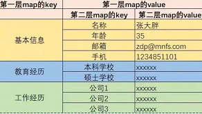

连接数据库是一个很容易出错,出错后因为原因众多又难以定位的一个bug.

## 1. 检查数据库连接配置 

### 1.1. 密码什么的错误吗?
### 1.2. 确认用户权限
1. 创建用户时需要这样:
```sql
GRANT ALL PRIVILEGES ON *.* TO 'itoffice'@'%' IDENTIFIED BY 'itoffice' WITH GRANT OPTION;
flush privileges;
```
第一个itoffice表示用户名，%表示所有的电脑都可以连接，也可以设置某个ip地址运行连接(这样安全些)，第二个itoffice表示密码[^用户权限]:
[^用户权限]
  
2. 检查是否创建成功
`SELECT DISTINCT CONCAT('User: ''',user,'''@''',host,''';') AS query FROM mysql.user;`
或者这样检查

### 1.3. 使用`com.mysql.jdbc.Driver`时
或者简单点说就是你的url咋写的
- `jdbc:mysql://127.0.0.1:3306/ --username hive --password hive`
- `jdbc:mysql://127.0.0.1:3306/hive?characterEncoding=utf-8 --username hive --password hive`
**注意第二种**
### 1.4. 使用`com.mysql.cj.jdbc.Driver`
貌似还需要指定时区那些,暂略
## 2. 测试本地连接
写一个简单的jdbc数据库测试本地连接[^测试本地连接]
[^测试本地连接]:[JDBC数据库连接本地数据库的报错问题：Communications link failure](https://blog.csdn.net/qq_41907816/article/details/89104699?utm_medium=distribute.pc_relevant_t0.none-task-blog-BlogCommendFromMachineLearnPai2-1.nonecase&depth_1-utm_source=distribute.pc_relevant_t0.none-task-blog-BlogCommendFromMachineLearnPai2-1.nonecase)


## 3. 各版本对应关系
### 3.1. mysql-connector-java与Mysql对应版本
`mysql>select version()`可以查看数据库版本.

### 3.2. mysql-connector-java与Java对应版本

### 3.3. openSSL
- **5.x版本**
```properties
driver=com.mysql.jdbc.Driver
url=jdbc:mysql://localhost:3306/mybatis?useSSL=false&useUnicode=true&characterEncoding=UTF-8
```
注意useSSL=false必须为`false`

- **8.x版本**
```properties
driver=com.mysql.cj.jdbc.Driver
url=jdbc:mysql://localhost:3306/mybatis?useSSL=true&useUnicode=true&characterEncoding=UTF-8&serverTimezone=U
```
## 4. 排查是否线程超时
### 4.1. Mysql服务器默认的“wait_timeout”是8小时
`mysql﹥ show global variables like 'wait_timeout'; `可以查看到,这意味着如果一个`connection`空闲超过8个小时，Mysql将自动断开该connection。

### 4.2. 重置`wait_timeout`
```sh
set global wait_timeout=604800; 

set global interactive_timeout=604800;
```

或者直接修改`my.ini`(windows下),`my.cnf`(linux下)
## 5. 防火墙是否关闭
**默认是关闭的.**但是依然有可能屏蔽3306端口.

1. 设置防火墙允许3306端口
`vi /etc/sysconfig/IPtables`
2. 添加（添加在`-A RH-Firewall-1-INPUT -j REJECT –reject-with icmp-host-prohibited`之前）
`-A RH-Firewall-1-INPUT -m state --state NEW -m tcp -p tcp --dport 3306 -j ACCEPT`


3. 重启防火墙
`service iptables restart`

## 6. Mysql默认跟随Ubuntu等使用的验证插件有问题
以至于在`root@%`的情况下能使用`localhost`登录,不能使用`127.0.0.1`登录,并在修改user表至下图后:

造成下面[Error 1698](https://stackoverflow.com/questions/39281594/error-1698-28000-access-denied-for-user-rootlocalhost) 和 [Error 1045](https://stackoverflow.com/questions/21944936/error-1045-28000-access-denied-for-user-rootlocalhost-using-password-y/42967789#42967789)同框:

最终只能卸载Mysql,重新解决1698的问题.并注意重新设置验证插件后,**没有密码**,需重新指定密码.

## 7. 其他
error2003,可以限制只监听3306端口,但是放开所有IP

update-alternatives: 使用 /etc/mysql/my.cnf.fallback 来在自动模式中提供 /etc/mysql/my.cnf (my.cnf)
## 8. 各人谈数据库
### 8.1. 多是数据密集型应用
>Xujiu@Sapesn:大部分APP-数据密集型应用，不从轮子做起,就与数据结构和算法没关系。主要创造性的工作往往在**数据模型**和**数据流设计**上。实际生产中，数据表就是数据结构，索引和查询就是算法，应用代码往往扮演胶水角色，处理IO和业务逻辑，在数据库系统之间搬运数据。架构师最重要的能力之一，就是能够灵活地权衡取舍/集成拼接数据系统。
第一代:网状和层次数据库系统
第三代:面向对象数据模型为主要特征的数据库系统
>- 支持一致性管理/对象管理/事务管理
第二代:关系型数据库系统

事务与ACID其实是为了帮程序员屏蔽底层并发的细节.
### 8.2. Not Only Sql
- 高并发下,数据库IO非常缓慢
    - `key-value`形式:redis、memcached
- 关系数据库难以应付复杂数据
    - 数据是树状结构(如`json`):MongoDB、CouchDB
    - 社交关系等图结构:Neo4j
- 百亿条级别的大数据,以及这种大数据往往并不需要ACID,比如转发的微博数据、日志数据和物理网数据等,可以异步/错误/不清晰
    - 列式(如两级嵌套的map)数据库:HBase
    
- 传统数据库底层是B树/B+树,降低树的高度避免IO,但存储性能值得探讨
    - 专业的时间序列数据库:InfluxDB
### 8.3. ACID vs CAP
|              词语               |                 数据库                  |              CAP              | 迷惑? |
| ------------------------------- | --------------------------------------- | ----------------------------- | ----- |
| 事务                            | 一组不可分割的操作(包括ACID)             | -                             | -      |
| 持久化 (Durability)             | 状态更改故障/重启后不受影响               | -                             | -      |
| 一致性(Consistency)             | 数据本身的完整性约束(数据类型,范围.etc)   | "原子一致性"模型的简称         | 不同义 |
| 隔离性(Isolation)               | 多个事务并发执行结果可以像事务顺序执行一般 | 被包含着CAP的一致性模型中      | 被包含 |
| 原子性(Atomicity)               | 所有更改要么全部发生,要么全部不发生       | 原子一致性模型                 | 不同义 |
| 可用性(Availability)            | 按时间计使用率                           | 非故障节点应至少响应一次        | 不同义 |
| 分区容错性(Partition-toleranceh) | - \ (水平分片&垂直分区?)                 | 两组节点分区时,它们之间消息丢失 | -      |

note:

- 顺序一致性:所有处理器的内存访问是交叉的,然而程序的行为好像它们是按顺序执行的
- 原子/线性一致性:顺序一致性+**实时约束**.线性一致性假设所有处理器共享全局时间
- Isolation
    - `serializable`可序列化:读写均锁**表**,强行**单线程**操作....开发人员可以躺平了
    - `repeatable read`:事务开始时建立一致性视图,读取时若`DB_TRX_ID`(处理的事务数ID)在视图建立前未提交,则读到的是原来的数据(多版本并发`MVCC`的基础)
    - `read committed`读取已提交数据:写的时候锁行,写完了commit再允许被读
    - `read uncommitted`读取未提交数据:什么也不做,只要内存中改了记录就能被读
- Base理论，基本可用->最终一致性


## 9. 优化SQL
对数据库的操作依然离不开查找和排序，并且传承于通用的数据结构与算法。
### 9.1. 对传统索引的理解
#### 9.1.1. 只是支持快速查找的数据结构
索引的本质在**查询关键字**与**数据库记录**之间建立的一种支持快速查找的数据结构 ，不一定是b+树，也可以是hash索引，也可以是b树/二叉树/数组/n叉树等等。
因为磁盘相比主存慢十万倍，而磁盘一次能取一个扇区的数据[^WhyB]，因此索引的设计应当使每次磁盘`I/O`取到内存的数据都能帮助后续记录的定位，尽可能减少IO的次数。以第二行做二叉树形式的索引结构如下：
[^WhyB]:[文件系统和数据库是由于什么原因才选择 B 树或 B+ 树建立索引的？](https://www.zhihu.com/question/62406977)


- B树（多路平衡二叉树）俯视图[^BTree]：


[^BTree]:[MySQL索引凭什么能让查询效率提高这么多？](https://juejin.im/post/6869532756498448392?utm_source=gold_browser_extension)

- B+树只是一种均衡各方面的产物：


|        操作         |   Hash   | 有序数组 |  二叉树  |      b树(B-tree,Balanced Tree)      |                  b+树                  |                  b*树                   |
| ------------------ | -------- | -------- | ------- | ----------------------------------- | ------------------------------------- | --------------------------------------- |
| Insert             | O(1)     | O(n)    | O(logn) | n叉树，每个节点可以有1200个叉         | n叉树，优化b树存储，提供范围查找          | n叉树，优化b+树页分裂空间利用率低的问题     |
| Remove             |          |          | O(logn) | 树高不超过3                          | **所有Key只在叶子节点上出现一次**       | 非叶子节点的兄弟节点之间也通过指针相连      |
| Update             |          |          |         | 最多只需要访问3次磁盘就可定位数据块    | 所有非叶子节点都是**叶子节点**的索引     | 如果节点上的子节点满了                     |
| Find               | O(1)     | O(logn)  | O(logn) | 极少io--根节点总在内存中              | 叶子结点如果是聚簇索引直接定位到记录       | 就将它的子节点挪一部分到旁边没满的兄弟节点上 |
| Iterator(范围查找n) | $\times$ | O(n)     | O(n)?   | **所有数据只在节点上出现一次**       | 叶子结点如果是非聚簇索引存储指向记录的指针 | 避免了重新创建新的节点的过程               |
| Sort/Group by      | $\times$ |          |         | 搜索可以在非叶子节点结束              | 各个叶子节点通过指针跟兄弟节点关联(双指针) |                                         |
| supplement         |          |         |         | 子节点数目超过后再二分，称作**页分裂** |                                        |                                         |

B+树正面图：


#### 9.1.2. 索引的演化简史

- 索引结构经历了**Hash -> 二叉树 -> 平衡二叉树（BST） -> 多路平衡二叉树（B-Tree） -> B+树 -> `B*`树**的演变过程，依次提供了一些功能或解决了一些问题：
    - 直接给每个记录唯一的键(hash值)，并通过唯一键给记录定位是最直接的想法
        - 不同索引键可能存在相同 Hash 值而碰撞，且不支持Key比较，且不支持范围遍历
    - 支持范围查找O(log2n)
        - 树结点因为包括<指针，主键，(记录)）>所需空间变大
    - 分叉少容易树高则查找次数变多
    - 支持n叉，尽可能在3次IO内定位记录，充分利用每次磁盘I/O取到内存的索引(每一次取的数据包含下一次的索引)
    - 受限于每一个数据**页**（结点）的存储空间`16k`(InnoDB),分开存储各级索引与记录以便每层存储更多索引，降低树深
        - 层数可以不变，但是能存储的更多了.假设每个结点大小为2k,结点中每一个指针为`6-8B`
        - 第一层一个2k结点 -> 第二层200个结点 -> 第三层200^2 = 40000个结点,这三层大小=2k + 0.4m + 80m,足够三层放入内存中,而第4层可以支撑200^4=16亿条数据,恰好他们也都在磁盘中.这种情况下也只有一次与磁盘的IO
    - 结点必要时换父亲，尽可能减少页分裂的次数
- 红黑树，是编程语言中的存储结构，不是 MySQL 的

#### 9.1.3. 索引聚不聚簇
以新华字典为例说明，新华字典提供主要的索引方法：**拼音**查询。因为**字典本身按照这样的索引已聚集排序**，当输入一个拼音如`gong`--一个`Key`,就可以按照`g`--`ong`（--`笔画数`）不断缩小查找范围，最后遍历最小的那个分类集合**命中**汉字--一个`value`.这样像拼音这样的索引被称作”聚簇索引(`Clustered Index`)“。聚簇索引本身并不需要聚簇索引表。

可以看出聚簇索引并不是一种单独的索引类型，而是一种数据存储方式，满足`聚簇`的字面意思[^Cluster]。必须注意的是，每张表有且仅有一个聚簇索引[^Clustered],因为数据库只能按照一种方法进行排序。

同时字典也提供部首查询的方法，字典中字排列顺序与这里索引--部首的排序不一致，所以**部首查询表本身一定需要包含命中的指向字的直接索引**。有过部首查询经历会发现，部首查询表自己是按笔画数进行的划分，先按照”一笔“”二笔“”三笔“...这样类似数组下标的索引查得部首如"工"，接着同样按照笔画数如三笔--一个`Key`,又查到部首索引表中的字与它对应的页数--一个`<K,V>`,而这里的`V`是一个指向实际物理文件--字典中字的`point`.这里的部首索引表本身也就是一个含有**笔画**--这种聚簇索引的表，而对于字典，部首索引表的**部首**则是”非聚簇索引（`Noinclustered Index`）“

新华字典的层级关系可以表示为
<center><strong>声母-韵母-笔画-（<字,页数>）-记录</strong></center>
<center><strong>笔画-部首-笔画-<字，页数> ->记录</strong></center>


假设每页为一记录，自然地页数就是主键id,并且满足主键约束（不重复）。在页数之上添加的部首索引表便是在聚簇索引的基础上添加了非聚簇索引。
而在数据库中，索引是通过n叉树的形式进行描述的。承接上述的层级关系，聚簇索引的叶子结点是最终的数据结点记录，而非聚簇索引的叶子结点仍然是索引节点，一定有一个指向最终数据的指针。

[^Cluster]:[聚簇索引和非聚簇索引](https://blog.csdn.net/lm1060891265/article/details/81482136?utm_medium=distribute.pc_relevant.none-task-blog-BlogCommendFromMachineLearnPai2-2.channel_param&depth_1-utm_source=distribute.pc_relevant.none-task-blog-BlogCommendFromMachineLearnPai2-2.channel_param)

[^Clustered]:[聚集索引，非聚簇索引，辅助索引](https://blog.csdn.net/riemann_/article/details/90324846?utm_medium=distribute.pc_relevant.none-task-blog-BlogCommendFromMachineLearnPai2-1.channel_param&depth_1-utm_source=distribute.pc_relevant.none-task-blog-BlogCommendFromMachineLearnPai2-1.channel_param)

对于使用聚簇索引方式存储的表,每个索引后都会附加索引信息?

#### 9.1.4. 索引优缺点[^Mysql]
##### 9.1.4.1. 优点
[^Mysql]:[曾经，我以为我很懂 MySQL 索引...](https://mp.weixin.qq.com/s?__biz=MzU0OTk3ODQ3Ng==&mid=2247489255&idx=1&sn=43793ea6368c32645c9171e1ee160cd2&chksm=fba6fee4ccd177f22c31d8b1ab14ea44d7d753e6d42cd18be2c5fd5881362a702376ca953e39&mpshare=1&scene=1&srcid=0908hXnudi0sZuHNEzdMMRga&sharer_sharetime=1599530921440&sharer_shareid=f059618cb093f5efb49a39cd6562e90e&key=c45d238be947117fbf9b0bbb7c85ee41039a467b954cd73519cd9d9aa048aa01a00297833817905235b10d87d3e285f42ab3246ce4e4f0346cb6066b90f1d1818bff0bf31991b536d063c3f97c0186c04290dc3876c1e3ef7a19600e6394a14506fc814887b4b1c6db24acca9b7826917771ff67696dd12083792a68818d965c&ascene=1&uin=MTM2NzczNTcyNQ%3D%3D&devicetype=Windows+10+x64&version=62090529&lang=zh_CN&exportkey=A%2FCs263OBTZ%2F8s0ViGboT1k%3D&pass_ticket=g9yhQkckoZlAk%2FX6cPUhDBTSEp8osozONZ7MKFJVjVqOacOgUwH%2FJagIuENpoxqA&wx_header=0)

1. 索引大大减少了存储引擎需要扫描的数据量。因为可以逐步聚焦需要的记录。

2.  索引可以帮助存储引擎避免排序和临时表。因为对于聚簇索引本身记录会按索引组织，从而也可以避免临时表之后再建立索引。

3. 索引可以将随机 I/O 变成**顺序 I/O**（比如B+树底部的双链表）。随机指的是无目的查询，相比有了索引关键字，只需要按步骤顺序查询或者遍历叶节点就好。
##### 9.1.4.2. 缺点
1. 降低更新表的速度，如对表进行 INSERT、UPDATE 和 DELETE。因为更新表时，MySQL 不仅要更新数据，还要更新索引文件。

2. 索引文件会占用磁盘空间。当在一个大表上创建了多种组合索引，且伴随大量数据量插入，索引文件大小也会快速膨胀。

3. 在**重复列**上添加聚簇索引，引擎需要自动添加额外字段以组合满足主键（`PRIMARY KEY`）`UNIQUE`约束。因此对于包含重复的内容的数据列，是否建立聚簇与非聚簇索引得综合判断[^唯一性与索引]。
    - 如果是性别标签“男 女 未知”这种对应的大量重复记录，索引开销可能大于直接遍历；
    - 如果是日期划分，虽然每日有许多，但是每一个按日的聚合划分仍然有效区分数据集，建立聚簇索引；
    - 小数据集或数据记录本身小，直接排序更好，优先聚簇索引；
    - 如果一条记录本身十分大，为了降低insert的维护开销，可用非聚簇索引（以避免对记录的重排序？）

[^唯一性与索引]:唯一性并不是索引的必要条件。将索引设置为唯一，对于等值查找当查到第一条符合条件的纪录时即可停止查找，而非唯一索引则要继续查找(回表，因为叶结点还是指针）。不过索引唯一维护开销也大，每一行数据的插入都会去检查重复以保证唯一性；

4. 对于记录很少的表，不仅仅范围查询，大部分情况下简单的全表扫描更高效。因为拿到主索引回表查一次，可能会涉及 I/O 的行数更多,同样这也是聚簇索引优于非聚簇索引，以及`select *`垃圾的原因。
### 9.2. 针对索引的优化
#### 9.2.1. 索引是最左匹配的

#### 9.2.2. 默认的索引下推优化
```sql
select * from item where itemName like “前缀” and itemSize = 20
```
假如itemName是索引，那么MySQL5.6之后优化为在索引遍历过程中，对索引中包含的itemSize先做判断，直接过滤掉不满足条件的记录-->减少回表次数[^敖丙调优]。
#### 9.2.3. 如何建立主键索引?
一个列可以选择多种数据类型时,数字类型->日期/二进制类型->字符类型,并且选择占用空间小的类型.
##### 9.2.3.1. 区分业务主键与数据库主键
业务主键用于标识业务数据,进行表与表之间的关联;
Innodb要求每个表中都要有主键,按照**主键的顺序**逻辑存储.如果没有主键,会选择非空列的唯一索引.如果还没有,Innodb会生成6Byte的隐含主键.
最好主键可以顺序增长,避免数据的逻辑迁移,减少IO;同时主键的字段类型应该尽可能的小,使一页中存储的主键数量更多
##### 9.2.3.2. 索引可以用已有的唯一键，如trade_no吗？
首先，普通索引不一定要求键要唯一；而如果建唯一索引或者主键索引，则应当自己建顺序主键。因为

- trade_no具有自己的业务意义，不一定永远保证唯一性（比如对接了不同的trade_no合并到一张表）
- trade_no较长，主键使用空间多，二级索引空间也多
- trade_no一般为了安全会有一定随机性，这会使得建B*树时，不能顺序插入而被动随机插入，最后造成数据不够紧凑


#### 9.2.4. 常见操作避坑
- `group by name`,实际上这既包括了聚合，也默认了排序操作
    - 如果只是对数据做过滤而不需要排序，需要指定不需要排序操作：`group by name order by null`

- 传统行数据库中，where子句中对**列**的任何操作结果都是在SQL运行时**逐列计算**得到的，因此如果where子句包括函数，它将不得不进行表搜索，而无法使用该列上面的索引；
    - 还要一种解释：对索引字段做函数操作，可能会破坏索引值的有序性，因此优化器就决定放弃走树搜索功能[^敖丙调优]。

[^敖丙调优]:[「数据库调优」屡试不爽的面试连环combo](https://juejin.cn/post/6844904201437315079)

- `in ('0','1')` => `id_no ='0' or id_no='1'` =>`or策略`,会创建临时表自己建立索引而不会利用即使已经有的索引[^SQL优化]
    - 因此已建立的索引应尽量避免`or策略`，可以分别条件过滤再join


[^SQL优化]:[如何让你的SQL运行得更快](https://blog.csdn.net/gprime/article/details/1687930)

### 9.3. 有了索引真的有用吗?
#### 9.3.1. 怎样查看索引的执行计划？
遇SQL不决explain
#### 9.3.2. 隐藏索引
Mysql8中引入隐藏索引,这种索引不会被优化器所使用,从而可以利用它来快速测试删除索引后对SQL查询性能的影响,如果有用则设置可见即可,而避免索引删除与重建耗费时间.
