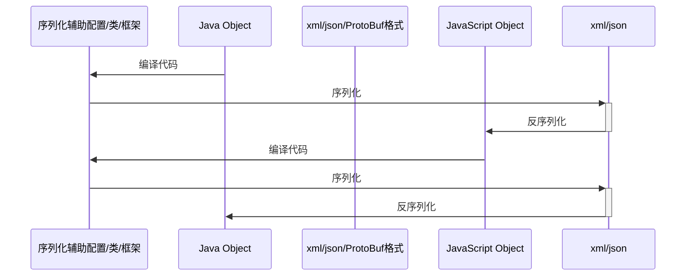
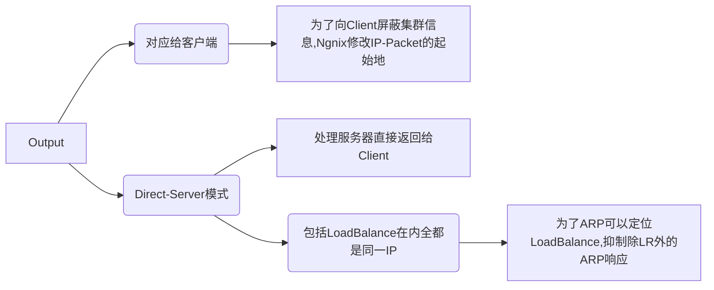
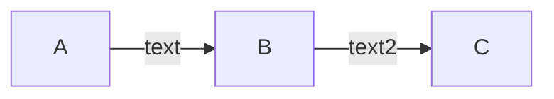

## 1. 编码规范
### 1.1. ASCII码
ASCII码的取值范围是**0~127**，可以用**7**个bit表示。C语言中char型变量的大小规定为一字节，如果存放ASCII码则只用到低7位，高位为0。以下是ASCII码表：


绝大多数计算机的一个字节是8位，取值范围是`0~255`，而ASCII码并没有规定编号为`128~255`的字符，为了能表示更多字符，各厂商制定了很多种ASCII码的扩展规范。注意，虽然通常把这些规范称为扩展ASCII码（Extended ASCII），但其实它们并不属于ASCII码标准。在图形界面中最广泛使用的扩展ASCII码是`ISO-8859-1`，也称为`Latin-1`，其中包含欧洲各国语言中最常用的非英文字母，但毕竟只有128个字符，某些语言中的某些字母没有包含。


编号为128~159的是一些控制字符，在上表中没有列出。

物理层以电平脉冲的形式传输信息，每个电平表示一个bit信息，即0或1，每8个bit组成一个byte为计算机识别的基本单位。抛开直接操作`bit`组成的数据结构的情况，上层的信息无论是什么，最后都要转换为byte形式表示的信息。由编码规范可知，1byte根据不同的编码内容有不同的`Extended ASCII`。因为1byte最多表示的范围即[0-255],所以如果还要表示汉字就必须要双字节，这样范围扩大到【0-65535】，这就是`GBK`编码规范。但如果要表示世界上所有的字符，就还要继续扩大，Unicode便是四字节编码的规范，又考虑到传输效率，通常只是用UTF-8，这个变长编码的最多3字节的编码规范。
### 1.2. 实例举例
`compareTo( )`方法在对字符串进行比较时，比较的是字符串中每一个byte类型变量即每一个`char`的数值大小。在JDK8中每一个String在存储时都是使用的`char[]`,默认情况下按照`UTF-8`码表编码后生成char[]。因为char最大255，所以Extended ASCII 之外的字符一定会被拆成几个char来表示。如下图所示：


排序时，将会调用compareTo()进行字符串之间的顺序比较，那么将会符合`UTF-8`也即Unicode的编码顺序，这种顺序即通常所指的字典序。
而汉字在Unicode中的排列顺序是怎样的呢？至少不是拼音序。所以使用UTF-8解码并不能对汉字进行按照拼音顺序的排序。值得说明的是，Tomcat默认使用的是ISO8859-1编码规范--一个单字节的拉丁码表规范。直接使用ISO8859-1解码汉字因为ISO8859-1的码表中根本没有对应的汉字编码， 所以默认都会翻译成默认的编码--笔者试验时至少只用双字节编码的汉字都会转为`63`,对应ISO8859-1中的`?`。这时候相当于原本的信息都已经丢失了，之后采用何种编码规范译码也不可能得到原本的汉字了。
书回正传，GB2312/GBK中汉字的编码采用两个字节表示，并且按照拼音序排列，所以用GB2312先解码汉字后得到bytes[]，再使用ISO8859-1转成String。即
`new String(s.getBytes("GB2312"), StandardCharsets.ISO_8859_1)`
虽然这时候的String不是汉字，但是调用compareTo()进行排序时比较的是GBK中的编码顺序而不是Unicode对汉字的编码顺序。
不过GBK双字节的编码顺序是否还能与转化后两个单字节排序后的顺序一一对应呢？但确实排序后的结果就是拼音序。
## 2. IO的设计
### 2.1. 数据源的多样性
数据源可以是内存，文件，网络或程序,呈现异构性.

- 代表磁盘文件本身的类:`java.io.File`
- 代表网络资源的类:`java.net.URL`

**注意**

- 屏蔽不同操作系统下的
    - 文件分隔符的不同,使用`File.separator`
    - 路径列表分隔符的不同,使用`pathSeparator`


### 2.2. 节点流与包装流

>Stream API可以方便支持一块一块的处理数据，而不是一次性全部读取出来再操作，以至于占用大量内存

为了屏蔽这样的异构性一般需要一个中间件解耦,这里采用装饰器设计模式,通过使用`包装流`(又称处理流)来包装不同的`节点流`[^IO]
[^IO]:[Java IO流详解（二）](https://lrh1993.github.io/2017/02/22/Java-IO流详解（二）——IO流的框架体系/)

- 节点流:从/向一个特定的IO设备（如磁盘、网络）读/写数据的流
    - FileInputStream:数据源是磁盘文件
    - FileOutputStream:目的地是磁盘文件
- 包装流:对一个已存在的流进行连接或封装，通过封装后的流来实现数据读/写功能

```java
//节点流，直接传入的参数是IO设备
FileInputStream fis = new FileInputStream("test.txt");
//处理流，直接传入的参数是流对象
BufferedInputStream bis = new BufferedInputStream(fis);
```
### 2.3. 字节流与字符流
1. 字节流能处理所有类型的数据（如图片、avi等）.
2. 不过为了提高对纯文本文件,也即全部都是字符(`char`)的文件的处理效率,在原本按字节(`8bit`)读取流的基础上,通过指定字符格式而可以一次按字符大小一次读取多个字节.当然另一方面字符流也只能处理字符类型的数据。
3. 字节流与字符流之间也需要一个桥梁,即转换流

- 字节流:InputStream/OutputStream:
- 字符流: Reader/Writer
    - 将平台缺省的编码集编码的字节转换为`Unicode`字符
- 转换流
    
### 2.4. 缓冲流与Flush
与自己设计缓冲数组类似:
```java
 byte[] buffer  = new byte[10];//这里我们定义了一个 长度为 10 的字节数组，用来存储读取的数据
 in.read(buffer);//获取 某数据源中的前10 个字节，并存储到 buffer 数组中
``` 
将读取的数据先存放数组中，再取数组里面的数据相比一个一个的读取/写入数据效率要高很多,于是诞生了缓冲流.注意读取时仍需要一个小的数组再将小数组放入到缓冲流内部数组中(`?`)[^IO-Buffer]:
[^IO-Buffer]:[Java IO详解（五)](https://www.cnblogs.com/ysocean/p/6864080.html)

```java
// 创建磁盘对象
// 如果不封装成File,直接将路径用于构造接下来的节点流也可以
File source = new File("JavaTest"+File.separator+"in.txt");
File target = new File("JavaTest"+File.separator+"out.txt");

//字符缓冲输入流
BufferedReader br = new BufferedReader(new FileReader(source));
//字符缓冲输出流
BufferedWriter bw = new BufferedWriter(new FileWriter(target));

char[] buffer = new char[10];
//len表示读取的字节数
int len = -1;
while((len=br.read(buffer))!=-1){
    bw.write(buffer,0,len);
}

// 关闭IO资源
br.close();
bw.close();
```

程序里打开的IO资源不属于内存资源，垃圾回收机制无法回收该资源，所以需要显式关闭文件IO资源(`close()`);当关闭资源IO资源时,缓冲流中的数据也会被`Flush`到目的端.当然也可以手动`flush()`来得到所有缓冲流.
### 2.5. 网络IO之序列化与反序列化

- `Xml`与`JSON`序列化
Java最开始倡导的序列化为二进制字节流传输因为只支持Java,自然诞生了`Xml`这样的形式标记语言,用于协调通信
json可以认为是简化版的xml，适合于网络传输，如api接口与ajax调用。但xml具有像namespace、tag等扩展功能，适合于复杂格式文件的存储。
- 序列化为二进制
现在[protocol buffer](https://www.cnblogs.com/dwxt/p/8528683.html)沿用了序列化为二进制传输的思路,虽然这样对人不友好,但是对机器友好,体积小,解析快.通过一个中间层定义或者说描述信息的格式,当一边按约定序列化为二进制的字节流并传输到另一边之后,另一边就可以同样按约定,通过**编译器**将程序员自定义的消息格式转换为具体语言的实现,反序列化为自己语言的对象.唯一的要协调的只是定义消息格式的中间层需要各方都支持.
RPC框架gRPC就是基于ProtoBuf开发的。

>[>](https://www.jianshu.com/p/a24c88c0526a)XML、JSON 更注重数据结构化，关注人类可读性和语义表达能力。ProtoBuf 更注重数据序列化，关注效率、空间、速度，人类可读性差，语义表达能力不足（为保证极致的效率，会舍弃一部分元信息）



## 3. 根据需要选择[^JavaIO流详解]
### 3.1. IO常见类型总结
除了常见基于数据源的操作,还有一些流负责程序运行时的场景:
[^JavaIO流详解]:[Java IO流详解](http://www.51gjie.com/java/686.html)

- 对象输入输出(序列化与反序列化)：ObjectInputStream, ObjectOutputStream
- 在内存中读取字节流: ByteArrayInputSteam,ByteArrayOutputSteam
- 进程间通信：PipeInputStream, PipeOutputStream, PipeReader, PipeWriter 
- 合并输入：SequenceInputStream

.....

简单总结如下:


### 3.2. 结合Scanner对IO的实现
Scanner作为StringTokenizer和Matcher类之间的某种结合,可以扫描输入文本.
```java
  public Scanner(File source) throws FileNotFoundException {
        this((ReadableByteChannel)(new FileInputStream(source).getChannel()));
    }
```
底层调用了对应的节点输入流方法.
#### 3.2.1. 文件IO
重定向输入输出流至`terminal`

```java
import java.io.*;
import java.util.*;
---
File sourceFile  = new File(args[0]);
File targetFile = new File(args[1]);
if (!sourceFile.exists() || !targetFile.exists()) return;

Scanner in = new Scanner(sourceFile);
PrintWriter out = new PrintWriter(targetFile);
while (in.hasNext()) {
    String s = in.nextLine();
    String s2 = s.replaceAll(args[2],args[3]);
    out.println(s2);
}

in.close();out.close();

```

#### 3.2.2. 网页IO
`File`封装换成了`URL`封装,以及需要调用对象`url`的`openStream()`方法来打开输出流.文件不需要大概是因为本机访问便利.

```java
System.out.println("Enter a url:");
Scanner input = new Scanner(System.in);
String URLString = input.next();
try {
    URL url = new URL(URLString);
    Scanner in = new Scanner(url.openStream());
    PrintWriter out = new PrintWriter("out.txt");
    while (in.hasNext()) {
        String line = in.nextLine();
        out.println(line);
    }
    in.close();out.close();
}
catch (MalformedURLException ex){
    System.out.println(ex.toString());
}
catch (IOException ex){
    System.out.println(ex.toString());
}    

input.close();

```

## 4. 优雅的关闭IO流
### 4.1. 关闭中的阻塞问题

```java
BufferedReader reader = .....
String name = reader.readLine();
```
当一个线程执行这段代码,readLine()方法等待过程中就会被阻塞,实际处理如下:
```java
BufferedReader reader = .....
String name = reader.readLine();
while(数据还没准备好){
继续等待
}
处理数据
```
对于传统的阻塞问题,没有什么好的解决办法,列举几种:

1.  客户端在`write()`后马上`close()`关闭输出流或直接写入结束标志,如`socket.shutdownOutput()`，服务器不阻塞
    - 缺点:除非协议是单向的
2. 发送方返回数据长度,接收方接收完后退出`read()`
    - 缺点:如果不是一次返回总的数据长度,每次都告知发送长度,开销大也麻烦
3. 用指定大小数组当容器,当数组未读满时,退出`read()`
```java
//如果读的长度小于1024，说明是最后一次读,后面已经没有数据，跳出循环
if (len < 1024) {
	break;
}
```

4. 指定等待时间,超时退出`read()`
5. 商定结束标志,如`\n`或`EOF`等
### 4.2. Apache Commons IO之IOUtils
脏活累活库给你封装[^IOUtils]：
[^IOUtils]:[Apache Commons IO之IOUtils优雅操作流](https://www.jianshu.com/p/6b4f9e5e2f8e)

```java
FileInputStream fileInputStream = new FileInputStream(new File("d://demo.txt"));
List<String> list = IOUtils.readLines(fileInputStream, "UTF-8");//只要是InputStream流都可以，比如http响应的流
//直接把流读取为String
String content = IOUtils.toString(inputStream,"UTF-8");

try {
// 复制输入流至输出流
     return IOUtils.copy(inputStream, outputStream);
 } finally {
     //优雅的关闭流
     IOUtils.closeQuietly(inputStream);
     IOUtils.closeQuietly(outputStream);
 }
```
## 5. IO太慢必须要Cache
### 5.1. 从内存屏障说起
1. **缓存一致性**必须读写屏障
2. 编译器优化程序指令执行会指令重排
3. 多个执行线程共享数据保障按指定顺序执行

以上三种情况都需要内存屏障指令在硬件级别解决重排序问题。`Memory barrier` 也称为 `membar`，其可以保证在屏障之前发布的操作可以在屏障之后发布的操作之前执行[^cacheCoherency]：
[^cacheCoherency]:[锁（Lock）、内存屏障（Memory barrier）与 缓存一致性](https://blog.csdn.net/weixin_40539125/article/details/104215766?utm_medium=distribute.pc_relevant_t0.none-task-blog-searchFromBaidu-1.control&depth_1-utm_source=distribute.pc_relevant_t0.none-task-blog-searchFromBaidu-1.control)

- 读屏障：在读屏障之前所有`Invalidate queue`中所有的无效化指令都执行
- 写屏障: 在写屏障之前所有`store buffer`中的指令都真正的写入了缓存

先使用写屏障再使用读屏障的结果就是 各cpu核心的缓存被更新，并将缓存回写到主存中，同时当前cpu因为缓存失效回去主存拿数据再放到缓存中。

### 5.2. Cache不能太大必须取舍
LRU算法
## 6. BIO的改进
### 6.1. NIO(New IO)的诞生
但是面对成百上千个文件需要读取,就必须改成非阻塞的,即允许同时处理---通过**轮询**操作循环检查是否可以关闭输入流.

**文字解释**
具体的实现方式如NIO(`non-blocking IO`),使用**一个线程**管理高并发的多个socket连接线程.

- Channel: 类似Stream,但是`Non-Blocking`.将一个socket视为Channel的一种
- Buffer:Channel读取的数据在Buffer中.而由于Buffer不是流,Channel可以任意位置读
- Selector:和Channel 配合使用,Channel注册自己及自己监听的`XXX事件`在Selector中

**代码解释**
```
每一个Channel注册一个Channel在Selector

while(true){  
    检查Selector有没有事件
    if(事件是Channel可读){  
        从产生事件的Channel中读取数据
    }
    if(事件是Channel可写){  
        从产生事件的Channel中写入数据
    }
    ...
}

```
**图表解释**

#### 6.1.1. NIO的易用性
因为JDK 原生API开发NIO需要开发者理解`Selector`、`Channel`和`ByteBuffer`三大组件,编程模式较为复杂;原生实现也不够稳定(包括有`bug`).所以应运而生`Netty`,将三大组件封装在了内部,支持自定义协议，解决了原生NIO拆包粘包，客户端重连，网络拥塞等问题。
`dubbo`、`spark`、`zookeeper`和`elasticSearch`等框架使用`Netty`作为底层通信IO框架.
#### 6.1.2. NIO的不足
NIO用一个线程处理多个Socket，跟踪和调试难以捉摸，只能靠日志分析。
### 6.2. AIO的诞生
## 7. IO处理多个线程与对象
对于服务器往往会接触多个线程与对象,直接使用Java IO的API来操作IO并不常见.通常配置文件(`xml`,`properties`等)被框架读取后,框架会把**配置数据**变成**Java对象**方便程序员调用,而不用程序员关注IO细节.不过框架本身"IO"是怎么做的呢?
### 7.1. LoadBalance ,like Ngnix
**Input**

- 静态连接处理,一个IP对外,一个IP对内
- 维持动态连接,将连接请求分发[^分发]给Tomcat集群
    - 网站同一域名映射到多个服务器IP(`NAT`,Network Address Translation)

**Output**



[^分发]:根据负载均衡策略,修改IP Packet的目的地IP以及TCP Segment的目的地port

[^负载均衡策略]:轮询/加权轮询/最少连接

### 7.2. Web Server, like Tomcat
Web容器(`Jetty`和`Tomcat`)其实核心是一个`socket`。这个socket监听并接受到达的TCP连接，一旦一个连接被建立，就可以通过这个新的连接读取、解析信息，然后将这些信息包装成一个HTTP请求给处理web请求的框架（如Spring Web）.为了单线程不因为IO被阻塞，如果是用户的每个请求都会从**线程池**中取出一个单独的`servlet`线程去处理请求：
```java
ServerSocket listener = new ServerSocket(8080);
while(true){ 
Socket socket = listener.accept(); 
threadPool.execute(new HandleRequestRunnable(socket);
}
```
同一时刻,可能有多个线程在处理多个请求:

- 执行`servlet`代码
- 访问Database
- 访问微服务
- 本地IO(1~10ms)
- 网络IO(例如http服务,30~100ms)

于是线程往往只能阻塞.而垃圾服务器,CPU核心一般不超过4核,线程之间还需要常常切换.
### 7.3. Spring框架
Spring依赖注入Bean实例默认是单例的,其基本流程如下:

#### 7.3.1. Spring三级缓存
3. `singletonFactories`:三级缓存,用于保存bean创建工厂,以便于后面扩展有机会创建代理对象-->原始对象
2. `earlySingletonObjexts`:二级缓存,用于保存实例化完成的bean实例-->代理对象
1. `SingletonObjects`:一级缓存,用于保存实例化、注入、初始化完成的bean实例-->代理对象
#### 7.3.2. Bean的作用域
1. `Singleton`:单例模式:Spring的单例保证在一个IOC容器中只有一个action单例,从而保证开发者使用的是同一个实例.**默认模式**
2. `Prototype`:原型模式,每次创建该bean后都会产生一个新实例，创建后Spirng不再对其管理
    如对于Dao层的bean对象,Spring对于`ThreadLocal`对象,区别常用的加锁方式,用空间换时间--**给每个线程复制一份独立的变量副本**,从而隔离多线程访问对于数据访问的冲突.
3. `request`: 每次请求都创建一个新的实例，同时Spring对其管理
4. `session`: 每次会话同上（session是指拿到cookie后服务器端创建的）
5. `global session`:全局的web域，类似于servlet中的application
#### 7.3.3. 默认单例
正因为是单例的，所以对于成员变量会被重复使用，不是线程安全的[^Singleton].

[^Singleton]:[spring的controller是单例还是多例，怎么保证并发的安全?](https://blog.csdn.net/riemann_/article/details/97698560)


### 7.4. Redis
因为对Redis的请求都是访问内存,不涉及文件/DB/IO等操作,时间很短(`100ns`左右),所以用**同一线程**就可处理多个请求.同时也避免了线程切换的开销和共享数据的问题.
Redis使用的是文本协议，但不是http，兼具WebSocket/Dubbo/grpc这种二进制协议的优点。因为自己设计的更简洁：

>例：开始标志（Magic Number）--（是否为异步位--心跳请求位--是否是异常位--序列化ID【2^5种可能】）【8byte】--结束标志
>


### 7.5. Node.js
事件驱动编程

- 对于大部分非阻塞的线程,用一个线程处理所有请求,遇到耗时长的IO等操作,留下**回调函数**[^callfunctions],等到I/O操作完成后再去执行回调函数
- 个别会阻塞的线程,例如Linux文件I/O,CPU密集型的任务如加密/压缩等,从线程池拿线程

[^callfunctions]:这种函数对象并不直接调用函数本身，而是Runtimes环境（如浏览器）在事件发生时的适当时间调用函数。

#### 7.5.1. 代表产品
Electron桌面开发
高并发异步减少线程
#### 7.5.2. 缺点
- 单一主线程不能发挥多核优势
- 对于计算密集型的项目应当考虑其他技术

### 7.6. Netty
Netty的主线程和工作线程可以设置多个。因为主线程只负责连接与注册，工作线程是真正忙碌的线程，可以依据CPU核数多开。


### 7.7. Node.x->Vert.x

Verticle循环关联事件:
```java
接收事件
    加入事件队列
while(true){
    获取下一个事件
    找到下一个handler
    调用handler
}
```
Handler,以http服务器为例:
```java
import io.vertx.core.AbstractVerticle;
public class Server extends AbstractVerticle{
    public void start(){
        vertx.createHttpServer().requestHandler(req ->{
            res.response()
                .putHeader("content-type","text/plain")
                .end("Hello Word!");
        }).listen(8080);
    }
}
```
这样就摆脱了对Tomcat这些容器的需求,自己就完成了一个HTTP服务器.

但是必须全是异步操作,如同时有服务器运行和数据库查询:

数据库的`Verticle`代码:
```java
public class DatabaseVerticle extends AbstractVerticle{
    ......
    dbClient.getConnection(ar -> {
        if (ar.succeeded()) {
            SQLConnection connection = ar.result();
            connection.query("select .. from...", res -> {      
                 if (res.succeeded()) {
                   ......
                 } else {
                   ......
                 }
          });
        } else {
           ......
        }
    });
}
```

同时这里使用了`Event Bus`，让不同的`Verticle`之间通过消息传递.因为不用共享内存,所以不用加锁.
## 8. 其他
### 8.1. JdbcType类型和Java类型[^Jdbc]
[^Jdbc]:[JdbcType类型和Java类型的对应关系](https://blog.csdn.net/qq_39019865/article/details/80800649)

