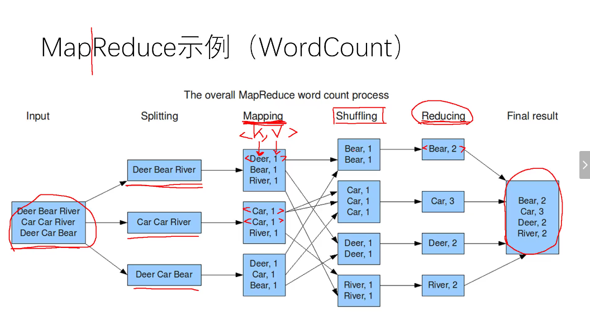

## 1. Hadoop的诞生
大型机和高端机的服务不能随便重启.而在信息时代,一个文件几十上百G,集群处理64M一块,冗余存储与崩溃是常态(硬盘大约5%故障率).Google公布了三驾马车HDFS/MapReduce/Zookeeper**以解决**

- 硬件成本
- 可靠性
- 并行计算

之所以是Google来做这件事,因为抓取网页,存取网页,搭建大型数据仓库,实现PB级的数据存储/处理/分析/统计,实现搜索引擎是它的老本行.
现在Hadoop大数据平台是事实上的标准.

### 1.1. HDFS
#### 1.1.1. HDFS的设计初衷

- 一次写入,多次读取
- 不支持文件并发写入
- 不支持文件修改

#### 1.1.2. HDFS的使用范围
- 存储并管理**PB**级数据
- 处理非结构化数据(网页时非结构化的);结构化数据每一行时必有每一列.
- 注重吞吐,对延时不敏感
- 一次写入,多次读取的模式

#### 1.1.3. Namenode管理结点
Namenode放的是数据的数据--元数据--Metadata.Metadata由文件扫描系统得到.
为了数据可靠性,备份三份数据,并且三份存储硬盘位置距离要远(不同机箱不同层),配之以Metadata存储各数据的位置.每次一写写三份,全部写完了再close.
不过Namenode挂了Metadata也可能丢失,怎么防止?Namenode中依然是一个集群,且相对datanode结点的设备性能较高.而且同样有备份,尽管时间差依然会造成数据丢失.
### 1.2. MapReduce是一个组件之一
#### 1.2.1. MapReduce也代指一系列过程
它允许上千cpu并行处理,进而充分利用廉价的低等CPU的性能,其中最重要的两个过程

- Map: 任务拆解
- Reduce: 任务汇总分析

为了提高速度,并不是结果直接写入硬盘,而是先在缓存中进行缓存和排序.

[完整过程](https://www.cnblogs.com/zjfstudio/p/3887551.html):

>1. 输入(input):将输入数据分成一个个split，并将split进一步拆成<key, value>。
2. 映射(map)：根据输入的<key, value>进生处理，
3. 合并(combiner)：合并中间相两同的key值。
4. 分区(Partition)：将<key, value>分成N分，分别送到下一环节。
5. 化简(Reduce)：将中间结果合并，得到最终结果
6. 输出(output)：负责输入最终结果。
其中第3、4步又成洗牌(shuffle)过程。

#### 1.2.2. WordCount
**以wordcount为例,应该这个例子完全搞明白,或者遇到问题先想着搞明白啊!**
[TextInputFormat](https://www.cnblogs.com/pengyingzhi/p/5361008.html)是Hadoop默认的输入方法，在TextInputFormat中，每个文件（或其一部分）都会单独作为Map的输入，之后，每一行数据都会产生一个<key,value>形式：其中key值是每个数据的记录在数据分片中的字节偏移量，而value值是每行的内容。所以，图5中画红圈的两个数据应该是有误的（在上面只是为了方便表示），正确的值应该是第二行第一个字符的偏移量才对。
[WordCount](https://www.cnblogs.com/huxinga/p/6939896.html)
[wordcount补充](https://blog.csdn.net/xiaoxiaolove_i/article/details/98737608?depth_1-utm_source=distribute.pc_relevant.none-task-blog-BlogCommendFromBaidu-1&utm_source=distribute.pc_relevant.none-task-blog-BlogCommendFromBaidu-1)
[数据清洗](https://blog.csdn.net/xiaoxiaolove_i/article/details/98737608?depth_1-utm_source=distribute.pc_relevant.none-task-blog-BlogCommendFromBaidu-1&utm_source=distribute.pc_relevant.none-task-blog-BlogCommendFromBaidu-1)
https://www.cnblogs.com/edisonchou/p/4458219.html
[!!!](https://www.cnblogs.com/xia520pi/archive/2012/05/16/2504205.html#_label4)

## 2. Hadoop的弱点
事实上Google开源Hadoop时它早已有其他更先进的产品了.
hadoop在硬盘中操作,延迟高,计算慢.
zookeeper能保持强一致性，master一旦发生故障之后会重新选举出新的主节点，保持一致性但是选举时间较长。Eureka 保持的是最终一致性，只要还有节点存在，那么就可以快速的响应。不过也很明显Eureka的弱一致性不能保证所见的信息是最新信息。
## 3. 问题与解决方案
### 3.1. 运行问题
>1. Job running in uber mode : false;但是可以正常运行

[What is the purpose of “uber mode” in hadoop?](https://stackoverflow.com/questions/30284237/what-is-the-purpose-of-uber-mode-in-hadoop)
>If you have a small dataset or you want to run MapReduce on small amount of data, Uber configuration will help you out, by reducing additional time that MapReduce normally spends in mapper and reducers phase

>2. 为什么hadoop要对基本数据类型封装一遍,如`int`->`IntWritable`,`String`->`Text`?能互转吗?
在hadoop中能运行的格式,估计得看源码如何封装.

关于互转,一边,以传统数据格式作参数`new`可;另一边,对于`IntWritable`提供了`get()`方法转换为`int`,`Text`提供了`toString()`转换为`String`,且相比于原生`String`,也提供了`set()`可改变自身.  

>3. 怎么样就生成了`<key,List>`?

split->map->(combine->partition)->reduce->result

所谓reduce生成list,其实也是并行的许多次reduce,逐个累积生成list的.  

### 3.2. 安装问题
>1. ubuntu重启不断闪屏

据说是gdm启动过程与什么冲突了,然后不断崩溃又重启造成了这个效果.重启两次之后偶尔会出现这个bug.
>2. 不知怎么查看配置第二个网卡

原来VMware默认只有一个网卡,可以手动加载[双网卡](https://blog.csdn.net/weixin_43291687/article/details/82863419?depth_1-utm_source=distribute.pc_relevant.none-task&utm_source=distribute.pc_relevant.none-task)
>3. 电脑低电量关机,重启后两个Linux都打不开

- 如果提示无法锁定文件,可以[删掉所有`.lck`文件](https://www.jianshu.com/p/be7e523678ba).因为那时突然系统崩溃了，虚拟机来不急把已经锁定的文件解锁.
- 或重来一遍

>4. ssh启动失败:`The authenticity of host 'localhost (127.0.0.1)' can't be established.localhost: Host key verification failed.`

ubuntu默认禁止root账户的ssh连接,可以选择[不让ssh检查了](https://blog.csdn.net/stpeace/article/details/79426471)[并且进一步放松限制](https://www.cnblogs.com/hmy-blog/p/6500909.html).

>5. 启动hadoop时输入密码总是提示`Permission denied`

据说最新的ssh免密登录已经不支持id-dca,改用id-rca;并且通过scp公钥到其他ip机`/.ssh/`目录下,可以实现[一次密码,全面放行](https://blog.csdn.net/situliang/article/details/72904449?depth_1-utm_source=distribute.pc_relevant.none-task&utm_source=distribute.pc_relevant.none-task).

>6. 机器卡死

之后`datanode`节点调到了1.3G.

>7. 上传文件时提示`no datanode`,当时jps显示有同时启动Hadoop没有任何错误

我这个机器的解决方案:注释掉master的`interfaces`的前两行即可.
*简记过程:*
造成这种问题可以有很多原因,比如[namenode格式化失败](https://www.cnblogs.com/zwgblog/p/6064022.html),比如[namenode与datanode参数不匹配](https://blog.csdn.net/qq_43193797/article/details/85674720),比如防火墙原因.排查后发现`datanode`根本就没有生成`VERSION`文件,那些专注于解决datanodeSHUTDOWN的方法只会让debug越走越远.
排除了路径错误,文件权限,`hdfs-site.xml`或`core-site.xml`各种问题,在[这个帖子](https://blog.csdn.net/fireblue1990/article/details/51096350?depth_1-utm_source=distribute.pc_relevant.none-task&utm_source=distribute.pc_relevant.none-task)受到了启发:
- **发现问题最好的方法就是查看日志，根据日志提示找问题** grep error:xxx xxx.log

data1的日志中记载它反复尝试连接`master:9000`失败,以及发生了`java.lang.IOException`,此前尽管已经反复检查过`interfaces`中的配置,没有使用`telnet检查端口连接`,最后原因应该是其前两行干扰了主机ip与主机名的映射,把它们注释掉问题终于解决了.

>8. 关机之后，重启的时候黑屏，无鼠标的解决方案：

使用管理员权限打开powershell 输入：`netsh winsock -reset`

即可解决问题

>9. hadoop3.X之后端口有一些变更，导致打开50070端口无响应

应该改为9870端口。附[参考教程](https://blog.csdn.net/sinat_35045195/article/details/88774512)

>10. master崩溃，拷贝slave虚拟机，修改配置使其成为master节点，开始运行hadoop后没有datanode?

这是因为GROUP ID不同的原因，通过将name 文件夹下的version文件中的GROUPID拷贝到DATA文件夹下的version文件中，重启后可以解决问题。
>11. 上一问题的情况下，新的master节点无法ssh登陆到master自身。生成新的ssh秘钥后，拷贝到authorized-keys后报错

这是因为之前slave节点中已经存放了一个master的秘钥，拷贝新的秘钥后会导致重复，这时，按照指引删除掉旧的秘钥（oldkey）,重新连接即可，注意要把authorized_keys同步到slave上以更新

>12. 下载速度过慢

更换镜像是个好方法，但是安装时是无法选择镜像的，这时我们可以连接上北京大学VPN..速度会有显著的提高。

