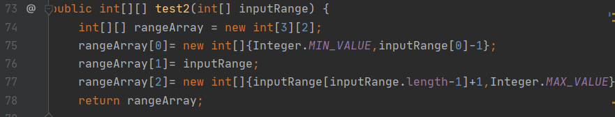
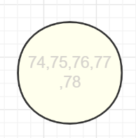
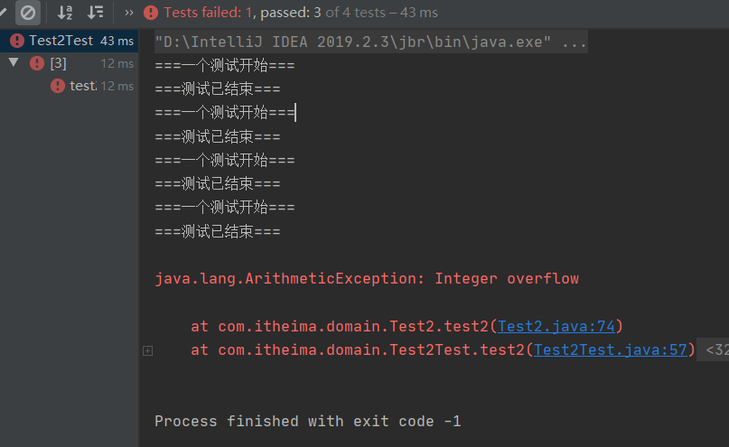
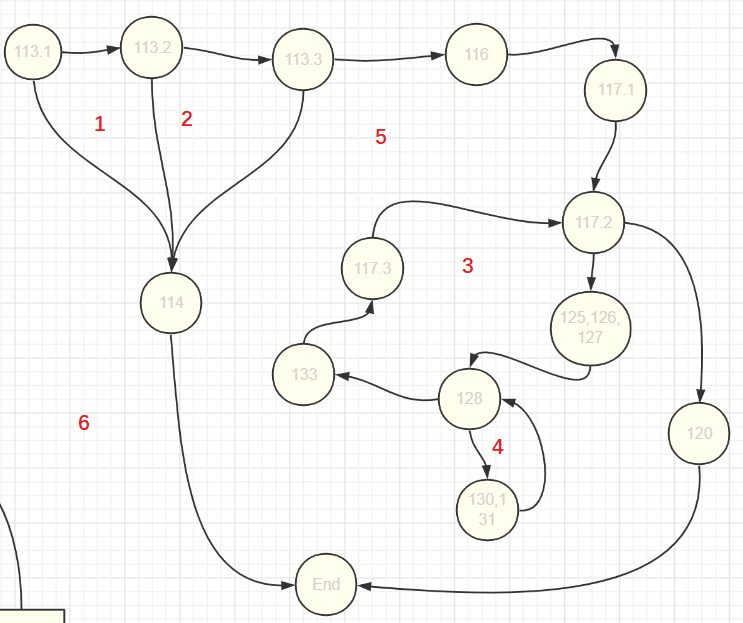
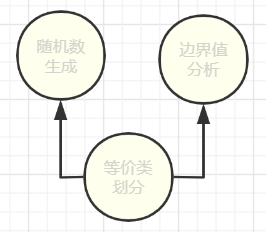
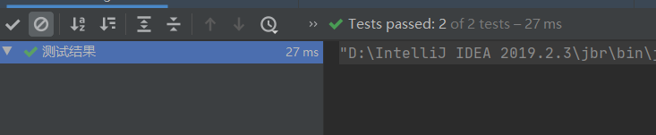

<font size=6ex><center> 对三种黑盒测试技术的单元测试与集成测试</center></font>

[toc]

## 1. 被测试代码及任务说明
### 1.1. 被测试代码
对被测试代码进行了增删,主要增加了处理处理部分,同时使用`switch-case`结构优化了代码性能,[完整代码](https://blog.csdn.net/qq_31912571/article/details/105024592)如下:
```java
import java.io.IOException;
import java.util.Arrays;
import java.util.HashMap;
import java.util.HashSet;
import java.util.Scanner;
public class Test2 {
    /** 声明一个静态的Scanner工具类,以便调用同时最后结束时才关闭 */
    private static Scanner input =new Scanner(System.in);

    public static void main(final String[] args) throws IOException {
        int[] range = new int[2];
        Test2 t = new Test2();
        try {
            System.out.println("====得到正确的输入范围====");
            // 输入范围检查,并返回正确的输入范围
            int[] inputRange =t.test1(range);
            System.out.println("====等价类划分技术====");

            // 使用等价类划分技术返回三个区间
            int[][] equalClass = t.test2(inputRange);
            for (int[] row : equalClass) {
                System.out.println(Arrays.toString(row));
            }
            System.out.println("====边界值划分技术====");

            // 边界值分析返回六个边界值数组
            int[][] criticValues = t.test3(equalClass);
            for(int[] row : criticValues) {
                System.out.println(Arrays.toString(row));
            }
            t.alert(3);t.alert(4);

            System.out.println("====随机数生成技术====");
            System.out.print("请输入要生成的随机数数目: ");
            int n =input.nextInt();
            //随机数生成返回随机数组
            Object[] randomValues = t.test4(equalClass,n);
            for(int i = 0;i<randomValues.length;i++){
                HashSet<Integer> row = (HashSet<Integer>)randomValues[i];
                System.out.println(row.toString());
            }

            input.close();
        }catch (ArithmeticException e){
            System.out.println(e.getClass().getName()+e.getMessage()+"\n请重新运行程序输入合理数值");
        }


    }
    public int[] test1(int[] range) throws IOException {
        // Scanner input = new Scanner(System.in);
        int errorType = 0;
        do {
            System.out.println("请输入下界与上界");
            String stringLow = input.next();
            String stringHigh = input.next();

            if(this.isInteger(stringLow) && this.isInteger(stringHigh)){
                int low = Integer.parseInt(stringLow);
                int high = Integer.parseInt(stringHigh);
                if(this.isProper(low,high)){
                    range[0] = low;
                    range[1] = high;
                    break;
                }
                else{
                    errorType = 2;
                    this.alert(errorType);
                }
            } else {
                errorType = 1;
                this.alert(errorType);
            }
        } while (errorType != 0);
        return range;
    }
    public int[][] test2(int[] inputRange){
        if(inputRange[0]<=Integer.MIN_VALUE || inputRange[1] >= Integer.MAX_VALUE)
            throw new ArithmeticException("Integer overflow");
        int[][] rangeArray = new int[3][2];
        rangeArray[0]= new int[]{Integer.MIN_VALUE,inputRange[0]-1};
        rangeArray[1]= inputRange;
        rangeArray[2]= new int[]{inputRange[inputRange.length-1]+1,Integer.MAX_VALUE};
        return rangeArray;
    }

    /**
     * 边界值分析,防止重复设置了两个非1的常量
     * @param rangeArray
     * @return
     */
    public int[][] test3(int[][] rangeArray){
        int limit  =3;
        if(rangeArray[0][1]-rangeArray[0][0] ==limit ||  rangeArray[1][1]-rangeArray[1][0] ==limit ||  rangeArray[2][1]-rangeArray[2][0] ==limit) {
            throw new RuntimeException("区间长度为3不能生成不重复的边界值");
        }
        int[][] criticValues = new int[6][3];
//        6个边界值的加一减一
        criticValues[0]= new int[]{rangeArray[0][0]-1,rangeArray[0][0],rangeArray[0][0]+1};
        criticValues[1]= new int[]{rangeArray[0][1]-1,rangeArray[0][1],rangeArray[0][1]+3};
        criticValues[2]= new int[]{rangeArray[1][0]-3,rangeArray[1][0],rangeArray[1][0]+1};
        criticValues[3]= new int[]{rangeArray[1][1]-1,rangeArray[1][1],rangeArray[1][1]+3};
        criticValues[4]= new int[]{rangeArray[2][0]-3,rangeArray[2][0],rangeArray[2][0]+1};
        criticValues[5]= new int[]{rangeArray[2][1]-1,rangeArray[2][1],rangeArray[2][1]+1};
        return criticValues;
    }

    /**
     * 随机数生成
     * @param rangeArray
     * @param n
     * @return
     */
    public Object[] test4(int[][] rangeArray,int n){
        if(!isLegalRangeArray(rangeArray,n)){
            throw new RuntimeException("区间过小不足以生成指定数目的随机数");
        }
        Object[] randomValues = new Object[3];
        for(int i = 0;i<randomValues.length;i++) {
            randomValues[i] = this.randomValueSet(i, n, rangeArray);
        }

        return randomValues;
    }
    /** 用index控制生成第几行的随机数 */
    public HashSet<Integer> randomValueSet(int index,int n,int[][] rangeArray){
        // 使用HashSet来去重
        HashSet<Integer> randomValueSet = new HashSet<>();
        // 如果正常用int,这里减去一个Integer.MIN_VALUE就很容易整数溢出
        long gap = (long)rangeArray[index][1]-(long)rangeArray[index][0];
        while(randomValueSet.size() < n){
            // temp最大也就取到给的区间的最大值,因而可以用int
            int temp = (int)(Math.random()*gap+rangeArray[index][0])+1;
            randomValueSet.add(temp);
        }
        return randomValueSet;
    }
     /** 是否是整数 */
    public boolean isInteger(String input) {
        // 检测整数的正则表达式
        final String regex = "^-?[1-9]\\d*$|0?";
        return input.matches(regex);
    }

    /** 范围适合 low<high */
    public boolean isProper(int low, int high) {
        if (low > high)
            return false;
        return true;
    }

    /** 错误报告 */
    public void alert(int warningType) {
        switch (warningType){
            case 1 : System.out.println("不是整数!请重新输入");return;
            case 2 : System.out.println("下界大于上界!请重新输入");return;
            case 3 : System.out.println("Warning: Integer下界越界!");return;
            case 4 : System.out.println("Warning: Integer上界越界!");return;
        }
    }
    public boolean isLegalRangeArray(int[][] rangeArray,int limit){
        if(limit >   rangeArray[0][1]-rangeArray[0][0] || limit > rangeArray[1][1]-rangeArray[1][0] || limit > rangeArray[2][1]-rangeArray[2][0]){
            return false;
        }
        return true;
    }
}
```
### 1.2. 任务说明
- 对于三种黑盒测试技术分别测试**对应的测试用例生成功能**及集成测试
- 单元测试需要对构件的5方面进行测试:
1. 模块或构件接口
2. 局部数据结构
3. 边界条件
4. 独立路径
5. 处理错误的路径
- 需要为每个单元测试开发驱动器或/和子程序桩
    - 因为本黑盒测试用例生成类已经开发完毕,各模块的子程序桩便不需要单独设计,子程序由各模块调用即可
    - 驱动器程序可以为`main()`,这里会在集成测试时再设计测试方法调用三种黑盒测试用例生成方法
## 2. 等价类划分
### 2.1. 需求描述
对输入范围划分,返回一个有效区间和两个无效区间
### 2.2. Junit程序设计
#### 2.2.1. 测试模块或构件接口
给出正常输入判断是否符合预期输出
#### 2.2.2. 测试局部数据结构
本功能模块无局部变量,不予测试
#### 2.2.3. 边界条件
对`[0,1]`,`[-1,0]`,`[Integer.MIN_VALUE,Integer.MAX_VALUE]`容易发生错误的边界测试
#### 2.2.4. 独立路径
1. 根据代码画出对应的流图
- 代码

- 流图

2. 环形复杂度CC(G)=1
3. 独立路径集即`{74-75-76-77-78}`
所以此前测试用例已覆盖独立路径
#### 2.2.5. 处理错误的路径
整数溢出`ArithmeticException`继承自`RuntimeException`,为非受查异常,但是对于整数溢出计算过程无误而程序无法得知其计算是否正确,所以需要开发者声明此异常.这里使用`[Integer.MIN_VALUE,Integer.MAX_VALUE]`测试整数溢出的错误处理.
### 2.3. Junit程序实现

```java
import org.junit.After;
import org.junit.Before;
import org.junit.Test;
import org.junit.runner.RunWith;
import org.junit.runners.Parameterized;
import static org.junit.Assert.*;

import java.util.Arrays;
import java.util.Collection;
// 将所有需要运行的测试用例集中起来，一次性地运行所有测试用例
// 为准备使用参数化测试的测试类指定特殊的运行器 org.junit.runners.Parameterized
@RunWith(Parameterized.class)
public class Test2Test {
//    分别用于存放期望值和测试所用数据
    private int[][] expected = new int[3][2];
    private int[] target = new int[2];
    private int i =1;

//    在java.util.Collection 的公共静态方法初始化所有需要测试的参数对
    @Parameterized.Parameters
    public static Collection<Integer[]> getTestParas(){
        return Arrays.asList(new Integer[][]{
                    
                {-2147483648,-6,-5,10,11,2147483647,-5,10},// 测试一般情况
                {-2147483648,-1,0,1,2,2147483647,0,1},//测试边界
                {-2147483648,-2,-1,0,1,2147483647,-1,0},//测试边界
                {-2147483648,2147483647,-2147483648,2147483647,-2147483648,2147483647,-2147483648,2147483647}// 测试边界与错误处理路径
        });
    }
    // 构造函数依次调用Collection中的数组元素构造
    public Test2Test(int n1,int n2,int n3,int n4,int n5,int n6,int n7,int n8){
        this.expected[0][0]=n1;
        this.expected[0][1]=n2;
        this.expected[1][0]=n3;
        this.expected[1][1]=n4;
        this.expected[2][0]=n5;
        this.expected[2][1]=n6;
        this.target[0]=n7;
        this.target[1]=n8;
    }
    @Before
    public void setUp() throws Exception {
        System.out.println("===一个测试" +"开始===");

    }

    @After
    public void tearDown() throws Exception {
        System.out.println("===测试"+"已结束===");
    }

    @Test
    public void test2() {
        assertArrayEquals("整数溢出",expected,new Test2().test2(target));

    }
}
```
### 2.4. Junit测试结果
通过三个,对于整数溢出准确报了错误,错误处理路径正常

## 3. 边界值分析
### 3.1. 需求描述
对于各区间去边界值,并返回边界值,注意返回的边界值里没有重复值.
### 3.2. Junit程序设计
#### 3.2.1. 测试模块或构件接口
给出正常输入判断是否符合预期输出,包括没有重复值
#### 3.2.2. 测试局部数据结构
本功能模块无局部变量,不予测试.
#### 3.2.3. 边界条件
对`[0,1]`,`[-1,0]`容易发生错误的边界测试
#### 3.2.4. 独立路径
1. 根据代码画出对应的流图
- 代码

- 流图略,易知环形复杂度CC(G)=2
3. 独立路径集:
- `{95-96-99-101-102-103-104-105-106-107}`
- `{95-96-97}`
包括3.2.5在内的其他测试需求中的测试用例已覆盖独立路径
#### 3.2.5. 处理错误的路径
因为输入来自上一模块,错误输入将被拒绝;但是本模块对于边界值的处理因采取的是`+1/-1/+3/-3`这样的方式,特别地,区间范围为3时将不能生成不重复的区间值,这里采用一个中间区间为3的测试用例:
- `{{-2147483648, 3}, {4, 7}, {8, 2147483647}}`

测试处理错误的路径;同时本模块一定会发生整数越界,在主函数中已予以说明.
### 3.3. Junit程序实现

```java
package com.itheima.domain;

import org.junit.jupiter.api.Test;

import static org.junit.Assert.assertArrayEquals;

class Test2test3 {
    Test2 tmpObject = new Test2();
    @Test
    public void test3() {
        int[][] t1 = {{2147483647, -2147483648, -2147483647}, {-7, -6, -3}, {-8, -5, -4}, {9, 10, 13}, {8, 11, 12}, {2147483646, 2147483647, -2147483648}};
        assertArrayEquals(t1, tmpObject.test3(new int[][]{{-2147483648, -6}, {-5, 10}, {11, 2147483647}}));
    }
    @Test
    public void test3_2(){
        int[][] t2 = {{2147483647, -2147483648, -2147483647}, {-2, -1, 2}, {-3, 0, 1}, {0, 1, 4}, {-1, 2, 3}, {2147483646, 2147483647, -2147483648}};
        assertArrayEquals(t2, tmpObject.test3(new int[][]{{-2147483648, -1}, {0, 1}, {2, 2147483647}}));
    }
    @Test
    public void test3_3(){
        int[][] t3 = {{2147483647, -2147483648, -2147483647}, {-3, -2, 1}, {-4, -1, 0}, {-1, 0, 3}, {-2, 1, 2}, {2147483646, 2147483647, -2147483648}};
        assertArrayEquals(t3, tmpObject.test3(new int[][]{{-2147483648, -2}, {-1, 0}, {1, 2147483647}}));
    }
    /**
     * 测试错误抛出路径
     */
    @Test
    public void test3_4(){
        assertArrayEquals(null, tmpObject.test3(new int[][]{{-2147483648, 3}, {4, 7}, {8, 2147483647}}));
    }
}
```  
### 3.4. Junit测试结果

## 4. 随机数生成器
### 4.1. 需求描述
应用随机数生成器对每个区间生成指定数量(从命令行输入)的随机值.注意返回的值里没有重复值.
### 4.2. Junit程序设计
因为是返回的是随机值,这里判断输出是否符合标准代之以:
- 返回值数目是否正确
- 返回值是否有重复
- 返回值是否在区间内
#### 4.2.1. 测试模块或构件接口
输入正常输入`{{-2147483648,-6},{-5,10},{11,2147483647}},5`
#### 4.2.2. 测试局部数据结构
检查局部数据结构是为了保证临时存储在模块内的数据在程序执行过程中完整、正确，局部功能是整个功能运行的基础。重点是一些函数是否正确执行，内部是否运行正确。局部数据结构往往是错误的根源，应仔细设计测试用例，力求发现下面几类错误：

- 不合适或不相容的类型说明；

- 变量无初值；

- 变量初始化或省缺值有错；

- 不正确的变量名（拼错或不正确地截断）；

- 出现上溢、下溢和地址异常。

这里测试内部关键的局部函数`randomValueSet()`
#### 4.2.3. 边界条件
- 输入中间区间很小的边界条件:`{{-2147483648,-2},{-1,1},{2,2147483647}},5`
- 输入左边区间很小的边界条件:`{{-2147483648,-2147483647},{-2147483646,1},{2,2147483647}},5`
- 输入右边区间很小的边界条件:`{{-2147483648,-1},{0,21474836475},{2147483646,2147483647}},5`
#### 4.2.4. 独立路径
1. 根据代码画出对应的流图
- 代码

- 流图
因为程序有2个终止条件,将两个条件合并为一个

2. 环形复杂度CC(G)=6
3. 独立路径集:
-   `{113.1-114}`
-  `{113.1-113.2-114}`
-    `{113.1-113.2-113.3-114}`
- `{113.1-113.2-113.3-116-117.1-117.2-120}`
- `{113.1-113.2-113.3-116-117.1-117.2-125-126,127,128-133-117.3-117.2-120}`
-  `{113.1-113.2-113.3-116-117.1-117.2-125-126,127,128-130,131-133-117.3-117.2-120}`
4. 生成测试用例
前三个被边界条件生成的测试用例覆盖;第四个程序本身不允许实现;第六个被4.2.1覆盖;对第5个:
- `{{-2147483648,-2},{-1,1},{2,2147483647}},3`
#### 4.2.5. 处理错误的路径
边界条件的测试用例可覆盖这个错误的处理路径:`java.lang.RuntimeException: 区间过小不足以生成指定数目的随机数`
### 4.3. Junit程序实现

```java
import org.junit.jupiter.api.Test;

import java.util.HashSet;
import java.util.Iterator;

import static org.junit.jupiter.api.Assertions.*;

class Test2test4 {

    @Test
    void test4I() {
        Test2 tmpObj = new Test2();
        // 输入正常的测试条件
        Object[] t1 = tmpObj.test4(new int[][]{{-2147483648,-6},{-5,10},{11,2147483647}},5);
        assertEquals(3,t1.length);
    }
    @Test
    void test4II() {
        Test2 tmpObj = new Test2();
        // 输入中间区间很小的边界条件
        Object[] t2 = tmpObj.test4(new int[][]{{-2147483648,-2},{-1,1},{2,2147483647}},5);
        assertEquals(3,t2.length);
    }
    @Test
    void test4III() {
        Test2 tmpObj = new Test2();
        // 输入左边区间很小的边界条件
        Object[] t3 = tmpObj.test4(new int[][]{{-2147483648,-2147483647},{-2147483646,1},{2,2147483647}},5);
        assertEquals(3,t3.length);
    }
    @Test
    void test4IV() {
        Test2 tmpObj = new Test2();
        // 输入右边区间很小的边界条件
        Object[] t4 = tmpObj.test4(new int[][]{{-2147483648,-1},{0,2147483645},{2147483646,2147483647}},5);
        assertEquals(3,t4.length);
    }
    @Test
    void test4V() {
        Test2 tmpObj = new Test2();
        // 覆盖独立路径集{113.1-113.2-113.3-116-117.1-117.2-125-126,127,128-133-117.3-117.2-120}
        Object[] t5 = tmpObj.test4(new int[][]{{-2147483648,-2},{-1,1},{2,2147483647}},3);
        assertEquals(3,t5.length);
    }
    // 输入正常的测试条件
    @Test
    void randomValueSet() {

        Test2 tmpObject = new Test2();
        HashSet<Integer> t1 = tmpObject.randomValueSet(0,5,new int[][]{{-2147483648,-6},{-5,10},{11,2147483647}});
        // 测试元素个数
        assertEquals(5,t1.size());
        // 测试元素重复
        assertEquals(1,this.repeatTimeK(t1));
        // 测试元素区间内
        Iterator<Integer> it = t1.iterator();
        it.forEachRemaining(i ->
                assertEquals(true,i>Integer.MIN_VALUE & i<Integer.MAX_VALUE)
        );
    }

    // 覆盖独立路径集{113.1-113.2-113.3-116-117.1-117.2-125-126,127,128-133-117.3-117.2-120}
    @Test
    void randomValueSet5() {

        Test2 tmpObject = new Test2();
        HashSet<Integer> t1 = tmpObject.randomValueSet(0,3,new int[][]{{-2147483648,-2},{-1,1},{2,2147483647}});
        // 测试元素个数
        assertEquals(3,t1.size());
        // 测试元素重复
        assertEquals(1,this.repeatTimeK(t1));
        // 测试元素区间内
        Iterator<Integer> it = t1.iterator();
        it.forEachRemaining(i ->
                assertEquals(true,i>Integer.MIN_VALUE & i<Integer.MAX_VALUE)
        );
    }
    public int repeatTimeK(HashSet<Integer> t1){
        // Set -> 数组
        Integer[] t = t1.toArray(new Integer[t1.size()]);
        int k=1;
        for(int i=0;i<t.length;i++){
            for(int j=i+1;j<t.length;j++){
                if(t[i].equals(t[j]))
                    k++;
            }
        }
        return k;
    }
}

```

### 4.4. Junit测试结果

程序在正确处理及异常输入,错误处理各方面运行正常

## 5. 集成测试
### 5.1. 需求描述
把以上通过了单元测试的模块一起够着一个在设计中所描述的程序结构.
### 5.2. Junit程序设计
随机数生成模块与边界值分析模块的输入为等价类划分模块的结果:

所以采用增量集成测试中的自底向上测试方法

### 5.3. Junit程序实现

```java

import org.junit.jupiter.api.Test;

import static org.junit.Assert.assertArrayEquals;
import static org.junit.Assert.assertEquals;

public class Test2Integrate {
    @Test
    public void test2_test3(){
        int[] t1= new int[]{-5,10};
        Test2 tmpObject = new Test2();
        int[][] t_test3 = {{2147483647, -2147483648, -2147483647}, {-7, -6, -3}, {-8, -5, -4}, {9, 10, 13}, {8, 11, 12}, {2147483646, 2147483647, -2147483648}};
        assertArrayEquals(t_test3, tmpObject.test3(tmpObject.test2(t1)));
    }
    @Test
    public void test2_test4(){
        int[] t1= new int[]{-5,10};
        Test2 tmpObject = new Test2();
        /**随机数模块已无问题,这里用长度参数反映程序造件正常*/
        assertEquals(3, tmpObject.test4(tmpObject.test2(t1),5).length);
    }
}
```
### 5.4. Junit测试结果

## 6. Junit程序测试总结
Junit是事实上的Java开发测试标准工具,这次的实践使我很好地学会了这个工具,也使我认识到测试驱动开发是可行的并且会使得程序高度解耦,内部结构也清晰.单元测试的5个测试要求倒逼程序本身明确实现需求,考虑到各种依赖,对边界的处理,软件的扩展性以及对软件错误的处理,程序因此高内聚低耦合同时健壮性,可读性都得到提高.集成测试使开发人员需要审视全局,理清数据流走向.
对软件测试的学习与实践不仅提高了软件测试能力,也无形提高了代码开发能力,尤其是在对模块的抽象封装与代码的质量方面.